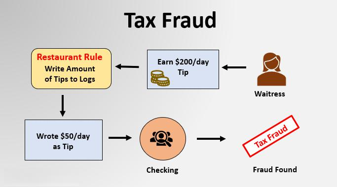

Financial fraud represents a significant threat to both the inventory and trading sectors, with extensive repercussions for investors, corporations, and the global market. In these sectors, fraudulent activities can take various forms, ranging from manipulating inventory records to distort a company's financial health to executing unscrupulous trading strategies that deceive market participants. Such deceptions not only undermine trust but can also have severe financial consequences, leading to bankruptcies, regulatory penalties, and a substantial erosion of investor confidence.

This article examines notable historical financial scandals that have unfolded in the inventory and trading sectors. By reviewing these cases, the article sheds light on common fraudulent practices, their motivations, and the broader impact on stakeholders. For instance, the manipulation of financial statements has often been a central tactic for perpetrators seeking to present an inflated or artificial picture of a company's financial standing. Notable scandals such as those involving the Equity Funding Corporation of America and Crazy Eddie demonstrate the intricate and deceptive methods employed to mislead investors and regulators.

Additionally, this article introduces the concept of algorithmic trading, a relatively modern innovation that leverages advanced algorithms to automate trading decisions in financial markets. While algorithmic trading offers improved efficiency and faster execution of trades, it also presents new vulnerabilities to fraud. The potential for manipulation and data spoofing is heightened in algorithmic trading due to the automated and high-speed nature of transactions. As such, understanding these vulnerabilities and implementing robust measures to mitigate associated risks is crucial for the integrity of modern financial markets.

In summary, this article highlights the significance of financial fraud in the inventory and trading sectors by exploring historical scandals and emerging risks associated with algorithmic trading. By analyzing these issues, we aim to emphasize the importance of vigilance, transparency, and robust financial systems in preventing fraud and safeguarding market integrity.

## Table of Contents

## Famous Inventory Fraud Cases

Inventory fraud represents a significant challenge in financial management, particularly in sectors where stock valuation and management form the core of business operations. Companies may engage in inventory fraud to artificially inflate their financial health, making themselves more attractive to investors and creditors. The motives behind such fraudulent activities often include the desire to secure additional financing, enhance stock prices, or meet financial performance targets to trigger executive bonuses.

### Common Practices in Inventory Fraud

Inventory fraud often involves manipulating accounting records to inflate the value or quantity of inventory, thus altering the company's perceived financial status. This might be achieved through various methods, such as recording nonexistent inventory, altering purchase records, or manipulating inventory valuation methods to show higher profits.

A prevalent technique used in inventory fraud is **overstating inventory** on financial statements. This can be done by recording fictitious purchases, inadequately writing off obsolete inventory, or deceitfully valuing inventory at higher than the market cost. Such manipulations allow companies to present a healthier balance sheet than is accurate.

### Key Examples: Equity Funding Corporation of America and Crazy Eddie

Two of the most notorious cases of inventory fraud in corporate history are those of the Equity Funding Corporation of America and Crazy Eddie. These cases serve as textbook examples of how fraudulent practices can devastate a company and its stakeholders.

#### Equity Funding Corporation of America

The Equity Funding scandal of the early 1970s involved the creation of fictitious insurance policies that enabled the company to overstate its revenues significantly. This fraudulent activity was facilitated by advanced computer systems of the time, which the company used to produce false insurance claims and policies. Employees created fake documents and policyholder lists to deceive auditors and stakeholders.

The impact of the Equity Funding fraud was far-reaching. Once uncovered, it led to significant financial losses for investors and a loss of trust in the financial statements produced by the company. Regulatory bodies responded with, increased scrutiny and stricter regulations for auditing practices and corporate governance.

#### Crazy Eddie

Crazy Eddie, an electronics retail chain, engaged in numerous fraudulent practices in the 1980s to inflate its stock value. The company overstated its inventory to enhance its financial statements before its initial public offering (IPO). This fraudulent reporting increased the perceived profitability and attractiveness of the company to investors.

The scheme primarily involved inflating inventory counts and manipulating financial statements through insider manipulation. The founders and several executives were eventually convicted of financial fraud. The lasting impact included financial losses for investors and the eventual collapse of the company, highlighting the destructive potential of inventory fraud.

### Impact on Stakeholders

Inventory fraud like that of Equity Funding and Crazy Eddie affects a broad range of stakeholders, including investors, creditors, employees, and regulatory bodies. Investors are misled by inaccurate financial information, potentially leading to financial losses when the truth comes to light. Creditors may extend loans based on false financial health, ultimately facing repayment issues. Employees may lose their jobs as companies face legal repercussions and financial insolvency. Additionally, these scandals damage public trust in financial reporting, leading to tighter regulations and increased costs for compliance for all companies within the market.

These historical cases emphasize the critical importance of robust internal controls, vigilant auditing practices, and regulatory oversight to deter fraudulent activities and protect stakeholders' interests.

## Equity Funding Corporation of America

The Equity Funding Corporation of America scandal, which came to light in the early 1970s, is a seminal example of financial fraud in the inventory and trading sectors. The fraudulent activities primarily involved the creation of phony insurance policies and the subsequent inflation of revenues. This scheme was engineered to artificially boost the company’s financial profile, making it appear more successful and solvent than it truly was.

The fundamental tactic employed by Equity Funding involved the fabrication of non-existent insurance policies. These fictitious policies falsely increased the company's assets and revenue streams. The fraudulent scheme was so elaborately constructed that it evaded detection for years, allowing the company to attract investors and maintain an inflated stock price.

Technology played a crucial role in facilitating this deception. Equity Funding utilized computers, a relatively novel tool at the time, to manipulate and create fake documentation that 'verified' the existence of these non-existent policies. Specifically, computer systems were used to generate falsified policy details, including premiums, benefits, and customer information, which were then entered into the company’s official records. This use of technology significantly masked the fraud from auditors and regulators, who were ill-prepared to detect such sophisticated electronic manipulations during that era.

When the scandal was finally uncovered, it sent shockwaves through the financial and regulatory communities, leading to significant legal and regulatory consequences. Key executives involved in the fraud faced criminal charges, resulting in prison sentences for several top officials. Additionally, the scandal prompted a reevaluation of auditing practices and the technological capabilities of regulatory frameworks. In response, there was a heightened focus on improving the detection of electronic fraud and the development of more robust auditing technologies and methodologies.

The exposure of the Equity Funding scandal led to reforms aimed at strengthening corporate governance and accountability. It underscored the need for financial institutions and regulatory bodies to adapt to the rapid advancements in technology that could be exploited for fraudulent purposes. Consequently, there was an increased emphasis on the transparency of financial reporting and the accountability of corporate executives to protect investors and maintain market integrity.

## Crazy Eddie: A Case of Cooking the Books

Crazy Eddie was an electronics retail chain that became infamous for a massive fraud scandal involving inventory inflation and fraudulent financial reporting. The company, which became a household name in the Northeastern United States due to its aggressive advertising and discount pricing, engaged in fraudulent practices that ultimately led to its downfall.

The fraud primarily revolved around inflating inventory levels to overstate the company's assets and earnings. This tactic involved falsifying inventory records to reflect higher stock levels, which in turn misled investors and auditors into believing the company was more prosperous and stable than it actually was. By reporting inflated inventory, Crazy Eddie could present stronger financial metrics, such as increased profit margins and return on assets, making the company more attractive to investors.

Insider manipulation played a crucial role in perpetuating and hiding the fraud. During Crazy Eddie’s Initial Public Offering (IPO), the company's executives, including founder Eddie Antar, engaged in deceptive practices to boost stock prices. This included manipulating financial statements to show improved performance and conducting IPOs during favorable market conditions to capitalize on market optimism.

The downfall of Crazy Eddie began when discrepancies in financial statements were discovered. Following the exposure of these irregularities, extensive investigations revealed the extent of the fraudulent activities. The aftermath of the scandal was devastating for investors, as Crazy Eddie's stock value plummeted, resulting in significant financial losses. The company eventually filed for bankruptcy in 1989, and its executives faced legal consequences, including charges of securities fraud.

The case of Crazy Eddie serves as a stark reminder of the consequences of financial fraud. It underscores the importance of robust internal controls and transparent reporting practices to prevent similar occurrences in the future. The long-term effects were not only financial losses for investors but also a heightened awareness in the financial industry about the risks of fraudulent activities and the need for stringent regulatory oversight.

## Algorithmic Trading and Fraud Risks

Algorithmic trading refers to the use of computer programs and algorithms to execute trading decisions in financial markets. By automating the trading process, [algorithmic trading](/wiki/algorithmic-trading) offers significant advantages such as increased speed, efficiency, and precision in executing trades. This automation allows traders to capitalize on opportunities in milliseconds, manage large volumes of orders, and minimize human error. Algorithms are designed to follow specific strategies that can analyze vast amounts of market data, identify trends, and execute trades based on predefined criteria.

Despite its advantages, algorithmic trading also presents several risks, particularly regarding fraud. A primary concern is market manipulation, where traders use algorithms to influence the market to their advantage. One common practice is spoofing, where traders create false buy or sell orders to manipulate prices. Once the market reacts, the trader cancels the orders and profits from the resulting price movements. Spoofing can disrupt market equilibrium, leading to increased [volatility](/wiki/volatility-trading-strategies) and reduced market integrity.

Another significant risk is data spoofing, where inaccurate or misleading market data is intentionally fed to algorithms, causing them to make erroneous decisions. This can be exploited by malicious actors who manipulate data inputs to trick algorithms into executing trades that benefit fraudsters.

To mitigate these risks, several measures and best practices are recommended:

1. **Robust Monitoring and Surveillance Systems**: Financial institutions are advised to implement advanced monitoring systems capable of detecting suspicious algorithmic behaviors. These systems use machine learning and artificial intelligence to identify patterns indicative of spoofing or other manipulative practices.

2. **Regulatory Compliance and Audits**: Regulatory bodies such as the U.S. Securities and Exchange Commission (SEC) and the Commodity Futures Trading Commission (CFTC) have established rules to govern algorithmic trading practices. Compliance with these regulations, along with regular audits, helps ensure that trading algorithms operate within legal and ethical boundaries.

3. **Algorithmic Testing and Validation**: Before deployment, trading algorithms should undergo rigorous testing in simulated environments to evaluate their performance and resilience to different market conditions. This can help identify potential vulnerabilities that could be exploited by fraudsters.

4. **Real-time Analytics and Alert Systems**: Implementing real-time analytics can help detect anomalies in trading patterns. Alert systems can notify traders and compliance officers of unusual activities, allowing for prompt investigation and action.

5. **Education and Training**: Continuous education and training for traders, developers, and compliance teams are crucial to maintain awareness of the latest fraud tactics and technological advancements. Staff should be well-versed in recognizing fraud indicators and understanding the regulatory landscape.

In conclusion, while algorithmic trading revolutionizes the financial markets by offering remarkable efficiency and precision, it also poses substantial fraud risks. Proactive measures and adherence to best practices can significantly mitigate these risks, ensuring the integrity and stability of financial markets.

## Lessons Learned and Future Outlook

The analysis of historical financial fraud cases provides essential insights into vulnerabilities within financial systems and the measures necessary to counter such threats. Understanding these past instances aids in shaping current financial practices and regulatory frameworks.

**Key Lessons from Past Fraud Cases**

Examining fraud incidents such as the Equity Funding Corporation of America and Crazy Eddie reveals common tactics employed by fraudsters, including inventory manipulation and false reporting. A repeated theme in these cases is the exploitation of weak internal controls and oversight mechanisms. The effectiveness of fraudulent schemes often hinges on the perpetrators' ability to obscure their activities within complex financial structures.

A significant lesson is the need for rigorous internal controls and robust auditing processes. Stakeholders must emphasize transparency, regular audits, and cross-verification of financial statements. These processes should be designed to detect discrepancies early, thus preventing minor issues from escalating into significant fraud.

**Evolution of Regulatory Frameworks**

In response to these cases, regulatory frameworks have evolved significantly. Legislations like the Sarbanes-Oxley Act in the United States have emerged to enhance corporate governance and accountability. This act requires top management to certify the accuracy of financial information and mandates stricter penalties for fraudulent financial activity, fostering a culture of compliance and ethical reporting.

The role of technology in regulatory evolution has been profound. Automated systems and advanced data analytics have become integral to monitoring and detecting anomalies in financial transactions. These technological advancements provide real-time insights and enable proactive responses to potential fraudulent activities.

**Future Challenges and Technological Roles in Fraud Prevention**

As financial systems increasingly incorporate technology, new challenges arise, particularly in trading and inventory sectors. Algorithmic trading, while beneficial for efficiency, introduces potential risks such as market manipulation and data spoofing. Future challenges include managing these risks without stifling innovation.

Technological advancements will play a pivotal role in addressing these challenges. Machine learning models and [artificial intelligence](/wiki/ai-artificial-intelligence) can analyze vast datasets to identify unusual patterns indicative of fraud. Blockchain technology also offers promise in enhancing transparency and traceability, making fraudulent activities more challenging to conceal.

To enable these technologies effectively, organizations must invest in continuous learning and adaptation, ensuring that systems are not only robust but agile enough to respond to new fraud tactics swiftly. Emphasizing cybersecurity measures is crucial to protect data integrity and prevent unauthorized access.

In conclusion, while past fraud cases provide valuable insights, a forward-looking approach combining vigilant regulatory practices and technological innovation will be essential in mitigating future financial fraud risks.

## Conclusion

In the complex landscape of financial markets, the importance of vigilance and robust systems in preventing financial fraud cannot be overstated. Financial fraud, particularly in inventory and trading sectors, poses significant risks to markets, investors, and the broader economy. It is imperative for organizations and regulatory bodies to implement robust internal controls and continuously update their measures to detect and prevent deceptive activities. The cases of Equity Funding Corporation of America and Crazy Eddie serve as solemn reminders of the devastating effects of fraudulent activities on stakeholders and the necessity for meticulous oversight.

Ongoing education and adaptation within financial and regulatory sectors are essential to stay ahead of fraudsters who deploy sophisticated techniques to manipulate markets. Industry professionals must be equipped with the latest knowledge and tools to identify and counteract fraudulent practices. This requires regular training, access to updated resources, and a culture that values integrity and ethical conduct.

Furthermore, there is an urgent need for greater transparency and accountability in corporate governance. Companies must commit to ethical practices and transparency in financial reporting to foster trust among investors and the public. Regulatory frameworks should evolve to encompass advanced technologies such as algorithmic trading, ensuring they are not exploited for nefarious purposes. It is crucial for companies to establish clear accountability mechanisms and foster an environment where ethical behavior is the norm, not the exception.

In conclusion, preventing financial fraud necessitates a concerted effort characterized by vigilance, continuous learning, and a steadfast commitment to transparency and accountability. By reinforcing these principles within corporate governance, the financial industry can effectively safeguard itself against fraudulent activities, ensuring long-term stability and investor confidence.

## References & Further Reading

[1]: Cunningham, L. A. (2002). ["The Sarbanes-Oxley Yawn: Heavy Rhetoric, Light Reform (And It Just Might Work)."](https://scholarship.law.gwu.edu/cgi/viewcontent.cgi?article=1538&context=faculty_publications) Connecticut Law Review, 35(3).

[2]: Curlander, I. (2003). ["Equity Funding: The Inside Story"](https://www.jstor.org/stable/pdf/4478015.pdf) by Ira Curlander.

[3]: Antar, S., & Antar, S. H. (1991). ["Crazy Eddie Scrapbook Memories of a Retail Revolutionary"](https://whitecollarfraud.com/crazy-eddie/crazy-eddie-litigation/) by Sam E. Antar and Sharyn Antar.

[4]: Yang, H. S. (2011). ["Rogue Traders and Financial Crimes"](https://www.ft.com/content/e3bdcf84-ea8d-11e0-b0f5-00144feab49a) in Professor Karen L. Ford's Guide to Forensic Accounting and Fraud Examination, Oxford University Press.

[5]: Goodhart, C., & Lastra, R. (2010). ["The Future of Financial Regulation."](https://www.bis.org/publ/work326.pdf) Journal of Banking & Finance, 34(3)