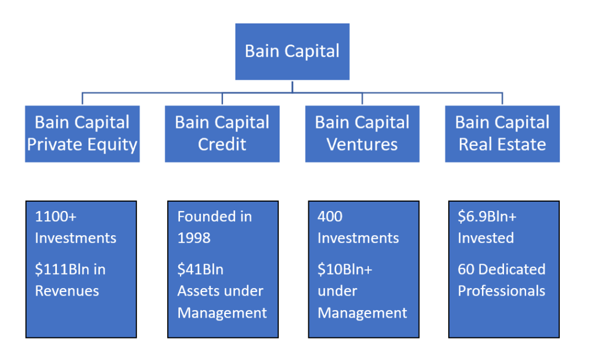

## Table of Contents

## What is Bain Capital?

Bain Capital is a big company that helps other companies grow and make more money. It was started in 1984 by a man named Mitt Romney and some other people. They use their own money and money from other people to buy parts of or whole companies. Then, they try to make those companies better and more valuable. When the companies do well, everyone makes more money.

Bain Capital works in many different areas, like helping companies with their money, buying and selling companies, and even starting new businesses. They have helped many companies around the world, not just in the United States. Some of the big companies they have worked with are Burger King and Dunkin' Donuts. They always look for new ways to help companies grow and succeed.

## When was Bain Capital founded?

Bain Capital was founded in 1984. It was started by Mitt Romney and some other people. They wanted to help other companies grow and make more money.

Bain Capital uses its own money and money from other people to buy parts of or whole companies. They then work to make those companies better and more valuable. This way, everyone can make more money when the companies do well.

## Who are the founders of Bain Capital?

Bain Capital was started by Mitt Romney and some other people. Mitt Romney is a well-known person who later became a politician. The other founders were T. Coleman Andrews III, who was good with money, and Eric Kriss, who helped with the business side of things.

These three people wanted to create a company that could help other businesses grow and become more successful. They used their own money and money from other people to buy parts of or whole companies. Their goal was to make these companies better and more valuable, so everyone could make more money when the companies did well.

## What types of investments does Bain Capital focus on?

Bain Capital focuses on different types of investments. They invest in private equity, which means they buy parts of or whole companies that are not on the stock market. They also invest in credit, which means they lend money to companies and get paid back with interest. Another area they focus on is real estate, where they buy, sell, and manage properties to make money.

They also have a special interest in technology and life sciences. In technology, they invest in new and growing tech companies to help them become bigger and more successful. In life sciences, they focus on healthcare and medicine, helping companies that work on new treatments and technologies. Bain Capital tries to find the best opportunities in these areas to help companies grow and make money for everyone involved.

## Can you name some early investments made by Bain Capital?

Bain Capital made some early investments that helped them grow. One of their first big investments was in a company called Gartner, which helps businesses with research and advice. They bought Gartner in 1989 and helped it become a lot bigger and more successful. Another early investment was in a company called Staples, which sells office supplies. Bain Capital helped Staples open more stores and become a well-known brand.

They also invested in a company called Domino's Pizza in the early 1990s. Bain Capital helped Domino's grow by opening more stores and improving how they made and delivered pizzas. These early investments showed that Bain Capital was good at [picking](/wiki/asset-class-picking) companies that could become bigger and more valuable with their help. By choosing the right companies and helping them grow, Bain Capital started to make a name for itself in the investment world.

## What was Bain Capital's role in the buyout of Domino's Pizza?

Bain Capital helped buy Domino's Pizza in the early 1990s. They worked with another company called Thomas H. Lee Partners to do this. Together, they bought Domino's for around $1 billion. This was a big deal because it showed that Bain Capital could handle big investments and help big companies grow.

After the buyout, Bain Capital worked to make Domino's better. They helped the company open more stores and improve how they made and delivered pizzas. This made Domino's more successful and valuable. By the time Bain Capital sold its part of Domino's in 1998, the company was doing much better and everyone made more money.

## How has Bain Capital's investment strategy evolved over the years?

Bain Capital started out by focusing on buying parts of or whole companies that were not on the stock market. They would use their own money and money from other people to buy these companies, then work to make them better and more valuable. In the early years, they made big investments in companies like Gartner, Staples, and Domino's Pizza. These early successes showed that Bain Capital was good at picking companies that could grow with their help.

Over the years, Bain Capital's investment strategy has grown to include more areas. They now invest in credit, which means lending money to companies and getting paid back with interest. They also invest in real estate, buying, selling, and managing properties to make money. More recently, they have focused on technology and life sciences, helping new and growing tech companies and healthcare businesses become bigger and more successful. This shows how Bain Capital keeps looking for new ways to help companies grow and make money for everyone involved.

## What are some of the largest investments Bain Capital has made?

Bain Capital has made some really big investments over the years. One of the biggest was when they bought a company called HCA Healthcare in 2006. HCA is a big company that runs hospitals and other healthcare places. Bain Capital, along with some other investors, bought HCA for about $33 billion. This was a huge deal and showed that Bain Capital could handle really big investments. They helped HCA grow and become even more successful.

Another big investment was in a company called Sungard in 2005. Sungard helps other companies with their computer systems and technology. Bain Capital, along with other investors, bought Sungard for about $11.3 billion. They worked to make Sungard better and more valuable. These big investments show how Bain Capital keeps finding new ways to help companies grow and make money for everyone involved.

## Can you discuss the impact of Bain Capital's investment in Staples?

When Bain Capital invested in Staples in the late 1980s, it was a big moment for the company. Staples was just starting out and selling office supplies. Bain Capital saw that Staples could grow a lot. They helped Staples open more stores all over the country. This made Staples a well-known brand that people could trust for their office needs. Bain Capital's help made Staples much bigger and more successful than it was before.

The investment in Staples showed that Bain Capital was good at picking companies that could grow with their help. They didn't just give money to Staples; they also gave advice and support to make the company better. By the time Bain Capital sold its part of Staples, the company was doing much better and was worth a lot more money. This success helped Bain Capital become known as a company that could help other businesses grow and make more money.

## What are some of the successful exits Bain Capital has achieved?

Bain Capital has had many successful exits, which means they sold their part of a company and made a lot of money. One big success was with a company called HCA Healthcare. Bain Capital, along with other investors, bought HCA in 2006 for about $33 billion. They helped HCA grow and become even better at running hospitals. When they sold their part of HCA in 2011, everyone made a lot of money because HCA was worth more.

Another successful [exit](/wiki/exit-strategy) was with a company called Domino's Pizza. Bain Capital and another company bought Domino's in the early 1990s for around $1 billion. They helped Domino's open more stores and improve how they made and delivered pizzas. By the time Bain Capital sold its part of Domino's in 1998, the company was doing much better and was worth a lot more money. These successful exits show how Bain Capital can help companies grow and make money for everyone involved.

## How does Bain Capital manage its portfolio companies?

Bain Capital works closely with the companies it invests in to help them grow and become more successful. They do this by giving advice and support, not just money. They help the companies make better decisions, find new ways to make money, and grow their business. This can mean opening new stores, improving how they make things, or finding new customers. Bain Capital also helps the companies find good people to work for them and teaches them how to run their business better.

When Bain Capital invests in a company, they look at everything the company does. They try to find problems and fix them. They might help the company save money, make more money, or both. They work with the company's leaders to set goals and make plans to reach those goals. By doing all these things, Bain Capital helps the companies in their portfolio become bigger and more valuable. This way, everyone can make more money when the companies do well.

## What are the future investment trends Bain Capital is focusing on?

Bain Capital is always looking for new ways to help companies grow and make money. One big trend they are focusing on is technology. They invest in new and growing tech companies to help them become bigger and more successful. This includes things like software, internet services, and new kinds of technology that can change how businesses work. They believe that technology will keep growing and becoming more important, so they want to be a part of that.

Another trend Bain Capital is interested in is life sciences. This means they invest in companies that work on healthcare and medicine. They help these companies find new treatments and technologies that can make people healthier. Life sciences is a growing field, and Bain Capital sees a lot of opportunities to help these companies succeed. By focusing on these trends, Bain Capital hopes to keep finding new ways to help companies grow and make money for everyone involved.

## References & Further Reading

[1]: ["Advances in Financial Machine Learning"](https://www.amazon.com/Advances-Financial-Machine-Learning-Marcos/dp/1119482089) by Marcos Lopez de Prado

[2]: ["Machine Learning for Algorithmic Trading"](https://github.com/stefan-jansen/machine-learning-for-trading) by Stefan Jansen

[3]: ["Quantitative Trading: How to Build Your Own Algorithmic Trading Business"](https://www.amazon.com/Quantitative-Trading-Build-Algorithmic-Business/dp/1119800064) by Ernest P. Chan

[4]: ["Evidence-Based Technical Analysis: Applying the Scientific Method and Statistical Inference to Trading Signals"](https://www.amazon.com/Evidence-Based-Technical-Analysis-Scientific-Statistical/dp/0470008741) by David Aronson

[5]: Bergstra, J., Bardenet, R., Bengio, Y., & Kégl, B. (2011). ["Algorithms for Hyper-Parameter Optimization."](https://dl.acm.org/doi/10.5555/2986459.2986743) Advances in Neural Information Processing Systems 24.