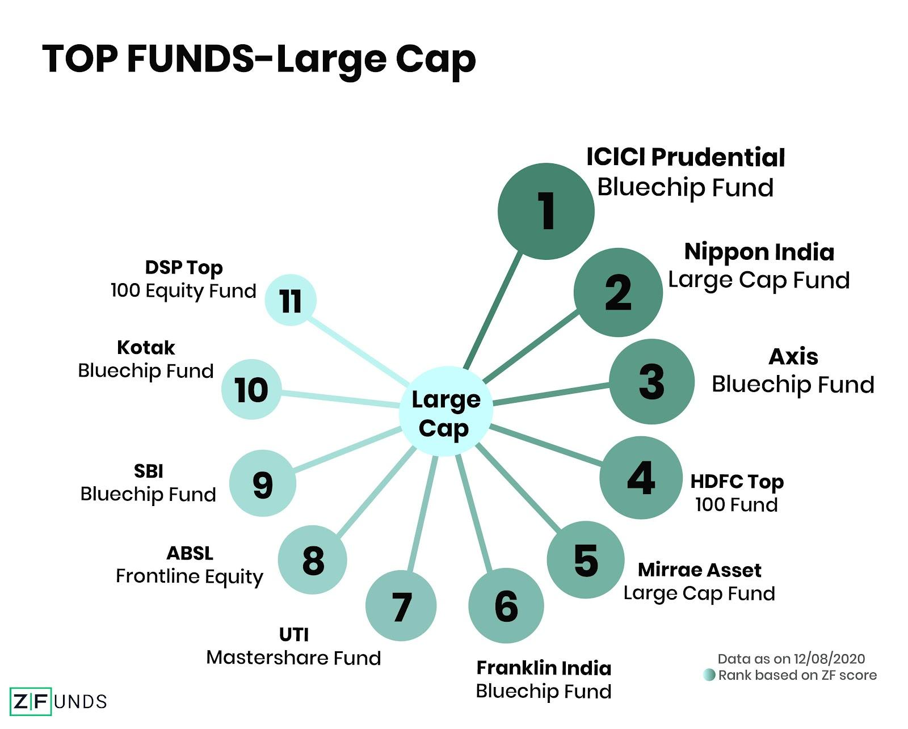

Investors today have a wide array of options for diversifying their portfolios, among which large-cap mutual funds, core mutual funds, and algorithmic trading (algo trading) stand out as significant tools. Large-cap mutual funds are particularly popular among those seeking stability and steady returns. These funds typically invest in well-established companies with substantial market capitalizations, providing investors with relatively low-risk opportunities for income generation. By understanding the fundamentals and benefits of such funds, investors can better position themselves to meet their financial goals.

Besides large-cap mutual funds, the investment landscape also includes core mutual funds and algo trading, each offering distinct advantages. Core mutual funds serve as vital components of many portfolios, offering broad market coverage and a mix of growth and value stocks. They are designed to facilitate long-term wealth accumulation, making them an ideal choice for retirement planning.

Moreover, the advent of algo trading has significantly transformed investment strategies, enabling both individual and institutional investors to leverage technology for executing trades with speed and precision. This automated approach utilizes sophisticated algorithms to analyze market trends and optimize trading decisions, thus potentially enhancing returns and efficiency.

Understanding how these investment vehicles operate allows investors to make informed choices that align with their financial objectives. By exploring the unique attributes of large-cap mutual funds, core mutual funds, and algo trading, one can appreciate their roles in crafting a robust investment strategy. This article will also highlight how these options can be integrated within larger investment frameworks to balance risk and reward effectively.

## Table of Contents

## Understanding Large-Cap Mutual Funds

Large-cap mutual funds are a category of mutual funds that primarily invest in large-capitalization companies—firms with market capitalizations usually exceeding $10 billion. These companies are typically well-established, often leaders in their industries, and have a critical impact on the economy. A market capitalization calculation is expressed as:

$$
\text{Market Capitalization} = \text{Share Price} \times \text{Number of Outstanding Shares}
$$

Investors are drawn to large-cap mutual funds because these funds tend to demonstrate greater stability and offer consistent returns over time. They are less susceptible to market [volatility](/wiki/volatility-trading-strategies) compared to small or mid-cap funds which invest in smaller companies with higher growth potential but increased risk.

Large-cap funds often include investments in industry leaders such as Apple and Microsoft, companies known for their robust financial performance and significant influence in their respective markets. The stable revenue streams and substantial market presence of these companies contribute to the lower risk profile of large-cap funds. Consequently, these funds can provide steady income to investors, often through dividends, and are perceived as a reliable component of a diversified investment portfolio.

One of the notable advantages of investing in large-cap mutual funds is the diversified exposure to blue-chip stocks. Blue-chip companies are characterized by their strong market reputation, established histories, and solid financial performance even during economic downturns. This diversification helps reduce the overall risk in an investor’s portfolio, offering potential protection against market declines. 

When selecting large-cap mutual funds, investors should consider a variety of factors to maximize the potential benefits. Historical performance metrics can offer insight into how a fund has managed through different market cycles. Expense ratios, which include management fees and other operational costs, directly impact the fund's net return and should be carefully analyzed. Lower expense ratios typically enhance investment returns over time, particularly when compounded.

In summary, large-cap mutual funds are a cornerstone for conservative investors seeking stability and reliable returns. By focusing on established companies with substantial market capitalization, these funds offer an appealing combination of low volatility and steady income, making them an attractive option for long-term investment strategies.

## Core Mutual Funds: An Overview

Core mutual funds form the backbone of many diversified investment portfolios, offering investors broad exposure to the stock market with a single investment vehicle. These funds are designed to include a blend of growth and value stocks, striking a balance that can cater to a wide range of investment goals and risk appetites. Core funds are structured to achieve long-term growth, making them particularly attractive for individuals planning their retirement or seeking to accumulate wealth over time.

One of the primary advantages of core mutual funds is the immediate diversification they provide. By encompassing a variety of sectors and industries within one fund, investors can mitigate the risks associated with concentrating their assets in a single stock or sector. This inherent diversification reduces the impact of volatility that individual stocks might experience, contributing to the fund's overall stability.

The composition of core mutual funds typically involves a mix of [growth stocks](/wiki/growth-stocks), which are expected to expand at an above-average rate compared to other companies, and value stocks, which are considered undervalued relative to their fundamentals such as earnings, dividends, or sales. This combination is aimed at balancing potential high returns from growth stocks with the protective aspects of value stocks, which can offer more resilience during market downturns.

For investors, understanding the role of core mutual funds in a portfolio is essential to balancing risk and reward effectively. These funds can act as a solid foundation upon which other investment strategies, such as sector-specific funds or alternative investments, can be layered. The core represents a stable base that can smooth out the inherent volatility in additional investments, thereby achieving a more nuanced risk profile.

In summary, core mutual funds provide a comprehensive and balanced investment solution for those seeking to cultivate a robust portfolio. They offer the dual benefits of diversification and balanced growth potential, aligning well with both conservative and more aggressive investment strategies. Recognizing the relevance of core funds in a broader investment strategy can significantly enhance an investor's ability to attain their financial objectives.

## The Role of Algo Trading in Modern Investing

Algorithmic trading, commonly known as algo trading, represents a significant advancement in the field of investing through its utilization of sophisticated software systems. These systems automate investment decisions and execute trades, thereby offering precision that surpasses the capabilities of manual trading methods. Algo trading employs a range of financial models and statistical analyses to enhance trading efficiency, with the potential to improve returns.

The core of algo trading involves executing pre-programmed trading instructions based on variables such as timing, price, and [volume](/wiki/volume-trading-strategy). This method not only increases execution speed but also allows for the processing of vast datasets that would be unmanageable for human traders. By using algorithms, investors can swiftly adapt to market fluctuations, optimizing their trading strategies in real-time.

A key feature of algo trading is its capacity to manage risks effectively. Algorithms can be designed to implement diverse strategies, such as mean reversion, [trend following](/wiki/trend-following), or [market making](/wiki/market-making), which aid in managing and mitigating financial risks. The automation and continuous monitoring by algo systems provide a level of response that traditional trading cannot match.

The increasing adoption of algo trading by both individual and institutional investors underscores its significance. Institutional investors, in particular, value algo trading for its ability to handle large volumes of transactions without significantly impacting the market price. For individual investors, algorithmic platforms have become more accessible, allowing for advanced trading strategies without requiring a deep understanding of the underlying complexity.

However, the deployment of algo trading systems is not without its drawbacks. One of the primary concerns is the risk inherent in the algorithms themselves, especially if they are not fully understood by the user. Algorithms, while capable of making logical decisions based on input data, can also amplify errors or react in unpredictable ways during abnormal market conditions. It is crucial for investors to have a thorough understanding of the algorithms they are using and to continuously monitor and adjust them as needed.

Despite these challenges, the benefits of algo trading continue to drive its integration into modern investment strategies. As technology advances, the precision and capabilities of [algorithmic trading](/wiki/algorithmic-trading) systems are expected to expand, facilitating even more efficient market participation. The balance lies in leveraging these tools while maintaining a robust framework for risk management.

## Integrating Large-Cap Funds and Algo Trading

Integrating large-cap mutual funds with algorithmic trading offers a strategic advantage for investors seeking a balanced investment approach. Large-cap mutual funds are renowned for their stability, often comprised of investments in financially secure companies with significant market capitalizations. This stability provides a solid foundation for a portfolio, mitigating risks associated with market fluctuations. On the other hand, algorithmic trading employs sophisticated software to automate investment decisions, enhancing efficiency and optimizing returns through precise execution of trades.

The integration of these two elements achieves portfolio diversification and effective risk management, accommodating a range of investor goals. Large-cap funds contribute steady income and reduced volatility, while algorithmic trading capitalizes on short-term market opportunities, potentially increasing overall portfolio returns.

The rise of financial technology (fintech) has democratized access to advanced trading tools, allowing individual investors to leverage algorithmic strategies previously available only to institutional investors. This technological progress facilitates seamless integration of large-cap funds and algo trading strategies, creating a cohesive investment framework.

Investors must align both elements with their broader financial objectives and risk tolerance. Understanding the underlying algorithms and the market dynamics that influence large-cap companies is essential to making informed decisions. By harnessing the strengths of both large-cap mutual funds and algorithmic trading, investors can develop a robust investment strategy poised for long-term success.

## Conclusion

Investment options like large-cap mutual funds, core mutual funds, and algorithmic trading (algo trading) offer unique benefits, catering to various investor needs and preferences. Large-cap mutual funds, with their focus on established corporations, provide stability and steady returns, making them a favored choice for conservative investors. These funds are typically invested in companies with significant market capitalizations, which helps in mitigating risks associated with market volatility. As a result, they serve as a strategic component for those seeking long-term financial security.

Core mutual funds contribute to a well-rounded investment portfolio by offering diversification through a mix of growth and value stocks. This balanced approach enables investors to tap into broad market exposure with a single investment, facilitating immediate sector and industry diversification. By aiming for long-term capital appreciation, core mutual funds are particularly appealing to individuals planning for retirement or seeking to accumulate wealth gradually over time.

Algorithmic trading, on the other hand, capitalizes on the speed and precision of advanced software to automate trading decisions. This approach enhances trading efficiency and can significantly improve returns, especially in volatile market conditions. Algo trading optimizes trading strategies through intricate financial models and statistical analyses, providing an additional layer of sophistication to investment portfolios.

By understanding and integrating these investment vehicles, investors can cultivate a more robust and effective investment strategy. The combination of stable returns from large-cap mutual funds, the diversified foundation from core mutual funds, and the precision offered by algo trading presents a comprehensive approach to risk management and portfolio optimization. Aligning these elements with individual financial objectives and risk tolerance can facilitate the achievement of diverse investment goals.

## References & Further Reading

[1]: Remolona, E. M., Kleiman, P., & Gruenstein, D. (1997). ["Market Returns and Mutual Fund Flows"](https://www.semanticscholar.org/paper/Market-Returns-and-Mutual-Fund-Flows-Remolona-Kleiman/1bf949a71cff335b74268e923eeebd79b92fdc9d) Journal of Economics and Business.

[2]: Sharpe, W. F. (1992). ["Asset Allocation: Management Style and Performance Measurement."](https://web.stanford.edu/~wfsharpe/art/sa/sa.htm) The Journal of Portfolio Management.

[3]: Treynor, J. L., & Mazuy, K. (1966). ["Can Mutual Funds Outguess the Market?"](https://www.semanticscholar.org/paper/Can-mutual-funds-outguess-the-market-Harvard-Review-Treynor-Mazuy/46f77dbcc3c07c1475640aa0a4ef4a957c026d99) Harvard Business Review.

[4]: Aldridge, I. (2013). ["High-Frequency Trading: A Practical Guide to Algorithmic Strategies and Trading Systems"](https://onlinelibrary.wiley.com/doi/pdf/10.1002/9781119203803.fmatter) Wiley.

[5]: Fabozzi, F. J., & Markowitz, H. M. (2011). ["The Theory and Practice of Investment Management"](https://onlinelibrary.wiley.com/doi/book/10.1002/9781118267028) Wiley.