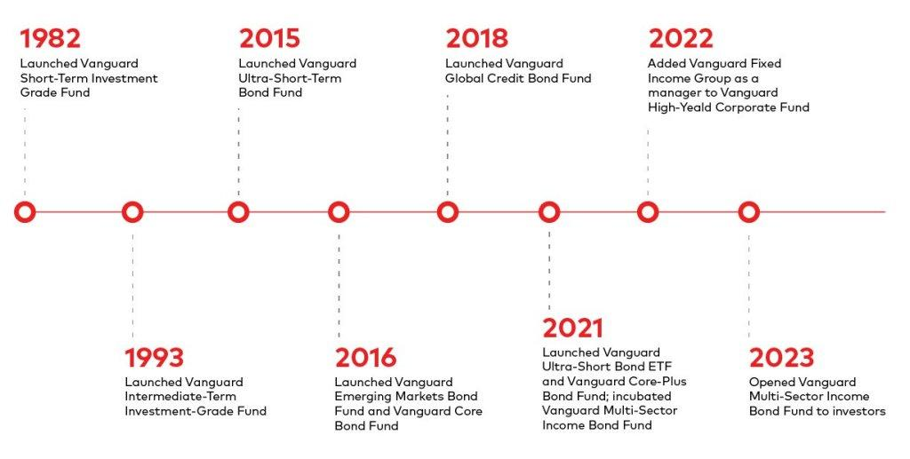

## Table of Contents

## What is a fixed-income fund?

A fixed-income fund is a type of investment fund that mainly invests in bonds and other types of debt securities. These funds aim to provide investors with a steady income stream through regular interest payments. The term "fixed income" comes from the fact that these securities typically pay a fixed interest rate to investors.

Fixed-income funds can be a good choice for people who want a more predictable income and less risk than stocks. They are often used by retirees or anyone looking for a stable source of income. However, the returns from these funds might be lower compared to stock funds, and they can still lose value if interest rates go up or if the issuers of the bonds face financial trouble.

## What is Vanguard, and why are their fixed-income funds notable?

Vanguard is a big company that helps people invest their money. They are known for having low costs and being owned by the people who invest with them, which means they focus on what's best for their investors. Vanguard offers many different types of investments, including fixed-income funds.

Vanguard's fixed-income funds are notable because they are very affordable. This means that when you invest in one of their funds, you keep more of your money instead of paying high fees. Also, Vanguard has a wide variety of fixed-income funds, so you can find one that fits what you need, whether you want to take a little risk or a bit more. This makes Vanguard a popular choice for people looking to invest in bonds and other fixed-income options.

## What are the different types of fixed-income funds offered by Vanguard?

Vanguard offers many kinds of fixed-income funds. They have funds that invest in government bonds, which are loans to the government that are seen as very safe. They also have funds that invest in corporate bonds, which are loans to companies and can be a bit riskier but might offer higher returns. There are also funds that invest in municipal bonds, which are loans to cities or states and often don't have to pay federal taxes on the interest.

Another type of fixed-income fund from Vanguard is the high-yield bond fund. These funds invest in bonds from companies that might have more risk, but they offer higher interest payments. Vanguard also has funds that focus on short-term, intermediate-term, and long-term bonds, which means you can choose a fund based on how long you want to keep your money invested. This variety helps people find a fixed-income fund that fits their needs and comfort with risk.

## How do Vanguard fixed-income funds generate returns for investors?

Vanguard fixed-income funds generate returns for investors mainly through interest payments. When you invest in these funds, you are essentially lending money to governments, companies, or other organizations. These borrowers pay interest on the money they borrow, and this interest is passed on to you as the investor. The interest payments come at regular times, like every month or every three months, giving you a steady income.

The value of the bonds in the fund can also go up or down, which affects the returns. If interest rates go down, the value of the bonds in the fund usually goes up, and this can increase the fund's value. On the other hand, if interest rates go up, the value of the bonds might go down, which can lower the fund's value. So, while the main way these funds make money is through interest, changes in bond prices can also play a role in the overall returns you get.

## What are the risk levels associated with different Vanguard fixed-income funds?

The risk levels of Vanguard fixed-income funds can vary a lot, depending on what kinds of bonds they invest in. Funds that invest in government bonds, like those from the U.S. Treasury, are seen as very safe. These funds have lower risk because the government is less likely to not pay back the money it borrows. But, they also usually offer lower returns. Funds that invest in municipal bonds, which are loans to cities or states, are a bit riskier than government bonds but still pretty safe. They might offer a bit higher returns, and the interest you earn is often not taxed by the federal government.

On the other hand, funds that invest in corporate bonds can have more risk. These bonds are loans to companies, and if a company runs into financial trouble, it might not be able to pay back the loan. So, corporate bond funds can offer higher returns, but they come with more risk. High-yield bond funds, which invest in bonds from companies that are riskier, can offer even higher returns but come with the highest risk of not getting your money back. Also, the length of time until the bonds in the fund mature can affect risk. Short-term bond funds are less risky than long-term bond funds because they are less affected by changes in interest rates.

## How do Vanguard fixed-income funds compare to similar funds from other providers?

Vanguard fixed-income funds are known for having low costs, which means investors get to keep more of their money. When you compare Vanguard's funds to similar funds from other providers, you'll often find that Vanguard's fees are lower. This can make a big difference over time because lower fees mean more of the fund's returns go into your pocket instead of being eaten up by costs. Also, Vanguard is owned by its investors, so they focus on what's best for the people who invest with them, not on making profits for outside shareholders.

Another way Vanguard fixed-income funds stand out is their wide variety. They offer funds that invest in different types of bonds, like government, corporate, and municipal bonds, and they have options for different levels of risk and time until the bonds mature. This variety means you can find a fund that fits your needs, whether you want something very safe or something that might offer higher returns but comes with more risk. Other providers might not have as many choices, so Vanguard can be a good place to look if you want a lot of options.

## What are the fees and expenses associated with Vanguard fixed-income funds?

Vanguard fixed-income funds are known for having low fees and expenses. This means that when you invest in one of their funds, you pay less in costs, and more of your money stays invested. For example, many of Vanguard's bond index funds have expense ratios that are less than 0.10%. An expense ratio is the yearly fee you pay to own the fund, and it's taken out of the fund's assets. So, if you have $10,000 invested in a fund with a 0.10% expense ratio, you would pay $10 a year in fees.

There might be other costs too, like trading costs when the fund buys or sells bonds. But Vanguard works hard to keep these costs low as well. They do this by using their size to get better deals and by managing their funds in a smart way. Overall, the low fees and expenses of Vanguard fixed-income funds are a big reason why many people choose to invest with them.

## How can someone start investing in Vanguard fixed-income funds?

To start investing in Vanguard fixed-income funds, you first need to open an account with Vanguard. You can do this by going to their website and following the steps to sign up. You'll need to provide some personal information and choose the type of account you want, like a regular brokerage account or a retirement account like an IRA. Once your account is set up, you can add money to it. You can do this by transferring money from your bank account or by mailing a check.

After you have money in your Vanguard account, you can start [picking](/wiki/asset-class-picking) out fixed-income funds to invest in. Vanguard has a lot of different fixed-income funds, so you can choose one that fits what you're looking for. You can look at the funds on Vanguard's website, where they give you information about each fund, like what it invests in and how much it costs. Once you've picked a fund, you can buy shares of it with the money in your account. It's a good idea to think about how much risk you're okay with and how long you want to keep your money invested when you're choosing a fund.

## What are some of the top-performing Vanguard fixed-income funds?

Some of the top-performing Vanguard fixed-income funds include the Vanguard Total Bond Market Index Fund (VBTLX) and the Vanguard Short-Term Corporate Bond Index Fund (VCSH). The Total Bond Market Index Fund is a broad fund that invests in a wide range of bonds, including government, corporate, and mortgage-backed securities. It's known for being a good choice if you want to spread your risk across many different types of bonds. The Short-Term Corporate Bond Index Fund focuses on bonds from companies that are due to be paid back in a shorter time. This fund can be a good pick if you want less risk from changes in interest rates.

Another strong performer is the Vanguard High-Yield Corporate Fund (VWEHX). This fund invests in bonds from companies that might be riskier but offer higher interest payments. It's a good choice if you're okay with taking on more risk for the chance of higher returns. All these funds are known for having low fees, which helps you keep more of your money. When choosing a fund, think about how much risk you're comfortable with and how long you plan to keep your money invested.

## How do economic conditions affect the performance of Vanguard fixed-income funds?

Economic conditions can have a big impact on how Vanguard fixed-income funds do. When the economy is doing well, interest rates might go up because the government wants to slow things down a bit. This can make the value of the bonds in the fund go down, because new bonds will pay more interest, making older bonds less attractive. On the other hand, if the economy is not doing so well, interest rates might go down to help it get better. This can make the value of the bonds in the fund go up, because people want the higher interest rates that older bonds offer.

Inflation also plays a role. If prices are going up a lot, the value of the money you get from the bonds can go down. This means that even if you're getting the same amount of interest, it might not buy as much as it used to. Some Vanguard funds invest in bonds that can change their interest payments based on inflation, which can help protect your money. Overall, keeping an eye on what's happening with the economy can help you understand how your Vanguard fixed-income funds might do.

## What strategies can be used to optimize a portfolio that includes Vanguard fixed-income funds?

To optimize a portfolio that includes Vanguard fixed-income funds, you should first think about how much risk you are okay with and how long you plan to keep your money invested. If you don't like a lot of risk, you might want to put more of your money into funds that invest in government bonds, like the Vanguard Total Bond Market Index Fund. These funds are safer but might not grow as much. If you can handle more risk and want to possibly earn more, you could put some money into funds like the Vanguard High-Yield Corporate Fund, which invests in riskier bonds but offers higher interest payments.

Another way to optimize your portfolio is to mix different types of fixed-income funds. For example, you could have some money in short-term bond funds like the Vanguard Short-Term Corporate Bond Index Fund, which are less affected by changes in interest rates, and some in long-term bond funds, which might offer higher returns but are more risky. This mix can help balance out the risk and reward in your portfolio. Also, keeping an eye on economic conditions, like interest rates and inflation, can help you decide when to adjust your investments to get the best results.

## What advanced features or options are available for expert investors in Vanguard fixed-income funds?

For expert investors, Vanguard offers some advanced features that can help them fine-tune their investment strategies. One of these is the ability to use Vanguard's Admiral Shares, which are versions of their funds with even lower expense ratios than the standard Investor Shares. This can be a big deal for people who have a lot of money to invest, because it means they keep more of their returns. Expert investors can also use Vanguard's bond ETFs, which are funds that trade like stocks and can be bought and sold throughout the day. This gives investors more control over when they buy and sell, which can be useful if they want to take advantage of short-term market changes.

Another feature for expert investors is the ability to use Vanguard's bond ladder strategy. This means investing in bonds that mature at different times, so you get money back at regular intervals. This can help manage risk and provide a steady income stream. Vanguard also offers tools and research on their website that can help expert investors make smart choices about which fixed-income funds to buy. These tools can give detailed information about the bonds in each fund, how they might do in different economic conditions, and other data that can help guide investment decisions.

## References & Further Reading

[1]: Bergstra, J., Bardenet, R., Bengio, Y., & Kégl, B. (2011). ["Algorithms for Hyper-Parameter Optimization."](https://papers.nips.cc/paper/4443-algorithms-for-hyper-parameter-optimization) Advances in Neural Information Processing Systems 24.

[2]: ["Advances in Financial Machine Learning"](https://www.amazon.com/Advances-Financial-Machine-Learning-Marcos/dp/1119482089) by Marcos Lopez de Prado

[3]: ["Evidence-Based Technical Analysis: Applying the Scientific Method and Statistical Inference to Trading Signals"](https://www.amazon.com/Evidence-Based-Technical-Analysis-Scientific-Statistical/dp/0470008741) by David Aronson

[4]: ["Machine Learning for Algorithmic Trading"](https://github.com/stefan-jansen/machine-learning-for-trading) by Stefan Jansen

[5]: ["Quantitative Trading: How to Build Your Own Algorithmic Trading Business"](https://www.amazon.com/Quantitative-Trading-Build-Algorithmic-Business/dp/1119800064) by Ernest P. Chan