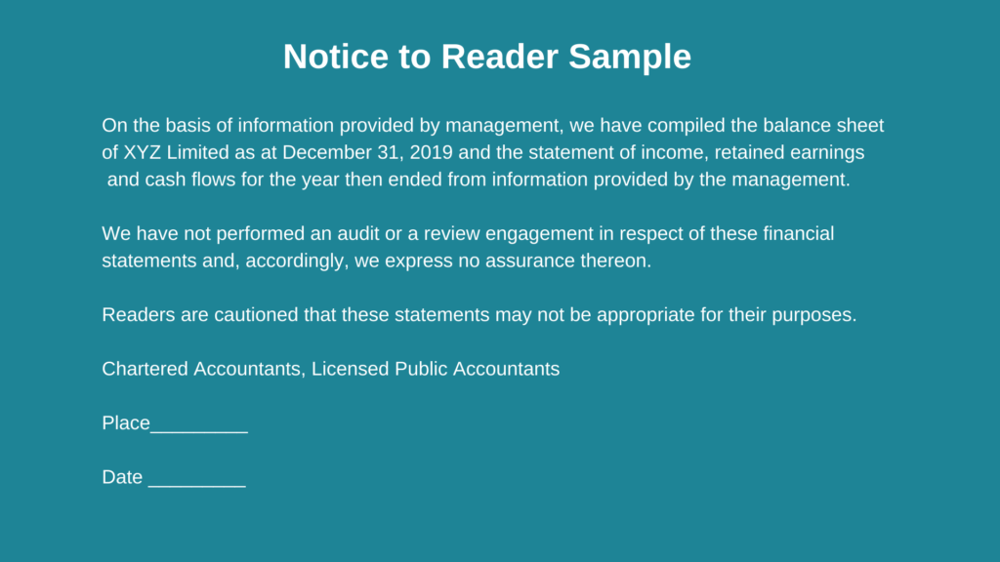

## Table of Contents

## What is notice compiling?

Notice compiling is a process used in programming where the computer takes the code you write and turns it into a form that it can run. This is important because computers can't directly understand the code humans write in languages like Python or Java. Instead, they need the code to be translated into machine code, which is made up of numbers and symbols that the computer's processor can execute.

When you compile code, the compiler looks at your entire program all at once. It checks for mistakes and, if everything is correct, it creates an executable file. This file contains the machine code that the computer can run directly. If there are errors, the compiler will show you where they are so you can fix them before trying to run your program again.

## Why is notice compiling important in software development?

Notice compiling is important in software development because it helps catch mistakes early. When you write code, it's easy to make small errors that can cause big problems. The compiler looks at your code and tells you where these errors are before you even try to run your program. This saves time because you don't have to run your program to find out it doesn't work. Instead, you can fix the errors right away and make sure your code is correct before moving forward.

Another reason notice compiling is important is that it makes your program run faster. Once the compiler turns your code into machine code, the computer can run it more quickly. This is because machine code is what the computer's processor understands best. So, by compiling your code, you're making sure your program will perform well when it's used by others. This is especially important for software that needs to be fast, like video games or apps that handle a lot of data.

## What are the basic steps involved in the notice compiling process?

The first step in notice compiling is writing your code. You use a programming language like Python or Java to tell the computer what you want it to do. Once you've written your code, you save it in a file. This file is what you'll give to the compiler.

Next, you run the compiler. The compiler reads your code and checks it for errors. If it finds any mistakes, it will tell you what they are and where they are in your code. You can then go back and fix these errors. If there are no errors, the compiler turns your code into machine code. This machine code is saved in a new file called an executable file.

Once you have the executable file, you can run your program. The computer uses the machine code in the executable file to do what your code told it to do. This is how your program works on the computer.

## How does notice compiling differ from traditional compiling?

Notice compiling and traditional compiling both turn your code into machine code that the computer can run. The main difference is how they handle errors. In traditional compiling, the compiler looks at your whole program at once and tries to make the machine code. If it finds an error, it stops and tells you about it. You have to fix the error and start the compiling process all over again.

Notice compiling, on the other hand, is a bit smarter. It also looks at your whole program, but it keeps going even if it finds errors. It will tell you about all the errors it finds, not just the first one. This means you can fix all the errors at once, instead of fixing them one at a time. This can save a lot of time and make the compiling process smoother.

## What are the key components of a notice compiling system?

The first key component of a notice compiling system is the source code. This is the code you write in a programming language like Python or Java. It's what you want the computer to do, written in a way that humans can understand. The source code is what you give to the compiler to turn into machine code.

The second key component is the compiler itself. The compiler reads your source code and checks it for errors. If it finds any mistakes, it tells you about them so you can fix them. If there are no errors, the compiler turns your source code into machine code. This machine code is saved in an executable file that the computer can run.

The third key component is the error reporting system. In a notice compiling system, this system is very important. It tells you about all the errors in your code, not just the first one it finds. This lets you fix all the errors at once, which can save a lot of time. The error reporting system makes the compiling process smoother and more efficient.

## Can you explain how notice compiling improves code efficiency?

Notice compiling helps make your code more efficient by catching errors early. When you write code, it's easy to make mistakes. The compiler looks at your whole program and tells you about all the errors it finds. This means you can fix all the errors at once, instead of fixing them one at a time. This saves time because you don't have to keep stopping and starting the compiling process. By fixing errors early, you can make sure your code is correct before you try to run it.

Another way notice compiling improves code efficiency is by making your program run faster. Once the compiler turns your code into machine code, the computer can run it more quickly. This is because machine code is what the computer's processor understands best. So, by compiling your code, you're making sure your program will perform well when it's used by others. This is especially important for software that needs to be fast, like video games or apps that handle a lot of data.

## What programming languages support notice compiling?

Many programming languages support notice compiling. Some of the most common ones are C, C++, and Java. These languages are used a lot in software development because they are good at making fast and efficient programs. When you write code in these languages, the compiler looks at your whole program and tells you about all the errors it finds. This helps you fix all the errors at once, which saves time and makes your code better.

Other languages that support notice compiling include C# and Go. These languages are also used a lot in software development, especially for making apps and websites. Like C, C++, and Java, these languages use compilers that check your whole program for errors. This makes it easier to find and fix mistakes, which helps you write better code faster.

## How can developers implement notice compiling in their projects?

To implement notice compiling in their projects, developers should start by choosing a programming language that supports it, such as C, C++, Java, C#, or Go. Once they have selected a language, they need to set up their development environment with a compiler that can perform notice compiling. This usually involves installing a software development kit (SDK) or an integrated development environment (IDE) that comes with the necessary tools. The compiler will then be able to check the entire program for errors and report all of them at once, allowing developers to fix multiple issues in one go.

After setting up the environment, developers can write their code as usual. When they are ready to compile, they should run the compiler and pay close attention to the error messages it produces. These messages will list all the errors found in the code, not just the first one. By addressing all the errors at the same time, developers can save time and improve the quality of their code. This process of notice compiling helps catch mistakes early, making the development process smoother and more efficient.

## What are the common challenges faced when using notice compiling?

One common challenge when using notice compiling is dealing with a large number of error messages. When the compiler checks the whole program and finds many errors, it can be overwhelming for developers to go through all of them. It takes time to understand each error and figure out how to fix it. This can slow down the development process, especially if the errors are complex or spread out across different parts of the code.

Another challenge is that notice compiling can sometimes be too strict. The compiler might flag things as errors that are actually just warnings or minor issues. This can make it hard for developers to focus on the most important problems. They might spend a lot of time fixing small issues that don't really affect the program's performance, while missing bigger problems that need more attention. Balancing the need to fix all errors with the need to prioritize can be tricky.

## How does notice compiling affect the debugging process?

Notice compiling makes the debugging process easier because it shows all the errors in your code at once. When you use notice compiling, the compiler checks your whole program and tells you about every mistake it finds. This means you can see all the problems in your code without having to run it first. It's like getting a list of things to fix before you even start driving a car. This helps you fix errors faster and more efficiently, because you don't have to keep stopping and starting the compiling process to find and fix one error at a time.

However, notice compiling can also make debugging more challenging if there are a lot of errors. Seeing a long list of errors can be overwhelming, especially if some of them are minor or not really important. It can be hard to decide which errors to fix first. Sometimes, the compiler might be too strict and flag things as errors that are actually just warnings. This can make it difficult to focus on the big problems that really need your attention. Balancing the need to fix all errors with the need to prioritize the most important ones is a key part of the debugging process when using notice compiling.

## What are the advanced techniques for optimizing notice compiling?

One advanced technique for optimizing notice compiling is using incremental compilation. This means the compiler only checks the parts of your code that have changed since the last time you compiled it. This can save a lot of time, especially if you're working on a big project. Instead of checking the whole program every time, the compiler can focus on the new or changed parts. This makes the compiling process faster and helps you see the results of your changes more quickly.

Another technique is to use parallel compilation. This means the compiler uses multiple parts of your computer at the same time to check your code. This can make the compiling process much faster, especially if you have a powerful computer with many processors. By using all the power of your computer, you can get your code compiled and ready to run more quickly. This is really helpful when you're working on a big project with a lot of code to check.

## What future developments can we expect in the field of notice compiling?

In the future, notice compiling might get even better at finding and fixing errors. Right now, compilers can tell you about all the errors in your code at once. But soon, they might be able to suggest ways to fix those errors too. This would make it easier for developers to write good code quickly. Imagine a compiler that not only tells you there's a problem but also shows you how to solve it. That would save a lot of time and help make programs work better.

Another thing that could happen is that notice compiling might become even faster. Right now, some compilers can check parts of your code at the same time, which makes things quicker. In the future, this could get even better. Compilers might use more of your computer's power to check your code even faster. This would be really helpful for big projects with a lot of code. It would make the whole process of writing and testing software smoother and more efficient.

## What is Information Synthesis for Trading Strategies?

Information synthesis is a crucial component in [algorithmic trading](/wiki/algorithmic-trading), involving the collation and integration of data from diverse sources to generate actionable insights. This process aids traders and automated systems in identifying market trends, enabling the formulation of robust trading strategies. The efficient synthesis of information is pivotal for gaining a competitive edge in the fast-paced environment of financial markets.

The first step in information synthesis is data collection. Traders and algorithms draw data from multiple sources, including historical price records, real-time market feeds, economic indicators, and news sentiment analysis. Advanced technologies facilitate the collection and storage of vast volumes of data, which forms the foundation for subsequent analysis. The integration of [machine learning](/wiki/machine-learning) algorithms and natural language processing techniques further enriches this data pool, allowing for more nuanced interpretations of market conditions.

Once collected, the data undergoes a series of transformations to derive meaningful patterns and insights. Techniques such as data normalization, cleaning, and feature extraction are applied to ensure quality and consistency. These steps are crucial for eliminating noise and highlighting relevant factors that may influence trading decisions. 

In the context of trading, statistical models and machine learning algorithms are frequently employed to predict market behavior. For example, a linear regression model can be used to forecast future stock prices based on past trends:

$$
P(t+1) = \beta_0 + \beta_1 P(t) + \epsilon
$$

where $P(t+1)$ is the predicted price, $\beta_0$ and $\beta_1$ are coefficients determined by the model, and $\epsilon$ is the error term. More sophisticated models like support vector machines (SVM) or neural networks can also be applied for complex pattern recognition and prediction.

Technologies such as cloud computing and distributed systems play a significant role in managing the computational demands of information synthesis. These technologies facilitate the processing and analysis of large datasets in real time, enabling the continuous refinement of trading strategies based on up-to-date information. Additionally, the integration of application programming interfaces (APIs) allows trading platforms to dynamically interact with external data sources, ensuring that trading algorithms operate with the most current information.

To implement information synthesis in a practical setting, a Python script using libraries like pandas for data handling and scikit-learn for machine learning might look like this:

```python
import pandas as pd
from sklearn.linear_model import LinearRegression

# Load historical market data
data = pd.read_csv('market_data.csv')
X = data['Previous_Price'].values.reshape(-1, 1)
y = data['Price'].values

# Initialize and train the model
model = LinearRegression()
model.fit(X, y)

# Make predictions
predicted_price = model.predict([[latest_price]])
print(f"Predicted next price: {predicted_price[0]}")
```

The continuous evolution of tools and technologies in data processing and machine learning ensures that the process of information synthesis remains at the forefront of developing trading strategies. As algorithmic trading advances, the ability to synthesize information efficiently and accurately will be a significant determinant of success in the financial markets.

## References & Further Reading

[1]: Bergstra, J., Bardenet, R., Bengio, Y., & Kégl, B. (2011). ["Algorithms for Hyper-Parameter Optimization."](https://dl.acm.org/doi/10.5555/2986459.2986743) Advances in Neural Information Processing Systems 24.

[2]: ["Advances in Financial Machine Learning"](https://www.amazon.com/Advances-Financial-Machine-Learning-Marcos/dp/1119482089) by Marcos Lopez de Prado

[3]: ["Evidence-Based Technical Analysis: Applying the Scientific Method and Statistical Inference to Trading Signals"](https://www.amazon.com/Evidence-Based-Technical-Analysis-Scientific-Statistical/dp/0470008741) by David Aronson

[4]: ["Machine Learning for Algorithmic Trading"](https://github.com/stefan-jansen/machine-learning-for-trading) by Stefan Jansen

[5]: ["Quantitative Trading: How to Build Your Own Algorithmic Trading Business"](https://www.amazon.com/Quantitative-Trading-Build-Algorithmic-Business/dp/1119800064) by Ernest P. Chan