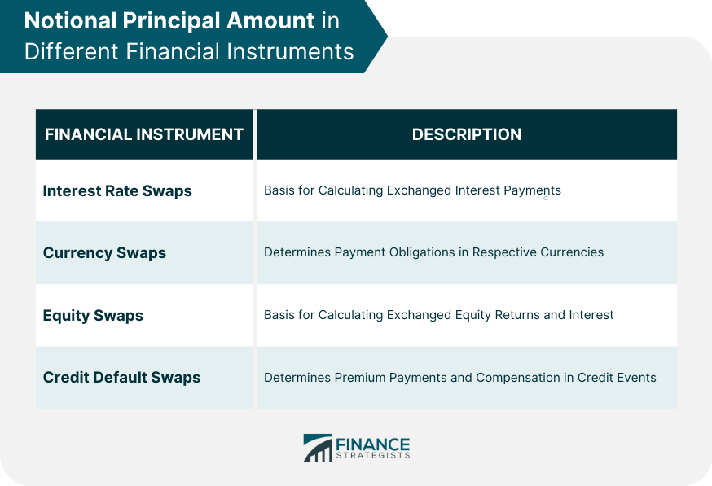

## Table of Contents

## What is the notional principal amount?

The notional principal amount is a term used in finance, especially in derivatives like swaps and options. It represents the imaginary amount of money used to calculate payments or values in a contract. It's called "notional" because it's not actually exchanged between the parties involved. For example, if two parties enter into an interest rate swap, the notional principal amount helps determine the interest payments they will exchange, but they don't actually transfer this amount.

Think of it like this: if you and a friend agree to bet on the temperature tomorrow, you might use a notional amount of $100 to calculate how much you owe each other based on the actual temperature. You don't actually exchange the $100, but it helps you figure out the bet's outcome. This concept is crucial in financial markets because it allows for large transactions without the need to move huge sums of money around, making it easier and more efficient to manage risks and investments.

## How is the notional principal amount used in financial derivatives?

In financial derivatives like swaps, options, and futures, the notional principal amount is used as a reference to calculate the cash flows or payments that need to be exchanged between the parties involved. It's a hypothetical amount that helps determine how much money should change hands based on the terms of the contract. For example, in an interest rate swap, the notional principal amount is used to figure out the interest payments that each party will pay or receive, even though the notional amount itself is never actually exchanged.

This concept is really helpful because it allows people to manage big financial risks without needing to move large sums of money around. Imagine you want to protect yourself against changes in interest rates or currency values. By using a notional principal amount in a derivative contract, you can do that without having to buy or sell the actual underlying asset. This makes it easier and more cost-effective to hedge against risks or speculate on future price movements, which is a key part of modern financial markets.

## Can you explain the difference between notional principal and actual principal?

Notional principal and actual principal are two different concepts in finance. Notional principal is like a pretend amount of money used in contracts like swaps or options. It helps figure out how much money should be paid or received, but it's not real money that gets moved around. For example, if you and a friend bet on the weather using a notional amount of $100, you don't actually give each other $100, but you use it to calculate who owes what based on the weather.

Actual principal, on the other hand, is the real money that you borrow or invest. When you take out a loan, the actual principal is the amount of money you get from the bank and have to pay back. If you invest in a bond, the actual principal is the amount you pay for the bond, and it's what you expect to get back when the bond matures. So, while notional principal is just a tool for calculating payments in certain financial contracts, actual principal is the real money involved in loans and investments.

## Why is the notional principal amount important in interest rate swaps?

The notional principal amount is super important in [interest rate](/wiki/interest-rate-trading-strategies) swaps because it helps figure out how much money each person needs to pay or get. Imagine you and a friend want to swap interest payments based on different rates, like one based on a fixed rate and the other on a variable rate. The notional principal amount is like a pretend amount of money you use to calculate those payments. Even though you don't actually move this money around, it's crucial because it makes the swap work without needing to handle huge sums of cash.

This concept makes interest rate swaps easier and more useful for managing financial risks. For example, if a company wants to protect itself from changes in interest rates, it can use an interest rate swap. By agreeing on a notional principal amount, the company can calculate the payments it needs to make or receive without actually borrowing or lending the full amount. This way, the company can focus on managing its risk without worrying about moving large amounts of money, making the whole process smoother and more efficient.

## How does the notional principal amount affect the cash flows in a swap agreement?

In a swap agreement, the notional principal amount is like a pretend amount of money used to figure out how much cash each person needs to pay or receive. Imagine you and a friend agree to swap interest payments: one based on a fixed rate and the other on a variable rate. The notional principal amount helps you calculate these payments without actually moving that money around. So, if the notional principal is $1 million, and you're swapping a fixed rate of 5% for a variable rate, you'd use that $1 million to work out how much each payment should be, but you wouldn't actually exchange the $1 million itself.

This way, the notional principal amount makes managing cash flows in a swap agreement easier and more efficient. It allows you to handle big financial risks without needing to deal with large sums of actual money. For example, if you're a company trying to protect yourself from changes in interest rates, you can use a swap to manage that risk. By agreeing on a notional principal amount, you can figure out your payments and receipts without the hassle of borrowing or lending the full amount, making it simpler to focus on managing your financial risks.

## What role does the notional principal amount play in the valuation of derivatives?

The notional principal amount is really important when figuring out how much a derivative is worth. Imagine you're trying to find out the value of a swap or an option. The notional principal is like a pretend amount of money that you use to help calculate that value. It's not real money that gets moved around, but it's crucial because it helps you see how much money you might gain or lose based on the terms of the contract.

For example, if you're looking at an interest rate swap, the notional principal amount helps you figure out the cash flows that will happen over time. By using this pretend amount, you can see how changes in interest rates might affect how much money you'll need to pay or receive. This makes it easier to understand the potential value of the swap without having to deal with big sums of actual money. So, the notional principal amount is a key part of valuing derivatives because it helps you calculate and manage financial risks in a simpler and more efficient way.

## How is the notional principal amount determined in a financial contract?

The notional principal amount in a financial contract is decided by the people who are making the deal. They look at things like how much risk they want to take, what they're trying to achieve with the contract, and how much money they want to base their payments on. For example, if two companies are doing an interest rate swap, they might pick a notional principal amount that matches the size of their loans or investments, so the swap can help them manage their risks better.

Once they agree on the notional principal amount, it becomes the pretend amount of money used to figure out the payments or values in the contract. This amount helps them calculate how much money they'll need to pay or receive without actually moving that money around. It's like using a made-up number to make the contract work smoothly and efficiently, without the need to handle large sums of real money.

## What are the risks associated with the notional principal amount in derivatives trading?

When you trade derivatives, the notional principal amount can bring some risks. One big risk is that even though you're not actually moving the notional principal around, the amount you might win or lose can be huge because it's based on that big pretend number. If the market moves a lot, your gains or losses could be much larger than you expected, which can be scary if you're not ready for it.

Another risk is something called counterparty risk. This is when the other person in your contract might not be able to pay what they owe you. Since the notional principal amount is used to calculate payments, if the other person can't pay, you could lose a lot of money, even if you never saw the notional principal itself. It's like betting a small amount on a game but finding out the other person can't pay up if you win big.

These risks show why it's important to be careful when choosing the notional principal amount in a derivative contract. You need to think about how much you can afford to lose and make sure the other person in the deal is reliable. That way, you can use derivatives to manage your risks without getting into trouble because of the big pretend numbers involved.

## How does the notional principal amount impact the leverage of a financial instrument?

The notional principal amount can make a financial instrument more powerful by increasing its leverage. Think of leverage like using a small amount of money to control a much bigger amount. When you use a notional principal amount in a derivative, you're using it to calculate how much you might gain or lose. This means you can control a large amount of money with just a small investment, which can lead to big wins if things go your way. But it also means you could lose a lot if the market moves against you.

For example, if you buy an option with a notional principal amount of $100,000, but you only pay a small premium for the option, you're using leverage. The notional principal amount lets you bet on a big amount of money without actually having to spend it all upfront. This can be great for making more money, but it also means your losses could be bigger than your initial investment if the market doesn't go as planned. So, the notional principal amount can make financial instruments more exciting, but also more risky.

## Can the notional principal amount be changed during the life of a derivative contract?

Usually, the notional principal amount in a derivative contract stays the same once it's set. It's like a rule that helps everyone know how much money they might need to pay or get. Changing it during the life of the contract would be like changing the rules of a game while you're playing, which can be confusing and unfair.

But sometimes, if everyone agrees, the notional principal amount can be changed. This might happen if the people involved in the contract want to adjust their risk or if something big changes in their situation. It's not common, but it can happen if everyone is okay with it and they make a new agreement.

## What are the accounting implications of the notional principal amount in financial reporting?

In financial reporting, the notional principal amount doesn't show up as an asset or liability on the balance sheet. That's because it's not real money that's being moved around. Instead, it's just a number used to figure out how much money people need to pay or receive from derivatives like swaps or options. When companies make financial reports, they focus on the actual cash flows and the fair value of the derivative, not the notional principal amount itself.

But the notional principal amount can affect how companies report their financial risks. For example, if a company uses a big notional principal amount in a derivative contract, it might need to explain this in its financial statements to show how much risk it's taking on. This helps people who read the financial reports understand the company's situation better, even though the notional principal amount isn't directly shown as a number on the financial statements.

## How do regulatory requirements affect the reporting and management of notional principal amounts?

Regulatory requirements play a big role in how companies handle and report notional principal amounts in their financial dealings. Rules from groups like the Financial Accounting Standards Board (FASB) or the International Financial Reporting Standards (IFRS) make sure that companies tell the truth about their financial risks and activities. These rules say that companies need to report the fair value of their derivatives and explain how much risk they're taking on because of the notional principal amounts. This helps everyone who looks at the company's financial reports understand what's going on, even though the notional principal amount itself isn't shown as a number on the balance sheet.

Because of these regulations, companies have to be careful about how they use notional principal amounts in their contracts. They need to keep good records and make sure they're following the rules. This can mean setting up special systems to track their derivatives and making sure they're ready to explain their risks to regulators and investors. By doing this, companies can manage their financial risks better and keep everyone informed about what they're doing with notional principal amounts.

## References & Further Reading

[1]: Hull, J. (2015). ["Options, Futures, and Other Derivatives"](https://www.amazon.com/Options-Futures-Other-Derivatives-10th/dp/013447208X). Pearson Education Limited.

[2]: Lopez de Prado, M. (2018). ["Advances in Financial Machine Learning"](https://www.amazon.com/Advances-Financial-Machine-Learning-Marcos/dp/1119482089). Wiley.

[3]: Chan, E. (2009). ["Quantitative Trading: How to Build Your Own Algorithmic Trading Business"](https://github.com/ftvision/quant_trading_echan_book). Wiley.

[4]: Jansen, S. (2020). ["Machine Learning for Algorithmic Trading: Predictive models to extract signals from market and alternative data for systematic trading strategies with Python"](https://github.com/stefan-jansen/machine-learning-for-trading). Packt Publishing.

[5]: Aronson, D. (2006). ["Evidence-Based Technical Analysis: Applying the Scientific Method and Statistical Inference to Trading Signals"](https://www.amazon.com/Evidence-Based-Technical-Analysis-Scientific-Statistical/dp/0470008741). Wiley.

[6]: Kissell, R. (2013). ["The Science of Algorithmic Trading and Portfolio Management"](https://www.sciencedirect.com/book/9780124016897/the-science-of-algorithmic-trading-and-portfolio-management). Academic Press.

[7]: Fabozzi, F. J., Gupta, F., & Markowitz, H. M. (2002). ["The Legacy of Modern Portfolio Theory"](https://www.semanticscholar.org/paper/The-Legacy-of-Modern-Portfolio-Theory-Fabozzi-Gupta/6619eebc6957d7c101112a041942c4df61783616). The Journal of Investing.