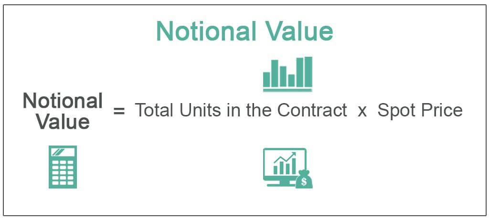

Financial calculations form the backbone of modern trading, enabling market participants to assess risk, determine value, and execute trades with precision. At the heart of these calculations lies the notional principal, a fundamental measure in derivatives trading. Notional principal provides a basis for calculating expected gains and losses in contracts like swaps and options, thereby heavily influencing trading strategies. In essence, it acts as a reference value on which derivative contracts are based, without the actual exchange of this amount.

As financial markets have evolved, the emergence of algorithmic trading, or algo trading, has revolutionized the way traders leverage these calculations. Algo trading employs complex algorithms to automatically execute trades at high speeds and volumes, minimizing human intervention. The rapid processing of complex financial calculations allows traders to react to market changes faster than ever before, providing significant competitive advantages.



The synergy between notional principal calculations and algo trading strategies is profound. By integrating notional principal considerations, algorithms can enhance their ability to assess risk, optimize trade sizing, and improve overall execution strategies. For instance, in interest rate swaps, the notional principal is pivotal for determining the swap's cash flows, and integrating this into an algo system enables precise hedging and arbitrage opportunities.

This article explores how these two components are intertwined, detailing how financial calculations underpin trading decisions. We will define financial calculations in trading, examine notional principal's role in derivatives, and delve into the mechanics of algorithmic trading. Furthermore, we will investigate how notional principal calculations are embedded within algorithmic systems and the resultant benefits and challenges. By the conclusion, the reader will gain a comprehensive understanding of how these elements collectively enhance trading efficacy and hadow a trajectory toward a data-driven future in financial markets.

## Table of Contents

## Understanding Financial Calculations in Trading

Financial calculations in trading are the mathematical assessments used to evaluate securities, projects, and portfolios. These calculations help traders make informed decisions about buying, holding, or selling financial instruments. They involve a wide array of quantitative techniques designed to manage risk, optimize portfolios, and analyze potential investment opportunities. 

### Fundamental Financial Metrics

Traders rely on several key financial metrics to guide their trading strategies. These include:

1. **Price/Earnings Ratio (P/E Ratio):** This ratio compares a company’s share price to its earnings per share. It helps assess whether a stock is over- or under-valued.

2. **Net Present Value (NPV):** NPV is used to assess the profitability of an investment, calculated as the difference between the present value of cash inflows and outflows over a period.

3. **Internal Rate of Return (IRR):** IRR is the discount rate at which the net present value of all the cash flows from a project or investment equals zero. It is a key measure in capital budgeting for assessing the attractiveness of investments.

4. **Volatility:** This metric measures the degree of variation of a trading price series over time, usually expressed as a standard deviation. It is crucial for assessing the risk associated with a security’s price movements.

5. **Value at Risk (VaR):** VaR calculates the potential loss in value of a risky asset or portfolio over a defined period for a given confidence interval. It is essential for risk management.

### The Backbone of Efficient Trading Strategies

Precise financial calculations form the backbone of efficient trading strategies. Accurate assessments allow traders to understand potential risks and returns, enabling them to make informed decisions that align with their investment goals. Calculations like NPV and IRR help traders evaluate the long-term profitability of investment projects, while metrics like VaR and [volatility](/wiki/volatility-trading-strategies) inform risk management strategies. Without accurate financial calculations, traders would be essentially navigating a volatile market blindfolded.

### Traditional vs. Modern Computational Methods

Historically, financial calculations in trading were performed manually or with basic computational tools. Traders and investors relied heavily on spreadsheets, calculators, and human intuition to make estimates and judgments.

With the advent of modern computational methods, the landscape has drastically changed. High-speed computers and advanced algorithms now handle complex models and massive datasets efficiently, enabling real-time analysis and rapid decision-making. 

**Traditional Methods:**
- Manual calculations using calculators and spreadsheets.
- Heavy reliance on historical data and patterns.
- Decision-making often influenced by human biases and intuition.

**Modern Methods:**
- Use of programming languages like Python for real-time data analysis.
- Utilization of machine learning algorithms to predict market trends.
- High-frequency trading powered by sophisticated algorithms.

Here's a simple Python example showing how computational efficiency can be harnessed to calculate the moving average of stock prices, a fundamental metric used in trading strategies:

```python
import pandas as pd

# Load stock prices into a DataFrame
data = pd.read_csv('stock_prices.csv')  # assuming CSV contains 'Date' and 'Price' columns

# Calculate the moving average for a specific window size
window_size = 10
data['Moving_Average'] = data['Price'].rolling(window=window_size).mean()

print(data[['Date', 'Price', 'Moving_Average']])
```

This code snippet demonstrates the use of Python’s Pandas library to perform a simple financial calculation that informs trading decisions.

The transition from traditional to modern methods emphasizes the importance of precision and speed, reducing human error and bias. The ability to process vast amounts of data quickly and accurately is revolutionizing trading, setting the foundation for more complex strategies like [algorithmic trading](/wiki/algorithmic-trading), which continues to evolve and integrate more sophisticated financial calculations.

## What is Notional Principal in Derivatives Trading?

In derivatives trading, the term "notional principal" refers to the total value or face amount underlying a derivative contract, which determines the scale of financial transactions without necessarily changing hands. Essentially, notional principal acts as a reference point for the calculation of payments made in derivative agreements, such as swaps, options, and futures.

To understand its calculation, consider two parties involved in an [interest rate](/wiki/interest-rate-trading-strategies) swap agreement. Party A agrees to pay a fixed rate of interest to Party B, while Party B pays a floating rate to Party A. Here, neither party exchanges the notional principal itself; rather, they swap interest payments calculated on it. The notional principal serves as the basis for computation but does not represent an actual cash flow. Mathematically, if Party A and Party B agree that the notional principal for their swap is $100 million and the fixed rate is 5%, then Party A will pay 5% of $100 million in interest annually, i.e., $5 million, to Party B.

Notional principal is critical for derivatives contracts because it helps in determining the exposure and obligation levels, ultimately impacting strategies related to risk assessment and trade sizing. For instance, in the options market, the notional principal impacts the premium amount paid. An option to purchase 100 shares of a stock at a specified price will have a notional value determined by multiplying the price per share by the number of shares. This value dictates the magnitude of both profit potential and risk exposure for the option holder.

In the context of swaps, notional principal is the cornerstone for calculating periodic payment obligations between counterparties. It becomes integral in assessing counterparty risk and [liquidity](/wiki/liquidity-risk-premium) requirements. Particularly in interest rate swaps, calculating the right notional amount helps traders effectively manage interest rate exposures, aligning with their broader risk management strategies.

Risk assessment in derivative trading relies heavily on understanding the notional principal because it quantifies the size of exposure without signaling the cash that directly changes hands. For calculating risk exposures and capital requirements, financial institutions use the notional amounts of their derivatives positions. Larger notional principals generally imply greater market exposure, potential risk, and the need for effective trade sizing.

In summary, notional principal is a fundamental metric in derivatives trading, crucial for payment calculations and risk evaluation. Through derivatives like swaps and options, it determines the extent of financial involvement and helps assess risk, informing strategies for trade sizing and risk management.

## The Role of Algorithmic Trading in Financial Markets

Algorithmic trading, also known as algo trading, is a technological advancement in financial markets that involves using computer algorithms to execute trades at speeds and efficiencies beyond human capabilities. Rooted in mathematical models and statistical analyses, algo trading allows for the execution of orders based on predetermined criteria, such as timing, price, and quantity, thus automating the trading process. Introduced in the latter part of the 20th century, the practice has since evolved dramatically with advances in computational power and data analytics.

The primary advantages of algorithmic trading are its speed, efficiency, and elimination of emotional bias. Algorithms can execute multiple trades simultaneously across various markets and asset classes, a feat that would be time-consuming and nearly impossible for human traders. This capability ensures that trades are executed at the best possible prices and helps limit the market impact of large orders. Efficiency in algo trading is further achieved through reduced transaction costs and the ability to implement complex strategies rapidly.

Another key advantage of algorithmic trading is the reduction of human error. Emotional biases often lead to suboptimal trading decisions, such as holding onto losing positions out of hope or panic selling during market downturns. Algorithms, however, make decisions based solely on data-driven criteria, devoid of psychological impacts. This objectivity can enhance the consistency and predictability of trading outcomes.

Algorithms process complex financial calculations quickly and accurately, a critical component of effective trading strategies. High-frequency trading ([HFT](/wiki/high-frequency-trading-strategies)), a subset of algorithmic trading, exemplifies this capability by executing thousands of trades per second, capturing minuscule price discrepancies that would otherwise be missed. Techniques such as statistical [arbitrage](/wiki/arbitrage), mean reversion, and trend-following rely heavily on algorithms' capacity to analyze vast volumes of data efficiently and execute trades accordingly. Python, a popular programming language in the financial industry, provides libraries such as NumPy and pandas to facilitate these calculations and strategy developments.

Recent trends in algorithmic trading include the integration of [machine learning](/wiki/machine-learning) and [artificial intelligence](/wiki/ai-artificial-intelligence), allowing for more adaptive and predictive trading strategies. These technologies can identify patterns in large datasets that may not be evident to human traders, enriching decision-making processes. The proliferation of big data has also contributed to the refinement of algorithms; with more data points to analyze, algorithms can improve their accuracy and predictive power.

Despite its advantages, algorithmic trading comes with challenges, including the need for robust infrastructure and real-time data processing capabilities. Latency, or delay in information processing, can adversely affect trade execution and profits. Additionally, the increasing complexity of algorithms may require specialized knowledge and resources to develop and maintain sophisticated trading systems.

Overall, algorithmic trading has profoundly impacted financial markets by enhancing the speed and efficiency of trading practices. Its ongoing evolution, fueled by technological advancements, promises to offer even more sophisticated tools and strategies for market participants in the future.

## Integrating Notional Principal Calculations into Algo Trading

Integrating notional principal into algorithmic trading systems requires an understanding of both derivatives trading and the operational framework of trading algorithms. The notional principal is a critical component in derivatives as it represents the total value of a leveraged position or contract, without necessarily changing hands. Accurate calculation and incorporation of this concept in algorithmic strategies can significantly influence trade outcomes, particularly in terms of risk management, leverage, and liquidity evaluation.

To effectively integrate notional principal calculations into algorithmic systems, algorithms must first retrieve and process market data to accurately compute the notional value of positions. These calculations can be automated using Python scripts that utilize libraries such as NumPy and Pandas to handle large datasets efficiently. This automation facilitates real-time analysis and decision-making, which is crucial in high-frequency trading environments. For instance, algorithms can be designed to adjust the notional principal dynamically as market conditions evolve, ensuring optimized exposure levels across varying market scenarios.

```python
import numpy as np
import pandas as pd

# Sample data representing notional values and market rates
data = {'Contract': ['Swap A', 'Option B'],
        'Notional Principal': [1000000, 2000000],
        'Market Rate': [0.05, 0.1]}

df = pd.DataFrame(data)

# Calculate the adjusted notional value based on market rates
df['Adjusted Notional'] = df['Notional Principal'] * (1 + df['Market Rate'])

print(df)
```

Case studies highlight the enhancement of algorithmic trading outputs through notional principal calculations. For example, a trading firm employing swap contracts might use algorithms to adjust their positions dynamically based on real-time interest rate movements, as calculated from their notional principal. Such strategies can improve predictions by leveraging the sensitivity of derivatives to market changes, thereby optimizing trade execution.

The benefits of automating notional principal adjustments include improved precision in risk management, more efficient allocation of capital, and the ability to exploit arbitrage opportunities with minimal delay. By maintaining an accurate representation of notional values, traders can better assess leverage and risk, aligning their strategies with financial goals while adhering to regulatory requirements.

However, there are challenges inherent in automating these calculations. Complex derivatives can involve multi-layered financial structures, necessitating robust and sophisticated algorithms that can handle diverse scenarios and potential market disruptions. Moreover, these systems require high-quality data inputs and computational power to function effectively, highlighting the necessity for advanced IT infrastructure and investment in technological resources.

Integrating notional principal calculations into algorithmic trading also necessitates constant monitoring of liquidity conditions. Algorithms must be able to adapt to changes in market stability, ensuring that positions can be entered and exited without undue market impact. This consideration is paramount, especially during periods of volatility where liquidity may be constrained.

In summary, while integrating notional principal calculations into algorithmic trading systems proves advantageous in enhancing trade precision and execution, it also demands a strategic approach to overcome computational and market complexity. These integrations provide a competitive edge by equipping traders with the tools necessary for managing risk and optimizing trades in rapidly changing financial markets.

## Benefits and Challenges of Using Notional Principal in Algo Trading

Integrating notional principal in algorithmic trading strategies offers several advantages, particularly in risk management and leverage. Notional principal represents a theoretical amount used in derivatives trading to calculate payment streams generated by interest rates, exchange rates, or other financial metrics without requiring the actual exchange of the notional amount itself. By incorporating this concept into trading algorithms, traders can more effectively manage risk and adjust leverage according to market conditions. 

The use of notional principal allows traders to maintain control over their exposure by tailoring the size of their positions without impacting the actual capital deployed. In algorithmic trading, this capability enables the creation of sophisticated risk management strategies that dynamically adjust based on the volatility and perceived risk of assets. Thus, it aids in optimizing portfolio allocations and provides significant leverage capabilities, enhancing potential returns while managing the associated risks.

However, automating notional principal calculations within algorithmic systems presents computational challenges. These calculations can be complex, requiring constant real-time adjustments to account for fluctuating market parameters and the terms of various derivative instruments. Scalability is another concern, as algorithms must efficiently handle a large [volume](/wiki/volume-trading-strategy) of transactions while maintaining accuracy. This demands high-quality data inputs and robust computational resources to process and react to market changes swiftly. Accurate data is essential in ensuring the effectiveness of the algorithms as even minor errors in the notional principal calculations can lead to substantial financial consequences.

The necessity for high-quality data highlights another challenge—market liquidity and stability. As algorithms execute trades based on computed signals, a large-scale adoption of notional principal within algo trading could impact liquidity. While it is useful for individual risk management, if many traders employ similar algorithms, it could lead to synchronized buying or selling, potentially destabilizing the market. 

In conclusion, while the integration of notional principal into algorithmic trading provides significant benefits in risk management and leveraging, it requires overcoming various computational obstacles. Traders and firms must ensure they have access to precise data and adequate computational power to fully harness the potential of incorporating notional principal in their trading algorithms, all while considering the broader implications on market dynamics.

## Conclusion

In modern trading, the integration of notional principal calculations with algorithmic trading has proven to be a cornerstone in enhancing trading strategies. The synergy between these elements lies in the ability of algo trading systems to incorporate precise calculations, such as those involving notional principal, into their decision-making processes. This integration allows for improved risk assessment, optimal trade sizing, and better leverage management, ultimately leading to more efficient and effective trading outcomes.

Traders who successfully blend notional principal calculations with algorithmic strategies gain significant advantages in terms of speed, accuracy, and consistency. By automating the adjustment of notional principal within trading algorithms, traders can quickly adapt to market changes, minimize human error, and reduce emotional biases, all of which contribute to superior trade execution and market predictions.

Looking ahead, the future of algo trading hinges on advancements in financial computations. As computational techniques evolve, so too does the capacity for algorithms to process complex financial metrics with greater precision. This, in turn, fosters an environment where trading strategies can become increasingly sophisticated, leveraging nuanced financial data to achieve competitive advantages.

Moreover, ongoing exploration and adaptation of advanced financial techniques are essential for maintaining and enhancing the efficacy of trading workflows. The careful application of notional principal calculations in algorithmic systems not only bolsters current trading strategies but also sets a foundation for future innovations in trading technology. Therefore, it is crucial for traders and financial institutions to remain at the forefront of these advancements, continuously integrating new methods to maximize their trading potential.

## References & Further Reading

[1]: Hull, J. (2015). ["Options, Futures, and Other Derivatives"](https://www.amazon.com/Options-Futures-Other-Derivatives-10th/dp/013447208X). Pearson Education Limited.

[2]: Lopez de Prado, M. (2018). ["Advances in Financial Machine Learning"](https://www.amazon.com/Advances-Financial-Machine-Learning-Marcos/dp/1119482089). Wiley.

[3]: Chan, E. (2009). ["Quantitative Trading: How to Build Your Own Algorithmic Trading Business"](https://github.com/ftvision/quant_trading_echan_book). Wiley.

[4]: Jansen, S. (2020). ["Machine Learning for Algorithmic Trading: Predictive models to extract signals from market and alternative data for systematic trading strategies with Python"](https://github.com/stefan-jansen/machine-learning-for-trading). Packt Publishing.

[5]: Aronson, D. (2006). ["Evidence-Based Technical Analysis: Applying the Scientific Method and Statistical Inference to Trading Signals"](https://www.amazon.com/Evidence-Based-Technical-Analysis-Scientific-Statistical/dp/0470008741). Wiley.

[6]: Kissell, R. (2013). ["The Science of Algorithmic Trading and Portfolio Management"](https://www.sciencedirect.com/book/9780124016897/the-science-of-algorithmic-trading-and-portfolio-management). Academic Press.

[7]: Fabozzi, F. J., Gupta, F., & Markowitz, H. M. (2002). ["The Legacy of Modern Portfolio Theory"](https://www.semanticscholar.org/paper/The-Legacy-of-Modern-Portfolio-Theory-Fabozzi-Gupta/6619eebc6957d7c101112a041942c4df61783616). The Journal of Investing.