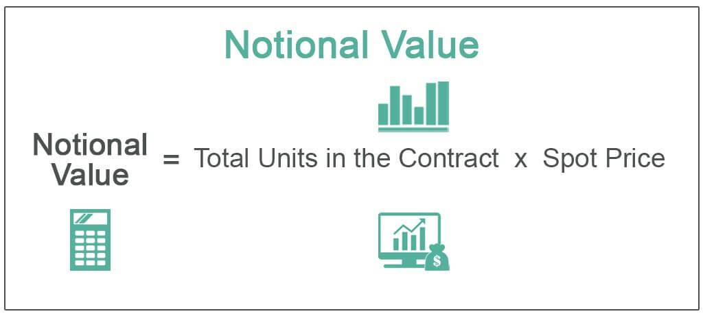

In today's complex financial markets, understanding the intricacies of financial contracts and derivatives is essential. Financial derivatives are powerful instruments that derive their value from underlying assets such as stocks, bonds, commodities, or indices, and their effective use hinges upon the concept of notional value. Notional value refers to the aggregate value of a derivative's underlying asset, which differs from its market value. This metric is crucial for gauging the scale and potential impact of trading activities, especially when the actual cash exchanged in transactions is a fraction of the notional value. It plays an essential role in risk exposure assessments within derivative transactions.

Simultaneously, algorithmic trading has transformed modern trading practices by enhancing the speed and efficiency of executing transactions. This technology deploys sophisticated algorithms and mathematical models to automatically manage trading decisions based on pre-set parameters, creating enormous potential for more precise and rapid trade executions.



This article highlights how notional value, financial contracts, derivatives, and algorithmic trading are interconnected and significant in contemporary financial markets. They integrate to form the backbone of numerous trading strategies, offering both opportunities and risks that stakeholders need to navigate adeptly. By exploring these topics, we aim to provide a comprehensive overview to help finance professionals and enthusiasts better navigate today's fast-paced and dynamic financial ecosystem, empowering them to make informed decisions and optimize their strategic approaches.

## Table of Contents

## Understanding Notional Value

Notional value is a fundamental concept in the financial markets, especially regarding derivatives. It represents the total nominal or face value of a derivative's underlying asset rather than the actual market value exchanged at the time of trading. By definition, notional value is crucial for evaluating the scale and potential impact of a derivative contract without the necessity of the physical exchange of assets or cash.

To better understand, consider a derivative such as a futures contract. In futures, the notional value is the product of the contract size and the current price of the underlying asset. For example, if a futures contract involves 100 barrels of oil priced at $50 per barrel, the notional value is $5,000. However, this notional value does not imply that $5,000 has been exchanged. It is primarily a reference metric to measure the contract's size.

Notional value is significant for several reasons:

1. **Assessment of Exposure**: By analyzing the notional value, investors can gain crucial insights into the level of exposure they face in derivative transactions. Higher notional values can indicate substantial exposure to market movements and potential risks in case the market direction opposes the investor's position.

2. **Risk Management**: Understanding the notional value is invaluable for managing risk, especially in large-scale derivative trades. Since notional values often reflect leveraged positions, they can help estimate the potential gains or losses and plan strategies to mitigate risk.

3. **Market Impact Analysis**: For professionals evaluating the market impact of trades, notional value provides a baseline for understanding the potential volume and movement that a particular trade might induce within the market. Analyzing aggregate notional values helps gauge the broader market dynamics and liquidity conditions.

Applications of notional value are prominently seen in different types of derivative contracts, including futures, options, and swaps. Each of these contracts uses notional value to determine leverage and exposure. For instance, options might have a notional value based on their underlying asset, which determines the potential payout but does not equate to the premium paid for the option itself.

In swap agreements, notional value is integral to calculating periodic interest payments or currency exchanges. For example, in an [interest rate](/wiki/interest-rate-trading-strategies) swap, the notional amount is utilized to compute the interest payments exchanged between parties, although the principal itself is not exchanged.

In summary, notional value is an essential measurement in the world of derivatives. It is a tool that aids in assessing exposure, managing risk, and predicting market impacts, enabling finance professionals to intelligently navigate and strategize within derivative markets. Understanding its mechanics is vital for anyone involved in trading or managing portfolios with derivative components.

## Financial Contracts and Derivatives: An Overview

Financial contracts, commonly known as derivatives, are financial instruments that derive their value from an underlying asset or group of assets. These assets can include stocks, bonds, commodities, currencies, interest rates, or market indices. Derivatives play a vital role in modern finance due to their versatility and utility in diverse financial strategy applications.

Derivatives serve several purposes, the most common being risk management through hedging strategies. Hedging involves taking a position in a derivative to offset potential losses in another position, thus mitigating financial risks. For example, a farmer may use futures contracts to lock in the price of their crop, protecting against potential future price declines. Similarly, financial institutions often use interest rate swaps to manage exposure to fluctuating interest rates.

In addition to hedging, derivatives are employed for speculative purposes. Traders and investors may seek to profit from anticipated price movements by leveraging derivatives without owning the underlying asset. This is achieved by taking positions based on forecasts of market direction, [volatility](/wiki/volatility-trading-strategies), or other financial metrics. Due to their leveraged nature, even small movements in the underlying asset's price can result in significant profits or losses, making speculation with derivatives a high-risk, high-reward strategy.

Derivatives also facilitate portfolio diversification. Investors can use these instruments to gain exposure to different asset classes or market segments, enhancing a portfolio's risk-adjusted returns. By including derivatives, investors can potentially achieve better balance and performance within their portfolios.

Several types of derivatives are prevalent in financial markets, each with distinct features and applications:

1. **Futures**: These are standardized contracts that obligate the buyer to purchase or the seller to sell a specific asset at a predetermined future date and price. Futures are commonly used for commodities and financial instruments, providing a mechanism for hedging and speculative trading on exchanges.

2. **Options**: These contracts give the holder the right, but not the obligation, to buy or sell an asset at a specified strike price before or on a given expiration date. Options offer flexibility in hedging and speculation strategies, as they allow traders to capitalize on market movements without the requirement to transact in the underlying asset.

3. **Swaps**: Swaps are private agreements between parties to exchange cash flows or financial instruments. Examples include interest rate swaps, where two parties exchange fixed for floating interest payments, and currency swaps, which involve exchanging principal and interest payments in different currencies.

4. **Forwards**: Similar to futures, forwards are agreements to buy or sell an asset at a specified future date and price. However, forwards are typically customized contracts traded over-the-counter (OTC), allowing for greater flexibility but also increasing counterparty risk.

Leverage is a defining feature of derivative contracts, enabling traders to control larger positions than their actual capital would allow. This amplification of potential returns also magnifies potential losses, introducing significant risks. As a result, understanding the intricacies of leverage is essential for effective derivatives trading.

For both individual and institutional traders, a comprehensive understanding of financial contracts and derivatives is crucial for navigating the complexities of contemporary finance. Mastery of these instruments allows for effective risk management, strategic diversification, and informed speculation, contributing to the achievement of financial objectives in a dynamic marketplace.

## The Rise of Algorithmic Trading

Algorithmic trading has fundamentally transformed the landscape of financial markets by utilizing sophisticated computer algorithms to execute trades with a speed and precision unreachable by human traders. This form of trading harnesses mathematical models to make decisions regarding buying and selling based on predefined criteria, thus eliminating emotional biases that often affect human decision-making. The evolution of [algorithmic trading](/wiki/algorithmic-trading) has been largely driven by the increasing demand for rapid and cost-effective trade execution. 

One of the primary advantages of algorithmic trading is its efficiency. By automating the trading process, algorithms can scan multiple markets simultaneously and execute large volumes of trades with reduced transaction costs. This efficiency is augmented by strategies that are meticulously designed to take advantage of small price differences across different markets or securities. 

Furthermore, algorithmic trading significantly influences market [liquidity](/wiki/liquidity-risk-premium) and volatility. The presence of high-frequency trading ([HFT](/wiki/high-frequency-trading-strategies)), a subset of algorithmic trading, plays a pivotal role in enhancing market liquidity as it involves making a large number of trades at extremely high speeds. However, this can also lead to increased market volatility. The introduction and execution speed available to HFT allows for [arbitrage](/wiki/arbitrage) opportunities that might be imperceptible in slower trading environments but can cause rapid changes in asset prices.

Understanding algorithmic trading is crucial for a comprehensive grasp of how contemporary financial markets operate. Notional value calculations become critical in high-frequency and algorithmic trading environments. They help in assessing the total value underlying derivative trades, which is imperative for estimating leverage and exposure. For instance, when considering a futures contract, the notional value is the product of the contractual price and the size of the contract. Accurately evaluating these metrics allows for more informed trading strategies and risk management.

In practice, algorithmic trading systems can be implemented using languages such as Python, which is popular due to its extensive libraries and ease of use. A basic example of an algorithm for moving average crossover, one of the simplest trading strategies, could be coded as follows:

```python
import pandas as pd

# Sample data
data = pd.read_csv('stock_price_data.csv')  # Replace with actual data source

# Calculate moving averages
data['SMA_50'] = data['Close'].rolling(window=50).mean()
data['SMA_200'] = data['Close'].rolling(window=200).mean()

# Detect signal for buy/sell
data['Signal'] = 0  # Default no action
data.loc[data['SMA_50'] > data['SMA_200'], 'Signal'] = 1  # Buy on crossover
data.loc[data['SMA_50'] < data['SMA_200'], 'Signal'] = -1 # Sell on crossunder

# Output signals
print(data[['Date', 'Close', 'SMA_50', 'SMA_200', 'Signal']])
```

In conclusion, the rise of algorithmic trading is a testament to the evolving nature of financial markets, emphasizing efficiency, speed, and precision. The interaction between this technology and elements such as notional value underlines the complexity and sophistication required to navigate today's financial ecosystem effectively.

## Interconnectivity of Notional Value, Derivatives, and Algorithmic Trading

The interplay between notional value, derivatives, and algorithmic trading is a crucial component of today's financial markets. Algorithmic trading systems are designed to execute trades at speeds and frequencies far beyond the capabilities of human traders. These systems often incorporate derivatives to enhance their trading strategies, leveraging the notional value to assess exposure and leverage effectively.

Notional value is a significant metric in understanding the scale of exposure when dealing with derivatives within these algorithmic frameworks. By accurately gauging notional values, traders and algorithms can maintain a balanced portfolio and implement effective hedging strategies. The ability of algorithmic models to integrate notional value calculations can aid in predicting the potential market impact and liquidity requirements of trades. This is particularly relevant in high-frequency trading environments, where the precision of trade execution can influence market dynamics significantly.

For example, in a complex portfolio comprising multiple derivatives, calculating the aggregate notional value provides insight into the overall exposure. This can be expressed mathematically with the following Python code snippet:

```python
def calculate_aggregate_notional(derivatives):
    total_notional = 0
    for derivative in derivatives:
        total_notional += derivative['notional_value']
    return total_notional

# Example usage
derivatives = [
    {'type': 'futures', 'notional_value': 1000000},
    {'type': 'options', 'notional_value': 500000},
    {'type': 'swaps', 'notional_value': 750000},
]

aggregate_notional_value = calculate_aggregate_notional(derivatives)
print(f"The aggregate notional value is: {aggregate_notional_value}")
```
This code calculates the sum of notional values for a list of derivatives, offering a straightforward method to assess total market exposure, essential for managing risk in automated trading systems.

Furthermore, algorithmic trading systems rely on seamless integration of notional value metrics with trading algorithms to improve risk management and optimize performance. The predictive capability of these systems enables them to adapt trading decisions based on continuous assessments of notional value and associated risks, allowing for real-time refinements of trading strategies.

Integrating notional value with derivatives and algorithmic trading thus provides a robust framework for risk analysis and management in the financial sector. By understanding these interconnections, traders can effectively steer their strategies toward greater efficiency and better informed decision-making processes in the ever-evolving financial markets.

## Risks and Challenges in Algorithmic Trading with Derivatives

Algorithmic trading, while offering efficiency and speed, presents several notable risks and challenges, especially when integrated with derivatives trading. These risks can be broadly categorized into technological, market, and regulatory challenges, each requiring specific mitigation strategies to ensure stability and compliance in financial markets.

**Technological Risks:**

Algorithmic trading relies heavily on complex technical infrastructures. A primary concern is technological glitches, which can lead to erroneous trades due to software bugs, hardware failures, or network issues. These glitches can result in significant financial losses and even trigger broader market disruptions. To mitigate such risks, robust testing and verification processes are essential. Real-time monitoring systems and redundancy protocols can help detect and correct errors swiftly.

**Market Manipulation:**

Algorithmic trading can also facilitate market manipulation tactics such as "spoofing" and "quote stuffing," where traders use high-speed trading algorithms to create false market signals, distorting the perceived supply and demand. This manipulation can lead to mispricing and increased volatility, harming market integrity. Regulatory bodies have implemented stringent guidelines and surveillance systems to identify and penalize such manipulative practices.

**Systemic Risk:**

The speed and [volume](/wiki/volume-trading-strategy) of trades conducted through algorithms can exacerbate systemic risk. In highly interconnected financial markets, a failure in one part of the system can trigger cascading effects, as observed in the 2010 Flash Crash. This systemic risk is amplified when trading involves derivatives, which are inherently complex and leveraged. Stress-testing and scenario analysis can help prepare for and mitigate potential systemic disruptions.

**Risks Associated with Derivatives:**

Derivatives introduce additional layers of risk, including counterparty risk and market risk. Counterparty risk arises from the possibility that one party in a derivative contract may default on its obligations, while market risk refers to potential losses due to adverse price movements. Algorithmic frameworks must account for these risks through comprehensive risk assessment models and hedging strategies. The use of collateral and Clearinghouses can further reduce counterparty risk.

**Regulatory Challenges:**

The rapid evolution of algorithmic trading technology has posed significant challenges for regulators, who must balance market innovation with investor protection. Ensuring algorithms comply with market regulations involves ongoing scrutiny and adaptability to new trading tactics and technologies. Regulatory bodies, therefore, continuously update their frameworks to address emerging issues, such as the introduction of new trading platforms and algorithms.

In addressing these diverse risks, a combination of robust risk management systems and an in-depth understanding of market dynamics, both in algorithmic trading and derivatives, is crucial. Employing a multidisciplinary approach that incorporates technology, finance, and regulatory compliance will allow stakeholders to harness the benefits of algorithmic trading while mitigating its associated risks.

## Conclusion

The convergence of notional value, financial contracts, derivatives, and algorithmic trading is pivotal in shaping contemporary trading strategies. Each of these components contributes distinct advantages and hurdles that require a thorough understanding for proper execution. Financial contracts and derivatives, by facilitating diverse investment strategies and hedging opportunities, inherently contain complexities and risks. Similarly, the notional value provides a crucial measure of exposure and potential leverage, essential for evaluating the scale and impact of derivative products.

Algorithmic trading, which revolutionizes trade efficiency and speed, introduces both opportunities for cost reduction and challenges related to market volatility and technological reliance. As these elements coalesce, they necessitate a framework where the comprehension of risk, contract valuation, and market dynamics are integral to successful navigation.

As financial markets progress, staying abreast of advancements in technology and regulatory changes remains crucial for stakeholders. Continuous innovation in algorithmic models, alongside regulatory scrutiny, will undoubtedly affect the landscape. These changes present new opportunities for optimizing trading systems but also introduce complexities that demand sophisticated risk management and compliance strategies. 

By effectively integrating notional value, financial contracts, derivatives, and algorithmic trading elements, traders and financial experts can refine their strategic approaches, ultimately enhancing performance and achieving success in the fast-paced financial environment. This synthesis is essential not only to maximize returns but also to navigate the rapidly changing regulatory and technological scenarios that define modern financial markets.

## References & Further Reading

[1]: Hull, J. C. (2017). ["Options, Futures, and Other Derivatives"](https://www.semanticscholar.org/paper/Options%2C-Futures%2C-and-Other-Derivatives-Hull/89bdee500c8623864fc9eb7a471546aa713acc44). Pearson.

[2]: Aldridge, I. (2013). ["High-Frequency Trading: A Practical Guide to Algorithmic Strategies and Trading Systems"](https://www.ahmetbeyefendi.com/wp-content/uploads/2020/07/High-Frequency-Trading-Irene-Aldridge.pdf). Wiley.

[3]: Lopez de Prado, M. (2018). ["Advances in Financial Machine Learning"](https://www.amazon.com/Advances-Financial-Machine-Learning-Marcos/dp/1119482089). Wiley.

[4]: Durbin, M. (2010). ["All About Derivatives"](https://www.amazon.com/All-About-Derivatives-Second/dp/0071743510). McGraw-Hill.

[5]: Narang, R. K. (2013). ["Inside the Black Box: A Simple Guide to Quantitative and High-Frequency Trading"](https://onlinelibrary.wiley.com/doi/book/10.1002/9781118662717). Wiley.