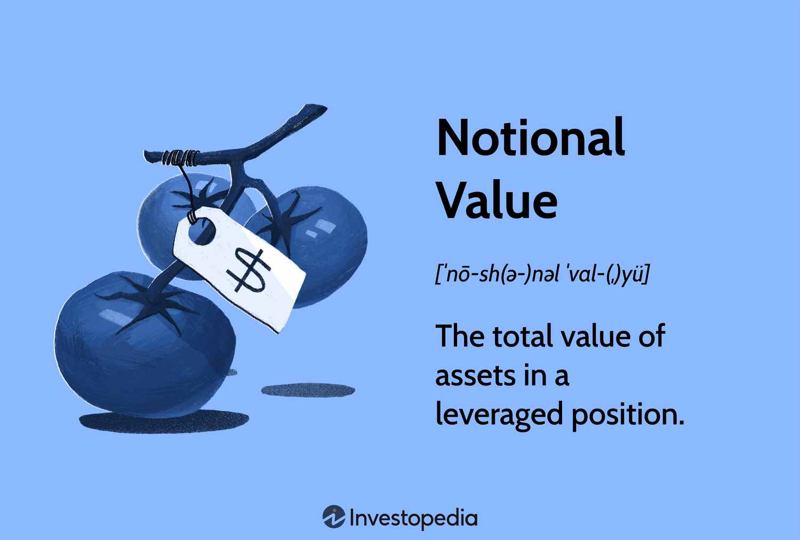

## Table of Contents

## What is notional value in financial contracts?

Notional value is a term used in financial contracts to describe the total value of a position, agreement, or transaction. It's like the face value or the amount that the contract is based on, but it's not necessarily the amount of money that changes hands. For example, if you buy a futures contract for 100 barrels of oil at $50 per barrel, the notional value of that contract is $5,000, even if you only need to put down a small amount of money to enter the contract.

This concept is important because it helps people understand the size and risk of a financial contract. In derivatives like options and swaps, the notional value can be much larger than the actual money involved, which can make these contracts seem riskier. It's a way to measure the total exposure without looking at the cash that's actually exchanged.

## How is notional value different from market value?

Notional value and market value are two different ways to look at the worth of a financial contract. Notional value is like the total amount that the contract is based on. It's the face value or the amount used to calculate payments. For example, if you have a contract to buy 100 shares of a stock at $10 each, the notional value is $1,000, even if you don't pay that full amount right away.

Market value, on the other hand, is the price that the contract would sell for in the market right now. It can change all the time based on what people are willing to pay. Using the same example, if the stock price goes up to $12, the market value of your contract would be $1,200. So, notional value stays the same unless the contract changes, but market value can go up and down with the market.

## Can you give an example of notional value in a simple financial contract?

Imagine you want to buy a futures contract for corn. The contract says you can buy 5,000 bushels of corn at $4 per bushel. The notional value of this contract is $20,000, which is just 5,000 bushels times $4 per bushel. This is the total amount the contract is based on, even if you don't have to pay the full $20,000 right away.

Let's say you only need to put down $2,000 to enter this contract. That $2,000 is called the margin, and it's much less than the notional value. The notional value helps you understand the size of the deal you're making, even if the actual money you're putting down is smaller.

## Why is notional value important in derivatives like futures and options?

Notional value is important in derivatives like futures and options because it shows the total amount of the contract. It's like the size of the bet you're making. For example, if you buy a futures contract for oil, the notional value tells you how much oil you're dealing with and at what price, even if you don't pay the full amount right away. This helps you understand how big your position is and how much it could affect you if the price of oil changes.

In options, the notional value is also key because it helps you see the potential impact of the contract. If you buy an option to buy 100 shares of a stock at a certain price, the notional value is the total value of those 100 shares at that price. This is important because it shows you the maximum amount you could gain or lose if the stock price moves a lot. So, notional value is a way to measure the risk and reward of derivatives without looking at the actual money you're putting down.

## How does notional value affect the risk exposure of a financial contract?

Notional value is like the size of the bet you're making in a financial contract. It shows how much you could win or lose if things go well or badly. For example, if you buy a futures contract for 100 barrels of oil at $50 each, the notional value is $5,000. If the price of oil goes up to $60, you could make a profit based on that $5,000 notional value. But if the price goes down to $40, you could lose money based on that same $5,000. So, the notional value helps you see how much risk you're taking on.

In derivatives like options and swaps, the notional value can be much bigger than the money you actually put down. This can make the contract seem riskier because even a small change in the price of the underlying asset can lead to big gains or losses. For example, if you buy an option to buy 1,000 shares of a stock at $10 each, the notional value is $10,000. If the stock price moves just a little, it can affect your profit or loss a lot because of that big notional value. So, understanding the notional value helps you know how much risk you're taking on with these contracts.

## What role does notional value play in the leverage of a financial instrument?

Notional value is really important when it comes to leverage in financial instruments. Leverage is like using a small amount of money to control a much bigger investment. For example, if you buy a futures contract for 100 barrels of oil at $50 each, the notional value is $5,000. But you might only need to put down $500 to enter that contract. That $500 is your margin, and it lets you control a $5,000 position. So, the notional value shows you how much you're really betting on, even if you're only using a small amount of money.

This can make things riskier because even small changes in the price of what you're betting on can lead to big gains or losses. If the price of oil goes up just a little, your profit can be big because you're controlling a big position with just a little money. But if the price goes down, your loss can be big too. So, the notional value helps you understand how much leverage you're using and how much risk you're taking on.

## How is notional value calculated in complex financial instruments like swaps?

In complex financial instruments like swaps, notional value is the amount used to calculate the payments that need to be made. For example, if you have an [interest rate](/wiki/interest-rate-trading-strategies) swap where you agree to pay a fixed rate of 5% on a notional value of $1 million, the notional value is $1 million. You don't actually exchange the $1 million, but you use it to figure out how much you need to pay. If the other side of the swap is paying a floating rate, they would also use the $1 million to calculate their payments.

The notional value in swaps is important because it shows how big the contract is, even if no money changes hands at the start. It helps you understand the size of the risk you're taking on. If the notional value is big, even small changes in interest rates can lead to big payments. So, the notional value is like the size of the bet you're making in a swap, and it's used to figure out the payments without actually exchanging that amount of money.

## What are the implications of notional value for regulatory capital requirements?

Notional value is important for banks and financial institutions when they figure out how much money they need to keep as a safety net, which is called regulatory capital. Regulators want to make sure that banks have enough money to cover their risks. If a bank has a lot of contracts with big notional values, like swaps or futures, they might need to keep more money in reserve. This is because the notional value shows how big their bets are, and bigger bets mean more risk.

For example, if a bank has a swap agreement with a notional value of $100 million, they need to think about how much risk that represents. Even if they don't actually exchange $100 million, the notional value helps regulators decide how much money the bank should keep to cover potential losses. So, notional value helps set the rules for how much money banks need to have on hand to stay safe and sound.

## How does notional value impact the pricing of financial contracts?

Notional value plays a big role in how financial contracts are priced. It's like the size of the bet you're making, so it helps figure out how much money you could win or lose. For example, if you buy a futures contract for 100 barrels of oil at $50 each, the notional value is $5,000. This notional value is used to calculate the price of the contract. If the market thinks the price of oil might go up, the contract might cost more because the notional value shows how much you could gain if you're right.

In derivatives like options and swaps, the notional value can make the pricing more complicated. For an option to buy 100 shares of a stock at $10 each, the notional value is $1,000. The price of the option depends on this notional value, but also on how likely it is that the stock price will go above $10. In swaps, the notional value helps calculate the payments that need to be made, so it affects the price of the swap too. So, notional value is a key part of figuring out how much financial contracts are worth.

## Can notional value be used to assess the systemic risk in financial markets?

Notional value can help us understand systemic risk in financial markets. Systemic risk is like the danger that problems in one part of the market could spread and cause trouble everywhere. If a lot of financial contracts have big notional values, it means there are big bets being made. If something goes wrong with these big bets, it could affect a lot of people and cause a big mess in the market. So, by looking at the notional values of contracts, we can see how much risk is out there and how bad things could get if something goes wrong.

For example, if banks and other big players have a lot of swaps and derivatives with huge notional values, a small change in interest rates or stock prices could lead to big losses. These losses could make banks less stable, and if one bank gets into trouble, it might make other banks and investors nervous. This nervousness can spread quickly and cause a bigger problem in the whole financial system. So, notional value helps us keep an eye on how much risk is building up and how it might affect everyone if things go south.

## What are the common misconceptions about notional value among investors?

One common misconception among investors is that notional value is the same as the amount of money they need to pay or receive right away. For example, if you buy a futures contract for 100 barrels of oil at $50 each, the notional value is $5,000. But you might only need to put down a small amount, like $500, to enter the contract. So, notional value is just the total amount the contract is based on, not the actual money that changes hands at the start.

Another misconception is that notional value directly shows how much money you can make or lose. While notional value does help you see the size of your bet, it doesn't tell you the exact profit or loss. For instance, if you buy an option to buy 100 shares of a stock at $10 each, the notional value is $1,000. But your actual profit or loss depends on how the stock price moves and other factors like the option's premium. So, notional value is more about understanding the scale of the contract and the potential impact of price changes, not the exact financial outcome.

## How do advanced financial models incorporate notional value in risk management strategies?

Advanced financial models use notional value to help manage risk by showing how big the bets are in financial contracts. For example, if a bank has a lot of swaps with big notional values, the models can calculate how much money the bank might lose if interest rates change. This helps the bank decide how much money to keep as a safety net, which is called regulatory capital. By looking at the notional value, the models can figure out the size of the risk and make sure the bank has enough money to cover potential losses.

These models also use notional value to understand how changes in the market can affect the whole financial system. If a lot of contracts have big notional values, a small change in prices could lead to big problems. The models can simulate different scenarios to see how these big bets might cause trouble if things go wrong. This helps banks and regulators keep an eye on systemic risk and take steps to make the financial system safer. So, notional value is a key part of these models, helping to manage risk and protect against big losses.

## References & Further Reading

[1]: Hull, J. C. (2017). ["Options, Futures, and Other Derivatives"](https://www.semanticscholar.org/paper/Options%2C-Futures%2C-and-Other-Derivatives-Hull/89bdee500c8623864fc9eb7a471546aa713acc44). Pearson.

[2]: Aldridge, I. (2013). ["High-Frequency Trading: A Practical Guide to Algorithmic Strategies and Trading Systems"](https://www.ahmetbeyefendi.com/wp-content/uploads/2020/07/High-Frequency-Trading-Irene-Aldridge.pdf). Wiley.

[3]: Lopez de Prado, M. (2018). ["Advances in Financial Machine Learning"](https://www.amazon.com/Advances-Financial-Machine-Learning-Marcos/dp/1119482089). Wiley.

[4]: Durbin, M. (2010). ["All About Derivatives"](https://www.amazon.com/All-About-Derivatives-Second/dp/0071743510). McGraw-Hill.

[5]: Narang, R. K. (2013). ["Inside the Black Box: A Simple Guide to Quantitative and High-Frequency Trading"](https://onlinelibrary.wiley.com/doi/book/10.1002/9781118662717). Wiley.