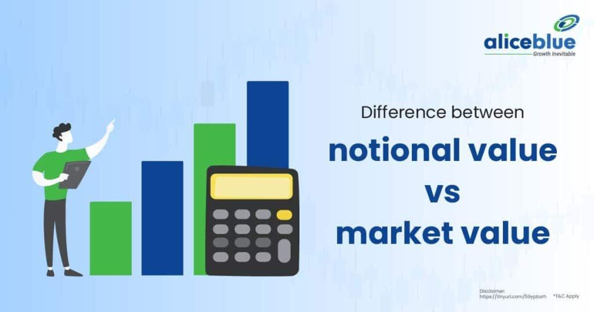

Understanding the nuances of financial instruments is essential for investors and traders aiming to navigate the complex landscape of modern markets. Two key financial concepts that play a pivotal role, particularly within derivative markets, are notional value and market value. These concepts help in assessing financial positions and gauging potential exposures and risks. Notional value refers to the total value of a leveraged position’s assets in a contract, serving as a measure used primarily in derivatives like futures, options, and swaps. Conversely, market value pertains to the price at which a security can be bought or sold at any given time, shaped by the current supply and demand dynamics. 

The delineation of these values is crucial as notional value often provides insights into the underlying exposure or potential risk of a financial instrument, whereas market value offers a real-time assessment of what that instrument is currently worth in the marketplace. Differentiating between these can enhance trading strategies, offering sophisticated approaches to risk management and capital allocation. Furthermore, these concepts are pivotal in financial reporting and regulatory compliance, ensuring that organizations accurately represent their financial health and adhere to industry standards.

Concurrently, algorithmic trading has transformed financial markets through efficiency and precision. This method employs computer algorithms to execute trades, often at speeds and volumes unattainable by human traders alone. Algorithmic trading not only increases market liquidity but also facilitates enhanced price discovery, utilizing complex mathematical models and extensive data analysis to make informed trading decisions. As the financial markets continue to evolve, the integration of algorithmic trading with core financial concepts like notional and market value highlights the dynamic nature of trading strategies. This article aims to elucidate the distinctions between notional and market value, and explore the profound impact of algorithmic trading on modern financial markets, emphasizing the importance of these elements in developing robust trading strategies and effective risk management.

## Table of Contents

## Understanding Notional Value

Notional value is a critical financial metric that represents the total value of a leveraged position's assets within a financial contract. Predominantly utilized in derivatives such as futures, options, and swaps, notional value provides a foundational understanding of the scale and potential exposure associated with these instruments. By focusing on the total amount that a contract represents, rather than its initial cost or current market value, notional value serves as a conceptual measure crucial for risk assessment and management in trading.

In derivative markets, notional value plays an instrumental role in evaluating potential exposure. For example, in a futures contract, the notional value is calculated by multiplying the contract size by the current market price of the underlying asset. Consider a futures contract on [crude oil](/wiki/crude-oil) where each contract equates to 1,000 barrels, and the market price per barrel is $70. The notional value is therefore 1,000 x $70 = $70,000. This notional value reflects the full economic exposure of the contract and is vital for traders to understand the scale of their positions relative to their risk tolerance.

Moreover, notional value is a key component in risk management strategies. By understanding the notional value, traders and investors can set appropriate limits on their positions and leverage, ensuring they do not exceed their risk capacity. This understanding also assists in calculating margin requirements imposed by exchanges or brokers, thus influencing trading decisions and strategies.

The concept of notional value also extends to regulatory compliance and capital requirements. Financial regulatory bodies often set capital reserves based on the notional exposure of derivative positions to mitigate systemic risks. Financial institutions must maintain sufficient capital reserves relative to their notional exposure, which ensures they can absorb potential losses, thereby promoting market stability.

To further illustrate, [interest rate](/wiki/interest-rate-trading-strategies) swaps, a common type of derivative, often involve significant notional amounts without immediate cash flow. In these instruments, notional value is used to calculate the interest payments exchanged between parties; however, the notional principal itself is not exchanged. This underlines its function as a notional benchmark for determining cash flows rather than representing a direct financial liability.

In summary, notional value is an essential concept in the derivatives market, offering a comprehensive measure of economic exposure and aiding in risk management and regulatory compliance. Understanding notional value is paramount for any trader or investor leveraging derivative instruments as part of their financial strategy.

## Exploring Market Value

Market value, often simply referred to as the "market price," is the price at which a financial security or asset can be bought or sold in the current economic market. It reflects the perceptions and actions of buyers and sellers, determined largely by the dynamics of supply and demand. Unlike notional value, which is a theoretical total associated with leveraged positions or derivative contracts, market value provides a real-time assessment of what market participants are willing to pay or accept for an asset.

Supply and demand are the fundamental forces governing market value. When the demand for a security increases and supply remains constant or decreases, its market value typically rises. Conversely, if supply outweighs demand, the market value tends to decline. This basic principle exemplifies how market value acts as a dynamic, fluctuating metric sensitive to the immediate economic environment and market cycles.

Market cycles, influenced by various factors such as economic indicators, interest rates, and geopolitical events, cause significant variations in market value. During periods of economic growth, market values often rise as investor optimism increases, causing higher demand for stocks and assets. In contrast, during economic downturns, market values can drop as investors become more risk-averse, leading to decreased demand and increased selling activity.

Assessing market value is crucial for investors seeking to evaluate company performance and market perceptions. By analyzing a company's market capitalization, which is the total market value of its outstanding shares, investors can infer how the market perceives the company's growth potential and risk profile. Market value is also integral to valuation metrics, such as the price-to-earnings ratio (P/E), which compares a company's current share price to its per-share earnings, providing insights into relative valuation levels compared to peers or historical standards.

Distinguishing market value from notional value is critical for accurate financial analysis. While notional value gives the size and scope of a position, particularly in derivatives, market value provides the actual economic worth or price point. For example, in a futures contract, the notional value represents the total value of the contract’s underlying asset, while the market value would indicate the contract's price if sold on the open market. Understanding this distinction helps in comprehending the actual exposure and risk inherent in financial instruments, ensuring better-informed trading decisions and financial strategies.

## Notional Value vs. Market Value

Notional value and market value are fundamental concepts in financial markets, particularly in derivatives trading. Notional value represents the total value of the underlying assets in a financial contract, such as futures, options, or swaps. It is a theoretical measure that indicates the scale of the position without considering leverage or actual investment made. For example, in a futures contract for oil, the notional value might represent the total worth of the physical quantity of oil specified in the contract.

Market value, on the other hand, refers to the actual price at which a security is traded in the marketplace at any given time. It is determined by the prevailing supply and demand conditions and can vary significantly based on market perceptions and investor sentiment. For instance, the market value of a stock reflects its current trading price on the stock exchange.

These two values serve distinct purposes within financial markets. Notional value is pivotal for assessing potential exposure and calculating trading volumes, especially in instruments where leverage is involved. It aids in understanding the scale and potential risk inherent in derivatives contracts. Market value provides insights into the current state of a security’s pricing, influencing trading decisions based on real-time market conditions.

In real-world scenarios, the difference between notional and market value becomes apparent when evaluating derivatives. Consider an interest rate swap with a notional value of $1 million. While the notional value reflects the principal amount used to calculate interest payments, the market value might show a gain or loss based on changes in interest rates since the contract's inception. 

Distinctions between these values also impact trading strategies and financial reporting. Traders need to account for both measures to optimize their strategies effectively. For risk management, the notional value helps in stress testing and calculating potential maximum loss. In financial reporting, accurately distinguishing between these values ensures transparency and compliance with regulatory standards, as it affects balance sheet reporting and hedging strategies.

In summary, notional value and market value are complementary metrics essential for comprehensive financial analysis. They enable traders to gauge potential risks, make informed trading decisions, and fulfill regulatory requirements through precise financial reporting. Understanding their differences can enhance strategy formulation and execution in complex trading environments.

## The Role of Algorithmic Trading

Algorithmic trading, often referred to as algo trading, employs sophisticated computer algorithms to facilitate rapid and efficient execution of trades. These algorithms process large volumes of data to identify optimal trading opportunities, capitalizing on minor price fluctuations across various markets. By automating the trading process, [algorithmic trading](/wiki/algorithmic-trading) enhances market efficiency, enabling high-speed operations that surpass human capabilities.

At the core of algorithmic trading are complex mathematical models that analyze market data to predict price movements. These models evaluate numerous variables, including historical price patterns, trading [volume](/wiki/volume-trading-strategy), and market [volatility](/wiki/volatility-trading-strategies), to ascertain the most favorable conditions for executing trades. Such analysis allows traders to make informed decisions quickly, often within milliseconds, affording them a competitive edge in fast-paced markets.

The integration of algorithmic trading with financial concepts, such as notional value, enables traders to automatically manage large portfolios. For example, a trading algorithm might be programmed to maintain a specific notional value exposure to a currency pair by automatically rebalancing positions as market conditions change. This capability allows for precise control of risk and ensures adherence to predefined trading strategies without manual oversight.

Despite its advantages, algorithmic trading poses significant challenges. One of the primary requirements is access to advanced technology, including high-speed internet connections and powerful computing infrastructure. These resources are essential for processing the vast amounts of data required for real-time decision-making. Additionally, the reliance on automated systems increases the risk of market disruptions. Flaws in algorithm design, unexpected market conditions, or technical failures can lead to erratic trading behavior, sometimes exacerbating market volatility rather than stabilizing it.

In conclusion, while algorithmic trading provides numerous benefits in terms of speed and data-driven precision, it also necessitates careful management to mitigate risks associated with technological dependencies and market susceptibility to algorithmic disruptions. As financial markets continue to evolve, the balance between technological innovation and risk management will remain crucial for sustaining algorithmic trading's positive impact.

## Impact and Applications in the Financial Markets

Algorithmic trading plays a crucial role in shaping market [liquidity](/wiki/liquidity-risk-premium) and the price discovery process, which are fundamental aspects of financial markets. By employing algorithms, trades can be executed at speeds dramatically faster than human capabilities, boosting market efficiency. These algorithms are designed to analyze vast swathes of market data, identifying [arbitrage](/wiki/arbitrage) opportunities and executing trades with precision and minimal impact on market prices.

The integration of notional and market value concepts within algorithmic trading enables the development of sophisticated trading strategies. Notional value, which represents the nominal or face value of a leveraged position, is essential for assessing exposure and the potential scale of investments. On the other hand, market value reflects the current price at which assets can be transacted. Algorithms utilize these values to optimize portfolio allocations, manage risk, and maximize returns by pinpointing discrepancies or inefficiencies between the notional and actual valuations of financial instruments.

Financial institutions increasingly leverage algorithmic strategies to manage large portfolios and diversify investments. Through automation, these institutions can handle complex portfolio adjustments in real-time, balancing assets in response to market movements faster than traditional human-driven methods. This allows for more effective hedging and the fine-tuning of portfolio composition, accommodating rapid changes in market conditions.

Regulatory frameworks have evolved to address the ascent of algorithmic trading, implementing guidelines to mitigate associated systemic risks. The [high frequency](/wiki/high-frequency-trading) and volume of trades executed by algorithms can amplify market volatility and introduce liquidity risks, particularly during periods of financial stress. Regulatory bodies, therefore, emphasize transparency, fair access to trading platforms, and measures to prevent market manipulation or unfair practices. An example includes deploying circuit breakers to halt trading amid erratic market swings, aiming to maintain market stability.

Looking towards the future, there is a clear trend of increasing reliance on automation within financial markets, with [artificial intelligence](/wiki/ai-artificial-intelligence) playing a more substantial role. AI techniques offer sophisticated pattern recognition, predictive analytics, and adaptive algorithms that enhance trading decision-making capabilities. These advancements promise further refinements in trading strategies, improving accuracy and reducing margins of error. As algorithms become more advanced, the integration of AI could lead to fully autonomous trading systems that self-optimize based on real-time data and market conditions, driving the next evolution of financial market operations.

## Conclusion

In modern financial markets, the comprehension of notional and market value serves as a cornerstone for successful navigation and strategy formulation. Notional value facilitates the evaluation of potential exposure associated with derivatives, acting as a key metric for managing leverage. Conversely, market value offers a real-time snapshot of a security's worth, shaped by current market dynamics and sentiments, thereby influencing investor perception and decision-making. Distinguishing between these two concepts enables investors and traders to undertake precise financial analysis and formulate robust trading strategies.

Algorithmic trading, characterized by its automation and high-speed executions, presents remarkable opportunities to maximize market efficiency and capitalize on marginal price differences. Despite its advantages, algorithmic trading necessitates diligent oversight to mitigate risks such as algorithmic malfunctions or unintended market disruptions. The interplay of these technologies with notional and market values plays a crucial role in optimizing trading operations and enhancing portfolio management.

Both conceptual and technological aspects are indispensable for making informed decisions and effectively managing risks. Investors and traders are urged to stay abreast of evolving market conditions and technological innovations, which are continually reshaping the financial landscape. The future of trading success is likely to depend on a balanced approach, harmonizing human intuition with algorithmic accuracy to adapt to an ever-changing market environment. By maintaining this equilibrium, market participants can better position themselves to navigate the complexities of financial markets, leveraging both traditional insights and cutting-edge technologies.

## References & Further Reading

[1]: Hull, J. C. (2017). ["Options, Futures, and Other Derivatives"](https://www.semanticscholar.org/paper/Options%2C-Futures%2C-and-Other-Derivatives-Hull/89bdee500c8623864fc9eb7a471546aa713acc44). Pearson.

[2]: Harris, L. (2003). ["Trading and Exchanges: Market Microstructure for Practitioners"](https://www.amazon.com/Trading-Exchanges-Market-Microstructure-Practitioners/dp/0195144708). Oxford University Press.

[3]: Aldridge, I. (2013). ["High-Frequency Trading: A Practical Guide to Algorithmic Strategies and Trading Systems"](https://www.ahmetbeyefendi.com/wp-content/uploads/2020/07/High-Frequency-Trading-Irene-Aldridge.pdf). John Wiley & Sons.

[4]: Narang, R. (2013). ["Inside the Black Box: A Simple Guide to Quantitative and High-Frequency Trading"](https://onlinelibrary.wiley.com/doi/book/10.1002/9781118662717). John Wiley & Sons.

[5]: Lopez de Prado, M. (2018). ["Advances in Financial Machine Learning"](https://www.amazon.com/Advances-Financial-Machine-Learning-Marcos/dp/1119482089). John Wiley & Sons.

[6]: Jorion, P. (2007). ["Value at Risk: The New Benchmark for Managing Financial Risk"](https://link.springer.com/article/10.1007/s11408-007-0057-3). McGraw-Hill Education.