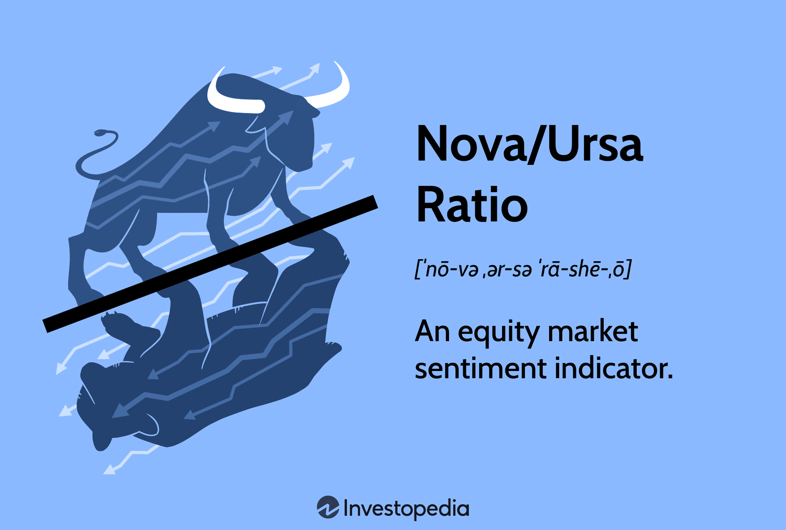

In the ever-evolving landscape of financial investment, algorithmic trading strategies have emerged as vital tools for investors and financial institutions. Among these strategies, a novel approach that integrates astronomy insights with financial algorithms is gaining attention. This article explores how traders are employing the Nova/Ursa ratio alongside astronomical cycles to potentially enhance their investment strategies.

The Nova/Ursa ratio serves as a market sentiment indicator, derived from the performance of the Rydex Nova and Ursa funds. The Rydex Nova Fund seeks to achieve investment returns that are 150% of the daily performance of the S&P 500 Index, embodying bullish consumer confidence. On the other hand, the Rydex Ursa Fund mirrors the inverse performance of the S&P 500, acting as a hedge against market downturns and representing bearish sentiment. A higher Nova/Ursa ratio indicates bullish market sentiment, while a lower ratio points toward a bearish outlook.



This article investigates the combination of the Nova/Ursa ratio with astronomical insights to devise a novel algorithmic trading strategy known as the "Astronomy Ursa Ratio Nova." This innovative strategy seeks to harness the potential of celestial patterns to provide investors with a unique perspective on market trends. By examining the intersection of astronomy and financial analytics, this approach seeks to blend traditional sentiment analysis with astrological cycles, offering traders an intriguing method for navigating the market.

## Table of Contents

## Understanding the Nova/Ursa Ratio

The Nova/Ursa ratio serves as a notable market sentiment indicator by utilizing the Rydex Nova and Ursa funds to assess investor confidence and market outlook. This ratio reflects the relative levels of bullish and bearish sentiment in the market.

The Rydex Nova Fund is designed to achieve returns that are 150% of the daily performance of the S&P 500 Index. This fund aligns with bullish investor behavior, as it seeks leveraged exposure to the index, allowing investors to amplify potential gains when the market rises.

On the other hand, the Rydex Ursa Fund is constructed to move inversely with the S&P 500. It provides a strategic hedge against market downturns, catering to investors with a bearish outlook. The Ursa Fund is structured to gain value when the market declines, serving as a counterbalance to the Nova Fund's bullish strategy.

The Nova/Ursa ratio is calculated by dividing the assets in the Nova Fund by the assets in the Ursa Fund:

$$
\text{Nova/Ursa Ratio} = \frac{\text{Assets in Nova Fund}}{\text{Assets in Ursa Fund}}
$$

A higher Nova/Ursa ratio indicates an increase in bullish market sentiment, suggesting that more investors are leveraging their investments in anticipation of rising market values. Conversely, a lower ratio points toward a predominant bearish sentiment, with investors potentially seeking protection through the Ursa Fund amidst expected market declines.

Traders and analysts monitor the Nova/Ursa ratio to gauge shifts in market sentiment, recognizing that these insights can provide valuable context for making informed investment decisions. It is important, however, to consider this ratio alongside other indicators and market analyses to obtain a comprehensive understanding of market dynamics.

## The Role of Astronomy in Trading

Astrology and its application to trading have a long history, rooted in the belief that celestial events can exert influence over human behavior and consequently affect financial markets. This notion extends beyond traditional economic fundamentals and technical analysis, incorporating the timing of astronomical cycles such as lunar phases, solar cycles, and planetary alignments.

The idea suggests that as celestial bodies move and align in particular patterns, they have the potential to affect collective human emotions and decisions, a theory that some traders believe extends to buying and selling patterns in stock markets. For example, lunar phases are thought to impact market mood, with some market participants hypothesizing that the new and full moons can correlate with shifts in investor sentiment.

Planetary movements are another focus for those practicing financial astrology. Significant astrological events, such as planetary conjunctions or retrogrades, are observed for their perceived capacity to herald changes in market trends. The logic here is that these alignments influence macro-level sentiment shifts, prompting collective human actions reflected in trading activities.

There are also hypotheses regarding solar cycles, where fluctuations in solar activity might tie into broader economic cycles. The so-called "Mars effect," where planetary positions are believed to trigger market [volatility](/wiki/volatility-trading-strategies), is another example of astrology's potential influence, despite lacking scientific backing.

While the effects of celestial cycles on market movements are largely speculative, some traders integrate these patterns into their toolkit to enhance predictive capabilities. By using astrology as a supplementary perspective in combination with traditional market analysis, they aim to obtain a subjective psychological edge.

In practical terms, traders employ astrology to time their trades, anticipating market reversals, entry, and [exit](/wiki/exit-strategy) points around key astronomical events. While this approach offers an unconventional view, it serves as a reminder of the diverse methods investors use to interpret market conditions, highlighting the psychological dimensions of trading decisions.

## Integrating the Nova/Ursa Ratio with Astronomy

The integration of the Nova/Ursa ratio with astronomical insights is an innovative approach that marries quantitative analysis with astrological interpretations. At its core, this methodology leverages the trade signals from the Nova/Ursa ratio—an index reflecting market sentiment based on contrarian positioning between the bullish Rydex Nova fund and the bearish Rydex Ursa fund—and combines them with patterns dictated by celestial movements.

Traders seeking to apply this integrated strategy can start by assessing the market sentiment through the Nova/Ursa ratio. A high ratio indicates a bullish sentiment, reflecting confidence in upward market trends, while a low ratio suggests a bearish inclination. These sentiment indicators can be juxtaposed with astronomical cycles—such as lunar phases and solar activities—which are hypothesized to affect psychological and behavioral tendencies in market participants.

The dual-strategy approach enables traders to strengthen their market timing by cross-verifying sentiment indicators with astronomical cycles. For instance, if the Nova/Ursa ratio indicates bullish sentiment, further analysis of planetary alignments or lunar cycles could confirm the likelihood of a positive market movement. Conversely, if celestial forecasts predict a downturn, traders might consider this an early warning sign, even amid bullish sentiment indicators.

This interplay between quantitative data and astrological signs provides an opportunity for identifying lucrative entry and exit points in market trades. By programming trading algorithms to respond to specific triggers from both these sources, traders can optimize their strategies for capturing market fluctuations more effectively. The versatility of this approach extends to the potential development of more sophisticated algorithmic systems, which can evaluate complex scenarios from both financial and astronomical perspectives, offering a comprehensive framework for modern trading.

Practitioners of this strategy should maintain an awareness of its experimental nature, ensuring thorough [backtesting](/wiki/backtesting) and validation against historical data to mitigate risks and confirm its efficacy.

## Implementing the Strategy in Algo Trading

Algorithmic trading systems offer a seamless platform for integrating the Nova/Ursa ratio with astronomical indicators. Through precise programming, these systems can harness both financial sentiment data and celestial events as triggers for automated trading strategies. 

### Use of Algorithmic Systems
By leveraging the power of algorithms, traders can set specific triggers tied to changes in the Nova/Ursa ratio and astronomical events. These triggers can prompt real-time adjustments to trading positions, aiming to optimize gains while minimizing exposure to risk. For instance, an algorithm can be programmed to initiate a buy order when the Nova/Ursa ratio exceeds a certain threshold or during specific lunar phases, which historically correlate with market uptrends.

### Sample Python Code
The combination of sentiment data and astronomical patterns can be effectively implemented using scripts. Here is an example of how one might set up a simple trading algorithm using Python:

```python
import pandas as pd

# Example function to check if an astronomical event occurs
def is_astronomical_event(date):
    # Define specific rules for astronomical events here
    # This is a placeholder for demonstration.
    return date.weekday() == 0  # Example: a significant event on Mondays

# Fetch or simulate Nova/Ursa ratio
nova_ursa_data = pd.read_csv('nova_ursa_ratio.csv', parse_dates=['date'])
nova_ursa_data['Buy_Signal'] = nova_ursa_data['Nova_Ursa_Ratio'] > 1.5

# Combine Nova/Ursa ratio with astronomical event triggers
nova_ursa_data['Astronomy_Signal'] = nova_ursa_data['date'].apply(is_astronomical_event)
nova_ursa_data['Trade_Signal'] = nova_ursa_data['Buy_Signal'] & nova_ursa_data['Astronomy_Signal']

# Implement trading strategy based on combined signals
for index, row in nova_ursa_data.iterrows():
    if row['Trade_Signal']:
        print(f"Buy on {row['date']}: Nova/Ursa Ratio = {row['Nova_Ursa_Ratio']}")
```

### Benefits of Automation
1. **Reduced Emotion in Trading**: Automated systems eliminate emotional biases, ensuring that trades are executed based on predefined criteria rather than impulsive decisions. This fosters greater consistency and discipline, essential traits for successful trading.

2. **Enhanced Strategy Precision**: Algorithmic trading allows for the precise tuning of strategies based on historical backtesting. Traders can refine algorithms to react optimally to specific market conditions, thus enhancing the probability of success.

3. **Scalability**: With algorithms, traders can simultaneously apply their strategies across multiple markets and securities, dramatically increasing the potential scope and scale of their trading activities.

This integration of the Nova/Ursa ratio with astronomical indicators within [algorithmic trading](/wiki/algorithmic-trading) frameworks presents an innovative approach to navigating financial markets, balancing quantitative analysis with abstract insights to potentially achieve optimal trading outcomes.

## Potential Risks and Limitations

While the integration of astronomical cycles with algorithmic trading strategies such as the Nova/Ursa ratio presents a novel approach, it carries certain risks and limitations that must be considered to ensure practical application and reliability.

One of the primary challenges lies in the necessity for robust backtesting. Backtesting helps verify the strategy's viability by simulating trading strategies on historical data. This can provide insights into how a strategy might perform in real market conditions. However, the unpredictable nature of financial markets means past performance does not guarantee future results. Traders should strive for extensive and realistic backtesting to avoid overfitting to historical data, which could cause poor performance in live trading scenarios.

Moreover, market sentiment indicators like the Nova/Ursa ratio are susceptible to numerous influences beyond astrological patterns. Economic reports, geopolitical events, and unexpected market news can significantly impact sentiment and market movements. Over-reliance on these indicators without integrating other complementary strategies can lead to inadequate risk management and possible financial loss. A diversified approach that includes traditional analytic methods, such as fundamental or technical analysis, alongside sentiment indicators, can provide a more comprehensive market view.

Astrological effects on market movements are not grounded in scientific consensus, making their application speculative. While some traders believe that celestial events can influence market sentiment, there is a lack of empirical evidence to support consistent and reliable predictive outcomes. Therefore, traders utilizing astrological insights should do so cautiously, recognizing these influences as secondary or supplementary to more conventional, data-driven strategies.

In conclusion, while the Astronomy Ursa Ratio Nova strategy incorporates innovative elements, it must be implemented with a clear understanding of its limitations and potential risks. By combining rigorous backtesting, complementary analytic approaches, and prudent management of speculative components like astrology, traders can better navigate the uncertainties inherent in this unique strategy.

## Conclusion

The Astronomy Ursa Ratio Nova trading strategy stands out as a captivating blend of astronomy and financial analytics. This novel approach leverages the Nova/Ursa ratio to gauge market sentiment while integrating celestial cues to inform trading decisions. By employing this dual-layered strategy, traders are able to craft a distinctive method for analyzing market trends and making informed decisions. The incorporation of astronomical insights offers an additional dimension to traditional financial analytics, potentially unveiling patterns not typically discernible through conventional means.

However, despite its innovativeness, the Astronomy Ursa Ratio Nova strategy demands meticulous consideration of its potential risks and implications. The reliance on astrological indicators, which lack empirical validation, alongside the Nova/Ursa ratio necessitates a cautious approach. The interplay between market sentiment indicators and celestial events requires thorough backtesting and a prudent combination with conventional analytic techniques. This strategy exemplifies a harmonious combination of art and science, inviting traders to explore its potential while remaining vigilant to its limitations and the complexities of market dynamics.

## References & Further Reading

[1]: ["Advances in Financial Machine Learning"](https://www.amazon.com/Advances-Financial-Machine-Learning-Marcos/dp/1119482089) by Marcos Lopez de Prado

[2]: Aronson, D. R. (2007). ["Evidence-Based Technical Analysis: Applying the Scientific Method and Statistical Inference to Trading Signals."](https://onlinelibrary.wiley.com/doi/book/10.1002/9781118268315) John Wiley & Sons.

[3]: Jansen, S. (2020). ["Machine Learning for Algorithmic Trading."](https://github.com/stefan-jansen/machine-learning-for-trading) Packt Publishing Ltd.

[4]: Chan, E. P. (2008). ["Quantitative Trading: How to Build Your Own Algorithmic Trading Business."](https://github.com/egorpe/EPChan-QuantitativeTrading/blob/master/example7_6.m) John Wiley & Sons.

[5]: Tulett, S. (2019). ["AstroTrading: Technical Analysis with Astrology."](https://www.reddit.com/r/astrotrading/comments/ftpop2/a_crash_course_in_astro_trading/) ilea garzón.

[6]: Smirnoff, M. (2020). ["Astrological Trading: Animal Spirits in Portfolio Management."](https://zodiactrading.medium.com/animal-spirits-in-finance-understanding-the-psychological-drivers-behind-market-movements-3056bb48871f) Springer.