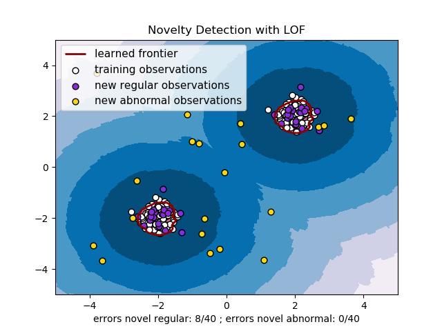

## Table of Contents

## What is Novelty Detection in machine learning?

Novelty detection in machine learning is about finding new or unusual data that a model hasn't seen before. Imagine you have a system that knows all about dogs. If a cat comes along, the system should be able to say, "Hey, this is something new!" This is useful in many areas, like spotting fraud in bank transactions or finding new trends in social media.

The way novelty detection works is by training a model on normal data. Once trained, the model can then look at new data and decide if it's normal or if it's something new. There are different ways to do this, but a common method is to use a distance measure. If the new data is too far away from the normal data, it's considered a novelty. For example, if we use a simple distance formula like $$d(x, y) = \sqrt{(x_1 - y_1)^2 + (x_2 - y_2)^2}$$, we can see how far a new point is from the known data points. If this distance is too big, we say it's a novelty.

## How does Novelty Detection differ from Outlier Detection?

Novelty detection and outlier detection both deal with finding unusual data, but they do it in different ways. Novelty detection is about spotting new things that the system hasn't seen before. Imagine you have a machine that knows all about apples. If you show it a banana, it should say, "This is new!" It's like finding something completely different from what the machine was trained on. In novelty detection, the model is trained on normal data, and then it looks for things that are very different from this normal data. If a new data point is too far away from the known data, using a distance measure like $$d(x, y) = \sqrt{(x_1 - y_1)^2 + (x_2 - y_2)^2}$$, it's considered a novelty.

On the other hand, outlier detection is about finding data points that are just unusual compared to the rest of the data. It's like looking at a bunch of apples and finding one that's much bigger or smaller than the others. Outlier detection works with the data it has, trying to find points that don't fit well with the rest. It doesn't need to know about new types of data; it just looks for anything that stands out. Both methods are important, but they serve different purposes. Novelty detection is great for finding completely new things, while outlier detection is useful for spotting unusual cases within the known data.

## What are the common applications of Novelty Detection?

Novelty detection is used in many areas where finding new or unusual things is important. One common use is in fraud detection for banks and credit card companies. The system is trained on normal transactions, and when a new transaction comes in, it checks if it's very different from what it knows. If the transaction is too far away from the normal data, using a distance measure like $$d(x, y) = \sqrt{(x_1 - y_1)^2 + (x_2 - y_2)^2}$$, it might be flagged as fraud. This helps catch new types of fraud that the system hasn't seen before.

Another use is in monitoring machines and systems. For example, in a factory, machines can be watched to see if they start doing something new or unusual. If a machine starts making a different noise or its performance changes a lot, the novelty detection system can alert the workers. This helps catch problems early before they cause bigger issues. Novelty detection is also used in social media to find new trends or topics that suddenly become popular, helping companies stay on top of what people are talking about.

## What are the basic algorithms used in Novelty Detection?

One common algorithm for novelty detection is the One-Class SVM (Support Vector Machine). This method trains on normal data and creates a boundary around it. Any new data that falls outside this boundary is considered a novelty. Imagine drawing a circle around all the apples you know. If a banana comes along and it's outside the circle, the One-Class SVM says, "That's new!" It uses a distance measure to see how far the new data is from the known data. If the distance is too big, like $$d(x, y) = \sqrt{(x_1 - y_1)^2 + (x_2 - y_2)^2}$$, it's a novelty.

Another basic algorithm is the Local Outlier Factor (LOF). This method looks at how dense the data is around each point. If a new point is in a less dense area compared to the normal data, it might be a novelty. Think of it like being in a crowded room. If you move to a spot where there are fewer people around you, you stand out. LOF helps find these less dense areas and flags them as novelties. Both One-Class SVM and LOF are useful for finding new things in data, but they work in different ways.

A third algorithm used in novelty detection is the Isolation Forest. This method works by randomly splitting the data into smaller and smaller groups until each point is isolated. Novelties are easier to isolate because they are different from the normal data. It's like playing a game where you keep dividing a group of apples until you find the one banana. The fewer splits it takes to isolate a point, the more likely it is to be a novelty. Isolation Forest is fast and works well with large datasets, making it a popular choice for novelty detection.

## How can one preprocess data for Novelty Detection?

Preprocessing data for novelty detection is important to make sure the model works well. You start by cleaning the data, which means getting rid of any missing or wrong information. You might also need to make all the data look the same by scaling it. For example, if you have numbers like ages and incomes, you can use a formula like $$z = \frac{x - \mu}{\sigma}$$ to make them fit between 0 and 1. This helps the model see the data clearly and find new things more easily.

Another step is to change the data into a format that the model can understand. If you have words or categories, you can turn them into numbers using something called encoding. For example, you might use a code block to do this:

```python
from sklearn.preprocessing import LabelEncoder

encoder = LabelEncoder()
data['category'] = encoder.fit_transform(data['category'])
```

This makes it easier for the model to work with the data. By doing these steps, you help the model focus on finding new or unusual things in the data, which is what novelty detection is all about.

## What metrics are used to evaluate Novelty Detection models?

To evaluate how well a novelty detection model works, we use different metrics. One common metric is the Area Under the Receiver Operating Characteristic Curve (AUC-ROC). This metric looks at how well the model can tell the difference between normal and new data. It's like a score that goes from 0 to 1, where 1 is perfect. We can use a formula to find the AUC-ROC, but it's easier to use a tool like Python's scikit-learn library. Here's how you might do it in code:

```python
from sklearn.metrics import roc_auc_score

y_true = [0, 1, 0, 0, 1]  # 0 for normal, 1 for novelty
y_scores = [0.1, 0.9, 0.2, 0.3, 0.8]  # model's scores
auc = roc_auc_score(y_true, y_scores)
print(f"AUC-ROC: {auc}")
```

Another important metric is the F1-score, which looks at how well the model finds novelties without making too many mistakes. It's a balance between precision (how many of the things the model says are novelties are actually novelties) and recall (how many of the actual novelties the model finds). The F1-score is calculated with the formula $$F1 = 2 \times \frac{\text{precision} \times \text{recall}}{\text{precision} + \text{recall}}$$. A high F1-score means the model is good at finding novelties and not making too many false alarms. Both AUC-ROC and F1-score help us see how well the novelty detection model is doing its job.

## Can you explain the One-Class SVM method for Novelty Detection?

The One-Class SVM method is a way to find new things in data by drawing a boundary around what's normal. Imagine you have a bunch of apples, and you draw a circle around them. If a banana comes along and it's outside the circle, the One-Class SVM says, "That's new!" It works by training on normal data and then using a distance measure to see how far new data is from the normal data. If the distance is too big, like $$d(x, y) = \sqrt{(x_1 - y_1)^2 + (x_2 - y_2)^2}$$, it's considered a novelty. This method is good for finding completely new things that the system hasn't seen before.

To use One-Class SVM in a real situation, you can use a tool like Python's scikit-learn library. Here's how you might set it up and use it in code:

```python
from sklearn import svm
from sklearn.datasets import make_blobs
import numpy as np

# Create some normal data
X, _ = make_blobs(n_samples=100, centers=1, cluster_std=0.5, random_state=0)

# Train the One-Class SVM
model = svm.OneClassSVM(nu=0.1, kernel="rbf", gamma=0.1)
model.fit(X)

# Test with new data
new_data = np.array([[10, 10]])  # This is far from the normal data
prediction = model.predict(new_data)

if prediction[0] == -1:
    print("This is a novelty!")
else:
    print("This is normal.")
```

This code shows how to train a One-Class SVM on normal data and then check if new data is a novelty. If the prediction is -1, it means the new data is outside the boundary and is considered a novelty.

## How does the Isolation Forest algorithm work in the context of Novelty Detection?

The Isolation Forest algorithm works by randomly splitting the data into smaller and smaller groups until each point is isolated. Imagine you have a bunch of apples and you keep dividing them into smaller groups until you find the one banana. The idea is that novelties, or unusual things, are easier to isolate because they are different from the normal data. The fewer splits it takes to isolate a point, the more likely it is to be a novelty. This method is fast and works well with large datasets, making it a popular choice for novelty detection.

To use the Isolation Forest for novelty detection, you can train it on normal data and then see how it handles new data. If a new data point is isolated quickly, it's likely a novelty. You can use a tool like Python's scikit-learn library to set this up. Here's how you might do it in code:

```python
from sklearn.ensemble import IsolationForest
from sklearn.datasets import make_blobs
import numpy as np

# Create some normal data
X, _ = make_blobs(n_samples=100, centers=1, cluster_std=0.5, random_state=0)

# Train the Isolation Forest
model = IsolationForest(contamination=0.1, random_state=0)
model.fit(X)

# Test with new data
new_data = np.array([[10, 10]])  # This is far from the normal data
prediction = model.predict(new_data)

if prediction[0] == -1:
    print("This is a novelty!")
else:
    print("This is normal.")
```

This code shows how to train an Isolation Forest on normal data and then check if new data is a novelty. If the prediction is -1, it means the new data is isolated quickly and is considered a novelty.

## What are the challenges faced when implementing Novelty Detection in real-time systems?

Implementing novelty detection in real-time systems can be tricky because it needs to work quickly and accurately. Imagine you're watching a stream of data coming in, like bank transactions or machine performance metrics. The novelty detection model has to look at each new piece of data fast and decide if it's normal or new. If the model takes too long, it might miss something important or slow down the whole system. Also, real-time systems often have a lot of data coming in all at once, so the model needs to be able to handle this without getting overwhelmed.

Another challenge is keeping the model up to date. In real-time systems, what's considered normal can change over time. For example, if a new type of transaction becomes common, the model needs to learn this new normal without thinking it's a novelty. This means the model might need to be retrained or updated regularly, which can be hard to do without stopping the system. Balancing the need for quick decisions with the need to keep the model accurate and up to date is a big challenge in real-time novelty detection.

## How can Novelty Detection be integrated with other machine learning techniques?

Novelty detection can be combined with other machine learning techniques to make a system that's even better at finding new things. One way to do this is by using novelty detection as a first step to find unusual data, and then using another model like a classifier to figure out what kind of novelty it is. For example, if a bank's system spots a new kind of transaction, it can then use a classifier to see if it's fraud or just a new type of normal transaction. This helps the system learn from new data and get better over time. You can use a code block to set this up like this:

```python
from sklearn.ensemble import IsolationForest
from sklearn.svm import SVC
from sklearn.datasets import make_blobs
import numpy as np

# Create some normal data
X, _ = make_blobs(n_samples=100, centers=1, cluster_std=0.5, random_state=0)

# Train the Isolation Forest for novelty detection
novelty_model = IsolationForest(contamination=0.1, random_state=0)
novelty_model.fit(X)

# Train a classifier for identifying the type of novelty
classifier = SVC()
classifier.fit(X, np.zeros(X.shape[0]))  # Assume all normal data is labeled as 0

# Test with new data
new_data = np.array([[10, 10]])  # This is far from the normal data
novelty_prediction = novelty_model.predict(new_data)

if novelty_prediction[0] == -1:
    print("This is a novelty!")
    # Use the classifier to identify the type of novelty
    type_prediction = classifier.predict(new_data)
    print(f"Type of novelty: {type_prediction[0]}")
else:
    print("This is normal.")
```

Another way to integrate novelty detection with other techniques is by using it with clustering methods. Clustering can group similar data points together, and novelty detection can then look for points that don't fit into any group. This can help find new trends or unusual patterns in data. For example, in a social media platform, clustering can group similar posts, and novelty detection can spot posts that are very different from these groups, which might be new trends or important events. By working together, these methods can make a system that's good at finding and understanding new things in data.

## What are the latest research trends in Novelty Detection?

Recent research in novelty detection has focused on making models better at finding new things in big data sets. One big trend is using deep learning, like neural networks, to spot novelties. These models can learn complex patterns in data, which helps them find new things more accurately. Researchers are also working on ways to make these models explain why something is a novelty, which is important for people to trust the system. For example, if a model says a bank transaction is new, it should be able to explain why it thinks that.

Another trend is making novelty detection work well with streaming data, where new information keeps coming in all the time. This is important for things like monitoring machines or watching for fraud in real-time. Researchers are trying to make models that can learn from new data quickly without forgetting what they already know. This is called online learning, and it's a big challenge because the model needs to stay accurate as the world changes. For example, if a machine starts making a new noise, the system should spot it fast and keep learning what's normal.

Lastly, there's a lot of work on combining novelty detection with other machine learning methods to make systems smarter. For instance, using novelty detection with clustering can help find new groups in data, or using it with classification can help identify what kind of novelty something is. This helps systems not just find new things, but also understand them better. For example, in a social media platform, novelty detection can spot new trends, and then other methods can figure out what those trends mean.

## How can one optimize a Novelty Detection model for better performance?

To make a novelty detection model work better, you can start by choosing the right algorithm for your data. Different algorithms, like One-Class SVM or Isolation Forest, work better for different kinds of data. You might also want to play around with the settings of the algorithm. For example, in One-Class SVM, you can change the $$nu$$ parameter to control how many novelties the model expects to find. In Isolation Forest, you can adjust the $$contamination$$ parameter to tell the model how much of the data is likely to be new. You can use a code block to try different settings like this:

```python
from sklearn.svm import OneClassSVM
from sklearn.ensemble import IsolationForest
from sklearn.datasets import make_blobs
import numpy as np

# Create some normal data
X, _ = make_blobs(n_samples=100, centers=1, cluster_std=0.5, random_state=0)

# Try different settings for One-Class SVM
svm_model = OneClassSVM(nu=0.1, kernel="rbf", gamma=0.1)
svm_model.fit(X)

# Try different settings for Isolation Forest
if_model = IsolationForest(contamination=0.1, random_state=0)
if_model.fit(X)

# Test with new data
new_data = np.array([[10, 10]])  # This is far from the normal data
svm_prediction = svm_model.predict(new_data)
if_prediction = if_model.predict(new_data)

print(f"One-Class SVM prediction: {'Novelty' if svm_prediction[0] == -1 else 'Normal'}")
print(f"Isolation Forest prediction: {'Novelty' if if_prediction[0] == -1 else 'Normal'}")
```

Another way to improve the model is by making sure the data is ready for it. This means cleaning the data to get rid of mistakes and scaling it so all the numbers are on the same level. You can use a formula like $$z = \frac{x - \mu}{\sigma}$$ to scale the data. Also, it's good to use more data to train the model, because the more it sees, the better it gets at finding new things. If you can, try using different kinds of data to train the model, so it knows about different situations. This can make the model more flexible and better at spotting novelties in real life.