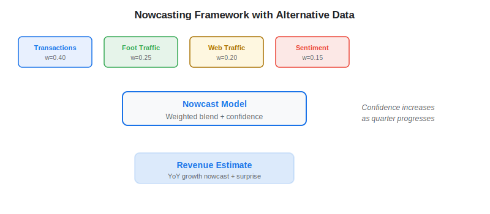
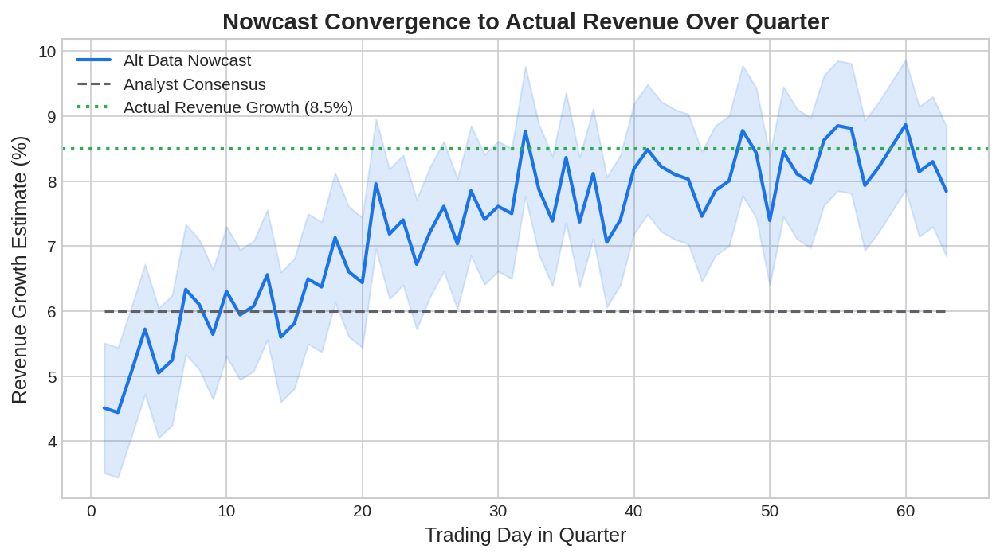

Nowcasting — the practice of estimating the present state of economic activity before official statistics are released — has been transformed by [alternative data](https://paperswithbacktest.com/wiki/best-alternative-data). While central banks and government agencies report GDP, employment, and trade figures with weeks or months of delay, algo traders using satellite imagery, [transaction data](https://paperswithbacktest.com/wiki/credit-card-transaction-data-trading), and [maritime traffic](https://paperswithbacktest.com/wiki/maritime-supply-chain-data-trading) can build real-time estimates that lead official releases by weeks.

## What Is Nowcasting?

Nowcasting is the real-time estimation of economic variables or company fundamentals using high-frequency data. The term originated in meteorology (forecasting *now*) and was adopted by economists at central banks who needed timely GDP estimates between quarterly releases.

In traditional macroeconomics, nowcasting uses bridge equations linking monthly indicators (industrial production, retail sales) to quarterly GDP. Alternative data supercharges this by adding daily or weekly signals — [foot traffic](https://paperswithbacktest.com/wiki/geolocation-foot-traffic-trading), shipping volumes, electricity consumption, credit card spending — that capture economic activity as it happens.

The general nowcasting framework can be expressed as:

$$\hat{Y}_t = \sum_{i=1}^{K} \beta_i X_{i,t} + \epsilon_t$$

Where $\hat{Y}_t$ is the nowcast of the target variable (GDP, company revenue) and $X_{i,t}$ are high-frequency alternative data inputs observed at time $t$.



## Nowcasting Applications in Trading

### GDP and Macro Nowcasting

Macro hedge funds combine multiple alternative data streams to estimate GDP growth before official releases. A typical macro nowcast model might include electricity consumption (industrial activity proxy), [maritime shipping volumes](https://paperswithbacktest.com/wiki/maritime-supply-chain-data-trading) (trade proxy), credit card spending aggregates (consumer demand proxy), satellite-derived nighttime lights (economic activity proxy), and job posting volumes (labor market proxy).

The New York Fed's nowcasting model (based on Giannone, Reichlin, and Small, 2008) demonstrated that adding high-frequency data substantially reduces GDP forecast errors. Alternative data extends this further with even higher-frequency, granular signals.

### Company Revenue Nowcasting

For equity traders, nowcasting individual company revenues is the primary application. By combining transaction data, foot traffic, web traffic, and app download estimates, traders build a real-time revenue estimate that converges to the actual reported figure as the quarter progresses.

### Inflation Nowcasting

The Billion Prices Project at MIT pioneered using web-scraped online prices to nowcast inflation indices. By tracking millions of product prices daily across retailers, traders can estimate CPI changes days before the official release — a valuable signal for fixed income and macro strategies.

## Python Implementation: Simple Revenue Nowcast

```python
import numpy as np
import pandas as pd

class RevenueNowcaster:
    """
    Multi-source revenue nowcaster combining alternative data signals.
    """
    def __init__(self, signal_weights: dict[str, float] = None):
        self.weights = signal_weights or {
            "transaction": 0.40,
            "foot_traffic": 0.25,
            "web_traffic": 0.20,
            "sentiment": 0.15,
        }
    
    def nowcast(
        self,
        signals: dict[str, float],
        days_into_quarter: int,
        total_quarter_days: int = 63
    ) -> dict:
        """
        Produce a blended revenue growth nowcast.
        
        Parameters:
        - signals: dict mapping signal name to YoY growth estimate
        - days_into_quarter: trading days elapsed
        - total_quarter_days: total trading days in quarter
        """
        coverage = days_into_quarter / total_quarter_days
        
        # Weighted average of available signals
        weighted_sum = 0.0
        total_weight = 0.0
        for signal_name, growth in signals.items():
            w = self.weights.get(signal_name, 0.1)
            weighted_sum += w * growth
            total_weight += w
        
        nowcast_growth = weighted_sum / total_weight if total_weight > 0 else 0
        
        # Confidence increases with coverage and number of signals
        confidence = min(coverage * (len(signals) / 4) * 1.2, 1.0)
        
        return {
            "nowcast_yoy_growth": f"{nowcast_growth:.1%}",
            "quarter_coverage": f"{coverage:.0%}",
            "signals_used": len(signals),
            "confidence": f"{confidence:.0%}",
            "signal_contributions": {
                k: f"{self.weights.get(k, 0.1) * v / total_weight:.2%}"
                for k, v in signals.items()
            },
        }

# Example: Retail company mid-quarter nowcast
nowcaster = RevenueNowcaster()
signals = {
    "transaction": 0.085,     # Credit card data shows 8.5% YoY growth
    "foot_traffic": 0.072,    # Foot traffic up 7.2%
    "web_traffic": 0.110,     # Web visits up 11%
    "sentiment": 0.045,       # Sentiment mildly positive
}
result = nowcaster.nowcast(signals, days_into_quarter=42, total_quarter_days=63)
for k, v in result.items():
    print(f"  {k}: {v}")
```



## Key Techniques in Nowcasting

**Dynamic Factor Models (DFM)**: Extract common factors from many high-frequency series to produce a single nowcast. The Kalman filter updates the estimate as new data arrives.

**MIDAS Regression** (Mixed Data Sampling): Handles the mismatch between high-frequency alternative data (daily) and low-frequency target variables (quarterly). Uses polynomial distributed lag weights.

**Machine Learning Approaches**: Random forests and gradient boosting can capture nonlinear relationships between alternative data inputs and target variables. Beware overfitting with limited quarterly observations.

## Limitations and Risks

**Revision risk**: Alternative data signals themselves can be revised. Transaction data panels change, foot traffic vendors recalibrate, and satellite imagery gets reprocessed. Your nowcast at time $t$ may look different from the same nowcast computed at time $t+7$.

**Model instability**: The relationship between alternative data and fundamentals can shift — a pandemic, a price war, or a business model change can break historical correlations.

**Overfitting**: With dozens of potential inputs and only ~20 quarterly observations per company, the risk of fitting noise is substantial. Regularization and out-of-sample testing are essential.

## Conclusion

Nowcasting with alternative data is the unifying framework that ties together all other alternative data types — [satellite](https://paperswithbacktest.com/wiki/satellite-imagery-trading), transactions, foot traffic, sentiment, and shipping data all serve as inputs to a nowcast model. For algo traders, building a robust multi-source nowcaster is the highest-leverage investment in alternative data infrastructure.

---

**Explore further on PapersWithBacktest:**
- Browse [backtested nowcasting strategies](https://paperswithbacktest.com/strategies) with Python code and performance metrics
- Access [clean historical market data](https://paperswithbacktest.com/datasets) for equities, crypto, and futures
- Take the [algo trading course](https://paperswithbacktest.com/course) — 60+ video lessons and notebooks
- Related wiki pages: [Best Alternative Data Sources](https://paperswithbacktest.com/wiki/best-alternative-data) · [Credit Card Transaction Data](https://paperswithbacktest.com/wiki/credit-card-transaction-data-trading)
