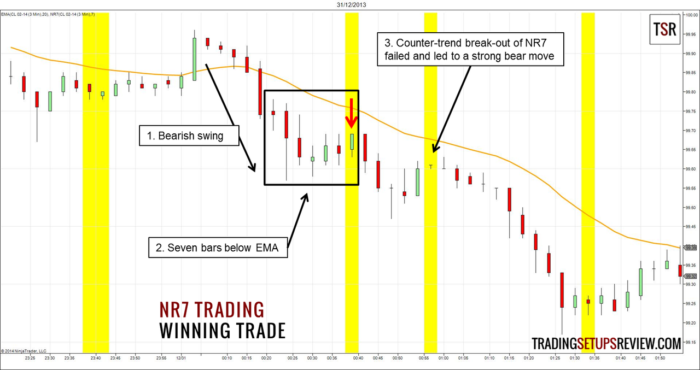

## Table of Contents

## What is the NR7 trading strategy?

The NR7 trading strategy is a method used by traders to identify potential breakout points in the market. It focuses on the range of price movement within a day. Specifically, NR7 stands for "Narrowest Range of the last 7 days." This means that a trader looks for the day with the smallest difference between the highest and lowest prices over a 7-day period. When this day is found, it suggests that the market might be getting ready for a big move, either up or down.

Traders using the NR7 strategy will often place buy orders just above the high of the NR7 day and sell orders just below the low of the NR7 day. The idea is to catch the market as it breaks out of its narrow range. This strategy can be used in various markets, like stocks, forex, or commodities. However, it's important for traders to combine the NR7 strategy with other tools and indicators to increase their chances of making successful trades.

## How does the NR7 strategy identify potential trading opportunities?

The NR7 strategy helps traders find good times to buy or sell by looking at how much the price moves each day. It focuses on finding the day with the smallest difference between the highest and lowest prices over the last 7 days. This day is called the NR7 day. When traders see this narrow range, they think the market might be ready for a big move soon. They look for this special day because it could mean the market is about to break out and move strongly in one direction.

Once the NR7 day is found, traders get ready for the market to move. They put buy orders just above the high price of the NR7 day and sell orders just below the low price of the NR7 day. This way, if the market moves up, they can buy at a good time. If the market moves down, they can sell at a good time. The NR7 strategy works in many markets, like stocks or [forex](/wiki/forex-system), but traders often use other tools too to make better choices.

## What are the key components of the NR7 pattern?

The NR7 pattern is all about finding the day with the smallest price range over the last 7 days. This means you look at the difference between the highest and lowest prices each day. When you find the day with the smallest difference, that's the NR7 day. It's called the Narrowest Range of the last 7 days. This day is important because it might mean the market is getting ready for a big move.

Traders use the NR7 day to decide when to buy or sell. If the price goes above the high of the NR7 day, traders might buy. If the price goes below the low of the NR7 day, traders might sell. This strategy helps traders catch the market just as it starts to move a lot. But, it's good to use other tools too, to make better trading choices.

## Can you explain how to set up the NR7 indicator on a trading platform?

To set up the NR7 indicator on a trading platform, first, you need to find the indicator section in your trading software. Most platforms have a place where you can add different tools and indicators. Look for an option to add custom indicators or search for "NR7" if it's already available in the platform's library. Once you find it, add the NR7 indicator to your chart. You might need to adjust some settings, but usually, the default settings are fine because the NR7 just looks for the day with the smallest price range over the last 7 days.

After adding the NR7 indicator, it will show on your chart by marking the NR7 day in a special way, often with a different color or a symbol. This makes it easy to see when the market has a day with the narrowest range in the last week. When you see this mark, you can get ready to place buy orders above the high of the NR7 day or sell orders below the low of the NR7 day, depending on which way you think the market will move. Remember, it's good to use other tools too, to help you make the best trading choices.

## What timeframes are most effective for using the NR7 strategy?

The NR7 strategy can work on different timeframes, but it often works best on daily charts. This is because the NR7 looks at the range of prices over 7 days, and daily charts give a clear view of each day's high and low prices. Traders often use the daily chart to spot the NR7 day and then watch for a breakout the next day. This way, they can catch the market as it starts to move strongly in one direction.

For shorter timeframes like hourly or 4-hour charts, the NR7 strategy can still be useful, but it might give more signals, which can be harder to trade. On these shorter charts, the NR7 day is based on a smaller time period, so the price movements might be smaller too. Traders using shorter timeframes need to be quick and ready to act when they see a breakout. It's good to use other tools with the NR7 strategy on any timeframe to make better trading choices.

## How do traders typically enter and exit trades using the NR7 strategy?

When using the NR7 strategy, traders enter a trade by waiting for the market to move past the high or low of the NR7 day. If the price goes above the high of the NR7 day, traders might buy. They think the market is going to keep going up. If the price goes below the low of the NR7 day, traders might sell. They think the market is going to keep going down. This way, they try to catch the market just as it starts to move a lot.

For exiting trades, traders often set a target price or use a stop-loss order. A target price is where they plan to sell if the price goes up, or buy back if the price goes down. A stop-loss order helps them limit their losses if the market moves the wrong way. Some traders also watch the market closely and might decide to exit their trade if they see signs that the market is changing direction. Using other tools and indicators can help them make better choices about when to get in and out of trades.

## What are the common risk management techniques used with the NR7 strategy?

When traders use the NR7 strategy, they often use a stop-loss order to manage their risk. A stop-loss order is like a safety net that tells the trading platform to close the trade if the price moves too much against them. For example, if a trader buys after the price goes above the high of the NR7 day, they might set a stop-loss just below that high. This way, if the price drops back down, they don't lose too much money. It's a way to control how much they might lose on a trade.

Traders also use a take-profit order to lock in gains. This is like setting a goal for how much they want to make on a trade. If the price moves in their favor and reaches this goal, the trade automatically closes, and they keep the profit. Another common technique is to use a trailing stop. A trailing stop moves with the price, so if the price keeps going up, the stop-loss moves up too. This helps traders keep more of their profits if the market keeps moving in their favor. By using these risk management techniques, traders can protect their money and make better trading decisions with the NR7 strategy.

## How can the NR7 strategy be combined with other technical indicators for better results?

Traders often use the NR7 strategy along with other technical indicators to make better trading decisions. One common way is to use the NR7 with trend indicators like moving averages. For example, if the NR7 day happens while the price is above a long-term moving average, it might mean the market is in a strong uptrend. This could make traders more confident about buying if the price breaks above the NR7 day's high. On the other hand, if the NR7 day happens below the moving average, it might signal a downtrend, making traders more likely to sell if the price breaks below the NR7 day's low.

Another useful combination is using the NR7 with [momentum](/wiki/momentum) indicators like the Relative Strength Index (RSI) or the Moving Average Convergence Divergence (MACD). If the NR7 day happens and the RSI shows the market is not overbought or oversold, it might be a good time to trade. If the RSI is overbought and the price breaks below the NR7 day's low, it could be a strong signal to sell. Similarly, if the MACD shows a bullish crossover near an NR7 day, it might be a good time to buy when the price breaks above the NR7 day's high. By combining the NR7 strategy with these other indicators, traders can get more information and make smarter trading choices.

## What are some real-life examples of the NR7 strategy in action?

Imagine a trader using the NR7 strategy in the stock market. They are watching the daily chart of a popular tech company. Over the last week, the stock's price moved a lot every day, but on Friday, it only went up and down a little bit. This makes Friday the NR7 day because it had the smallest price range in the last 7 days. The trader gets ready for a big move. On Monday, the stock's price jumps above Friday's high. The trader buys the stock, thinking it will keep going up. A few days later, the stock reaches the trader's target price, and they sell it for a nice profit.

In another example, a forex trader is looking at the EUR/USD pair. They notice that last Thursday had the smallest price range of the last 7 days, making it the NR7 day. The trader waits to see what happens next. On Friday, the price drops below Thursday's low. The trader decides to sell EUR/USD, expecting the price to keep falling. They set a stop-loss just above Thursday's low to limit their risk. A few days later, the price hits their take-profit level, and they close the trade, happy with their gain. By using the NR7 strategy, both traders found good times to enter and exit their trades.

## What are the potential pitfalls and limitations of using the NR7 strategy?

Using the NR7 strategy can be tricky because it doesn't always work. Sometimes, the market doesn't move much after the NR7 day, or it moves in the opposite direction of what the trader expects. This can lead to losses if the trader isn't careful. Also, the NR7 strategy can give false signals, where the price breaks out but then quickly reverses. This means traders might enter a trade and then have to exit at a loss. It's important for traders to be ready for these situations and not rely only on the NR7 strategy.

Another limitation is that the NR7 strategy works best in markets that have clear trends and big moves. If the market is moving sideways or not very active, the NR7 day might not lead to a good trading opportunity. Traders need to understand the market conditions and use other tools to help them make better decisions. Combining the NR7 strategy with other indicators can help, but it still requires patience and good risk management to be successful.

## How does the NR7 strategy perform in different market conditions?

The NR7 strategy works well in markets that have strong trends and big moves. When the market is moving up or down a lot, finding the NR7 day can help traders catch the start of these big moves. For example, if the market is going up and the NR7 day happens, traders might see the price break above the NR7 day's high and keep going up. This can be a good time to buy and make a profit. But, the NR7 strategy can be less useful in markets that are moving sideways or not very active. In these conditions, the market might not move much after the NR7 day, and traders might not find good trading opportunities.

Another thing to think about is that the NR7 strategy can give false signals sometimes. This means the price might break out after the NR7 day but then quickly move back the other way. Traders need to be careful and use other tools to help them decide when to trade. Using things like moving averages or the RSI can help traders see if the market is really ready for a big move. By combining the NR7 strategy with these other indicators, traders can make better choices and manage their risks better.

## What advanced techniques can be applied to enhance the effectiveness of the NR7 strategy?

To make the NR7 strategy work better, traders can use other tools along with it. One good idea is to look at the market's overall trend using moving averages. If the NR7 day happens while the price is above a long-term moving average, it might mean the market is in a strong uptrend. This can give traders more confidence to buy if the price breaks above the NR7 day's high. On the other hand, if the NR7 day happens below the moving average, it might signal a downtrend, making traders more likely to sell if the price breaks below the NR7 day's low. Using these trend indicators helps traders see if the market is really ready for a big move.

Another advanced technique is to use momentum indicators like the RSI or MACD. If the NR7 day happens and the RSI shows the market is not overbought or oversold, it might be a good time to trade. For example, if the RSI is overbought and the price breaks below the NR7 day's low, it could be a strong signal to sell. Similarly, if the MACD shows a bullish crossover near an NR7 day, it might be a good time to buy when the price breaks above the NR7 day's high. By combining the NR7 strategy with these momentum indicators, traders can get a better idea of the market's strength and direction, which can help them make smarter trading choices.

## What is the NR7 Strategy and how does it work?

The NR7 strategy is a technical trading pattern that involves identifying periods of reduced market volatility and positioning for a potential breakout. This strategy identifies a trading opportunity when the current trading day exhibits the narrowest daily price range compared to the previous six trading days. The "range" is defined as the difference between the high and low prices of the trading session. This is mathematically expressed as:

$$
\text{Range} = \text{High} - \text{Low}
$$

The strategy relies on the principle that market [volatility](/wiki/volatility-trading-strategies) tends to contract before expanding, positioning traders to benefit from potential price movements that follow these calm periods. The NR7 strategy considers a day with the narrowest range of the past seven trading days as indicative of this contraction phase or the 'calm before the storm'.

In practice, markets often exhibit this tightening behavior before a significant move, analogous to the buildup of energy in a coiled spring. Traders seek to capitalize on the expected volatility expansion by entering trades on these low-volatility days, with the anticipation of capturing a subsequent [breakout](/wiki/breakout-trading) move.

The core trading rules for executing the NR7 strategy typically include:

1. **Identification of NR7 Setup**: Determine if the current trading day has the narrowest range among the last seven trading days.

2. **Confirmation and Entry**: Traders may wait for a breakout from the identified narrow range, entering a long position if a breakout occurs above the NR7 high or a short position if a breakout occurs below the NR7 low.

3. **Risk Management**: Employ stop-loss orders either just below the narrow range low for long positions or above the narrow range high for short positions to mitigate potential losses.

4. **Profit Targets**: Establish profit targets based on the expected volatility expansion, possibly aligning with nearby support or resistance levels, or using a volatility-based indicator such as the Average True Range (ATR).

Implementing the NR7 strategy effectively requires careful monitoring of price movements and disciplined execution of entry and [exit](/wiki/exit-strategy) points. Utilizing this strategy may enhance a trader's ability to identify potential breakout opportunities resulting from periods of low market activity.

## How can one practically implement NR7: Coding and Backtesting?

Implementing the NR7 strategy requires a methodical approach to coding and [backtesting](/wiki/backtesting), ensuring the strategy functions as intended before applying it to live market conditions. Using platforms like Amibroker or Tradestation, traders can create scripts to automate the identification and execution of NR7 signals.

### Coding the NR7 Strategy

To code the NR7 strategy, you begin by defining the logic necessary to identify NR7 conditions. This involves comparing the range of the current trading day to the previous six days. In mathematical terms, the range is defined as:

$$
\text{Range} = \text{High} - \text{Low}
$$

In Python, using the Pandas library for data manipulation, you can implement the NR7 logic as follows:

```python
import pandas as pd

# Assuming df is a DataFrame with columns 'High' and 'Low'
df['Range'] = df['High'] - df['Low']
df['NR7'] = df['Range'] < df['Range'].rolling(window=7).min()

# Identify potential trading signals
df['Signal'] = df['NR7'].shift(1) # Assuming entry on next day's open
```

### Backtesting the NR7 Strategy

Backtesting is crucial in assessing the viability of the NR7 strategy. A robust backtest should simulate the strategy over a historical period, evaluating both profitability and risk. Key metrics to consider include the win/loss ratio, average gain per trade, and drawdown levels.

The following simplified Python snippet demonstrates a basic backtesting loop:

```python
# Assuming df['Signal'] is already defined
initial_capital = 10000
position_size = 100 # Number of shares or contract size

capital = initial_capital
positions = []

for i in range(1, len(df)):
    if df['Signal'].iloc[i] and capital >= df['Open'].iloc[i] * position_size:
        # Enter trade
        positions.append(df['Open'].iloc[i] * position_size)
        capital -= df['Open'].iloc[i] * position_size

    # Exit trade logic (for example, after a specific number of days or a target is met)
    # [...]

# Calculate returns
final_capital = capital + sum(positions)
gross_returns = (final_capital - initial_capital) / initial_capital * 100
print(f"Backtest Gross Returns: {gross_returns:.2f}%")
```

### Ensuring Robustness

The key to effective backtesting lies in ensuring the robustness of results. Avoid common pitfalls such as overfitting to historical data, which can lead to unreliable performance in live trading environments. Additionally, consider transaction costs, slippage, and [liquidity](/wiki/liquidity-risk-premium) constraints in your simulations.

By following these steps and maintaining a focus on robust, accurate coding, traders can effectively implement and backtest the NR7 strategy, gaining insights into its potential profitability and risk profile within different market environments.

## References & Further Reading

[1]: Crabel, T. (1990). ["Day Trading with Short Term Price Patterns and Opening Range Breakout."](https://www.amazon.com/Trading-Short-Patterns-Opening-Breakout/dp/0934380171) Business One Irwin.

[2]: Aronson, D. R. (2007). ["Evidence-Based Technical Analysis: Applying the Scientific Method and Statistical Inference to Trading Signals."](https://www.amazon.com/Evidence-Based-Technical-Analysis-Scientific-Statistical/dp/0470008741) Wiley.

[3]: Chan, E. P. (2009). ["Quantitative Trading: How to Build Your Own Algorithmic Trading Business."](https://github.com/ftvision/quant_trading_echan_book) Wiley.

[4]: Prado, M. L. (2018). ["Advances in Financial Machine Learning."](https://www.amazon.com/Advances-Financial-Machine-Learning-Marcos/dp/1119482089) Wiley.

[5]: Jansen, S. (2020). ["Machine Learning for Algorithmic Trading."](https://github.com/stefan-jansen/machine-learning-for-trading) Packt Publishing.