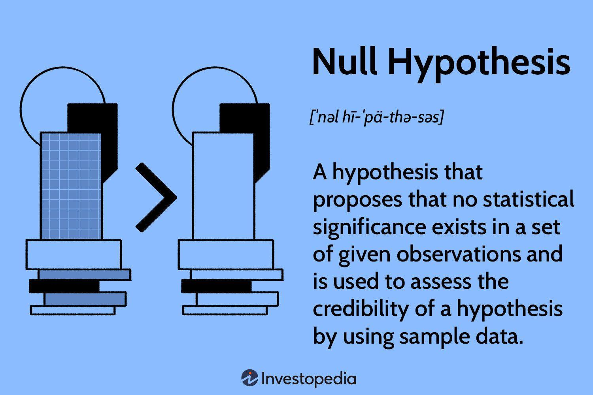

The ever-evolving landscape of investing and algorithmic trading incessantly integrates advanced statistical methodologies, aiming to enhance decision-making processes and optimize outcomes. At the forefront of these methodologies is statistical analysis, particularly the concept of the null hypothesis, which serves a critical function in validating and improving investment strategies and trading algorithms. The null hypothesis is a cornerstone of statistical inference, offering a framework to test and verify the efficacy of various strategies by assuming no initial effect or relationship between variables.

In investing and trading, null hypothesis testing facilitates the evaluation of new strategies by providing a baseline assumption that any observed differences in outcomes are due to chance. This statistical tool empowers investors and traders to objectively assess whether the observed performance improvements are statistically significant or merely the result of random variation. Through rigorous hypothesis testing, practitioners can thereby refine their strategies, leading to more informed investment decisions.



The utilization of null hypothesis statistical analysis not only aids in validating the effectiveness of trading algorithms but also enhances profitability and risk management. By embracing this systematic approach, investors can make more calculated decisions, thereby increasing their chances of achieving favorable market outcomes. This article will delve into the ways in which null hypothesis testing is employed in algorithmic trading and investment strategies, underscoring its pivotal role in driving profitability and managing risk effectively.

## Table of Contents

## Understanding the Null Hypothesis

A null hypothesis is a primary concept in statistical hypothesis testing, introduced to establish a default position that suggests no effect, relationship, or difference between two measured variables. In financial studies, the null hypothesis often serves as a starting benchmark that analysts seek to refute to demonstrate that a particular investment strategy or trading algorithm has an effect or exhibits superior performance.

### Conceptualization

The null hypothesis, typically denoted as $H_0$, posits that any observed effect in a dataset arises from random chance rather than from the influence of an independent variable. Its formulation is crucial in hypothesis testing because it provides a clear criterion against which the validity of the test's alternative hypothesis, denoted as $H_1$, can be evaluated. For example, when testing whether a new trading strategy is more effective than a standard one, the null hypothesis would claim that there is no difference in the effectiveness of the two strategies. Mathematically, this can be expressed as:

$$
H_0: \mu_{\text{new}} = \mu_{\text{standard}}
$$

where $\mu_{\text{new}}$ and $\mu_{\text{standard}}$ represent the mean returns of the new and standard strategies, respectively.

### Implications in Financial Studies

In the context of investment, statistical tests often hinge on the null hypothesis to quantify and assess market strategies’ potential impacts. By setting up the null hypothesis that a specific trading method does not outperform another or that a trading signal has no predictive capability, financial analysts can rigorously test and verify strategy efficacy. The goal is to provide evidence strong enough to reject the null hypothesis, thereby accepting the alternative hypothesis $H_1$ that a significant effect exists. This evidence is generated typically through p-values and confidence intervals.

### Rejection and Insights

Rejection of the null hypothesis suggests that an alternative hypothesis is plausible, indicating that the observed effect is statistically significant and unlikely to have occurred due to random chance. In financial studies, this could lead to valuable insights, such as identifying that a new pricing model is more accurate or that a particular set of market conditions enhances the performance of a trading strategy. By utilizing tools like the t-test or ANOVA, analysts can systematically investigate these hypotheses and quantify their trading strategies' performance under varied market scenarios.

Through this methodological framework, the null hypothesis becomes a critical element in the scientific investigation of financial strategies, enabling analysts to glean insights into market behavior and effectively drive investment decisions.

## Statistical Analysis in Algorithmic Trading

Algorithmic trading utilizes automated systems to execute trades based on pre-set criteria, often leveraging statistical, technical, and quantitative analyses to optimize decision-making processes. The core objective of statistical analysis in [algorithmic trading](/wiki/algorithmic-trading) is to improve the development and refinement of trading algorithms by rigorously testing their effectiveness across various market conditions.

One fundamental aspect of statistical analysis in algorithmic trading is hypothesis testing. This process involves comparing a sample statistic to a known population parameter or another sample statistic to determine if there is enough evidence to reject a null hypothesis. In the context of trading, the null hypothesis might assert that there is no significant difference between the returns generated by a given algorithm and a standard benchmark or another trading strategy.

For instance, suppose a trading system is designed to exploit short-term pricing inefficiencies. The effectiveness of this strategy can be evaluated using statistical metrics such as the Sharpe ratio, which measures the excess return per unit of risk. The hypothesis might be that the new algorithm results in a higher Sharpe ratio compared to a buy-and-hold strategy. Statistical tests like the t-test could be employed to determine if the difference in Sharpe ratios is statistically significant:

```python
import numpy as np
from scipy import stats

# Hypothetical Sharpe ratios of two strategies
strategyA_sharpe = np.array([1.2, 1.5, 1.3, 1.6])
strategyB_sharpe = np.array([0.8, 0.9, 1.0, 1.1])

# Performing a t-test
t_statistic, p_value = stats.ttest_ind(strategyA_sharpe, strategyB_sharpe)

print("t-statistic:", t_statistic)  
print("p-value:", p_value)
```

In this example, a low p-value would suggest rejecting the null hypothesis, indicating that the new strategy statistically outperforms the baseline.

Beyond hypothesis testing, statistical analysis in algorithmic trading also involves data processing and feature engineering. Techniques such as time-series analysis, principal component analysis (PCA), and [machine learning](/wiki/machine-learning) algorithms are often employed to extract meaningful patterns and signals from large datasets. This information is crucial for building predictive models that inform trading decisions.

However, it is crucial to exercise caution to avoid common pitfalls such as overfitting—where a model performs well on historical data but poorly on new data. To mitigate this risk, [backtesting](/wiki/backtesting) and cross-validation are extensively used. Backtesting allows traders to simulate a strategy's performance on historical data, while cross-validation helps ensure that the strategy generalizes well to unseen data.

In conclusion, statistical analysis is indispensable in algorithmic trading. By employing rigorous testing and validation techniques, traders can improve their strategies' robustness, ultimately enhancing profitability and risk management in dynamic market environments.

## Application of Null Hypothesis in Investment Strategies

Investment strategies frequently employ quantitative analysis, allowing investors and analysts to apply null hypothesis testing as a method to confirm or refute the effectiveness and potential success of these strategies. The process typically involves establishing a null hypothesis to assert that there is no significant difference or effect between a new investment approach and a traditional strategy.

For instance, consider an investor evaluating whether a newly developed algorithmic trading strategy significantly outperforms a conventional buy-and-hold approach. The null hypothesis (H0) in this context would claim that the new strategy does not have a statistically significant performance advantage over the buy-and-hold strategy. Formally, this can be represented as:

$$
H_0: \mu_{\text{new}} = \mu_{\text{buy-and-hold}}
$$

Where $\mu_{\text{new}}$ is the mean return of the new algorithmic strategy, and $\mu_{\text{buy-and-hold}}$ is the mean return of the buy-and-hold strategy.

To evaluate this hypothesis, statistical tools such as p-values and confidence intervals provide metrics for decision-making. The p-value is particularly crucial as it quantifies the probability of observing results as extreme as those in the sample data, assuming the null hypothesis is true. A low p-value (typically < 0.05) suggests that the observed outcomes are inconsistent with the null hypothesis, leading to its rejection in favor of the alternative hypothesis:

$$
H_a: \mu_{\text{new}} \neq \mu_{\text{buy-and-hold}}
$$

By contrast, confidence intervals offer a range within which the true difference in mean returns is likely to fall, thus providing a measure of uncertainty around the estimate. If the confidence interval for the difference in means does not include zero, it supports rejecting the null hypothesis.

In practical application, one might use Python to [carry](/wiki/carry-trading) out these statistical tests. For example, using the `scipy.stats` library, an investor can perform a t-test to compare the two strategies:

```python
from scipy import stats

# Sample returns from the new strategy and buy-and-hold strategy
returns_new = [0.10, 0.12, 0.09, 0.11, 0.13]
returns_bnh = [0.08, 0.09, 0.07, 0.09, 0.10]

# Perform a t-test
t_stat, p_value = stats.ttest_ind(returns_new, returns_bnh)

print(f"T-statistic: {t_stat}, P-value: {p_value}")
```

If the p-value obtained from the above test is below the chosen significance level (e.g., 0.05), the investor would reject the null hypothesis, concluding that the new algorithmic strategy significantly outperforms the buy-and-hold strategy.

Through these methods, null hypothesis testing provides a structured framework for statistically validating investment strategies, enabling more informed and data-driven decision-making in financial markets.

## Case Studies and Examples

A practical instance of null hypothesis testing can be found in hedge funds that develop new trading algorithms intending to outperform existing strategies. Consider a [hedge fund](/wiki/hedge-fund-trading-strategies) that has designed a predictive model based on historical market data. The null hypothesis in this scenario might assert that the performance difference between this new algorithm and an established strategy, such as a basic buy-and-hold approach, is negligible. To evaluate this, statistical tools such as t-tests or ANOVA could be employed to analyze the historical returns.

For example, if we represent the returns of the new algorithm as $R_{new}$ and the returns of the existing strategy as $R_{existing}$, the null hypothesis ($H_0$) can be articulated as:

$$
H_0: \mu_{new} = \mu_{existing}
$$

Where $\mu_{new}$ and $\mu_{existing}$ are the mean returns of the new algorithm and the existing strategy, respectively. Rejecting this null hypothesis after rigorous statistical testing would indicate that the new algorithm potentially offers better performance, beyond what could be attributed to random chance.

In another example, the relationship between economic indicators and stock prices can be investigated using similar statistical methodologies. For instance, an analyst might test the correlation between a leading economic index and the subsequent returns of a stock index. The null hypothesis could propose that there is no correlation ($\rho = 0$) between these two variables. Statistical tests such as Pearson's correlation test can be applied to verify this hypothesis:

```python
import numpy as np
from scipy import stats

# Sample data for economic indicators and stock index returns
economic_index = np.array([100, 102, 104, 105, 110])
stock_returns = np.array([1.5, 1.7, 1.8, 2.0, 2.3])

# Perform Pearson's correlation test
correlation_coefficient, p_value = stats.pearsonr(economic_index, stock_returns)

print(f"Correlation coefficient: {correlation_coefficient}")
print(f"P-value: {p_value}")
```

Here, a low p-value (typically less than 0.05) would lead to rejecting the null hypothesis, implying a significant correlation between the economic indicator and stock market returns. These case studies illustrate how null hypothesis testing serves as a robust statistical mechanism to validate or refute investment hypotheses, guiding decision-making in both algorithm development and market analysis.

## Challenges and Considerations

Statistical analysis is a cornerstone of contemporary investment strategy development and algorithmic trading, but it is not without its challenges. One critical aspect to consider is the potential for Type I and Type II errors, which can lead to incorrect conclusions about the effectiveness of a trading strategy. A Type I error, or a false positive, occurs when the null hypothesis is incorrectly rejected, suggesting a strategy is effective when it is not. Conversely, a Type II error, or a false negative, arises when the null hypothesis is incorrectly accepted, leading to the dismissal of a potentially profitable strategy.

These errors highlight the importance of setting an appropriate significance level in hypothesis testing. A common practice is to use a p-value threshold of 0.05, but this may not be suitable for all scenarios, especially in high-stakes financial environments. Adjusting the threshold can help tailor the sensitivity and specificity of the tests to the unique demands of each investment strategy.

Overfitting is another significant concern when utilizing statistical methods in investment. Overfitting occurs when a model is excessively complex and tailored to historical data, capturing noise rather than underlying trends. This is often observed when a model performs well on in-sample data but poorly on out-of-sample data, indicating that it lacks generalizability. To avoid overfitting, it is crucial to employ techniques like cross-validation, which partitions data into training and testing sets, ensuring the model's robustness across different datasets. In Python, this can be facilitated using libraries such as sklearn:

```python
from sklearn.model_selection import train_test_split, cross_val_score
from sklearn.linear_model import LinearRegression

# Example data
X, y = load_some_financial_data()

# Split data into training and test sets
X_train, X_test, y_train, y_test = train_test_split(X, y, test_size=0.3, random_state=42)

# Initialize model
model = LinearRegression()

# Perform cross-validation
scores = cross_val_score(model, X_train, y_train, cv=5)
print(f'Cross-validated scores: {scores}')
```

Another challenge is the risk of data mining, which involves searching large datasets for patterns and relationships without a prior hypothesis, often leading to spurious conclusions. This underscores the necessity for hypothesis-driven exploration and rigorous testing protocols.

Understanding the limitations of hypothesis testing is critical. Hypothesis tests make several assumptions, such as the normality of data distribution and the independence of observations. Violations of these assumptions can lead to unreliable results. Therefore, analysts should consider alternative non-parametric methods or bootstrap techniques when these conditions are not met.

Lastly, model validation is a fundamental aspect of maintaining the reliability of statistical analyses in investment decisions. Rigorous backtesting, stress testing under varied market conditions, and continuous monitoring of a model's performance are essential practices. By fostering a culture of robust validation and critical evaluation, analysts can better navigate the complexities and limitations inherent in applying statistical methods to financial markets.

## The Future of Statistical Analysis in Algo Trading

As technology continues to evolve, the integration of statistical analysis within algorithmic trading systems is set to expand in scope and sophistication. The null hypothesis, a critical concept in statistical analysis, remains a crucial tool for evaluating the validity and efficacy of trading strategies. However, the advent of machine learning and [artificial intelligence](/wiki/ai-artificial-intelligence) is beginning to reshape traditional methods, offering varied dimensions for hypothesis testing and strategy development.

Machine learning models, particularly those in supervised and unsupervised learning, have the capability to process vast amounts of financial data and identify patterns which may not be immediately apparent through traditional statistical methods. These models can assist in formulating alternative hypotheses and testing them against the null hypothesis more effectively. For example, a machine learning algorithm can be trained to predict stock prices based on historical data inputs, and its predictions can be assessed for statistical significance against a benchmark strategy utilizing the null hypothesis.

Artificial intelligence plays a pivotal role in enhancing the adaptability and precision of algorithmic trading strategies. Reinforcement learning, a subset of AI, enables algorithms to learn from interactions within trading environments and evolve strategies continuously. This adaptive learning can help refine hypotheses in real-time, providing a competitive edge in markets known for their dynamism.

The intersection of AI with statistical methods extends beyond hypothesis testing; it facilitates the continuous refinement of trading models. For instance, the use of Python libraries like SciPy and TensorFlow enables traders to apply statistical tests and machine learning algorithms cohesively. This synergy allows for robust backtesting and strategy optimization, components essential for developing resilient trading algorithms.

Continual research and innovation in statistical methodologies and AI technologies are essential to maintaining competitiveness in algorithmic trading. Advancements in data processing capabilities, coupled with enhanced algorithmic sophistication, suggest a future where statistical analysis does not merely validate strategies but also drives the creation of adaptive, intelligent trading systems. In this rapidly advancing field, staying abreast of the latest developments ensures traders and investors can exploit emerging market opportunities efficiently.

## Conclusion

Null hypothesis statistical analysis is a fundamental aspect of modern investing and trading operations, offering a rigorous framework for evaluating the effectiveness of investment strategies and informing decision-making processes. By establishing a benchmark for comparison, the null hypothesis assists analysts in discerning real effects from random noise, thus ensuring that strategies are based on genuine insights rather than coincidences.

The effective utilization of these analytical tools can enhance the precision of investment decisions, leading to increased efficiency and better risk management outcomes. By differentiating between significant and insignificant variables, traders can allocate resources more effectively, optimize portfolio returns, and implement strategies that are more resilient to market [volatility](/wiki/volatility-trading-strategies). Additionally, the ability to test and validate investment approaches statistically aids in the avoidance of overfitting, ensuring that strategies are applicable across various market conditions and not merely tailored to historical datasets.

Staying updated with the latest developments in statistical methods and technologies becomes imperative for traders and investors who wish to exploit market opportunities to their fullest potential. As the financial markets continue to evolve and integrate cutting-edge technologies such as machine learning and artificial intelligence, the role of statistical analysis is expected to expand, offering new tools and techniques for hypothesis testing and strategy evaluation. Keeping abreast of these advancements will enable practitioners to remain competitive and innovative in their approach, ensuring continued success in a rapidly evolving financial landscape.

## References & Further Reading

[1]: Bergstra, J., Bardenet, R., Bengio, Y., & Kégl, B. (2011). ["Algorithms for Hyper-Parameter Optimization."](https://dl.acm.org/doi/10.5555/2986459.2986743) Advances in Neural Information Processing Systems 24.

[2]: ["Advances in Financial Machine Learning"](https://www.wiley.com/en-us/Advances+in+Financial+Machine+Learning-p-9781119482109) by Marcos Lopez de Prado

[3]: ["Evidence-Based Technical Analysis: Applying the Scientific Method and Statistical Inference to Trading Signals"](https://www.amazon.com/Evidence-Based-Technical-Analysis-Scientific-Statistical/dp/0470008741) by David Aronson

[4]: ["Machine Learning for Algorithmic Trading"](https://github.com/stefan-jansen/machine-learning-for-trading) by Stefan Jansen

[5]: ["Quantitative Trading: How to Build Your Own Algorithmic Trading Business"](https://www.amazon.com/Quantitative-Trading-Build-Algorithmic-Business/dp/0470284889) by Ernest P. Chan