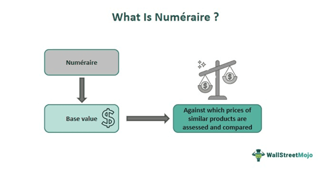

## Table of Contents

## What is the basic definition of numeraire?

A numeraire is a basic unit of account used in financial markets to measure the value of other assets. Think of it like a standard that helps us compare different things. In everyday life, we use money as a numeraire. For example, when you want to know how much an apple costs, you measure it in dollars or euros. In financial markets, a numeraire can be any asset, like a stock or a currency, that is used as a reference point to value other investments.

In more technical terms, a numeraire is important in financial mathematics and economics. It helps in pricing derivatives and other complex financial instruments. By choosing a numeraire, you can simplify calculations and make it easier to understand how the value of different assets changes over time. For instance, if you use a stock index as a numeraire, you can see how other stocks or options perform relative to that index. This makes it easier to make investment decisions and manage risk.

## How does the concept of numeraire originate?

The concept of numeraire originated in the field of economics and finance as a way to make it easier to compare the value of different things. A long time ago, people realized that they needed a common standard to measure the worth of goods and services. This led to the use of money as a numeraire. For example, instead of trading apples for oranges, people started using money to buy and sell things. This made trading much simpler and more efficient.

Over time, the idea of numeraire became more important in financial markets. Economists and mathematicians started using different assets, not just money, as numeraires to understand how the value of investments changes. For example, they might use a stock index as a numeraire to see how other stocks perform relative to that index. This helped them make better decisions about buying and selling investments. Today, the concept of numeraire is a key part of financial mathematics and is used to price complex financial products like derivatives.

## What are the primary functions of a numeraire in economics?

In economics, a numeraire has two main jobs. The first job is to help us compare the value of different things. Imagine you want to know if an apple is worth more than an orange. Without a numeraire, it's hard to tell. But if you use money as a numeraire, you can say an apple costs one dollar and an orange costs two dollars. Now it's easy to see that an orange is worth more. This makes trading and buying things much simpler.

The second job of a numeraire is to help us understand how the value of things changes over time. For example, if you use a stock index as a numeraire, you can see how other stocks go up or down compared to that index. This is really helpful for people who invest money. They can use a numeraire to make smart decisions about buying and selling investments. So, a numeraire makes it easier to understand the economy and make good choices.

## Can you explain the role of numeraire in different economic theories?

In classical economics, a numeraire is used to make it easier to compare the value of different things. Think of it like a common language that everyone understands. When economists talk about prices, they use a numeraire like money to say how much something costs. For example, if you use dollars as a numeraire, you can say an apple costs one dollar and an orange costs two dollars. This helps everyone understand the value of goods and services in a simple way. Classical economists believe that using a numeraire makes the economy run smoothly because it helps people trade and buy things easily.

In modern economic theories, like those used in financial markets, a numeraire has a more complex role. It's not just about comparing prices; it's also about understanding how the value of investments changes over time. For example, if you use a stock index as a numeraire, you can see how other stocks perform compared to that index. This helps investors make smart decisions about buying and selling stocks. Modern economists use numeraires to price complex financial products like derivatives. By choosing the right numeraire, they can make calculations easier and understand the risks and rewards of different investments better.

## How is numeraire used in the context of currency?

In the context of currency, a numeraire is a basic unit of account that helps us measure the value of money. For example, if you use the U.S. dollar as a numeraire, you can say that one euro is worth about 1.2 dollars. This makes it easy to compare the value of different currencies. Without a numeraire, it would be hard to know how much one currency is worth compared to another. By using a numeraire, people can trade and exchange money more easily.

In financial markets, a numeraire can also be used to understand how the value of a currency changes over time. For instance, if you use the U.S. dollar as a numeraire, you can see how the value of the euro goes up or down compared to the dollar. This helps traders and investors make decisions about buying and selling currencies. By keeping track of these changes, people can manage their money better and make smarter financial choices.

## What are some historical examples of numeraire?

A long time ago, people used different things as numeraires to compare the value of goods. In ancient times, some societies used grains like wheat or barley as a numeraire. For example, in Mesopotamia, people would say that a sheep was worth a certain amount of barley. This made it easier to trade because everyone understood how much barley was worth. Later, as societies grew, metals like gold and silver became popular numeraires. In ancient Rome, people used silver coins called denarii to measure the value of things. This helped make trade and commerce more organized and efficient.

In more recent history, money became the main numeraire. For example, during the Middle Ages in Europe, people started using coins and then paper money as a numeraire. This made it easier to buy and sell things because everyone knew how much a coin or a bill was worth. Over time, different countries chose their own currencies as numeraires. For instance, the British pound became the numeraire in England, and the U.S. dollar became the numeraire in the United States. Today, these currencies help people around the world compare the value of goods and services in a simple way.

## How does numeraire relate to the concept of money?

Numeraire and money are closely related because money often acts as a numeraire. A numeraire is a basic unit of account that helps us compare the value of different things. When we use money, like dollars or euros, as a numeraire, it makes it easy to know how much things cost. For example, if you want to buy an apple and an orange, you can say that an apple costs one dollar and an orange costs two dollars. This helps everyone understand the value of goods and services in a simple way.

In everyday life, using money as a numeraire makes trading and buying things much easier. Without a numeraire, it would be hard to know if an apple is worth more than an orange. But with money as a numeraire, you can easily compare prices and make decisions. In financial markets, money can also be used to understand how the value of different investments changes over time. This helps people make smart choices about buying and selling stocks or other assets. So, money as a numeraire is a key part of how our economy works.

## What is the significance of numeraire in financial markets?

In financial markets, a numeraire is super important because it helps people compare the value of different investments. Think of it like a yardstick that everyone uses to measure things. For example, if you use the U.S. dollar as a numeraire, you can see how much a stock or a bond is worth in dollars. This makes it easy to understand if one investment is worth more or less than another. Without a numeraire, it would be really hard to know if buying a certain stock is a good idea or not.

A numeraire also helps people understand how the value of investments changes over time. For instance, if you use a stock index like the S&P 500 as a numeraire, you can see how other stocks go up or down compared to that index. This is really helpful for investors because it helps them make smart decisions about when to buy or sell stocks. By using a numeraire, people in financial markets can manage their money better and make choices that can help them earn more or lose less.

## How do changes in numeraire affect economic analysis?

When the numeraire changes, it can really shake up how we look at the economy. Imagine you usually use dollars to figure out how much things cost. If you switch to using euros instead, suddenly everything looks different. Prices in dollars might seem high, but in euros, they could look low. This can make it hard to compare things from one time to another or from one country to another. Economists have to be careful when they change the numeraire because it can mess up their calculations and make it tough to understand what's really going on in the economy.

Using a different numeraire can also change how we see trends and make predictions. For example, if you use a stock index as a numeraire and it goes up a lot, other stocks might look like they're not doing so well, even if they're actually growing. This can lead to different decisions about investing or saving money. So, economists need to think about which numeraire to use and how changes in it might affect their analysis. It's like [picking](/wiki/asset-class-picking) the right tool for a job – the wrong one can make things a lot harder.

## What are the challenges in selecting an appropriate numeraire?

Picking the right numeraire can be tricky because it needs to be something that everyone understands and agrees on. If you choose something that changes a lot, like a stock that goes up and down every day, it can make it hard to compare the value of other things. For example, if you use a stock as a numeraire and it suddenly drops, everything else might seem more valuable even if nothing else has changed. This can lead to confusion and bad decisions. So, it's important to pick a numeraire that is stable and widely accepted, like a strong currency, to make sure everyone is on the same page.

Another challenge is that different people might need different numeraires depending on what they're trying to do. For instance, if you're looking at investments in the U.S., using the U.S. dollar makes sense. But if you're comparing investments around the world, you might want to use a global currency like the euro or even a basket of currencies. This can make things more complicated because you have to switch between different numeraires depending on the situation. It's like trying to use different rulers to measure the same thing – it can get confusing and lead to mistakes if you're not careful.

## How is numeraire applied in modern economic modeling?

In modern economic modeling, a numeraire is used as a basic unit to measure the value of different things. Think of it like a standard tool that helps economists compare prices and values easily. For example, if you're building a model to understand how the economy works, you might use the U.S. dollar as a numeraire. This way, you can see how the price of goods, like apples or cars, changes over time in dollars. Using a numeraire helps make the math simpler and the results easier to understand. It's like using a common language that everyone in the model can understand.

When economists build models to study financial markets, they often use different numeraires depending on what they're looking at. For instance, if they're studying stock prices, they might use a stock index like the S&P 500 as a numeraire. This helps them see how other stocks perform compared to the index. By choosing the right numeraire, economists can make their models more accurate and useful for understanding how investments change in value. It's important to pick a numeraire that fits the specific situation, so the model gives clear and reliable information.

## What are the advanced theoretical implications of numeraire in economic research?

In advanced economic research, the concept of numeraire plays a big role in helping economists understand how the economy works. A numeraire is like a common unit that everyone uses to measure the value of things. When economists use a numeraire in their models, it helps them see how prices and values change over time. For example, if they use the U.S. dollar as a numeraire, they can track how the price of goods like apples or cars changes in dollars. This makes it easier to understand economic trends and make predictions about the future. By choosing the right numeraire, economists can make their models more accurate and useful.

The choice of numeraire can also affect how economists study different parts of the economy. For instance, when looking at financial markets, economists might use a stock index as a numeraire to see how other stocks perform compared to the index. This helps them understand investment risks and returns better. In global economic studies, economists might use a basket of currencies as a numeraire to compare economic performance across countries. The numeraire choice can influence the results of the research, so economists need to be careful and pick one that fits the specific situation they are studying. This way, their findings will be more reliable and helpful for making economic decisions.

## What are the Mathematical Foundations of Numeraire?

The concept of numeraire plays a critical role in the mathematical framework of risk-neutral valuation in finance. It provides a consistent standard for pricing derivatives and financial instruments by ensuring that all asset prices are compared to a common benchmark. This is achieved through a transformation into a risk-neutral world, a hypothetical scenario in which all investors are indifferent to risk and asset growth rates align with the chosen numeraire. 

In risk-neutral valuation, the selection of a numeraire facilitates the change of measure, a mathematical process that transforms probability measures used in stochastic calculus. This transformation converts the actual probability measure, denoted as $\mathbb{P}$, to the risk-neutral measure, $\mathbb{Q}$. This change is crucial for simplifying the pricing of contingent claims, as it allows financial models to discount expected future payoffs at the risk-free rate, rather than the expected rate of return. 

A key principle in risk-neutral pricing involves the martingale representation theorem, which states that, under the risk-neutral measure $\mathbb{Q}$, appropriately discounted asset prices follow a martingale process. Mathematically, if $S(t)$ is the price of a given asset at time $t$ and $B(t)$ is the price of the numeraire, then the discounted asset price $\frac{S(t)}{B(t)}$ is a martingale under $\mathbb{Q}$. In other words:

$$
\mathbb{E}^{\mathbb{Q}} \left[ \frac{S(T)}{B(T)} \mid \mathcal{F}(t) \right] = \frac{S(t)}{B(t)}
$$

where $\mathcal{F}(t)$ represents the information available at time $t$, and $T$ is a future time.

Understanding how these mathematical concepts integrate with the numeraire framework is essential for navigating stochastic processes and financial models. These processes, such as the Black-Scholes model for option pricing, rely heavily on numeraire to ensure valuation consistency across various financial scenarios. By utilizing stochastic calculus and the risk-neutral approach, financial professionals can develop robust pricing models that effectively manage uncertainty and risk in dynamic market environments.

These mathematical underpinnings not only enhance the theoretical understanding of asset pricing but also provide practical tools for the accurate valuation and comparison of financial instruments across different markets and currencies.

## What is Numeraire in Algorithmic Trading?

Algorithmic trading, a cornerstone of modern financial markets, leverages computational tools to execute trading strategies at speeds and accuracies beyond human capability. Within this context, the concept of numeraire plays a crucial role by providing a standardized measure for valuing and comparing diverse financial assets. By transforming value assessments into a common benchmark, numeraire enhances the precision and efficiency of automated trading systems.

### Numeraire and Replicating Portfolios

In automated trading systems, the creation of replicating portfolios is significantly streamlined through the use of numeraire. A replicating portfolio consists of a combination of assets designed to mimic the payoff of a particular financial instrument or strategy. By using numeraire, traders can evaluate and optimize these portfolios uniformly across various assets, which is particularly useful in derivative markets.

Consider the following example: Suppose a trader seeks to replicate a complex derivative. With numeraire, the trader can standardize the valuation equations for each component of the replicating portfolio. This entails transforming asset prices into a risk-neutral measure where expected growth aligns with a risk-free benchmark, often achieved through methodologies such as the Girsanov theorem. In this setup, prices $P(t)$ can be expressed as martingales in the risk-neutral world:

$$
E_Q[P(T) \mid \mathcal{F}(t)] = P(t)
$$

where $E_Q$ is the expectation under the risk-neutral measure $Q$, $\mathcal{F}(t)$ is the information set available at time $t$, and $P(T)$ is the price at maturity. This approach allows for consistent asset valuation and effective portfolio replication.

### Integration with AI and Machine Learning

The application of numeraire in [algorithmic trading](/wiki/algorithmic-trading) is further enhanced by integrating [artificial intelligence](/wiki/ai-artificial-intelligence) (AI) and [machine learning](/wiki/machine-learning) techniques. Machine learning algorithms, trained on historical data, can recognize patterns and optimize trading strategies by adjusting to changing market conditions. When combined with numeraire, these algorithms can more effectively standardize and compare asset values, enriching the datasets used for training models.

For instance, machine learning models can incorporate numeraire to develop predictive analytics algorithms, leading to more robust trading signals. Below is a simple Python example demonstrating how a machine learning model might employ numeraire for standardization:

```python
import numpy as np
from sklearn.linear_model import LinearRegression

# Assume prices are raw asset prices
prices = np.array([...])
# Transform prices using a numeraire (e.g., risk-free rate transformation)
numeraire_prices = prices / prices[0]

# Features and target for machine learning model
X = np.array([...])  # Feature set
y = numeraire_prices  # Transformed using numeraire

# Linear regression model to predict price changes
model = LinearRegression()
model.fit(X, y)
predictions = model.predict(X)
```

This integration ensures that the predictions made by the model are aligned with the market’s risk-neutral values, improving both strategy execution and risk assessment.

### Future Prospects

The future of algorithmic trading incorporating numeraire lies in further enhancing its utility and predictive accuracy across diverse market conditions. As computational technology evolves, the precision with which numeraire-based models can analyze and execute trades is expected to increase. The integration of more sophisticated AI models, such as [deep learning](/wiki/deep-learning) and [reinforcement learning](/wiki/reinforcement-learning), promises to expand the capabilities of numeraire in understanding complex relationships within market data.

Moreover, numeraire's application in decentralized finance (DeFi) markets, which rely heavily on algorithmic trading, presents new opportunities for leveraging its standardizing benefits. The decentralized nature of these systems, coupled with the quantitative foundation provided by numeraire, could pave the way for innovative trading practices and financial products.

In summary, numeraire serves as a vital tool in algorithmic trading, enabling clear asset valuation and strategic trading execution. Its integration with machine learning and AI is likely to yield significant enhancements in trading strategies, positioning numeraire as a fundamental component of future financial markets.

## References & Further Reading

[1]: Cox, J. C., Ingersoll, J. E., & Ross, S. A. (1979). "The Pricing of Options and Corporate Liabilities." Journal of Political Economy, 87(2), 229-263. [Link](https://www.semanticscholar.org/paper/A-theory-of-the-term-structure-of-interest-rates''%2C-Cox-Ingersoll/853c1f9b36a574432f112d72b473a68f377f410e)

[2]: Harrison, J. M., & Kreps, D. M. (1979). "Martingales and Arbitrage in Multiperiod Securities Markets." Journal of Economic Theory, 20(3), 381-408. [Link](https://www.sciencedirect.com/science/article/pii/0022053179900437)

[3]: Black, F., & Scholes, M. (1973). "The Pricing of Options and Corporate Liabilities." Journal of Political Economy, 81(3), 637-654. [Link](https://www.cs.princeton.edu/courses/archive/fall09/cos323/papers/black_scholes73.pdf)

[4]: Björk, T. (2009). "Arbitrage Theory in Continuous Time" (3rd ed.). Oxford University Press. [Link](http://www.nigerianwomeninmaths.org/cs/books/Tomas%20Bjork-Arbitrage%20Theory%20in%20Continuous%20Time%20(Oxford%20Finance)%20(2009)%20(1).pdf)

[5]: Wilmott, P. (2007). "Paul Wilmott Introduces Quantitative Finance" (2nd ed.). Wiley. [Link](https://openlibrary.org/books/OL17901095M/Paul_Wilmott_introduces_quantitative_finance.)

[6]: Shreve, S. E. (2004). "Stochastic Calculus for Finance I: The Binomial Asset Pricing Model." Springer. [Link](https://link.springer.com/book/10.1007/978-0-387-22527-2)

[7]: Hull, J. C. (2018). "Options, Futures, and Other Derivatives" (10th ed.). Pearson. [Link](https://www.semanticscholar.org/paper/Options%2C-Futures%2C-and-Other-Derivatives-Hull/89bdee500c8623864fc9eb7a471546aa713acc44)

[8]: Lo, A. W., & MacKinlay, A. C. (1997). "The Econometrics of Financial Markets." Princeton University Press. [Link](https://press.princeton.edu/books/hardcover/9780691043012/the-econometrics-of-financial-markets)

[9]: "Risk-Neutral Valuation: Pricing and Hedging of Financial Derivatives." (2010) by Nicholas H. Bingham and Rüdiger Kiesel. Springer. [Link](https://link.springer.com/book/10.1007/978-1-4471-3856-3)