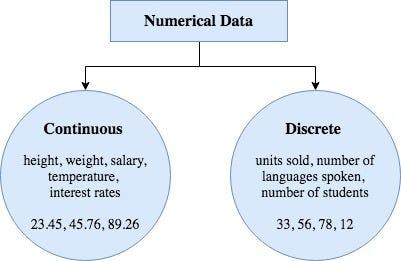

## Table of Contents

## What is numerical data in the context of machine learning?

Numerical data in machine learning refers to information that is expressed in numbers. This type of data can be used directly in mathematical calculations and machine learning algorithms. Examples of numerical data include age, height, weight, and temperature. These numbers can be continuous, like the temperature which can take any value within a range, or discrete, like the number of students in a class which can only be whole numbers.

In machine learning, numerical data is crucial because many algorithms are designed to work with numbers. For instance, algorithms like linear regression or k-means clustering use numerical data to make predictions or find patterns. If data is not already in numerical form, it often needs to be converted or encoded into numbers before it can be used effectively in these models. This process ensures that the machine learning algorithms can process and learn from the data accurately.

## How is numerical data different from categorical data?

Numerical data and categorical data are two main types of data used in machine learning. Numerical data is made up of numbers that you can do math with. This includes things like height, weight, or temperature. These numbers can be added, subtracted, multiplied, or divided. For example, if you know someone's height is 170 cm and they grow 5 cm, you can easily calculate their new height as 175 cm. Numerical data can be continuous, like temperature which can be any number within a range, or discrete, like the number of apples in a basket which can only be whole numbers.

Categorical data, on the other hand, is data that is divided into groups or categories. This type of data represents characteristics, like colors, types of fruits, or yes/no answers. You can't do math with categorical data in the same way as with numerical data. For example, if you have data about different fruits like apples, bananas, and oranges, you can't add these categories together. Instead, you might count how many items fall into each category. Sometimes, categorical data needs to be turned into numbers before it can be used in machine learning models. This process is called encoding, and it helps the computer understand and work with the data.

In summary, the key difference between numerical and categorical data is how they are used and what kind of operations you can perform on them. Numerical data is used for calculations and can be continuous or discrete, while categorical data is used to classify items into groups and needs to be encoded into numbers for use in many [machine learning](/wiki/machine-learning) algorithms.

## What are the common sources of numerical data for machine learning projects?

Numerical data for machine learning projects often comes from places like surveys, where people answer questions with numbers, like their age or how much they spend on something. Another big source is sensors, which can measure things like temperature or speed and give out numbers right away. Businesses also have a lot of numerical data from things like sales numbers, how many customers they have, or how much money they make. All these sources give us numbers that we can use directly in our machine learning models.

Sometimes, we get numerical data from big databases or public records, like weather data or health records. These records have lots of numbers that can be used to find patterns or make predictions. For example, weather data might include temperature, humidity, and wind speed, all of which are numbers that can be used in a model to predict the weather. Health records might include things like blood pressure or cholesterol levels, which can help predict health risks. By using these numbers, machine learning projects can learn and make better guesses or decisions.

## What preprocessing steps are necessary for numerical data before using it in machine learning models?

Before using numerical data in machine learning models, it's important to clean and prepare the data. This means checking for and fixing any missing values. If some numbers are missing, you might fill them in with the average of the other numbers, or you might just remove the rows with missing data. Another step is to make sure the data is in the right format. Sometimes, data comes in different units, like kilograms and pounds, and you need to convert everything to the same unit so the model can work with it correctly.

Another important step is to scale the data. This means making sure all the numbers are on a similar scale so one feature doesn't overpower the others. For example, if you're working with both income (in thousands of dollars) and age (in years), the income numbers might be much bigger and could dominate the model. To fix this, you might use a method like normalization, which changes the numbers so they all fit between 0 and 1. This can be done using a formula like $$X_{\text{normalized}} = \frac{X - X_{\text{min}}}{X_{\text{max}} - X_{\text{min}}}$$. After scaling, it's also a good idea to split the data into training and testing sets. This helps you check how well your model works on new data it hasn't seen before.

```python
from sklearn.preprocessing import MinMaxScaler
import numpy as np

# Sample data
data = np.array([[100000, 30], [150000, 40], [200000, 50]])

# Create a scaler object
scaler = MinMaxScaler()

# Fit and transform the data
scaled_data = scaler.fit_transform(data)

print(scaled_data)
```

By doing these steps, you make sure your numerical data is ready to use in machine learning models, and you can get the best results from your models.

## How can you handle missing values in numerical datasets?

Handling missing values in numerical datasets is important because these gaps can mess up your machine learning models. One way to deal with missing values is to simply remove the rows or columns that have them. This is easy but can lead to losing a lot of data, especially if missing values are common. Another way is to fill in the missing values with a number, like the average or median of the other values in that column. This is called imputation. For example, if you have a column of ages and some are missing, you could fill those missing spots with the average age from the rest of the data.

A more advanced method is to use a model to predict what the missing values should be. This can be done by creating a model that looks at the other data in the row and guesses the missing number. For instance, if you're missing someone's income but you know their age and education level, you could use a model to predict their income based on those other factors. This method can be more accurate but also more complicated to set up. 

```python
import pandas as pd
import numpy as np

# Sample data with missing values
data = pd.DataFrame({
    'Age': [25, 30, np.nan, 35, 40],
    'Income': [50000, 60000, 70000, np.nan, 90000]
})

# Fill missing values with mean
data['Age'] = data['Age'].fillna(data['Age'].mean())
data['Income'] = data['Income'].fillna(data['Income'].mean())

print(data)
```

By choosing the right method to handle missing values, you can make sure your dataset is ready for machine learning and that your models work as well as they can.

## What are the scaling techniques used for numerical features in machine learning?

Scaling numerical features is important in machine learning because it helps make sure all the numbers are on a similar level. This way, one feature doesn't become more important just because its numbers are bigger. There are two main ways to scale data: normalization and standardization. Normalization changes the numbers so they fit between 0 and 1. You can do this using the formula $$X_{\text{normalized}} = \frac{X - X_{\text{min}}}{X_{\text{max}} - X_{\text{min}}}$$. This is good when you want all your features to be on the same scale and you know the minimum and maximum values of your data.

Standardization, on the other hand, changes the numbers so they have a mean of 0 and a standard deviation of 1. This is done using the formula $$X_{\text{standardized}} = \frac{X - \mu}{\sigma}$$ where $$\mu$$ is the mean and $$\sigma$$ is the standard deviation. Standardization is useful when you want to keep the original distribution of your data but still make sure all features are on the same scale. It's especially helpful when you're working with algorithms that assume your data is normally distributed, like in some types of neural networks or support vector machines.

```python
from sklearn.preprocessing import MinMaxScaler, StandardScaler
import numpy as np

# Sample data
data = np.array([[100000, 30], [150000, 40], [200000, 50]])

# Normalization
normalizer = MinMaxScaler()
normalized_data = normalizer.fit_transform(data)

# Standardization
standardizer = StandardScaler()
standardized_data = standardizer.fit_transform(data)

print("Normalized Data:")
print(normalized_data)
print("\nStandardized Data:")
print(standardized_data)
```

## How do you select the most relevant numerical features for a machine learning model?

Choosing the right numerical features for a machine learning model is important because it can make your model work better and faster. One way to do this is by using a method called feature selection. This involves looking at how each feature affects the model's predictions. You can do this by checking how much each feature helps in making the model's guesses more accurate. A common way to measure this is by using a technique called correlation analysis, where you look at how much each feature relates to the thing you want to predict. If a feature has a high correlation with the target, it might be useful to keep it in the model.

Another way to pick the best features is by using something called feature importance, which many machine learning algorithms can give you. For example, if you're using a decision tree or a random forest, these models can tell you which features they found most useful for making predictions. You can then keep the features that are most important and drop the ones that don't help much. This not only makes your model simpler but also can help it perform better because it's focusing on the most relevant information. By carefully selecting features, you can make sure your machine learning model is as good as it can be.

```python
from sklearn.feature_selection import SelectKBest, f_regression
import numpy as np

# Sample data
X = np.array([[1, 2, 3, 4], [5, 6, 7, 8], [9, 10, 11, 12]])
y = np.array([1, 2, 3])

# Select the two best features
selector = SelectKBest(score_func=f_regression, k=2)
X_new = selector.fit_transform(X, y)

print("Selected features:")
print(X_new)
```

## What are some common algorithms used for modeling numerical data in machine learning?

When working with numerical data, machine learning often uses algorithms like linear regression and k-nearest neighbors (KNN). Linear regression is great for finding a straight line that best fits the data to predict a number. It uses a formula like $$y = mx + b$$ where $$m$$ is the slope and $$b$$ is the y-intercept. This is useful for things like predicting house prices based on size. KNN, on the other hand, looks at the numbers of the closest points to make a guess. For example, if you want to guess someone's income based on age and education, KNN would find people with similar ages and education levels and use their incomes to make a prediction.

Another common algorithm is decision trees, which work by splitting the data into smaller groups based on numbers. They keep splitting until they can make a good guess. For example, a decision tree might split people into groups by age, then by income, to predict if they'll buy a product. Random forests are like using many decision trees together. They make lots of trees and then combine their guesses to make a final prediction. This can be really good for predicting things like stock prices or customer behavior. Each of these algorithms has its own way of using numerical data to make predictions, and choosing the right one depends on what you're trying to predict and how your data looks.

## How can you evaluate the performance of a machine learning model trained on numerical data?

To evaluate how well a machine learning model works with numerical data, you can use different ways to measure its performance. One common way is to use something called Mean Squared Error (MSE). This measures how far off the model's guesses are from the real numbers. You take the difference between each guess and the real number, square it, and then find the average of all those squares. The formula for MSE is $$ \text{MSE} = \frac{1}{n} \sum_{i=1}^{n} (y_i - \hat{y}_i)^2 $$, where $$ y_i $$ is the real number and $$ \hat{y}_i $$ is the model's guess. A smaller MSE means the model is making better guesses. Another way is to use the R-squared score, which tells you how much of the changes in the numbers the model can explain. A higher R-squared means the model is doing a good job.

You can also split your data into two parts: one part for training the model and another part for testing it. This way, you can see how well the model works on new data it hasn't seen before. You train the model on the training data and then use it to make guesses on the test data. By comparing these guesses to the real numbers in the test data, you can see how accurate the model is. If the model does well on both the training and test data, it's a good sign that it's working well. But if it does much better on the training data than the test data, it might be overfitting, which means it's too focused on the training data and not good at guessing new numbers.

## What advanced techniques can be used to improve models working with numerical data?

One advanced technique to improve models working with numerical data is called ensemble methods. These methods combine the predictions of several models to make a final guess that's better than any single model. A popular ensemble method is called boosting, where you train models one after another, and each new model focuses on the numbers that the last model got wrong. Another ensemble method is bagging, where you train many models on different parts of your data and then average their guesses. Both these methods can make your model more accurate and less likely to overfit, which means it won't just memorize the training data but will be good at guessing new numbers too.

Another technique is using regularization. This helps stop the model from getting too complicated and overfitting. There are two main types of regularization: L1 and L2. L1 regularization, also called Lasso, can make some of the model's numbers zero, which means it can pick out the most important features for you. L2 regularization, also called Ridge, makes the model's numbers smaller but doesn't usually make them zero. You can use both together in something called Elastic Net. Regularization helps the model focus on the big picture and not get too caught up in the small details of the training data. By using these advanced techniques, you can make your model work better with numerical data and get more accurate guesses.

## How do ensemble methods enhance the prediction of numerical data in machine learning?

Ensemble methods help make better guesses with numerical data by combining the predictions of many models. Imagine you have a bunch of friends trying to guess how much it will rain tomorrow. If you take the average of all their guesses, you might get a better prediction than if you just listened to one friend. That's what ensemble methods do. They use different models, like decision trees or linear regression, and combine their guesses to make a final prediction. This way, if one model makes a mistake, the others can help correct it, making the overall guess more accurate.

A popular ensemble method is called boosting. It works by training models one after the other, where each new model tries to fix the mistakes of the last one. For example, if the first model is bad at guessing the temperature on cloudy days, the next model will focus more on those days. Another method is bagging, which stands for Bootstrap Aggregating. It trains many models on different parts of your data and then averages their guesses. Both these methods can make your model more accurate and less likely to overfit, which means it won't just memorize the training data but will be good at guessing new numbers too. By using ensemble methods, you can make your model work better with numerical data and get more accurate guesses.

## What are the current research trends in handling numerical data for machine learning applications?

One of the current research trends in handling numerical data for machine learning is the development of more advanced feature selection and engineering techniques. Researchers are working on ways to automatically find and create new features from existing numerical data that can improve model performance. This includes using [deep learning](/wiki/deep-learning) methods like autoencoders to learn new representations of the data. These techniques help models focus on the most important parts of the data, making predictions more accurate. Another trend is the use of transfer learning, where models trained on one dataset can be used to help with predictions on a different but related dataset. This can save time and resources because you don't have to start from scratch with every new problem.

Another trend is the exploration of new ways to handle missing data and outliers in numerical datasets. Traditional methods like mean imputation or removing outliers are being replaced with more sophisticated approaches. For example, researchers are using machine learning models to predict missing values based on other features in the dataset, which can lead to more accurate predictions. There's also a focus on robust algorithms that can handle outliers without being thrown off [course](/wiki/best-algorithmic-trading-courses). These methods help make sure that the data used in machine learning models is as clean and useful as possible, leading to better results.

## References & Further Reading

[1]: Géron, A. (2019). ["Hands-On Machine Learning with Scikit-Learn, Keras, and TensorFlow: Concepts, Tools, and Techniques to Build Intelligent Systems."](https://www.amazon.com/Hands-Machine-Learning-Scikit-Learn-TensorFlow/dp/1492032646) O'Reilly Media.

[2]: Hastie, T., Tibshirani, R., & Friedman, J. (2009). ["The Elements of Statistical Learning: Data Mining, Inference, and Prediction."](https://link.springer.com/book/10.1007/978-0-387-84858-7) Springer Series in Statistics.

[3]: Goodfellow, I., Bengio, Y., & Courville, A. (2016). ["Deep Learning."](https://www.deeplearningbook.org/) MIT Press.

[4]: ["Data Mining: Practical Machine Learning Tools and Techniques"](https://www.sciencedirect.com/book/9780123748560/data-mining-practical-machine-learning-tools-and-techniques) by Ian H. Witten, Eibe Frank, and Mark A. Hall. 

[5]: Pedregosa, F., Varoquaux, G., Gramfort, A., Michel, V., Thirion, B., Grisel, O., ... & Duchesnay, E. (2011). ["Scikit-learn: Machine Learning in Python."](https://dl.acm.org/doi/10.5555/1953048.2078195) Journal of Machine Learning Research, 12, pp. 2825-2830.

[6]: Zhou, Z.-H. (2012). ["Ensemble Methods: Foundations and Algorithms."](https://www.taylorfrancis.com/books/mono/10.1201/b12207/ensemble-methods-zhi-hua-zhou) Chapman & Hall/CRC.