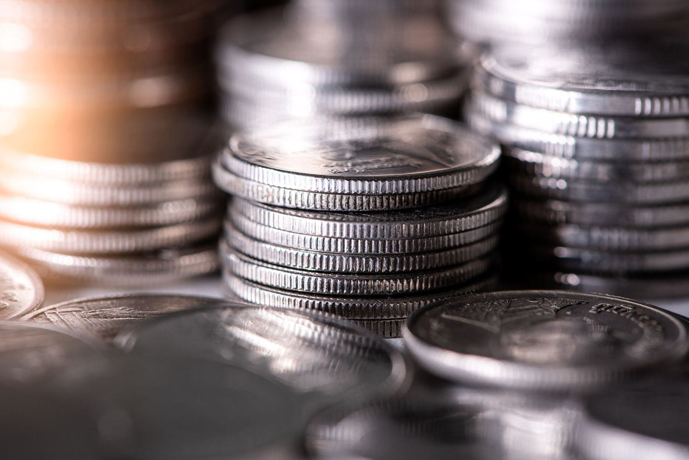

## Table of Contents

## What is numismatics?

Numismatics is the study of coins and other forms of money. It includes looking at old coins, paper money, and even tokens. People who study numismatics are called numismatists. They learn about the history, art, and culture of different times and places by studying money.

Numismatists often collect coins as a hobby. They enjoy finding rare or old coins and learning about them. Some people also study numismatics to understand how money was used in the past and how it changed over time. This can help them learn about trade, economy, and even politics in different historical periods.

## How did numismatics originate?

Numismatics started a long time ago, when people began using coins. The first coins were made around 600 BCE in Lydia, which is now part of Turkey. People started collecting these coins because they were interesting and showed pictures of kings and gods. As more coins were made in different places, people began to study them to learn about history and culture.

Over time, numismatics grew into a serious study. In the 16th and 17th centuries, scholars in Europe started writing [books](/wiki/algo-trading-books) about coins. They used coins to learn about ancient civilizations and how money was used. Today, numismatics is a big field with many people who study and collect coins. They use special tools and methods to learn more about the past through money.

## What are the basic types of numismatic items?

Numismatic items include coins, which are the most common. Coins can be made of different metals like gold, silver, bronze, or even copper. They often have pictures and writing on them that tell about the time and place they came from. Some coins are very old and rare, which makes them special to collectors.

Another type of numismatic item is paper money. This includes banknotes and bills. Paper money started being used a few hundred years ago and can show pictures of important people or places. Like coins, paper money can also be rare and valuable, especially if it is old or from a special edition.

Tokens and medals are also numismatic items. Tokens are like coins but are not official money. They might be used for things like public transport or games. Medals are often given as awards and can tell stories about events or people. All these items help numismatists learn about history and culture.

## What are the essential tools needed for a beginner in numismatics?

For a beginner in numismatics, a few essential tools can help you get started. You will need a magnifying glass to look closely at the details on coins and paper money. This helps you see tiny marks or writing that can tell you more about the item. A coin gauge or caliper is also useful. It helps you measure the size of coins, which can be important for identifying them.

Another helpful tool is a reference book or catalog. These books have pictures and information about different coins and paper money. They can help you learn what to look for and how to tell if an item is rare or valuable. Lastly, you might want a soft cloth or gloves to handle your numismatic items carefully. This keeps them clean and prevents damage from oils on your skin.

## How can someone start a numismatic collection?

Starting a numismatic collection is easy and fun. First, decide what you want to collect. You might like old coins from your country or maybe paper money from around the world. Once you know what you want, start looking for these items. You can find them at coin shops, online, or even in your own change! It's a good idea to buy a reference book or use websites to learn more about what you're collecting. This helps you know if a coin or bill is rare or valuable.

After you start collecting, take care of your items. Use a soft cloth or gloves when you handle them to keep them clean. Store your collection in a safe place, like a coin album or a special folder for paper money. This keeps them from getting damaged. As you learn more, you might want to join a numismatic club or go to coin shows. These are great ways to meet other collectors and learn even more about your hobby.

## What are the different grading systems used in numismatics?

In numismatics, grading systems help collectors understand the condition of coins and paper money. The most common system used in the United States is the Sheldon Scale, which rates coins from 1 to 70. A coin rated 1 is in very poor condition, while a coin rated 70 is perfect. This scale looks at things like wear, marks, and how much of the original detail is still there. Other countries might use different scales, but they all try to do the same thing: tell collectors how well a coin or bill has been kept.

For paper money, the grading can be a bit different. One common system is the International Bank Note Society (IBNS) grading scale, which goes from 1 to 63. A note rated 1 is in bad shape, and a note rated 63 is in perfect condition. This scale looks at things like folds, tears, and how bright the colors still are. Both coin and paper money grading help collectors know how much an item might be worth and how rare it is to find one in that condition.

## What are some common terms and jargon used in numismatics?

In numismatics, people use special words to talk about coins and money. One common term is "mint," which means the place where coins are made. When a coin is brand new and has never been used, it is called "uncirculated." If a coin has been used and shows wear, it is called "circulated." Collectors also talk about "mintage," which is the number of coins made in a certain year. Another important term is "strike," which describes how well the design was pressed into the coin.

There are also words for the condition of coins. "Proof" means a coin was made with special care to look perfect. "Mint State" or "MS" is used for coins that are almost perfect but not quite as good as proof coins. "Wear" is what happens to a coin when it gets used and rubbed. "Toning" is when a coin changes color over time, which can make it more valuable or interesting. Lastly, "obverse" is the front of the coin, and "reverse" is the back. Knowing these terms helps collectors talk about their hobby and understand more about their coins.

## How can one authenticate numismatic items?

To authenticate numismatic items, it's important to check them carefully. Start by looking at the details on the coin or paper money. Use a magnifying glass to see small marks or writing that can tell you if it's real. Compare the item to pictures in a reference book or on a trusted website. These resources can show you what a real coin or bill should look like. If something looks different or wrong, it might be fake.

You can also use special tools to help with authentication. A coin gauge or caliper can measure the size of the coin, which should match what it's supposed to be. Some collectors use a magnet to check if a coin is made of the right metal. If it sticks to the magnet, it might not be real. For paper money, look for watermarks or special ink that glows under a black light. These features are hard to fake. If you're still not sure, you can take your item to a professional at a coin shop or a numismatic society. They can give you expert advice on whether your item is genuine.

## What are the major numismatic societies and organizations?

There are many numismatic societies and organizations around the world that help people learn about coins and money. One of the biggest in the United States is the American Numismatic Association (ANA). It has been around since 1891 and helps people learn about numismatics through books, meetings, and events. Another important group is the Professional Numismatists Guild (PNG), which makes sure that dealers and collectors follow good rules and treat each other fairly. The Royal Numismatic Society in the United Kingdom is also very old and important. It was started in 1836 and helps people study and learn about coins from all over the world.

In Europe, the International Numismatic Council (INC) brings together many different numismatic groups. It helps them share information and work together. The International Association of Professional Numismatists (IAPN) is another big group that works to make sure that numismatic items are traded honestly and fairly. In Asia, the Oriental Numismatic Society focuses on coins and money from Asia and helps people learn about the history and culture of the region through numismatics. All these groups help people enjoy and learn more about their hobby.

## How does one specialize in a particular area of numismatics?

To specialize in a particular area of numismatics, you first need to decide what interests you the most. It could be ancient coins, paper money from a certain country, or even tokens from a specific time period. Once you know what you want to focus on, start learning as much as you can about that area. Read books, join online forums, and visit websites that talk about your chosen specialty. It's also helpful to find a mentor who knows a lot about your area of interest. They can give you tips and help you understand the details that make your specialty unique.

After you've learned a lot, start building your collection. Look for items that fit into your specialty at coin shows, online, or through dealers. As you collect, keep good records of what you have and what you learn. This will help you become an expert. You might also want to join a numismatic society that focuses on your area. These groups often have meetings and events where you can learn more and meet other collectors who share your interest. Specializing in numismatics takes time and effort, but it can be very rewarding as you become an expert in your chosen field.

## What advanced techniques are used in the conservation of numismatic items?

To keep numismatic items like coins and paper money in good shape, people use special methods to clean and protect them. One way is to use a soft brush and a mild cleaner to gently remove dirt without hurting the item. For coins, some collectors use a special liquid called an ultrasonic cleaner, which uses sound waves to get rid of tiny bits of dirt. After cleaning, it's important to dry the items well so they don't get damaged by water. Sometimes, if a coin has a lot of dirt or rust, people might use a chemical called electrolysis to clean it, but this needs to be done very carefully so it doesn't harm the coin.

Another important part of conserving numismatic items is storing them the right way. Coins should be kept in special holders or capsules that protect them from air and touch. These holders are made of materials that won't harm the coins over time. For paper money, people use special folders or sleeves made of acid-free paper or plastic. This keeps the paper from getting old and falling apart. Some collectors also use a special machine called a vacuum sealer to put their items in air-tight bags. This helps keep them safe from things like humidity and dust that can damage them over time.

## What are some notable examples of rare and valuable numismatic items?

One very famous rare coin is the 1933 Double Eagle. This is a $20 gold coin from the United States. It's special because almost all of them were melted down before they could be used. Only a few survived, and one of them sold for over $18 million at an auction. Another rare coin is the 1794 Flowing Hair Silver Dollar. It was one of the first dollars made in the United States. Not many were made, and they are hard to find in good condition. One of these coins sold for more than $10 million.

Paper money can also be very valuable. The 1890 Grand Watermelon $1,000 bill from the United States is a good example. It's called the "Grand Watermelon" because the zeros on the back look like watermelons. Only a few of these bills are known to exist, and one sold for over $3 million. Another notable example is the 1928 $100,000 Gold Certificate. It's the highest denomination of U.S. currency ever made and was used only between banks. These bills are very rare, and one sold for over $2 million.

## References & Further Reading

[1]: Cribb, Joe (2018). "Money as Metaphor 3: The Case of Money Scales and Weights," Numismatic Chronicle.

[2]: ["Advances in Financial Machine Learning"](https://www.amazon.com/Advances-Financial-Machine-Learning-Marcos/dp/1119482089) by Marcos Lopez de Prado

[3]: ["Evidence-Based Technical Analysis: Applying the Scientific Method and Statistical Inference to Trading Signals"](https://www.amazon.com/Evidence-Based-Technical-Analysis-Scientific-Statistical/dp/0470008741) by David Aronson

[4]: ["Machine Learning for Algorithmic Trading"](https://github.com/stefan-jansen/machine-learning-for-trading) by Stefan Jansen

[5]: ["Quantitative Trading: How to Build Your Own Algorithmic Trading Business"](https://www.amazon.com/Quantitative-Trading-Build-Algorithmic-Business/dp/1119800064) by Ernest P. Chan