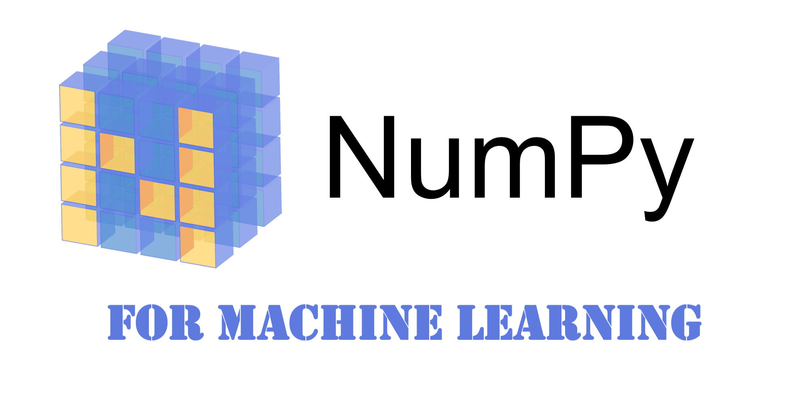

## Table of Contents

## What is NumPy and why is it important for machine learning?

NumPy is a powerful library in Python used for numerical computing. It stands for Numerical Python and provides support for large, multi-dimensional arrays and matrices, along with a collection of mathematical functions to operate on these arrays. NumPy is important because it makes working with numbers in Python much faster and easier. For example, if you need to do a lot of math calculations quickly, NumPy can help you do that without writing a lot of code.

In machine learning, NumPy is very important because many machine learning algorithms need to do a lot of math with big sets of numbers. NumPy helps by making these calculations faster and more efficient. For instance, when you are training a machine learning model, you might need to multiply matrices or calculate averages, and NumPy can do these operations very quickly. This speed and efficiency are crucial for machine learning because they allow you to work with big data and complex models without waiting too long for results.

## How do you install NumPy and set it up for use in a Python environment?

To install NumPy, you can use a tool called pip, which is a package manager for Python. Open your command line or terminal and type `pip install numpy`. This command will download and install NumPy on your computer. It's a simple process and usually takes just a few moments. Once the installation is complete, you can start using NumPy in your Python projects.

To set up NumPy for use in a Python environment, you first need to import it in your Python script or interactive session. You can do this by adding the line `import numpy as np` at the beginning of your Python file or in your Python interpreter. The `as np` part is a common convention that lets you use a shorter name, `np`, to call NumPy functions. After importing, you can start using NumPy's functions and features. For example, to create an array, you can use `np.array([1, 2, 3])`, which will create a NumPy array with the numbers 1, 2, and 3.

## What are the basic data structures in NumPy and how are they used in machine learning?

The basic data structure in NumPy is the array. A NumPy array is like a list in Python, but it's much faster and can handle more complex math operations. Arrays can be one-dimensional, like a simple list of numbers, or multi-dimensional, like a table or a cube of numbers. In [machine learning](/wiki/machine-learning), arrays are used to store and manipulate data. For example, if you have a dataset with features and labels, you can store the features in a two-dimensional array where each row represents a data point and each column represents a feature. This makes it easy to perform operations on the whole dataset at once, like calculating means or applying transformations.

Another important data structure in NumPy is the matrix, which is a special type of two-dimensional array. Matrices are used a lot in machine learning because many algorithms, like linear regression or neural networks, involve matrix operations. For example, when you're training a model, you might need to multiply matrices to update the model's parameters. In NumPy, you can create a matrix using the `np.matrix()` function, though it's more common to use regular arrays because they are more flexible. For instance, to create a simple matrix, you could use ```python
import numpy as np
matrix = np.array([[1, 2], [3, 4]])
```. This matrix can then be used in calculations like $$ \text{matrix} \times \text{another_matrix} $$ to perform operations needed in machine learning algorithms.

## How can you use NumPy to perform basic operations like array creation and manipulation?

NumPy makes it easy to create and manipulate arrays. To create an array, you can use the `np.array()` function. For example, if you want to create an array with the numbers 1, 2, and 3, you would write ```python
import numpy as np
my_array = np.array([1, 2, 3])
```. NumPy also has functions to create special arrays, like `np.zeros()` for an array of zeros or `np.ones()` for an array of ones. For instance, to create an array of five zeros, you would use ```python
zeros_array = np.zeros(5)
```. These functions are handy when you need to start with a blank slate or fill an array with a specific value.

Once you have an array, NumPy offers many ways to manipulate it. You can change values in the array by indexing, just like with a regular Python list. For example, to change the second element of `my_array` to 10, you would write ```python
my_array[1] = 10
```. NumPy also lets you perform operations on entire arrays at once. For instance, to add 5 to every element in `my_array`, you could use ```python
my_array = my_array + 5
```. This is much faster than looping through each element. Additionally, NumPy can perform more complex operations like matrix multiplication. If you have two matrices `A` and `B`, you can multiply them using ```python
result = np.dot(A, B)
```, which would be written as $$ \text{result} = A \times B $$ in math.

## What are some common NumPy functions used for data preprocessing in machine learning?

In machine learning, NumPy is often used for data preprocessing, which means getting data ready to be used in machine learning models. One common task is normalizing data, which makes all the numbers in a dataset fit within a certain range. This can be done using `np.mean()` to find the average of a dataset and `np.std()` to find the standard deviation. For example, to normalize a dataset `X`, you could use the formula $$ \text{normalized_X} = \frac{X - \text{np.mean}(X)}{\text{np.std}(X)} $$. This helps make sure all features are on the same scale, which can improve how well a machine learning model works.

Another important preprocessing step is reshaping data. Sometimes, data comes in a shape that's not right for the machine learning model you want to use. NumPy's `np.reshape()` function can help fix this. For instance, if you have a one-dimensional array and you need a two-dimensional array, you could use ```python
reshaped_array = np.reshape(original_array, (new_rows, new_columns))
```. This can be really useful when you're preparing data for algorithms like neural networks, which often expect data in specific shapes. Also, NumPy's `np.transpose()` function can be used to swap the rows and columns of a two-dimensional array, which can be helpful for certain types of data analysis or when working with different data formats.

## How does NumPy's broadcasting feature work and how can it be applied in machine learning tasks?

NumPy's broadcasting feature is a powerful tool that lets you perform operations on arrays of different shapes without having to manually adjust them. Imagine you want to add a number to every element in an array. Instead of using a loop, which can be slow, NumPy can do this quickly by "broadcasting" the number to match the shape of the array. For example, if you have an array `arr = np.array([1, 2, 3])` and you want to add 5 to each element, you can simply write `result = arr + 5`. NumPy will automatically add 5 to each element, resulting in `result = np.array([6, 7, 8])`. This makes coding simpler and faster, especially when working with big datasets.

In machine learning, broadcasting is very useful for tasks like feature scaling or applying the same operation to many data points at once. For instance, when you want to normalize a dataset, you might need to subtract the mean from each feature and then divide by the standard deviation. With broadcasting, you can do this easily. If `X` is your dataset, you can normalize it using $$ \text{normalized_X} = \frac{X - \text{np.mean}(X)}{\text{np.std}(X)} $$. Here, `np.mean(X)` and `np.std(X)` are single numbers (scalars), but NumPy broadcasts them across all elements of `X` to perform the operation. This makes preprocessing data much simpler and more efficient, which is crucial for machine learning tasks where you often work with large amounts of data.

## What are NumPy's capabilities for linear algebra operations, and how are they relevant to machine learning algorithms?

NumPy has strong capabilities for linear algebra operations, which are key to many machine learning algorithms. It can do things like matrix multiplication, finding the inverse of a matrix, and calculating eigenvalues and eigenvectors. These operations are important because many machine learning methods, like linear regression or principal component analysis (PCA), use them to work with data. For example, in linear regression, you might need to solve the equation $$ \beta = (X^T X)^{-1} X^T y $$ to find the best line that fits your data. NumPy makes this easy by providing functions like `np.dot()` for matrix multiplication and `np.linalg.inv()` for finding the inverse of a matrix.

In machine learning, these linear algebra operations help with tasks like optimizing models and understanding data. For instance, when training a model, you often need to update the model's parameters, which can involve multiplying matrices or solving systems of equations. NumPy's `np.linalg.solve()` function can be used to solve these equations quickly. Also, when you want to reduce the number of features in your dataset using PCA, you need to find the eigenvectors of the covariance matrix. NumPy's `np.linalg.eig()` function can do this, making it easier to apply PCA and other techniques that rely on linear algebra. These capabilities make NumPy a vital tool for anyone working in machine learning.

## How can you use NumPy to implement simple machine learning models like linear regression?

Linear regression is a simple machine learning model that tries to find the best line to fit your data. With NumPy, you can implement linear regression by using its linear algebra functions. Imagine you have some data points, and you want to find a line that goes through them as closely as possible. You can do this by solving the equation $$ \beta = (X^T X)^{-1} X^T y $$, where X is your input data, y is your output data, and β are the coefficients of the line. In NumPy, you can use `np.linalg.inv()` to find the inverse of a matrix and `np.dot()` to multiply matrices, which helps you solve this equation easily.

Here's how you might write this in code. First, you need to prepare your data in NumPy arrays. Then, you can use the following code to find the coefficients of the line:

```python
import numpy as np

# Assume X and y are your input and output data
X = np.array([[1, 1], [1, 2], [1, 3]])  # Add a column of ones for the intercept
y = np.array([2, 4, 5])

# Calculate the coefficients
X_transpose = np.transpose(X)
beta = np.dot(np.dot(np.linalg.inv(np.dot(X_transpose, X)), X_transpose), y)

print(beta)
```

This code will give you the coefficients β that best fit your data. With these coefficients, you can then use the line equation $$ y = \beta_0 + \beta_1 x_1 + \beta_2 x_2 $$ to make predictions or understand how your input data affects your output data.

## What are some advanced NumPy techniques for optimizing machine learning computations?

One advanced NumPy technique for optimizing machine learning computations is using vectorization. Instead of looping through each element in your data, you can use NumPy's functions to do operations on whole arrays at once. This is much faster because it uses the computer's hardware more efficiently. For example, if you're training a machine learning model, you might need to update the model's parameters. Instead of updating them one by one in a loop, you can use NumPy's broadcasting feature to update all parameters at the same time. This can make your code run much faster, especially when you're working with big datasets.

Another technique is using NumPy's linear algebra functions to solve equations quickly. Many machine learning algorithms, like linear regression or neural networks, need to solve systems of equations to find the best model parameters. NumPy's `np.linalg.solve()` function can do this very efficiently. For example, in linear regression, you might need to solve the equation $$ \beta = (X^T X)^{-1} X^T y $$ to find the best line that fits your data. With NumPy, you can write this in just a few lines of code:

```python
import numpy as np

X = np.array([[1, 1], [1, 2], [1, 3]])  # Add a column of ones for the intercept
y = np.array([2, 4, 5])

beta = np.linalg.solve(np.dot(X.T, X), np.dot(X.T, y))
```

This approach is not only faster but also more readable, making it easier to work with complex machine learning models.

## How does NumPy integrate with other machine learning libraries like scikit-learn?

NumPy integrates well with other machine learning libraries like scikit-learn because many of these libraries are built on top of NumPy. For example, scikit-learn uses NumPy arrays to store and manipulate data. When you use scikit-learn to train a model, you often pass your data to the library as NumPy arrays. This makes it easy to move data between NumPy and scikit-learn, allowing you to use NumPy's powerful functions for data preprocessing and then feed the results directly into scikit-learn's machine learning algorithms.

For instance, if you want to use scikit-learn to perform linear regression, you can use NumPy to prepare your data and then pass it to scikit-learn. You might use NumPy to normalize your data with the formula $$ \text{normalized_X} = \frac{X - \text{np.mean}(X)}{\text{np.std}(X)} $$, and then you can easily use this normalized data in scikit-learn's `LinearRegression` model. Here's how you might do this in code:

```python
import numpy as np
from sklearn.linear_model import LinearRegression

# Prepare your data
X = np.array([[1, 1], [1, 2], [1, 3]])
y = np.array([2, 4, 5])

# Normalize the data
X_normalized = (X - np.mean(X, axis=0)) / np.std(X, axis=0)

# Create and train the model
model = LinearRegression()
model.fit(X_normalized, y)

# Make predictions
predictions = model.predict(X_normalized)
```

This integration makes it easy to combine the strengths of NumPy and scikit-learn, allowing you to efficiently handle data and build machine learning models.

## What are some best practices for using NumPy efficiently in large-scale machine learning projects?

When working on large-scale machine learning projects, one of the best practices for using NumPy efficiently is to leverage vectorization and broadcasting. Instead of using loops to perform operations on each element of an array, which can be slow, you should use NumPy's functions to operate on entire arrays at once. This makes your code run much faster because it uses the computer's hardware more efficiently. For example, if you need to add a number to every element in an array, you can simply use `arr + number` instead of looping through each element. This approach not only speeds up your computations but also makes your code cleaner and easier to read.

Another important practice is to use NumPy's memory-efficient operations. Large datasets can take up a lot of memory, so it's important to use functions that minimize memory usage. For instance, instead of creating new arrays for intermediate results, you can use NumPy's in-place operations to modify arrays directly. Also, when you need to perform operations like summing or finding the mean across large arrays, using functions like `np.sum()` or `np.mean()` can be more memory-efficient than doing it manually. By being mindful of memory usage, you can handle larger datasets and make your machine learning projects more scalable.

Lastly, integrating NumPy with other libraries like scikit-learn can enhance efficiency in large-scale projects. Since many machine learning libraries are built on top of NumPy, you can seamlessly pass data between them. For example, you can use NumPy to preprocess your data, such as normalizing it with $$ \text{normalized_X} = \frac{X - \text{np.mean}(X)}{\text{np.std}(X)} $$, and then directly feed this data into scikit-learn's models. This integration allows you to take advantage of NumPy's speed and flexibility while using the powerful algorithms provided by other libraries, making your large-scale machine learning projects more efficient and effective.

## How can you use NumPy to handle more complex data types and structures in machine learning applications?

NumPy can handle more complex data types and structures in machine learning by using its support for different data types and multi-dimensional arrays. For example, if you're working with images, which are often represented as three-dimensional arrays (height, width, color channels), NumPy can easily store and manipulate these arrays. You can use functions like `np.array()` to create arrays of any shape and `np.dtype()` to specify the data type, like integers, floats, or even custom types. This flexibility is important in machine learning because different types of data, like text or images, might need different ways of being stored and processed.

When dealing with more complex data structures, NumPy also offers the ability to use structured arrays. These are arrays where each element can be a record containing multiple fields, similar to a row in a database table. For instance, if you have data about people, including their name, age, and height, you can create a structured array to store all this information together. This can be useful in machine learning for organizing and processing data that has different types of information for each data point. By using structured arrays, you can keep related data together and perform operations on it more efficiently, which can be crucial for handling large and diverse datasets in machine learning projects.