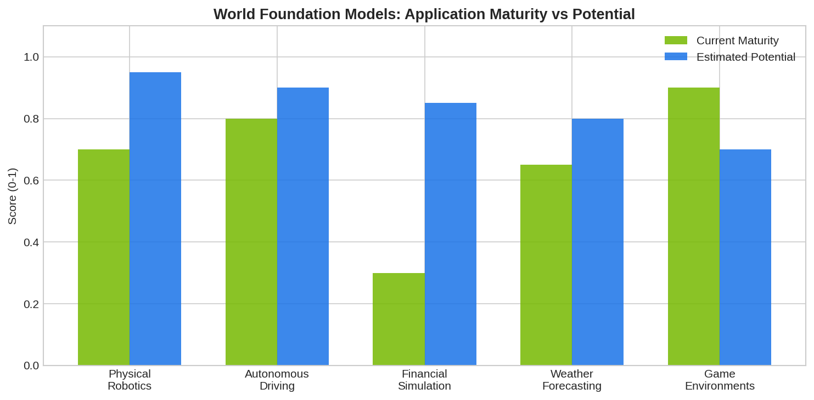

**World foundation models (WFMs)** are large-scale generative AI systems trained on vast visual and physical datasets to simulate realistic environments — understanding physics, spatial dynamics, and causal relationships. **NVIDIA Cosmos**, launched in early 2025, is the leading example: trained on 20 million hours of real-world footage, it generates physically consistent simulations for robotics, autonomous vehicles, and industrial applications. While primarily designed for physical AI, the underlying technology has emerging implications for financial market simulation and synthetic data generation.

## What Are World Foundation Models?

A world foundation model extends the concept of foundation models (like GPT for language) to the physical world. Instead of predicting the next token in a text sequence, WFMs predict the next frame in a video or the next state of a physical system. They combine three capabilities: representation learning (compressing sensory data into meaningful latent spaces), prediction (forecasting future states based on actions), and planning (evaluating different action sequences to choose optimal behavior).

The general framework:

$$z_t = \text{Encode}(o_t), \quad \hat{z}_{t+1} = f_\theta(z_t, a_t), \quad o_{t+1} = \text{Decode}(\hat{z}_{t+1})$$

where $o_t$ is an observation, $z_t$ is its latent representation, and $a_t$ is an action.



## NVIDIA Cosmos Architecture

Cosmos consists of several model families: **prediction models** that generate video and simulate motion from text prompts, **reasoning models** that use chain-of-thought approaches for decision-making in physical environments, and **guardrail models** that ensure generated content is physically plausible. The models are released under an open license, allowing developers to fine-tune them for specific applications.

Key specifications include tokenizers that convert visual data into discrete tokens suitable for transformer processing, diffusion-based and autoregressive generation approaches, and multi-resolution support for different application needs.

## Financial Applications (Emerging)

While WFMs are primarily built for physical AI, several aspects are relevant to quantitative finance:

**Synthetic market data generation**: The same generative techniques that produce realistic video can produce realistic financial time series — preserving statistical properties (fat tails, volatility clustering, cross-asset correlations) while creating unlimited training data for strategy development.

**Market simulation**: WFMs that model cause-and-effect in physical environments could be adapted to model cause-and-effect in economic environments — how policy actions propagate through markets.

**Multi-modal analysis**: Financial markets generate visual data (charts, order books, trading screens) alongside numerical data. World models that process visual inputs could potentially analyze market structure from visual representations.

## Python: Generative Market Simulation Concept

```python
import numpy as np

class SimpleWorldModelSimulator:
    """
    Conceptual analog of a world foundation model for market simulation.
    Learns dynamics from data and generates new scenarios.
    """
    def __init__(self, latent_dim=10):
        self.latent_dim = latent_dim
        self.dynamics = None
    
    def train(self, historical_returns):
        """Learn the dynamics matrix from historical data."""
        T = len(historical_returns)
        # Simple: learn AR(1) dynamics in a latent space
        self.mean = historical_returns.mean()
        self.std = historical_returns.std()
        self.autocorr = np.corrcoef(historical_returns[:-1], historical_returns[1:])[0, 1]
        self.kurtosis = np.mean((historical_returns - self.mean)**4) / self.std**4
    
    def generate(self, n_steps=252, n_scenarios=100):
        """Generate synthetic scenarios preserving learned dynamics."""
        scenarios = np.zeros((n_scenarios, n_steps))
        for i in range(n_scenarios):
            # Use Student-t to match kurtosis
            df = max(4, 6 / (self.kurtosis / 3 - 1) + 2) if self.kurtosis > 3 else 30
            noise = np.random.standard_t(df, n_steps) * self.std * np.sqrt((df-2)/df)
            scenarios[i, 0] = noise[0] + self.mean
            for t in range(1, n_steps):
                scenarios[i, t] = self.mean + self.autocorr * (scenarios[i, t-1] - self.mean) + noise[t]
        return scenarios

# Train and generate
np.random.seed(42)
historical = np.random.standard_t(5, 1000) * 0.01 + 0.0003
wm = SimpleWorldModelSimulator()
wm.train(historical)
synthetic = wm.generate(n_steps=252, n_scenarios=50)
print(f"Historical: mean={historical.mean():.5f}, std={historical.std():.5f}")
print(f"Synthetic:  mean={synthetic.mean():.5f}, std={synthetic.std():.5f}")
```

## From Physical to Financial World Models

The trajectory from physical world models to financial world models follows a clear path. Just as [agent-based models](https://paperswithbacktest.com/wiki/agent-based-models-finance) simulate markets from the bottom up and [DSGE models](https://paperswithbacktest.com/wiki/dsge-models-explained-algo-trading) simulate them from the top down, world foundation models could combine both approaches — learning the dynamics of market ecosystems from massive observational data and generating realistic scenarios for strategy testing.

## Limitations and Risks

WFMs for finance are in their infancy. Financial dynamics are fundamentally different from physical dynamics — markets are reflexive (participants change the system they observe), adversarial (other agents adapt), and subject to regime changes that have no physical analog. The computational cost of training and running WFMs is enormous. Current WFMs cannot yet handle the complexity of financial markets.

## Conclusion

World foundation models like NVIDIA Cosmos represent a new paradigm in AI — learning to simulate entire environments from observation. While current applications focus on robotics and autonomous vehicles, the underlying technology is directly applicable to financial simulation. As these models mature, they may provide algo traders with unprecedentedly realistic market simulators for strategy development and risk management.

---

**Explore further on PapersWithBacktest:**
- Browse [backtested strategies](https://paperswithbacktest.com/strategies) with Python code and performance metrics
- Access [clean historical market data](https://paperswithbacktest.com/datasets) for equities, crypto, and futures
- Take the [algo trading course](https://paperswithbacktest.com/course) — 60+ video lessons and notebooks
- Related wiki pages: [Agent-Based Models in Finance](https://paperswithbacktest.com/wiki/agent-based-models-finance) · [DSGE Models Explained](https://paperswithbacktest.com/wiki/dsge-models-explained-algo-trading) · [LLM Trading Agents](https://paperswithbacktest.com/wiki/llm-trading-agents)
