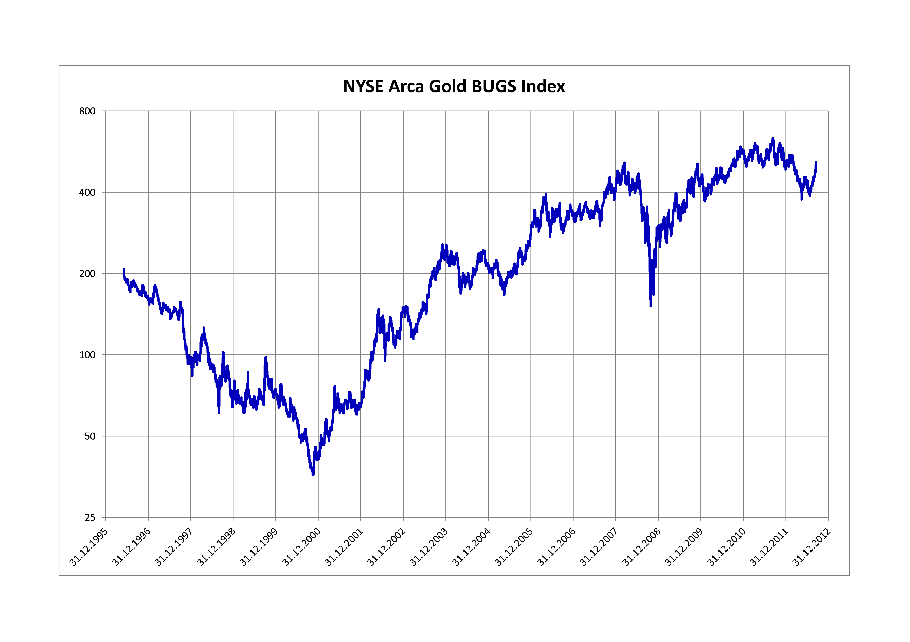

## Table of Contents

## What is the NYSE Arca Gold BUGS Index?

The NYSE Arca Gold BUGS Index, often just called the HUI Index, is a stock market index that tracks the performance of gold mining companies. It was created to give investors an idea of how well companies that mine gold are doing. The index includes companies that are mainly focused on finding and extracting gold from the ground. This means it can be a good way for people to see how the gold mining industry is doing without having to look at each company separately.

The HUI Index is important because it helps investors understand trends in the gold mining sector. When the price of gold goes up, the companies in the index usually do well because they can sell their gold for more money. But if the price of gold goes down, these companies might struggle. The index is watched closely by people who invest in gold or gold mining stocks because it can show them when it might be a good time to buy or sell these stocks.

## How is the NYSE Arca Gold BUGS Index calculated?

The NYSE Arca Gold BUGS Index, or HUI Index, is calculated by looking at the stock prices of a group of gold mining companies. The index uses a method called market capitalization weighting. This means that companies with a bigger total value, or market cap, have a bigger effect on the index's value. The index starts with a base value, and then it goes up or down based on how the stock prices of these companies change.

To keep the index fair and up to date, it is adjusted from time to time. This can happen if a company in the index gets bought by another company, or if a new company starts mining gold and becomes important enough to be included. These adjustments help make sure the index still represents the overall health of the gold mining industry. By tracking these changes, the HUI Index gives investors a clear picture of how gold mining stocks are doing as a group.

## What does BUGS stand for in the NYSE Arca Gold BUGS Index?

In the NYSE Arca Gold BUGS Index, BUGS stands for "Basket of Unhedged Gold Stocks." This means the index includes gold mining companies that do not use financial strategies to protect against falling gold prices. These companies are fully exposed to changes in the price of gold, which can make their stocks go up or down a lot.

The term "unhedged" is important because it shows that these companies are betting on gold prices going up. If gold prices do go up, these companies can make a lot more money. But if gold prices go down, they can lose a lot of money too. This makes the HUI Index a good way to see how the gold mining industry is doing without any financial tricks.

## What types of companies are included in the NYSE Arca Gold BUGS Index?

The NYSE Arca Gold BUGS Index includes companies that focus on mining gold. These companies are mainly involved in finding and extracting gold from the ground. They are called "unhedged" because they do not use financial strategies to protect against falling gold prices. This means their success depends a lot on how the price of gold changes.

The index is made up of companies that are big enough and important enough in the gold mining industry to be included. These companies can be from different countries, but they all have one thing in common: they mine gold and do not hedge against price changes. By looking at the performance of these companies, the index gives investors a clear picture of how the gold mining sector is doing overall.

## How does the NYSE Arca Gold BUGS Index differ from other gold indices?

The NYSE Arca Gold BUGS Index, or HUI Index, is different from other gold indices because it only includes companies that mine gold and do not use financial strategies to protect against falling gold prices. These companies are called "unhedged," which means their success depends a lot on how the price of gold changes. Other gold indices might include companies that use hedging strategies or might even include companies that deal with other precious metals like silver or platinum. The HUI Index focuses just on gold and the companies that are fully exposed to its price movements.

Another way the HUI Index differs is that it is weighted by market capitalization. This means that bigger companies have a bigger effect on the index's value. Some other gold indices might use different methods, like equal weighting, where each company has the same effect on the index no matter its size. By focusing on unhedged gold mining companies and using market cap weighting, the HUI Index gives investors a clear and specific view of how the gold mining industry is doing without any financial tricks.

## What is the historical performance of the NYSE Arca Gold BUGS Index?

The NYSE Arca Gold BUGS Index, also known as the HUI Index, has had ups and downs over the years, just like the price of gold. When gold prices go up, the HUI Index usually goes up too because the companies in the index make more money selling their gold. For example, during the early 2000s, when gold prices started to climb from around $250 per ounce, the HUI Index also saw big gains. By the end of 2011, gold prices hit about $1,800 per ounce, and the HUI Index reached its highest point ever. But when gold prices started to fall after that, the HUI Index also went down.

The HUI Index can be very volatile, meaning it can change a lot in a short time. This is because the companies in the index are unhedged, so they feel the full impact of gold price changes. During times of economic uncertainty or when investors are worried, gold prices can go up quickly, and the HUI Index can follow. For instance, during the financial crisis in 2008, the HUI Index saw big swings as gold prices went up and down. Overall, the HUI Index gives investors a way to see how gold mining companies are doing over time, but it can be a bumpy ride.

## How can investors use the NYSE Arca Gold BUGS Index to make investment decisions?

Investors can use the NYSE Arca Gold BUGS Index, or HUI Index, to get a sense of how gold mining companies are doing. Since the index only includes companies that mine gold and do not use financial strategies to protect against falling gold prices, it gives a clear picture of the gold mining industry's health. If the HUI Index is going up, it might be a good time for investors to buy stocks in gold mining companies because it suggests that gold prices are rising and these companies are doing well. On the other hand, if the HUI Index is going down, it might be a sign that gold prices are falling, and investors might want to sell their gold mining stocks or wait for a better time to buy.

The HUI Index can also help investors understand market trends. For example, if the index is moving a lot, it shows that the gold mining sector is volatile. This can be useful information for investors who like to take risks or those who prefer to be more cautious. By watching the HUI Index over time, investors can spot patterns and make smarter choices about when to buy or sell gold mining stocks. It's a tool that can help investors stay informed and make decisions based on how the gold market is behaving.

## What are the key factors that influence the NYSE Arca Gold BUGS Index?

The main thing that affects the NYSE Arca Gold BUGS Index, or HUI Index, is the price of gold. When gold prices go up, the companies in the index usually do well because they can sell their gold for more money. This makes the index go up too. But if gold prices go down, these companies might struggle, and the index will go down. Since the companies in the HUI Index don't use financial tricks to protect against falling gold prices, they feel the full impact of these changes.

Another important [factor](/wiki/factor-investing) is how well the gold mining companies are doing at finding and getting gold out of the ground. If they are good at this, they can produce more gold and make more money, which can make the HUI Index go up. But if they have problems, like high costs or trouble finding new gold, the index might go down. Also, things like economic uncertainty or big events in the world can make investors want to buy gold, which can push up the price of gold and help the HUI Index.

## How does the NYSE Arca Gold BUGS Index correlate with the price of gold?

The NYSE Arca Gold BUGS Index, or HUI Index, is closely tied to the price of gold. When the price of gold goes up, the HUI Index usually goes up too. This is because the index includes companies that mine gold and don't use financial tricks to protect against falling gold prices. So, when gold prices rise, these companies make more money selling their gold, which makes their stock prices go up and pushes the HUI Index higher.

On the other hand, when the price of gold goes down, the HUI Index often goes down as well. Since the companies in the index are fully exposed to changes in gold prices, they feel the full impact when prices drop. This means their profits go down, which can make their stock prices fall and pull the HUI Index down. So, the HUI Index is a good way to see how the gold mining industry is doing based on what's happening with the price of gold.

## What are the risks associated with investing in funds that track the NYSE Arca Gold BUGS Index?

Investing in funds that track the NYSE Arca Gold BUGS Index can be risky because the index is closely tied to the price of gold. When gold prices go up and down a lot, the companies in the index feel the full impact because they don't use financial tricks to protect against falling prices. This means the value of the funds can change a lot in a short time, which can be scary for investors who don't like a lot of ups and downs in their investments.

Another risk is that the companies in the HUI Index might have problems finding or getting gold out of the ground. If they have high costs or trouble finding new gold, they might not make as much money as expected. This can make their stock prices go down, which would make the funds that track the HUI Index go down too. So, investors need to be ready for the possibility that the funds might not do as well as they hope if the gold mining companies run into trouble.

## How has the composition of the NYSE Arca Gold BUGS Index changed over time?

The NYSE Arca Gold BUGS Index, or HUI Index, has changed a lot over the years because the gold mining industry keeps changing. When the index first started, it had a certain group of gold mining companies. But as time went on, some companies got bigger and more important, while others got smaller or stopped mining gold. This means the index had to change to keep showing a good picture of the gold mining industry. Sometimes, new companies that started mining gold got added to the index, and other times, companies that were already in the index got taken out if they weren't as important anymore.

The way the HUI Index is put together also changes to make sure it's fair and up to date. If a company in the index gets bought by another company, or if it starts doing something other than mining gold, the index might need to be adjusted. These changes help make sure the index still represents the overall health of the gold mining industry. By keeping the index updated, it stays a good tool for investors to see how gold mining companies are doing without any financial tricks.

## What advanced strategies can be employed using the NYSE Arca Gold BUGS Index for portfolio diversification?

Investors can use the NYSE Arca Gold BUGS Index, or HUI Index, to diversify their portfolios by adding exposure to the gold mining sector. Since the HUI Index tracks unhedged gold mining companies, it can help balance out a portfolio that is heavy in other types of investments like stocks or bonds. When the stock market goes down, gold prices often go up because people see gold as a safe place to put their money. By adding a fund that tracks the HUI Index, investors can protect their portfolios from big drops in the stock market. This way, if other parts of their portfolio go down, the gold mining part might go up and help soften the blow.

Another advanced strategy is using the HUI Index to take advantage of trends in the gold market. Investors can watch the HUI Index to see when gold prices are going up or down. If they think gold prices will keep going up, they can buy more of the funds that track the HUI Index. But if they think gold prices will go down, they might sell some of their gold mining investments or even use financial tools like options to protect against losses. This active management can help investors make the most of the ups and downs in the gold market, but it also means they need to keep a close eye on what's happening and be ready to make quick decisions.

## References & Further Reading

[1]: Bergstra, J., Bardenet, R., Bengio, Y., & Kégl, B. (2011). ["Algorithms for Hyper-Parameter Optimization."](https://dl.acm.org/doi/10.5555/2986459.2986743) Advances in Neural Information Processing Systems 24.

[2]: ["Advances in Financial Machine Learning"](https://www.amazon.com/Advances-Financial-Machine-Learning-Marcos/dp/1119482089) by Marcos Lopez de Prado

[3]: ["Evidence-Based Technical Analysis: Applying the Scientific Method and Statistical Inference to Trading Signals"](https://www.amazon.com/Evidence-Based-Technical-Analysis-Scientific-Statistical/dp/0470008741) by David Aronson

[4]: ["Machine Learning for Algorithmic Trading"](https://github.com/stefan-jansen/machine-learning-for-trading) by Stefan Jansen

[5]: ["Quantitative Trading: How to Build Your Own Algorithmic Trading Business"](https://www.amazon.com/Quantitative-Trading-Build-Algorithmic-Business/dp/1119800064) by Ernest P. Chan