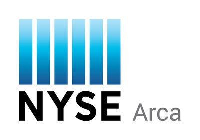

## Table of Contents

## What is NYSE Arca?

NYSE Arca is a stock exchange in the United States. It is part of the New York Stock Exchange (NYSE) group. NYSE Arca is known for trading many different types of financial products, like stocks, exchange-traded funds (ETFs), and options. It was originally called the ArcaEx, which stood for Archipelago Exchange, before it was bought by the NYSE in 2006.

The exchange is popular because it uses electronic trading. This means that all buying and selling happens on computers, which makes it fast and efficient. Many investors and traders use NYSE Arca because it offers a wide variety of products and has good technology. It helps people trade easily and quickly, which is important in the fast-paced world of finance.

## How does NYSE Arca differ from the New York Stock Exchange (NYSE)?

NYSE Arca and the New York Stock Exchange (NYSE) are both part of the same group, but they have some differences. NYSE Arca focuses more on electronic trading. This means that all the buying and selling of stocks, ETFs, and other products happen on computers. It's fast and efficient. On the other hand, the NYSE is famous for its traditional trading floor where people shout and use hand signals to buy and sell stocks. Even though the NYSE uses computers too, it's known for its human traders.

Another difference is the types of products they trade. NYSE Arca is known for trading a wide variety of financial products, including ETFs and options. It's a popular choice for investors who want to trade these specific products. The NYSE, while also trading ETFs and options, is more focused on traditional stocks of big companies. So, if you're looking to trade a diverse set of financial products quickly, NYSE Arca might be the better choice, but if you're interested in the stocks of well-known companies, the NYSE could be more suitable.

## What types of securities are traded on NYSE Arca?

NYSE Arca trades many different types of securities. You can find stocks on NYSE Arca, which are shares in companies that people can buy and sell. Another big type of security traded on NYSE Arca is exchange-traded funds (ETFs). ETFs are like baskets of stocks or other assets that you can trade just like a single stock. They are popular because they let you invest in a lot of things at once.

In addition to stocks and ETFs, NYSE Arca also trades options. Options are agreements that give you the right to buy or sell a stock at a certain price before a certain time. They can be used for different investment strategies. NYSE Arca is known for having a wide variety of these securities, which makes it a good place for investors who want to trade many different types of financial products.

## When was NYSE Arca established?

NYSE Arca was first established in 1997. It started as the Archipelago Exchange, which people called ArcaEx for short. This was a new kind of stock exchange that used computers to trade stocks, ETFs, and other financial products. It was different because it did not have a physical trading floor like the New York Stock Exchange.

In 2006, the New York Stock Exchange bought the Archipelago Exchange and renamed it NYSE Arca. Since then, NYSE Arca has been a part of the NYSE group. It is known for its electronic trading system, which makes buying and selling fast and easy. Many investors use NYSE Arca because it offers a wide variety of financial products to trade.

## How can someone start trading on NYSE Arca?

To start trading on NYSE Arca, you first need to open a brokerage account. A brokerage account is like a special bank account where you can buy and sell stocks, ETFs, and other financial products. You can open a brokerage account with a company that lets you trade on NYSE Arca. Some popular companies that offer this service are Fidelity, Charles Schwab, and E*TRADE. When you open your account, you'll need to provide some personal information and maybe some money to start trading.

Once your brokerage account is set up, you can start trading on NYSE Arca. You'll use the brokerage company's website or app to place your trades. You can search for the stocks, ETFs, or options you want to buy or sell. When you find what you want, you can enter how many shares you want to trade and at what price. The computer system of NYSE Arca will then match your order with someone else's order, and the trade will happen quickly. It's important to learn about the financial products you're trading and to be careful with your money.

## What are the trading hours for NYSE Arca?

NYSE Arca is open for trading from 9:30 AM to 4:00 PM Eastern Time, Monday through Friday. These are the regular trading hours when most people buy and sell stocks, ETFs, and other products on the exchange.

There is also something called pre-market and after-hours trading. Pre-market trading starts at 4:00 AM and goes until the regular trading hours begin at 9:30 AM. After-hours trading starts right after the regular trading hours end at 4:00 PM and can go until 8:00 PM. During these times, you can still trade, but the market might be less active, and prices can be different from the regular trading hours.

## What are the listing requirements for companies on NYSE Arca?

To list on NYSE Arca, a company needs to meet certain rules. They need to have enough shares available for the public to buy. This means they should have at least 1.1 million shares of stock that people can trade. Also, the company should have a lot of shareholders, at least 400, who own at least 100 shares each. This helps make sure there are enough people interested in trading the company's stock.

Another important rule is about the price of the stock. The stock needs to be worth at least $4 per share. This helps make sure the stock is valuable enough for people to want to trade it. The company also needs to show that it is doing well financially. They need to have made at least $750,000 in earnings before taxes over the last three years, with at least $250,000 in the most recent year. This shows that the company is stable and likely to keep doing well in the future.

## How does NYSE Arca handle market volatility?

NYSE Arca uses special rules to help handle market [volatility](/wiki/volatility-trading-strategies). When the market moves a lot very quickly, they might use something called a "circuit breaker." This is like a pause button. If a stock's price goes up or down too fast, trading stops for a little while. This gives everyone a chance to calm down and look at the information again before they start trading again. It helps stop the market from getting too crazy.

Another way NYSE Arca handles volatility is by using something called "price bands." These are limits on how much a stock's price can change in a short time. If the price tries to go outside these bands, the exchange might slow down the trading or stop it for a bit. This helps keep the market stable and makes sure that prices don't jump around too much without a good reason. By using these tools, NYSE Arca tries to keep trading fair and orderly, even when the market is moving a lot.

## What technological innovations has NYSE Arca implemented to improve trading?

NYSE Arca has made trading better by using new technology. They use a system called the "ArcaBook" which is like a big list that keeps track of all the orders to buy and sell stocks. This system helps make trading fast and fair because it shows everyone the same information at the same time. Another cool thing they use is called "ArcaVision," which is a tool that lets traders see what's happening in the market in real-time. This helps them make smart choices quickly.

They also have something called the "Arca Edge" which is a special way to match orders that makes trading even faster. This system looks at all the orders and finds the best matches, so trades happen quickly and at the best prices. By using these technologies, NYSE Arca makes sure that trading is smooth and efficient, which is really important for people who want to buy and sell stocks, ETFs, and other financial products.

## How does NYSE Arca ensure fair and transparent trading practices?

NYSE Arca makes sure trading is fair and clear by using special rules and technology. They use a system called the "ArcaBook" which keeps track of all the orders to buy and sell. This system shows everyone the same information at the same time, so no one gets special treatment. They also have "price bands" which stop the price of a stock from changing too fast. If the price tries to go outside these bands, trading might slow down or stop for a bit. This helps keep the market calm and fair for everyone.

Another way NYSE Arca keeps trading fair is by using "circuit breakers." These are like pause buttons that stop trading if a stock's price moves too much too quickly. This gives everyone a chance to look at the information again before trading starts again. It helps stop the market from getting too wild. By using these tools, NYSE Arca makes sure that trading is honest and open, which is important for people who want to buy and sell stocks, ETFs, and other financial products.

## What role does NYSE Arca play in the global financial market?

NYSE Arca is an important part of the global financial market because it helps people from all over the world trade different kinds of financial products. It is known for trading stocks, exchange-traded funds (ETFs), and options. Because it uses electronic trading, it makes buying and selling fast and easy. This means that investors and traders from different countries can quickly trade with each other. NYSE Arca is also part of the New York Stock Exchange group, which is one of the biggest and most famous stock exchanges in the world. This connection helps NYSE Arca have a big impact on the global market.

NYSE Arca's role in the global financial market is also important because it offers a wide variety of financial products. This variety attracts investors from all over the world who want to trade different kinds of securities. By providing a place where people can trade quickly and efficiently, NYSE Arca helps keep the global market moving smoothly. It also uses special rules and technology to make sure trading is fair and clear for everyone. This helps build trust in the market, which is important for keeping the global financial system stable and working well.

## What are some of the major milestones in the history of NYSE Arca?

NYSE Arca started in 1997 as the Archipelago Exchange, or ArcaEx for short. It was different because it used computers to trade stocks, ETFs, and other financial products. This was a new way of trading that did not need a physical trading floor like the New York Stock Exchange. In 2006, the New York Stock Exchange bought the Archipelago Exchange and renamed it NYSE Arca. This was a big step because it made NYSE Arca part of one of the biggest stock exchange groups in the world.

Since becoming part of the NYSE group, NYSE Arca has grown a lot. It has become known for its electronic trading system, which makes buying and selling fast and easy. NYSE Arca also started using special tools like the "ArcaBook" and "ArcaVision" to help traders see what's happening in the market in real-time. These tools help make trading fair and clear for everyone. Over the years, NYSE Arca has played a big role in the global financial market by offering a wide variety of financial products and helping people from all over the world trade with each other.

## References & Further Reading

[1]: Hasbrouck, J., & Saar, G. (2013). ["Low-latency trading."](https://www.sciencedirect.com/science/article/abs/pii/S1386418113000165) The Review of Financial Studies, 26(9), 2095-2136.

[2]: Ding, S., Hanna, J., & Hendershott, T. (2014). ["How slow is the NBBO? A comparison with direct exchange feeds."](https://onlinelibrary.wiley.com/doi/10.1111/fire.12037) Financial Review, 49(2), 313-332.

[3]: Foucault, T., Hombert, J., & Roşu, I. (2016). ["News trading and speed."](https://www.jstor.org/stable/43869102) The Review of Financial Studies, 29(12), 3380–3424.

[4]: Jones, C. M. (2013). ["What do we know about high-frequency trading?"](https://papers.ssrn.com/sol3/papers.cfm?abstract_id=2236201) Columbia Business School Research Paper.

[5]: Hendershott, T., & Moulton, P. C. (2011). ["Automation, speed, and stock market quality: The NYSE's Hybrid."](https://www.sciencedirect.com/science/article/pii/S138641811100005X) Journal of Financial Markets, 14(4), 568-604.

[6]: Arnoldi, J. (2016). ["Computer algorithms as markets."](https://journals.sagepub.com/doi/10.1177/0263276414566642) Acta Sociologica, 59(4), 321-335.

[7]: "Dark Pools, Flash Orders, High-Frequency Trading, and Algorithmic Trading: New Thinking on an Old Problem." Journal of Trading, Winter 2011, by Larry Harris.

[8]: Aldridge, I. (2013). ["High-Frequency Trading: A Practical Guide to Algorithmic Strategies and Trading Systems."](https://www.amazon.com/High-Frequency-Trading-Practical-Algorithmic-Strategies/dp/1118343506) Wiley Finance.

[9]: Vaananen, L. (2013). ["Electronic trading in financial markets."](https://www.researchgate.net/publication/3426629_Electronic_trading_in_financial_markets) Bank of England Quarterly Bulletin. 

[10]: McGowan, M. J. (2010). The rise of computerized high-frequency trading: Use and controversy. Duke University School of Law.