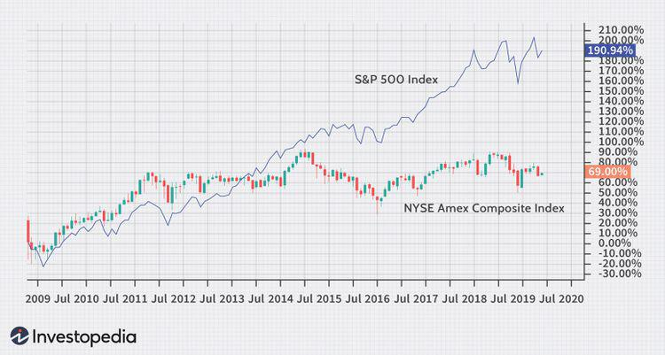

The financial markets are intricate and constantly changing, a vast network of trading activities undergoing perpetual evolution. This evolution has largely been shaped by technological advancements, with algorithmic trading emerging as a powerful force. Algorithmic trading employs complex computer algorithms to execute trades at speeds and frequencies impossible for human traders. This technological innovation allows investors to engage with markets with unprecedented swiftness and efficiency, reducing transaction costs and improving market liquidity.

An essential measure of market performance within this dynamic environment is the NYSE Composite Index. This index aggregates the performance of all common stocks listed on the New York Stock Exchange (NYSE), acting as a significant barometer for market health. By encompassing a wide array of financial instruments such as common stocks, American Depositary Receipts (ADRs), and Real Estate Investment Trusts (REITs), the NYSE Composite Index provides a comprehensive view of market performance, impacted by both domestic and international market dynamics.



In this article, the relationship between the NYSE Composite Index and algorithmic trading is examined. Algorithmic trading has revolutionized interactions with financial markets, altering the landscape in which indices like the NYSE Composite operate. Understanding this interplay is crucial for comprehending modern market phenomena and anticipating future trends as technology continues to advance and reshape financial markets.

## Table of Contents

## What is the NYSE Composite Index?

The NYSE Composite Index serves as a comprehensive barometer reflecting the performance of all securities actively traded on the New York Stock Exchange (NYSE). Its broad scope encompasses a diverse array of assets, including common stocks, American Depositary Receipts (ADRs), Real Estate Investment Trusts (REITs), and investment funds. This diversity allows the index to present a holistic view of market performance, representing industries from around the globe.

The construction of the NYSE Composite Index is based on a market capitalization weighting methodology. This means that the influence of each constituent within the index is proportional to its total market value—a metric calculated by multiplying the share price by the total number of outstanding shares. This approach ensures that companies with larger market capitalizations have a greater impact on the index's movements, reflecting their dominance in this financial market environment.

By including this extensive range of securities and utilizing a market capitalization-weighted structure, the NYSE Composite Index provides market participants with a reliable and comprehensive representation of the overall health and performance of companies listed on the NYSE. This index is beneficial for investors seeking to understand market trends, as it embodies a wide cross-section of industries, both domestic and international, making it an invaluable tool for financial analysis and economic forecasting.

## Importance of the NYSE Composite Index

The NYSE Composite Index plays a critical role in providing a comprehensive overview of market activity on the New York Stock Exchange. This index is composed of all common stocks listed on the NYSE, encompassing a wide spectrum of industries and asset types, including American Depository Receipts (ADRs) and Real Estate Investment Trusts (REITs). The index's extensive range of constituents allows it to serve as a robust indicator of broader market trends and performance.

The diversity inherent in the NYSE Composite Index offers substantial insight into both domestic and international sectors. Many of the companies listed on the NYSE are multinational corporations, contributing to the significant presence of foreign companies within the index. This international exposure provides market analysts and investors with valuable perspectives on global economic conditions and cross-border financial dynamics.

The weighting methodology based on market capitalization further enhances the NYSE Composite's representativeness. Larger companies have a proportionately greater influence on the index's overall performance, aligning the index closely with movements that reflect major shifts in the marketplace. Consequently, the NYSE Composite offers an in-depth view of financial health and investor sentiment, capturing the effects of significant market events and economic indicators.

Moreover, the NYSE is known for its stringent listing standards, which mandate financial transparency, operational viability, and governance practices that uphold certain levels of quality and accountability. Consequently, the companies that form the NYSE Composite Index usually have withstood rigorous evaluations, ensuring that the index is composed of financially sound entities with established reputations. This reliability provides market participants with confidence in the index as a credible measure of market performance, distinguishing it from other indices with less stringent inclusion criteria.

In summary, the NYSE Composite Index's broad and diverse makeup, coupled with its stringent listing criteria, makes it an indispensable tool for market analysts seeking to interpret market trends and economic conditions. Its comprehensive scope provides unique insights into the interplay between domestic and international financial activities, while its credibility is assured through adherence to rigorous standards.

## Algorithmic Trading: An Overview

Algorithmic trading, often known as algo trading, automates the trading process using computer programs to execute orders at a pace and frequency unattainable by human traders. At its core, [algorithmic trading](/wiki/algorithmic-trading) relies on algorithms, which are sets of predefined instructions for executing trades. These algorithms assess various market parameters such as price, timing, and [volume](/wiki/volume-trading-strategy), enabling traders to implement strategies systematically and consistently.

A primary advantage of algorithmic trading is speed. Highly complex algorithms manage transactions at lightning speed, often within milliseconds. This swiftness not only captures market opportunities as they arise but also enhances the market's overall [liquidity](/wiki/liquidity-risk-premium). For instance, an algorithm may decide to sell stocks if a certain percentage price change occurs, thereby facilitating quick responses to market movements.

Another significant benefit is efficiency. Algorithms streamline the trading process by executing trades automatically based on input criteria, which negates the need for manual intervention. This automation minimizes processing delays, reduces transaction costs, and allows for the management of multiple accounts and strategies simultaneously.

Moreover, algorithmic trading effectively eliminates emotional biases inherent in human decision-making. Emotions such as fear or greed can lead traders to make irrational decisions that deviate from established strategies. By contrast, algorithms operate strictly according to predefined rules without succumbing to psychological influences.

In terms of operation, a typical algorithmic trading system involves several key components. First, data feeds provide real-time market information. The algorithm then processes this data based on the chosen trading strategy, which might include factors such as [arbitrage](/wiki/arbitrage) opportunities, [trend following](/wiki/trend-following), or market-making. Once a trading signal is generated, the system interfaces with brokerage platforms to execute the trade. 

Consider the following simplified Python example that demonstrates the basic workings of an algorithm designed for moving average crossover — a popular strategy among traders:

```python
import pandas as pd

# Sample data
data = {'price': [110, 115, 112, 120, 125, 130, 128]}
df = pd.DataFrame(data)

# Calculate moving averages
df['ma_short'] = df['price'].rolling(window=3).mean()
df['ma_long'] = df['price'].rolling(window=5).mean()

# Generate signals
df['signal'] = 0
df.loc[df['ma_short'] > df['ma_long'], 'signal'] = 1
df.loc[df['ma_short'] <= df['ma_long'], 'signal'] = -1

# Display the signals
print(df)
```

In this example, the algorithm calculates short-term and long-term moving averages from the price data. When the short-term moving average surpasses the long-term one, a buy signal is generated; if it dips below, a sell signal is indicated.

Overall, algorithmic trading offers potent advantages for traders and investors, including enhanced efficiency, reduced transaction costs, and the mitigation of human error. As technology advances, the reliance on algorithmic trading is expected to grow, further shaping the landscape of financial markets.

## Impact of Algorithmic Trading on the NYSE Composite Index

Algorithmic trading, characterized by the use of complex mathematical models and high-speed computational capabilities to execute trades, has had a notable impact on the NYSE Composite Index. The integration of sophisticated algorithms into trading practices has led to increased trading volumes and enhanced liquidity on major exchanges such as the New York Stock Exchange (NYSE). According to the Securities Industry and Financial Markets Association (SIFMA), approximately 70-80% of the equities trading within the US is attributed to algorithmic trading, representing its pervasive influence on the market (SIFMA, 2021).

One of the primary benefits of algorithmic trading is its contribution to market accuracy and price discovery. By executing trades at speeds and volumes beyond human capability, algorithms can quickly assimilate information and adjust to new market realities. This rapid response ability helps maintain tighter bid-ask spreads, thereby allowing more precise reflections of a stock's true intrinsic value in the NYSE Composite Index. For instance, the implementation of [statistical arbitrage](/wiki/statistical-arbitrage) models enables traders to exploit price discrepancies between correlated financial instruments, effectively tightening spreads and enhancing index accuracy.

Algorithmic trading also improves liquidity by facilitating a more consistent flow of buy and sell orders. High-frequency trading ([HFT](/wiki/high-frequency-trading-strategies)), a subset of algorithmic trading, is particularly instrumental in this regard. HFT algorithms can execute thousands of trades within fractions of a second, ensuring that there are always buyers and sellers in the market. This constant activity reduces the impact of large trades on security prices, minimizing [volatility](/wiki/volatility-trading-strategies), and fostering an environment where assets can be bought or sold with minimal price fluctuation.

Despite these advantages, the dominance of algorithmic trading raises concerns about market stability and fairness, particularly for participants who do not have access to such technology. The Flash Crash of 2010 serves as a significant example; the event involved automated selling by trading algorithms, which resulted in a severe and rapid market downturn, highlighting potential vulnerabilities in algorithm-triggered trading. Moreover, the speed and complexity of algorithmic strategies can create an uneven playing field, where institutional players with advanced technology have a distinct advantage over smaller market participants. These discrepancies underscore the need for effective regulatory frameworks to ensure a fair trading environment. 

In conclusion, while algorithmic trading enhances the NYSE Composite Index's efficiency and liquidity, its influence necessitates careful management to mitigate risks associated with market stability and equity among traders.

## The Future of AI in Financial Markets

Artificial Intelligence (AI) is increasingly becoming a cornerstone of innovation in financial markets, automating tasks that were once manual and providing solutions to complex trading challenges. The adoption of AI in these markets presents a multitude of potential benefits, alongside significant risks, particularly in automated trading and regulatory oversight.

AI enhances trading algorithms by introducing capabilities such as pattern recognition, natural language processing, and predictive analytics. These technologies enable more sophisticated and adaptive trading strategies, which can react to market changes with unprecedented speed and accuracy. Furthermore, AI can process vast amounts of data in real-time, allowing for efficient market analysis and enhanced price discovery. As a result, AI-driven trading algorithms are positioned to transform market operations by optimizing trade execution and increasing liquidity across exchanges like the New York Stock Exchange (NYSE).

However, the integration of AI into trading systems is not without challenges. The complexity of AI models introduces risks related to understanding and interpreting their decisions, often referred to as the "black box" problem. This opacity can lead to difficulties in predicting system behaviors in volatile market conditions. Additionally, the rapid execution capabilities of AI could exacerbate market instability through phenomena such as flash crashes. Regulators face the formidable task of crafting guidelines that ensure market stability while fostering technological innovation. Ensuring fair access to markets for both algorithmic and non-algorithmic participants remains a priority in maintaining an equitable trading environment.

The future trends in AI adoption suggest a continued trajectory towards deeper market integration. Machine learning, a subset of AI, offers the potential to refine predictive models continuously and adapt to new market dynamics autonomously. As these models grow more advanced, their application could extend beyond traditional trading to areas such as risk management, fraud detection, and personalized financial services.

With respect to indices like the NYSE Composite Index, AI's influence could manifest in improved index tracking and enhanced constituent analysis. AI could provide more accurate reflections of market conditions by swiftly incorporating new information into pricing models. Moreover, as AI capabilities advance, they could facilitate more nuanced approaches to index composition analysis, potentially reshaping how indices are structured and understood.

In summary, while AI holds transformative potential for financial markets, its deployment necessitates careful consideration of associated risks and robust regulatory frameworks. The balance between innovation and oversight will be crucial in shaping the future landscape of AI in finance, ensuring that the benefits of technological advancement are realized without compromising market integrity.

## Conclusion

The New York Stock Exchange (NYSE) Composite Index serves as a comprehensive measure of market performance, reflecting the dynamic nature of a wide range of securities from various sectors. Algorithmic trading has played a pivotal role in enhancing the performance and efficiency of the NYSE Composite Index. By leveraging sophisticated algorithms, traders can execute large volumes of transactions with high speed and accuracy, contributing to improved market liquidity and efficient price discovery. However, this technological advancement also presents challenges for market stability, particularly concerning market volatility and the potential for flash crashes.

As the financial markets increasingly integrate AI and [machine learning](/wiki/machine-learning) technologies, the potential for innovations in trading algorithms is vast. AI could enhance predictive modeling, allowing for more accurate forecasting of market trends and potentially reducing systemic risks. However, the adoption of AI brings with it challenges in terms of regulatory oversight and ethical considerations. Ensuring that these advanced technologies do not unfairly disadvantage non-algorithmic traders or lead to market manipulation is crucial.

Oversight and regulatory frameworks must evolve to address the issues posed by algorithmic and AI-driven trading. Regulators need to ensure transparency and fairness to maintain investor confidence and market integrity. This includes implementing measures to prevent unethical practices, such as spoofing and layering, and ensuring a balanced trading environment for all participants.

In conclusion, the synergy between the NYSE Composite Index and algorithmic trading exemplifies the broader trends in financial market evolution. The integration of AI holds promise for further innovation, but it necessitates continuous oversight and regulatory updates to navigate the accompanying risks and maintain stable trading conditions. The future of financial markets will likely see increased AI influence, necessitating adaptive frameworks to uphold fair and efficient market operations.

## References & Further Reading

[1]: Lopez de Prado, M. (2018). ["Advances in Financial Machine Learning."](https://www.amazon.com/Advances-Financial-Machine-Learning-Marcos/dp/1119482089) Wiley.

[2]: Aronson, D. (2007). ["Evidence-Based Technical Analysis: Applying the Scientific Method and Statistical Inference to Trading Signals."](https://www.amazon.com/Evidence-Based-Technical-Analysis-Scientific-Statistical/dp/0470008741) Wiley.

[3]: Jansen, S. (2020). ["Machine Learning for Algorithmic Trading: Second Edition."](https://github.com/stefan-jansen/machine-learning-for-trading) Packt Publishing.

[4]: Chan, E. P. (2008). ["Quantitative Trading: How to Build Your Own Algorithmic Trading Business."](https://github.com/ftvision/quant_trading_echan_book) Wiley.

[5]: SIFMA. (2021). ["US Equity Market Structure Primer: Algorithmic Trading and Market Liquidity."](https://www.sifma.org/resources/news/blog/an-analysis-of-us-equity-market-structure/) Securities Industry and Financial Markets Association.