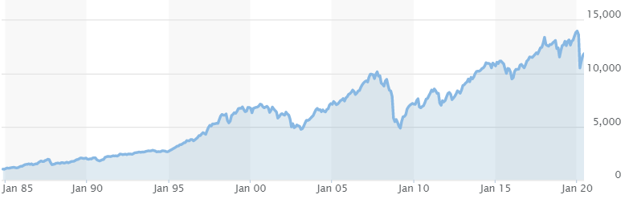

## Table of Contents

## What is the NYSE Composite Index?

The NYSE Composite Index is a stock market index that shows how well companies listed on the New York Stock Exchange (NYSE) are doing. It includes all the common stocks and some preferred stocks that are traded on the NYSE. This index gives investors a broad view of the overall performance of the market because it covers a wide range of industries and company sizes.

The index is useful for people who want to understand the general trend of the stock market. It helps them see if the market is going up or down. The NYSE Composite Index is often used as a benchmark to compare the performance of individual stocks or other investment portfolios. By tracking this index, investors can make better decisions about buying or selling stocks.

## How is the NYSE Composite Index calculated?

The NYSE Composite Index is calculated by taking the total market value of all the stocks included in the index. This means adding up the value of all the shares of each company that is part of the index. The value of each company's shares is found by multiplying the number of shares by the current price of each share. This total market value is then divided by a special number called the divisor. The divisor is adjusted over time to account for changes like stock splits or new companies being added to the index.

The result of this calculation gives the value of the NYSE Composite Index at any given time. This value changes throughout the trading day as the prices of the stocks go up or down. By comparing the current value of the index to its value at other times, investors can see how the overall market is performing. This helps them understand whether the market is doing well or not, and make decisions about their investments.

## What types of companies are included in the NYSE Composite Index?

The NYSE Composite Index includes a wide variety of companies that are listed on the New York Stock Exchange. This means it has companies from many different industries, like technology, healthcare, finance, and more. The index covers both big and small companies, so it gives a good overall picture of how the market is doing.

Not only does the NYSE Composite Index include common stocks, but it also has some preferred stocks. Common stocks are the regular shares that most people think of when they talk about buying stocks. Preferred stocks are a bit different because they usually pay a fixed dividend and have some other special features. By including both types of stocks, the index shows a complete view of the NYSE's performance.

## How does the NYSE Composite Index differ from other major indices like the S&P 500?

The NYSE Composite Index and the S&P 500 are both stock market indices, but they cover different sets of companies. The NYSE Composite Index includes all common and some preferred stocks listed on the New York Stock Exchange. This means it has a very broad range of companies from all different industries and sizes. On the other hand, the S&P 500 only includes 500 of the largest companies in the U.S. These companies are chosen based on their market size, [liquidity](/wiki/liquidity-risk-premium), and industry representation, making the S&P 500 a bit more selective.

Another key difference is how these indices are used. The NYSE Composite Index gives investors a broad view of the overall performance of the NYSE. It's a good tool for understanding the general trend of the market because it includes so many different types of companies. The S&P 500, however, is often used as a benchmark for the U.S. stock market as a whole. Many investors and financial professionals use it to compare the performance of their own investments or portfolios. So while the NYSE Composite Index is more comprehensive, the S&P 500 is more focused and widely recognized.

## What is the historical performance of the NYSE Composite Index?

The NYSE Composite Index has a long history that goes back many years. Over time, it has gone through many ups and downs, just like the economy and the stock market. During good economic times, the index often goes up because companies are doing well and people are buying more stocks. But during tough times, like during recessions, the index can go down a lot because people are worried and selling their stocks. For example, the index saw big drops during the financial crisis in 2008 and the early days of the COVID-19 pandemic in 2020. But it also recovered and grew after these tough times.

Looking at the long term, the NYSE Composite Index has generally gone up over many years. This shows that, despite short-term problems, the stock market can grow over time. Investors who hold onto their investments for a long time can often see good returns. But it's important to remember that past performance doesn't tell us exactly what will happen in the future. The index can still go up and down, and it's always a good idea for investors to keep an eye on the market and think about their own goals and how much risk they are willing to take.

## How can investors use the NYSE Composite Index to gauge market performance?

Investors can use the NYSE Composite Index to get a good idea of how the stock market is doing overall. The index includes stocks from all kinds of companies that are listed on the New York Stock Exchange. So, when the NYSE Composite Index goes up, it usually means that a lot of companies are doing well and the market is in a good place. On the other hand, if the index goes down, it can be a sign that the market is not doing as well and investors might want to be more careful.

By watching the NYSE Composite Index, investors can also see trends over time. For example, if the index has been going up steadily for a while, it might mean the market is in a strong period. But if the index starts to drop, it could be a warning that a downturn is coming. Investors can use this information to decide when to buy or sell stocks, or to adjust their investment strategies to match what's happening in the market.

## What are the benefits of investing in funds that track the NYSE Composite Index?

Investing in funds that track the NYSE Composite Index can be a good way to spread out your investments. These funds include stocks from many different companies on the New York Stock Exchange, so you're not putting all your money into just one or a few companies. This helps lower your risk because if one company does badly, the others might still do well. It's like not putting all your eggs in one basket.

Another benefit is that these funds give you a good overall picture of how the stock market is doing. Since the NYSE Composite Index includes so many different kinds of companies, it can show you if the whole market is going up or down. This can help you make better decisions about when to buy or sell stocks. Plus, these funds are often easy to buy and sell, and they can be a good choice if you want to invest in the stock market but don't have the time or knowledge to pick individual stocks.

## What are the risks associated with the NYSE Composite Index?

Investing in funds that track the NYSE Composite Index can have some risks. One big risk is that the whole market can go down. If the economy is not doing well, many companies on the NYSE might lose value, and this will make the index go down too. This means your investment could lose money if the market takes a big hit.

Another risk is that the NYSE Composite Index might not do as well as other investments. For example, if you put all your money in a fund that tracks this index, you might miss out on bigger gains from investing in specific stocks or other types of investments. The index includes a lot of different companies, but it might not include the ones that are growing the fastest or doing the best.

Also, even though the NYSE Composite Index is very broad, it still focuses on companies listed on the NYSE. This means it might not give you a complete picture of the whole global market. If other markets around the world are doing better, your investment in the NYSE Composite Index might not grow as much as it could if you had invested more globally.

## How has the composition of the NYSE Composite Index changed over time?

Over the years, the NYSE Composite Index has changed a lot because the companies listed on the New York Stock Exchange keep changing. New companies join the NYSE all the time, and some old companies leave or get bought by other companies. When a new company joins, it gets added to the index, and when a company leaves, it gets taken out. This means the index always includes the latest mix of companies that are trading on the NYSE.

The types of companies in the NYSE Composite Index have also changed over time. In the past, there might have been more companies from certain industries, like manufacturing or traditional energy. But now, there are more companies from newer industries like technology and renewable energy. This reflects how the economy and the world are changing. The index keeps up with these changes to give a good picture of what's happening in the market right now.

## What role does the NYSE Composite Index play in the broader financial market?

The NYSE Composite Index is really important for the whole financial market. It shows how all the companies listed on the New York Stock Exchange are doing. Since it includes so many different kinds of companies, it gives a good overall picture of the market. People who invest in the stock market often look at this index to see if things are going well or not. If the index goes up, it usually means the market is doing good, and if it goes down, it might mean people should be more careful with their money.

The index also helps people make decisions about their investments. For example, if someone wants to know if it's a good time to buy or sell stocks, they might check the NYSE Composite Index first. It's like a thermometer for the market. Also, the index is used by financial experts and the media to talk about what's happening in the stock market. This helps everyone understand the big picture and make smarter choices with their money.

## How do economic indicators correlate with movements in the NYSE Composite Index?

Economic indicators like unemployment rates, inflation, and GDP growth can have a big impact on the NYSE Composite Index. When the economy is doing well, with low unemployment and strong GDP growth, people feel more confident about spending and investing. This often leads to higher stock prices and a rising NYSE Composite Index. On the other hand, if the economy is struggling, with high unemployment or a slowing GDP, people might be more worried about their money. This can cause stock prices to fall, which would make the NYSE Composite Index go down too.

Interest rates are another important economic indicator that can affect the NYSE Composite Index. When interest rates are low, borrowing money is cheaper, which can help businesses grow and make more money. This can lead to higher stock prices and a rising index. But if interest rates go up, borrowing becomes more expensive, and businesses might not do as well. This can cause stock prices to drop, and the NYSE Composite Index might go down as a result. So, keeping an eye on these economic indicators can help investors understand what might happen to the NYSE Composite Index.

## What advanced analytical techniques can be used to predict future movements of the NYSE Composite Index?

To predict future movements of the NYSE Composite Index, one useful technique is called technical analysis. This involves looking at past price movements and trading volumes to spot patterns that might show what will happen next. For example, if the index has gone up and down in a certain way before, it might do the same thing again. People use charts and graphs to help them see these patterns. Another part of technical analysis is using things called indicators, like moving averages or the Relative Strength Index (RSI), to get more clues about where the index might be headed.

Another advanced technique is called quantitative analysis. This is when people use math and computer programs to predict the future of the index. They might use a lot of data, like economic reports, company earnings, and even news stories, to build models that try to guess what will happen. These models can be very complicated and need a lot of number-crunching. But they can be really helpful for seeing trends that might not be obvious just by looking at charts. Both technical and quantitative analysis can help investors make smarter guesses about where the NYSE Composite Index might go next.

## References & Further Reading

[1]: Lopez de Prado, M. (2018). ["Advances in Financial Machine Learning."](https://www.amazon.com/Advances-Financial-Machine-Learning-Marcos/dp/1119482089) Wiley.

[2]: Aronson, D. (2007). ["Evidence-Based Technical Analysis: Applying the Scientific Method and Statistical Inference to Trading Signals."](https://www.amazon.com/Evidence-Based-Technical-Analysis-Scientific-Statistical/dp/0470008741) Wiley.

[3]: Jansen, S. (2020). ["Machine Learning for Algorithmic Trading: Second Edition."](https://github.com/stefan-jansen/machine-learning-for-trading) Packt Publishing.

[4]: Chan, E. P. (2008). ["Quantitative Trading: How to Build Your Own Algorithmic Trading Business."](https://github.com/ftvision/quant_trading_echan_book) Wiley.

[5]: SIFMA. (2021). ["US Equity Market Structure Primer: Algorithmic Trading and Market Liquidity."](https://www.sifma.org/resources/news/blog/an-analysis-of-us-equity-market-structure/) Securities Industry and Financial Markets Association.