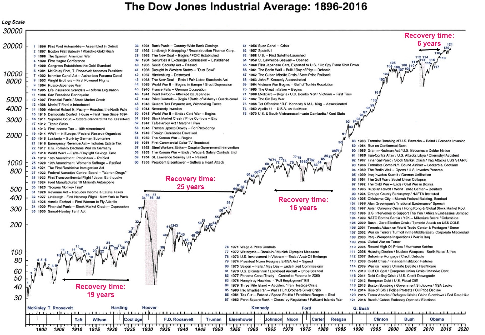

## Table of Contents

## What is the NYSE and why is it important?

The NYSE, or New York Stock Exchange, is a place where people buy and sell stocks. It's like a big marketplace, but instead of buying fruits and vegetables, people trade pieces of companies. The NYSE is located in New York City and is one of the oldest and largest stock exchanges in the world. It started in 1792, and now it has thousands of companies listed on it.

The NYSE is important because it helps companies raise money. When a company wants to grow, it can sell pieces of itself, called stocks, to people on the NYSE. This money can be used to build new factories, hire more workers, or create new products. The NYSE also helps people invest their money. By buying stocks, people can own a small part of big companies and maybe make more money if the company does well. This makes the NYSE a key part of the world's economy.

## What does historical pricing in fractions mean?

Historical pricing in fractions means that in the past, stock prices were shown as fractions instead of decimals. For example, instead of saying a stock costs $1.25, it might have been shown as $1 1/4. This way of showing prices was used for a long time, especially before the year 2000. Each fraction had a special meaning, and traders had to learn how to quickly add and subtract these fractions to make their trades.

This system of using fractions came from the old British currency system, where money was divided into pounds, shillings, and pence. In the stock market, the smallest fraction used was usually 1/16th of a dollar, or $0.0625 in today's decimal system. This made things a bit tricky because it was harder to do quick math with fractions than with decimals. But traders got used to it, and it was how business was done for many years until the switch to decimals made things simpler.

## When did the NYSE use fractional pricing?

The NYSE used fractional pricing for a long time, starting from when it began in 1792 until the year 2000. During this time, stock prices were shown as fractions instead of decimals. For example, a stock might be priced at $1 1/2 instead of $1.50. This system came from the old British way of counting money, where they used pounds, shillings, and pence.

Using fractions made things a bit harder for traders because they had to do quick math with fractions. The smallest fraction used was usually 1/16th of a dollar, which is $0.0625 in today's decimal system. Traders got used to working with these fractions, but it was still more complicated than using decimals. In the year 2000, the NYSE switched to decimal pricing, which made trading easier and more straightforward.

## How were stock prices quoted in fractions on the NYSE?

On the NYSE, stock prices were quoted in fractions for a long time, from when it started in 1792 until the year 2000. Instead of using decimals like we do now, prices were shown as fractions of a dollar. For example, if a stock cost $1.50 today, back then it would have been quoted as $1 1/2. The smallest fraction used was usually 1/16th of a dollar, which is the same as $0.0625 in today's decimal system.

This way of showing prices came from the old British money system, where they used pounds, shillings, and pence. Traders on the NYSE had to learn how to quickly add and subtract these fractions to make their trades. It made things a bit harder because doing math with fractions is trickier than with decimals. But traders got used to it, and it was how business was done until the switch to decimals in 2000 made everything simpler.

## What were the common fractions used in NYSE pricing?

On the NYSE, stock prices were often shown in fractions before the year 2000. The most common fractions used were halves, quarters, eighths, and sixteenths. For example, if a stock was priced at $1.25 today, it would have been shown as $1 1/4 back then. The smallest fraction used was usually 1/16th of a dollar, which is the same as $0.0625 in today's decimal system.

These fractions came from the old British way of counting money, where they used pounds, shillings, and pence. Traders had to learn how to quickly add and subtract these fractions to make their trades. It made things a bit harder because doing math with fractions is trickier than with decimals. But traders got used to it, and it was how business was done until the switch to decimals in 2000 made everything simpler.

## How did the transition from fractions to decimals affect the NYSE?

The transition from fractions to decimals on the NYSE happened in the year 2000. Before that, stock prices were shown as fractions like 1/2 or 1/16, which made trading a bit harder because traders had to do quick math with fractions. When they switched to decimals, it made things a lot simpler. Now, prices were shown as easy-to-understand numbers like $1.25 or $1.50. This change made it easier for everyone to understand and trade stocks.

The switch to decimals also made the market more fair and clear. With fractions, the smallest price change was 1/16th of a dollar, which is $0.0625. But with decimals, prices could change by just one cent, or $0.01. This meant that prices could be more exact, and it helped make the market more open and honest. Overall, the move to decimals helped the NYSE work better and made it easier for more people to trade stocks.

## What were the advantages of using fractions for stock pricing?

Using fractions for stock pricing had some advantages. One big advantage was that it followed an old tradition. The NYSE started using fractions because of the old British way of counting money, with pounds, shillings, and pence. This made it feel familiar to traders who were used to this system. It also helped keep things the same for a long time, which some people liked because it meant they didn't have to learn a new way of doing things.

Another advantage was that fractions helped keep prices a bit secret. With fractions, the smallest change in price was 1/16th of a dollar, which is $0.0625. This meant that prices couldn't change by just a tiny bit, like one cent. Some traders liked this because it made it harder for other people to see small changes in the market. This could be useful for big traders who wanted to keep their moves quiet.

## What challenges did traders face with fractional pricing?

Traders faced a few challenges with fractional pricing. One big challenge was doing quick math with fractions. When prices were shown as fractions like 1/2 or 1/16, traders had to add and subtract these fractions fast to make their trades. This was harder than using decimals because fractions can be tricky to work with. If a trader made a mistake, it could cost them money, so they had to be really careful and quick.

Another challenge was that fractional pricing made the market less clear. With the smallest change being 1/16th of a dollar, or $0.0625, prices couldn't move by just a tiny bit like one cent. This meant that small changes in the market were harder to see. Some traders liked this because it kept their moves a bit secret, but it also made things less fair and open. It was harder for everyone to understand what was really going on with stock prices.

## How did the use of fractions impact market transparency and efficiency?

The use of fractions made the market less clear and transparent. When stock prices were shown as fractions, like 1/2 or 1/16, the smallest change in price was 1/16th of a dollar, which is $0.0625. This meant that prices couldn't move by just a tiny bit, like one cent. Because of this, small changes in the market were harder to see. Some traders liked this because it kept their moves a bit secret, but it also made things less fair and open. It was harder for everyone to understand what was really going on with stock prices.

Using fractions also made the market less efficient. Traders had to do quick math with fractions to make their trades, which was harder than using decimals. If a trader made a mistake, it could cost them money, so they had to be really careful and quick. This made trading slower and more complicated. The switch to decimals in 2000 made things simpler and more efficient because prices could change by just one cent, making the market more exact and easier to understand.

## What historical data sources are available for NYSE fractional pricing?

There are a few places where you can find historical data on NYSE stock prices when they used fractions. One good place is the NYSE's own archives. They keep old records of stock prices, and you can sometimes find this information in their historical data sets. Another place to look is old financial newspapers and magazines. They used to print stock prices in fractions, so if you can find old issues of newspapers like The Wall Street Journal or magazines like Barron's, you might see the prices listed in fractions.

You can also check online databases that have been collecting stock market data for a long time. Websites like Yahoo Finance or Google Finance have historical stock price data, but you might need to go back to before the year 2000 to see the prices in fractions. Some special libraries or university archives might also have old stock market records that show prices in fractions. These places can be a bit harder to access, but they can have a lot of detailed information if you're able to visit them.

## How can one convert historical fractional prices to modern decimal prices?

To convert historical fractional prices to modern decimal prices, you need to know that each fraction represents a part of a dollar. For example, if a stock was priced at $1 1/2, you would add the whole dollar amount to the fraction. The fraction 1/2 is the same as 50 cents, so $1 1/2 is the same as $1.50. The most common fractions used were halves, quarters, eighths, and sixteenths. So, if you see a price like $2 3/8, you know that 3/8 is the same as 37.5 cents, making the decimal price $2.375.

The smallest fraction used was usually 1/16th of a dollar, which is $0.0625 in decimal form. To convert any fraction to a decimal, you can divide the top number by the bottom number. For example, 1/16 is 1 divided by 16, which equals 0.0625. If you see a price like $3 5/16, you add the whole dollar amount to the fraction, so 5/16 is 5 divided by 16, which is 0.3125. This makes the decimal price $3.3125. By understanding these fractions and how to convert them, you can easily change old stock prices to the modern decimal system.

## What are some case studies or examples of significant events influenced by NYSE fractional pricing?

One big event that was influenced by NYSE fractional pricing was the "Flash Crash" of 1962. Back then, stock prices were shown in fractions, and this made trading a bit harder. On May 28, 1962, the market suddenly dropped a lot because of a mix of things, including the tricky fractions. Traders had to do quick math with these fractions, and when the market got busy, it was easy to make mistakes. This made the drop even worse, and it took a while for the market to calm down. The use of fractions made it harder for everyone to understand what was going on, which added to the confusion.

Another example is the stock market in the 1990s. During this time, the market was growing a lot, but the use of fractions made it hard to see small changes in prices. The smallest change was 1/16th of a dollar, which is $0.0625. This meant that prices couldn't move by just a tiny bit, like one cent. Some traders used this to their advantage by making big trades without showing small changes in the market. This made the market less fair and open. The switch to decimals in 2000 helped make things clearer and easier to understand, but the use of fractions during the 1990s played a big role in how the market worked back then.

## References & Further Reading

[1]: Harris, L. E. (2003). ["Trading and Exchanges: Market Microstructure for Practitioners"](https://academic.oup.com/book/52292). Oxford University Press.

[2]: O'Hara, M. (1995). ["Market Microstructure Theory"](https://www.semanticscholar.org/paper/Market-Microstructure-Theory-O'Hara/2bd0833b023f3270a2a6bf301e86b8e02e2f28ed). Blackwell.

[3]: Grammig, J., & Theissen, E. (2005). ["Is Best Really Better? Internalization of Orders in Decentralized Markets"](https://link.springer.com/article/10.1007/BF03396891). Journal of Financial Intermediation, 14(3), 259-289.

[4]: Jones, C. M., & Lipson, M. L. (2001). ["Sixteenths: Direct Evidence on Institutional Execution Costs"](https://www.sciencedirect.com/science/article/pii/S0304405X00000878). Review of Financial Studies, 14(1), 115-147.

[5]: Bessembinder, H. (2003). ["Trade Execution Costs and Market Quality after Decimalization"](https://www.jstor.org/stable/4126742?read-now=1). Journal of Financial and Quantitative Analysis, 38(4), 747-777.