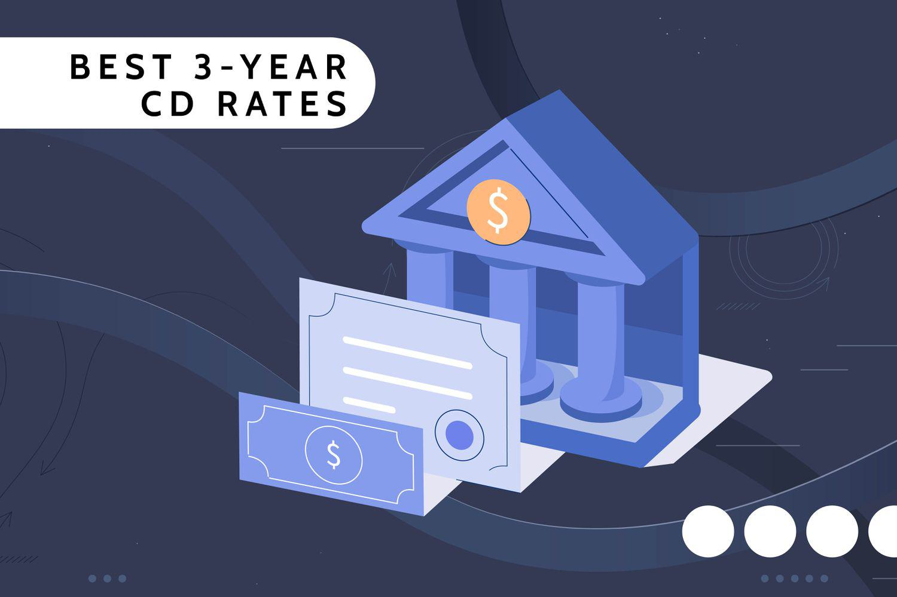

Futures trading represents a significant segment of the global financial markets, providing participants with opportunities to hedge risks, speculate on price movements, and diversify portfolios. A futures contract is a standardized agreement to buy or sell a specific asset at a predetermined price on a future date. These contracts are essential for managing price volatility in commodities, financial indices, interest rates, and currencies. By enabling participants to lock in prices, futures trading plays a critical role in risk management and price discovery, impacting both the microeconomic and macroeconomic landscapes.

The NYSE Liffe is a prominent derivatives exchange that has been instrumental in the trading of futures and options. Established in 1982 as the London International Financial Futures Exchange (LIFFE), it has evolved into a significant part of the global trading architecture, offering a diverse array of financial products. Known for its robust trading infrastructure and diverse product offerings, NYSE Liffe attracts a wide spectrum of market participants, from institutional investors to individual traders, seeking access to its comprehensive derivatives market.



Algorithmic trading, which involves the use of automated pre-programmed trading instructions, has been gaining increased prominence in futures markets. This approach leverages complex algorithms designed to analyze market data, execute orders, and manage investment portfolios with minimal human intervention. The rise of algorithmic trading has led to significant efficiency gains in futures markets, enhancing liquidity and reducing transaction costs. It facilitates the rapid execution of trades based on real-time market analysis, thereby improving decision-making processes for traders and investors.

In 2013, NYSE Liffe became part of the Intercontinental Exchange Group Inc. (ICE) following its acquisition of NYSE Euronext. This acquisition positioned NYSE Liffe within a larger network of exchanges and clearinghouses, extending its influence and integration into the global derivatives market. As part of ICE, NYSE Liffe continues to innovate and expand its offerings, benefiting from ICE's extensive technological capabilities and market reach, thus maintaining its pivotal role in the financial markets.

## Table of Contents

## A Brief History of NYSE Liffe

The origins of NYSE Liffe trace back to the establishment of the London International Financial Futures Exchange (LIFFE) in 1982 in London. LIFFE was created to capitalize on the burgeoning opportunities within the financial derivatives market, particularly with the advent of currency futures in the wake of the post-Bretton Woods era, which saw more volatility in exchange rates. Initially, LIFFE focused on providing a platform for interest rate futures and options, reflecting the growing need for risk management solutions in an increasingly globalized economy.

Over the years, LIFFE underwent significant transformations through mergers and acquisitions, which were pivotal in its evolution. One of the major milestones was the acquisition by Euronext in 2002. Euronext, a pan-European exchange group, integrated LIFFE into its operations, bolstering its position as a formidable entity within the derivatives trading sector. This acquisition marked the beginning of LIFFE's expansion into a broader range of products and markets, further solidifying its reputation as a robust trading platform.

The transition from open outcry to electronic trading was another critical development in LIFFE's history. Open outcry, a traditional method of trading where traders communicate buy and sell orders verbally, was gradually phased out in favor of electronic trading mechanisms. This shift was largely facilitated by the introduction of the LIFFE CONNECT platform, an electronic trading engine that revolutionized how trades were executed. LIFFE CONNECT enabled more efficient, faster, and transparent trading, aligning with global trends toward digitization and automation in financial markets.

In 2007, the New York Stock Exchange (NYSE) acquired Euronext, creating NYSE Euronext, a transatlantic exchange group that further consolidated LIFFE within a larger organizational structure. This consolidation brought about increased synergies and expanded market access, enhancing LIFFE's global reach and influence.

The landscape of NYSE Liffe changed in 2013 when the Intercontinental Exchange (ICE) acquired NYSE Euronext. This acquisition marked a new chapter for NYSE Liffe, as it became an integral part of ICE, a leading network of regulated exchanges and clearinghouses for financial and commodity markets. ICE's acquisition aimed to leverage its extensive technological resources and market expertise, providing NYSE Liffe with further growth and innovation opportunities.

Overall, the history of NYSE Liffe reflects its adaptability and resilience in the dynamic world of financial markets, effectively transitioning from traditional trading methods to modern electronic systems while expanding through strategic partnerships and acquisitions. These developments have ingrained NYSE Liffe as a pivotal player within the derivatives landscape, shaping its trajectory in alignment with evolving market demands and technological advancements.

## Understanding Futures Contracts on NYSE Liffe

Futures contracts are standardized agreements to buy or sell an asset at a specified future date and price, functioning as key financial derivatives in global markets. These contracts obligate the buyer to purchase, or the seller to sell, the underlying asset upon expiration, distinguishing them from options where the execution is at the discretion of the holder. Futures contracts facilitate price discovery and provide an avenue for speculative profits as well as risk management, notably hedging, by allowing market participants to lock in prices.

On the NYSE Liffe, a prominent derivatives exchange, a broad array of futures products are traded, including [interest rate](/wiki/interest-rate-trading-strategies), index, commodity, and currency futures. Interest rate futures, for instance, enable parties to hedge against fluctuations in interest rates, a critical activity for banks and financial institutions. Index futures, such as those tracking major stock indices, offer investors the ability to gain exposure to broad market movements, supporting strategies aimed at managing portfolio risks.

Commodity futures cover a variety of tangible products, ranging from agricultural goods to energy resources. These contracts are of particular importance to producers and wholesalers aiming to stabilize revenues and costs amidst volatile market conditions. Currency futures provide a mechanism to hedge against foreign exchange risk, serving businesses engaged in international trade who seek to protect profit margins against adverse currency movements.

The significance of futures contracts extends beyond speculation. They are crucial tools for hedging risks—and by doing so, they contribute to overall market stability. For instance, an exporter may use currency futures to fix the exchange rate of expected foreign revenue, shielding themselves from currency depreciation. Similarly, an investor anticipating a future interest payment can use interest rate futures to lock in the current rate, protecting against potential rate increases.

In conclusion, futures contracts on NYSE Liffe play a vital role in both hedging and financial planning. These contracts offer a robust mechanism for managing economic risks, thereby ensuring market [liquidity](/wiki/liquidity-risk-premium) and facilitating efficient capital allocation across the financial system.

## The Role of Algorithmic Trading in Futures Markets

Algorithmic trading refers to the use of computer algorithms to automate trading decisions and execute orders in financial markets. These algorithms follow predefined sets of rules to determine the timing, price, and quantity of trades. By leveraging algorithms, traders and financial institutions can manage large volumes of trade efficiently and with minimal human intervention. Algorithmic trading is especially prevalent in futures markets, where the speed and efficiency of execution can offer significant advantages.

In futures markets, [algorithmic trading](/wiki/algorithmic-trading) enhances trading efficiency and decision-making. Algorithms can process large datasets at high speeds, identifying trading opportunities based on historical patterns, market trends, and other quantifiable factors. This capability allows for real-time analysis and execution, reducing latency and improving the chances of capturing favorable market conditions. Moreover, algorithms help in maintaining discipline by adhering strictly to predefined trading strategies, thus eliminating emotion-driven decisions and reducing the likelihood of human error.

Several common strategies are employed in algorithmic trading within the futures sector. One widely used approach is statistical [arbitrage](/wiki/arbitrage), which involves the simultaneous purchase and sale of similar or related futures contracts to exploit price discrepancies and generate profits. Statistical models identify pricing inefficiencies and execute trades rapidly to capture small changes before the market corrects itself.

Another popular strategy is [trend following](/wiki/trend-following), where algorithms identify and invest in assets that are trending in a favorable direction. This approach involves analyzing historical price data to discern patterns and trends, thereby making informed predictions about future price movements. For example, algorithms might use moving averages or other trend indicators to initiate trades that align with an existing upward or downward market trend.

Market-making is also a significant strategy in algorithmic trading. In this approach, algorithms provide liquidity to the markets by continuously buying and selling futures contracts, profiting from the bid-ask spread. Market-making algorithms are designed to react swiftly to market changes, ensuring that they maintain a balanced inventory and optimal pricing positions.

In conclusion, algorithmic trading plays a vital role in futures markets by increasing trading efficiency, enhancing decision-making processes, and implementing diverse strategies that capitalize on quickly shifting market dynamics. Through algorithmic mechanisms like [statistical arbitrage](/wiki/statistical-arbitrage), trend following, and market-making, participants in futures markets can optimize their trading activities and potentially achieve more consistent returns.

## NYSE Liffe's Tech Infrastructure: LIFFE CONNECT

LIFFE CONNECT is the electronic trading platform utilized by NYSE Liffe, marking a significant advancement from traditional open-outcry trading methods. This platform is engineered to facilitate seamless trading operations, thereby enhancing efficiency and accessibility for traders globally. As an electronic trading engine, LIFFE CONNECT operationalizes a sophisticated infrastructure that caters to the needs of high-frequency trading ([HFT](/wiki/high-frequency-trading-strategies)) and algorithmic strategies.

Technological advancements embedded within LIFFE CONNECT cater specifically to high-frequency trading and algorithmic strategies, which require rapid execution and processing capabilities. The platform's architecture is designed to handle substantial volumes of data and large numbers of transactions simultaneously, providing traders with the necessary speed and precision required in modern financial markets. This is critical in scenarios where latency, measured in microseconds, can drastically influence trading outcomes. By leveraging state-of-the-art technology solutions, the platform minimizes latency and enhances the accuracy of order execution, thus supporting both market-making and speculative trading strategies.

LIFFE CONNECT's global reach is reflected in its extensive coverage across various European markets, making it a cornerstone for derivatives trading in the region. The platform supports diverse asset classes including interest rate, commodity, and equity derivatives, providing a comprehensive trading suite for market participants. This flexibility enables traders to exploit arbitrage opportunities and execute complex strategies that span multiple jurisdictions.

Furthermore, LIFFE CONNECT integrates advanced risk management tools and real-time monitoring features, allowing traders to assess and mitigate potential risks effectively. These functionalities are crucial for maintaining market stability and ensuring the integrity of trading operations.

By continually adapting to new technological advancements and evolving market needs, LIFFE CONNECT remains a pivotal component of NYSE Liffe's infrastructure, offering robust support for high-frequency and algorithmic trading across a diverse array of markets.

## Algorithmic Trading and Risk Management on NYSE Liffe

Algorithmic trading on NYSE Liffe requires robust risk management tools and techniques to ensure trading sustainability and efficacy. Effective risk management is crucial because algorithmic trading strategies, despite their sophistication, involve significant market risks that can result in substantial financial loss if not adequately managed.

One of the primary components facilitating risk management on the NYSE Liffe is ICE Clear Europe, which plays a critical role in providing clearing and risk management services. ICE Clear Europe ensures that all trades executed on NYSE Liffe are settled accurately and efficiently, mitigating counterparty risk. By acting as an intermediary, it guarantees the performance of all contracts, thus minimizing the risk of default. This clearinghouse model involves marking trades to market daily and maintaining margin requirements, which are essential in managing credit exposure.

Algorithmic traders on NYSE Liffe employ various risk management techniques to sustain their trading strategies. Position limits, for instance, are a common method to cap the maximum allowable exposure to a single asset or group of assets. By imposing these limits, traders can prevent excessive risk-taking that might jeopardize the portfolio.

Sophisticated algorithms are often equipped with real-time risk assessment capabilities. These systems can evaluate the risk of current positions and potential trades instantaneously. With modern computing power, algorithms can simulate numerous scenarios and adjust trading strategies dynamically in response to changing market conditions.

The integration of stop-loss orders in algorithmic trading systems is another protective measure deployed by traders. These orders automatically close positions when the market moves against the trader beyond a predefined threshold, thus minimizing losses. For example, in a Python-based algorithmic trading system, a simple implementation of a stop-loss order might look like this:

```python
def execute_trade(current_price, position, stop_loss_price):
    if position == "long" and current_price <= stop_loss_price:
        close_position()
        print("Position closed at stop-loss price:", stop_loss_price)
    elif position == "short" and current_price >= stop_loss_price:
        close_position()
        print("Position closed at stop-loss price:", stop_loss_price)

# Example usage
execute_trade(current_price=95, position="long", stop_loss_price=96)
```

Moreover, risk management in algorithmic trading is enhanced by the use of Value at Risk (VaR) models. VaR estimates the maximum potential loss over a specified period for a given confidence interval. It serves as a crucial indicator to identify how much risk is involved in a trading strategy and to decide on capital allocation accordingly.

In conclusion, risk management is a cornerstone of sustainable algorithmic trading on NYSE Liffe. The risk mitigation tools and services provided by ICE Clear Europe, alongside advanced algorithmic techniques such as position limits, real-time risk assessment, stop-loss orders, and VaR, collectively ensure that algorithmic trading strategies remain resilient and effective amidst market [volatility](/wiki/volatility-trading-strategies).

## Future Trends and Developments in Algorithmic Trading on NYSE Liffe

Emerging trends in [artificial intelligence](/wiki/ai-artificial-intelligence) (AI) and [machine learning](/wiki/machine-learning) (ML) are increasingly shaping the landscape of algorithmic trading on NYSE Liffe. These technologies enhance the ability of traders to develop sophisticated algorithms capable of processing vast amounts of market data in real time. AI and ML models facilitate predictive analytics, enabling traders to identify patterns and anticipate market movements with greater accuracy. A prevalent application of ML in trading involves the use of neural networks and [deep learning](/wiki/deep-learning) to predict price trends and volatility. These AI-driven systems allow for high-frequency trading strategies that can execute trades within microseconds, significantly improving response times and profitability.

Regulatory changes are another significant [factor](/wiki/factor-investing) impacting futures markets and algorithmic trading strategies. The complex regulatory environment governing financial markets is evolving to ensure systemic stability and protect market participants from undue risk. Regulating bodies such as the European Securities and Markets Authority (ESMA) continue to refine guidelines on high-frequency and algorithmic trading practices to mitigate the risks of market manipulation and systemic failures. These regulations may impose new compliance requirements, potentially influencing trading strategies by emphasizing transparency and risk management. Algorithmic traders on NYSE Liffe must stay abreast of these regulatory developments to adapt their strategies while ensuring adherence to new provisions.

In anticipation of growing algorithmic trading demands, NYSE Liffe's trading platforms are poised for further developments. Future enhancements are expected to integrate cutting-edge technologies, such as quantum computing and enhanced data analytics, which will significantly augment the processing power and speed of trades. Additionally, developments in blockchain technology could revolutionize the way trades are executed and settled by providing a more secure and transparent ledger system. As NYSE Liffe continues to adapt its infrastructure, these innovations aim to accommodate increased trading volumes and the rising complexity of algorithmic strategies, ensuring that the exchange remains competitive on a global scale.

## Conclusion

The emergence and growth of NYSE Liffe have been pivotal in shaping the landscape of the derivatives market. Originally established as LIFFE in 1982, the exchange has evolved through various mergers and acquisitions, most notably its acquisition by Euronext and later consolidation under NYSE Euronext, before becoming part of the Intercontinental Exchange (ICE) Group in 2013. This trajectory reflects its growing influence and adaptability in an ever-changing financial environment. Transitioning from open outcry to electronic trading with the introduction of LIFFE CONNECT, the platform has enhanced its service offering, making it a cornerstone of futures and options trading.

Algorithmic trading has significantly boosted efficiency in futures markets, allowing for more precise and quicker execution of trades. Algorithms, leveraging vast amounts of data, apply statistical models to identify trends and execute orders with minimal human intervention, thus reducing transaction costs and mitigating risks. Strategies like arbitrage, trend following, and [market making](/wiki/market-making) have become commonplace due to the precision and speed algorithms offer, thereby elevating trading strategies on exchanges like NYSE Liffe.

Looking ahead, NYSE Liffe is poised to continue being a leader in technological advancement within the derivatives market. The integration of emerging technology such as artificial intelligence (AI) and machine learning (ML) into algorithmic trading strategies holds promise for further innovation and refinement. These advancements could revolutionize how trades are executed by improving pattern recognition and predictive capabilities. Regulatory changes will continue to play a crucial role, potentially affecting how algorithms are designed and deployed. Thus, the future trajectory of NYSE Liffe will likely involve staying ahead of technological and regulatory developments to maintain its competitive edge and support the growing demands of algorithmic trading.

## References & Further Reading

[1]: Harris, L. (2003). ["Trading and Exchanges: Market Microstructure for Practitioners."](https://www.amazon.com/Trading-Exchanges-Market-Microstructure-Practitioners/dp/0195144708) Oxford University Press.

[2]: Malkiel, B. G., & Fama, E. (1970). ["Efficient Capital Markets: A Review of Theory and Empirical Work."](https://www.jstor.org/stable/2325486) The Journal of Finance.

[3]: Chan, E. P. (2009). ["Quantitative Trading: How to Build Your Own Algorithmic Trading Business."](https://github.com/ftvision/quant_trading_echan_book) Wiley Trading.

[4]: Hull, J. C. (2018). ["Options, Futures, and Other Derivatives."](https://www.semanticscholar.org/paper/Options%2C-Futures%2C-and-Other-Derivatives-Hull/89bdee500c8623864fc9eb7a471546aa713acc44) Pearson.

[5]: Lopez de Prado, M. (2018). ["Advances in Financial Machine Learning."](https://www.amazon.com/Advances-Financial-Machine-Learning-Marcos/dp/1119482089) Wiley.