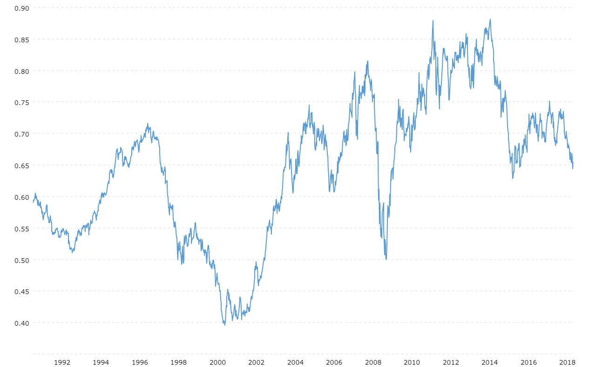

## Table of Contents

## What is the NZD/USD exchange rate?

The NZD/USD exchange rate shows how many US dollars you get for one New Zealand dollar. This rate changes every day because of things like trade, interest rates, and what's happening in the economy of both countries. For the most up-to-date rate, you can check financial news websites or use a currency converter online.

Right now, the NZD/USD exchange rate is around 0.60 to 0.65. This means if you have one NZD, you would get about 60 to 65 US cents. Keep in mind that this rate can go up or down, so it's a good idea to check it often if you need to exchange money or if you're planning a trip.

## How is the NZD/USD exchange rate determined?

The NZD/USD exchange rate is determined by the forces of supply and demand in the foreign exchange market. When more people want to buy New Zealand dollars (NZD) with US dollars (USD), the value of the NZD goes up. On the other hand, if more people want to sell NZD for USD, the value of the NZD goes down. This buying and selling happens because of trade between the two countries, tourism, investments, and other economic activities. For example, if New Zealand exports a lot of goods to the US, more USD will be needed to buy NZD, which can push the exchange rate up.

Several other factors also play a role in setting the exchange rate. Interest rates set by the central banks of New Zealand and the US can affect the rate because higher interest rates in one country can attract more foreign investment, increasing the demand for that country's currency. Economic indicators like inflation, employment rates, and GDP growth also influence the exchange rate. For instance, if the US economy is doing better than New Zealand's, the USD might strengthen against the NZD. Lastly, global events and market sentiment can cause sudden changes in the exchange rate, as investors move money around the world seeking safety or higher returns.

## What factors influence the NZD/USD exchange rate?

The NZD/USD exchange rate is influenced by many things. One big thing is how much people want to buy or sell the NZD compared to the USD. If more people want to buy NZD, its value goes up. This can happen if New Zealand is selling a lot of things to the US or if more tourists from the US are going to New Zealand. On the other hand, if more people want to sell NZD, its value goes down. This can happen if the US is selling a lot of things to New Zealand or if more people from New Zealand are going to the US.

Another thing that affects the exchange rate is the interest rates set by the central banks of New Zealand and the US. If New Zealand's interest rates are higher, more people might want to invest their money there, which can make the NZD stronger. Also, how well the economies of New Zealand and the US are doing matters. If the US economy is doing better, the USD might get stronger. Things like inflation, how many people have jobs, and how much the economy is growing can all change the exchange rate.

Lastly, big events around the world and what people think about the future can also change the NZD/USD exchange rate quickly. If there's a big event like a natural disaster or a political change, people might move their money to different countries to keep it safe. Also, if people think the economy of one country will do better in the future, they might buy more of that country's currency, which can change the exchange rate.

## How does the NZD/USD exchange rate affect trade between New Zealand and the United States?

The NZD/USD exchange rate plays a big role in trade between New Zealand and the United States. When the NZD is strong compared to the USD, it means that New Zealand's goods become more expensive for people in the US to buy. This can make it harder for New Zealand businesses to sell their products in the US because American buyers might look for cheaper options from other countries. On the other hand, if the NZD is weak, New Zealand's exports become cheaper for the US, which can help New Zealand businesses sell more to American customers.

The exchange rate also affects how much it costs for New Zealand to buy things from the US. When the NZD is strong, it's cheaper for New Zealand to import goods from the US because they can get more USD for their NZD. But if the NZD is weak, importing from the US becomes more expensive, which can make things like American electronics or cars more costly for people in New Zealand. So, the NZD/USD exchange rate can change how much trade happens between these two countries, affecting both exporters and importers.

## What are the historical trends of the NZD/USD exchange rate?

The NZD/USD exchange rate has had a lot of ups and downs over the years. From the 1980s to the early 2000s, the NZD was often weaker than the USD. During this time, the rate was usually between 0.30 and 0.50, which means you would get 30 to 50 US cents for one NZD. But things started to change in the early 2000s. The NZD got stronger, and by 2007, the rate went above 0.80 for the first time. This was because New Zealand's economy was doing well, and more people wanted to invest there.

After 2007, the NZD/USD rate kept changing. It went down during the global financial crisis in 2008 and 2009, dropping to around 0.50 again. But then it started to go up again, reaching around 0.85 in 2011. Since then, the rate has been going up and down, usually staying between 0.60 and 0.75. For example, in 2020, the rate dropped to around 0.60 because of the COVID-19 pandemic but then went back up a bit. These changes show how the NZD/USD rate can be affected by big events around the world and how the economies of New Zealand and the US are doing.

## How can individuals and businesses hedge against fluctuations in the NZD/USD exchange rate?

Individuals and businesses can use different ways to protect themselves from changes in the NZD/USD exchange rate. One way is to use forward contracts. This means they agree to buy or sell a certain amount of currency at a set price in the future. This can help them know exactly how much they will pay or get, even if the exchange rate changes. Another way is to use options, which give them the right, but not the obligation, to exchange currency at a certain rate. This can be useful if they want to take advantage of a good rate but also want the freedom to wait and see if the rate gets even better.

Another method is to diversify their currency exposure. This means they keep money in both NZD and USD, so if one currency goes down, the other might go up, balancing things out. Some people and businesses also use currency hedging funds or ETFs, which are managed by experts who try to protect against exchange rate changes. Lastly, natural hedging can be used by businesses, where they match their income and costs in the same currency. For example, if a New Zealand business sells a lot to the US, they might also try to buy things from the US, so the exchange rate changes affect both their income and costs in a similar way.

## What are the key economic indicators to watch for predicting movements in the NZD/USD exchange rate?

To predict movements in the NZD/USD exchange rate, it's important to keep an eye on several key economic indicators. One big indicator is interest rates set by the Reserve Bank of New Zealand (RBNZ) and the Federal Reserve in the US. If the RBNZ raises interest rates, the NZD might get stronger because more people want to invest in New Zealand for the higher returns. On the other hand, if the US raises its interest rates, the USD could get stronger. Another important thing to watch is inflation. If inflation is high in New Zealand, the NZD might go down because people might think the RBNZ will raise rates to control it, which can affect the currency's value.

Employment rates and GDP growth are also key indicators. If New Zealand's employment rate is going up and the economy is growing fast, the NZD might get stronger because it shows the country's economy is doing well. The same goes for the US; if their economy is doing better than New Zealand's, the USD might get stronger. Lastly, trade balances matter a lot. If New Zealand is exporting more than it's importing, the NZD might go up because more foreign currency, like USD, is coming into the country. Keeping an eye on these indicators can help you understand and maybe even predict how the NZD/USD exchange rate might move.

## How do global economic events impact the NZD/USD exchange rate?

Global economic events can have a big impact on the NZD/USD exchange rate. When there's a big event like a financial crisis or a natural disaster, people might move their money to safer places. If they think the US is safer, they might buy more USD, making it stronger and the NZD weaker. Also, if there's a big change in oil prices or if there's a trade war, it can change how much people want to buy or sell NZD and USD. For example, if oil prices go up a lot, countries that buy a lot of oil might see their currencies get weaker, including the NZD.

Another way global events affect the exchange rate is through changes in how people feel about the future. If there's good news about the global economy, people might be more willing to take risks and invest in places like New Zealand, making the NZD stronger. But if there's bad news, like a global recession, people might want to keep their money in the US, making the USD stronger. So, keeping an eye on what's happening around the world can help you understand why the NZD/USD exchange rate is moving the way it is.

## What role do central banks play in influencing the NZD/USD exchange rate?

Central banks, like the Reserve Bank of New Zealand (RBNZ) and the Federal Reserve in the US, have a big say in what happens to the NZD/USD exchange rate. They do this mainly by setting interest rates. If the RBNZ decides to raise interest rates, it can make the NZD stronger. This is because higher interest rates can attract more investors looking for better returns on their money. They'll want to buy more NZD, which pushes its value up. On the other hand, if the Federal Reserve raises US interest rates, the USD can get stronger for the same reason, making the NZD weaker in comparison.

Central banks can also use other tools to influence the exchange rate. They might buy or sell currencies directly in the foreign exchange market to try and change the rate. For example, if the RBNZ thinks the NZD is too strong and it's hurting New Zealand's exports, they might sell NZD to make its value go down. Also, what central banks say and do can change how people feel about the future. If the RBNZ or the Federal Reserve talks about wanting a stronger or weaker currency, it can make people act in ways that help make that happen. So, central banks have a lot of power over the NZD/USD exchange rate through their actions and words.

## How do technical analysis tools help in forecasting the NZD/USD exchange rate?

Technical analysis tools help people guess where the NZD/USD exchange rate might go next by looking at past prices and patterns. These tools use charts and numbers to find trends and patterns that can show when the rate might go up or down. For example, moving averages can help show if the rate is going up over time or if it's starting to go down. If the NZD/USD rate goes above a moving average, it might mean the rate will keep going up. If it goes below, it might mean the rate will keep going down.

Another tool is the Relative Strength Index (RSI), which helps see if the NZD/USD rate is being bought or sold too much. If the RSI is high, it might mean the rate is too high and could go down soon. If it's low, it might mean the rate is too low and could go up soon. By using these tools, people can make better guesses about where the NZD/USD rate might go next, which can help them decide when to buy or sell the currency.

## What are the implications of monetary policy differences between New Zealand and the U.S. on the NZD/USD exchange rate?

When the central banks in New Zealand and the U.S. have different monetary policies, it can really change the NZD/USD exchange rate. If the Reserve Bank of New Zealand (RBNZ) decides to raise interest rates while the Federal Reserve keeps theirs the same or lowers them, the NZD can get stronger. This is because higher interest rates in New Zealand make it more attractive for people to invest there, so they buy more NZD. On the other hand, if the Federal Reserve raises rates and the RBNZ keeps theirs the same or lowers them, the USD can get stronger because more people will want to invest in the U.S. for the higher returns.

These differences in monetary policy can also change how people feel about the future of the economies in New Zealand and the U.S. If the RBNZ is raising rates because they think the economy is doing well, people might feel more confident about investing in NZD. But if the Federal Reserve is raising rates to fight inflation, people might worry about the U.S. economy and move their money to other places, which can make the USD weaker. So, keeping an eye on what the central banks are doing and saying can help you understand why the NZD/USD exchange rate is moving the way it is.

## How do geopolitical tensions affect the NZD/USD exchange rate and what strategies can be employed to mitigate risks?

Geopolitical tensions can really shake up the NZD/USD exchange rate. When there's trouble between countries, like trade wars or political disagreements, people might get worried and move their money to what they think is a safer place. If they think the U.S. is safer, they'll buy more USD, which can make it stronger and the NZD weaker. Also, if there's a big event like a war or a big change in a country's government, it can change how much people want to buy or sell NZD and USD. For example, if there's a problem in the Pacific region, people might sell NZD and buy USD, making the NZD go down.

To protect against these ups and downs, people and businesses can use different strategies. One way is to use forward contracts, which let them agree to buy or sell currency at a set price in the future. This can help them know exactly how much they will pay or get, even if the exchange rate changes because of geopolitical tensions. Another way is to spread out their money in different currencies, so if one currency goes down because of a problem, the others might not be affected as much. Also, keeping an eye on the news and understanding what's happening around the world can help them make better decisions about when to buy or sell NZD or USD.

## References & Further Reading

[1]: Andrews, R. L., & Parsons, A. G. (2010). ["Econometric Analysis of Trends, Volatility and Risk Spread on Forex Markets Using NZD/USD Pair."](https://www.jstor.org/stable/j.ctt1trkkq1) Journal of Empirical Finance.

[2]: ["Algorithmic Trading: Winning Strategies and Their Rationale"](https://play.google.com/store/books/details/Algorithmic_Trading_Winning_Strategies_and_Their_R?id=CIwCTVqEj4oC&hl=en-US) by Ernest P. Chan

[3]: Armitage, S. (2006). ["Understanding Forex - A Guide to Trading the New Zealand Dollar/US Dollar Pair."](https://www.investopedia.com/articles/forex/11/why-trade-forex.asp) Macmillan.

[4]: ["Algorithmic and High-Frequency Trading"](https://www.cambridge.org/us/universitypress/subjects/mathematics/mathematical-finance/algorithmic-and-high-frequency-trading) by Álvaro Cartea, Sebastian Jaimungal, and José Penalva

[5]: ["New Zealand Dollar: Foreign Currency Exchange Rates"](https://www.xe.com/currencyconverter/convert/?From=NZD&To=USD) by Organisation for Economic Co-operation and Development (OECD)

[6]: ["Trading Systems and Methods"](https://www.amazon.com/Trading-Systems-Methods-Wiley/dp/1119605350) by Perry J. Kaufman

[7]: ["Forex Trading: Your Complete Guide to Get Started Like the Boss"](https://www.investing.com/brokers/guides/forex/forex-trading-for-beginners-a-beginners-guide-to-currency-markets/) by Heikin Ashi

[8]: Engle, R. F. (1982). ["Autoregressive Conditional Heteroscedasticity With Estimates of the Variance of United Kingdom Inflation."](https://www.semanticscholar.org/paper/Autoregressive-conditional-heteroscedasticity-with-Engle/2ee6cb87fc81ecd78d161c4a92c9dfce00c8961c) Econometrica, 50(4), 987-1007.

[9]: ["Technical Analysis of the Financial Markets: A Comprehensive Guide to Trading Methods and Applications"](https://drive.google.com/file/d/1OcDrGakDhaejT7J7xGEE3HHKy7xmrafy/preview) by John J. Murphy