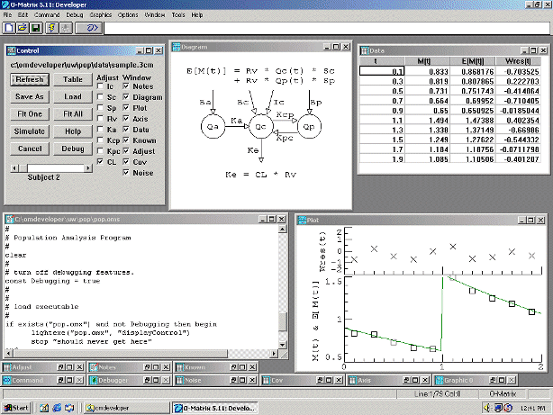

## Table of Contents

## What is O-Matrix?

O-Matrix is a software program that helps people do math and science calculations on their computers. It is like a calculator but much more powerful. People use O-Matrix to solve problems in areas like engineering, physics, and finance. It can handle big numbers and do many calculations quickly.

The program has a special language that users type in to tell the computer what to do. This language is easy to learn and helps people solve their problems faster. O-Matrix also has many tools and functions built-in, so users don't have to write everything from scratch. It is popular among scientists and engineers because it makes their work easier and more efficient.

## Who developed O-Matrix and when was it first released?

O-Matrix was developed by a company called Harmonic Software. The founder of the company, Robert H. Douglass, created the software to help with complex math and science problems.

The first version of O-Matrix was released in 1985. Since then, it has been updated many times to add new features and improve its performance. People who use it, like engineers and scientists, find it very helpful for their work.

## What are the main features of O-Matrix?

O-Matrix has many features that make it useful for people who need to do math and science calculations. One of the main features is its powerful calculation engine. This engine can handle big numbers and do many calculations very quickly. O-Matrix also has a lot of built-in functions and tools. These tools help users solve problems without having to write everything from scratch. This makes it easier and faster for people to get their work done.

Another important feature of O-Matrix is its programming language. This language is easy to learn and use. It lets users tell the computer exactly what to do, making it simple to solve complex problems. O-Matrix also supports data visualization, which means it can create graphs and charts to help users see their data better. This is very helpful for scientists and engineers who need to understand their results at a glance.

O-Matrix is also good at working with other software. It can connect with other programs and share data with them. This is useful when people need to use different tools together to solve a problem. Overall, these features make O-Matrix a popular choice for people who need a reliable and efficient tool for their math and science work.

## How does O-Matrix compare to other matrix programming languages like MATLAB?

O-Matrix and MATLAB are both powerful tools used for math and science calculations, but they have some differences. O-Matrix is known for being faster at running calculations, which can be really helpful when you need to solve big problems quickly. It also has a simpler programming language that is easier for some people to learn and use. On the other hand, MATLAB has a larger community and more resources available, like tutorials and forums where people can get help. MATLAB also has a lot of specialized toolboxes for different areas like signal processing and control systems, which can be very useful for specific tasks.

Another difference is how these programs work with other software. O-Matrix is good at connecting with other programs and sharing data with them, making it easier to use different tools together. MATLAB, while also capable of working with other software, is often more focused on its own ecosystem of tools and add-ons. Both O-Matrix and MATLAB are great for solving math and science problems, but the choice between them might depend on what you need to do and what you feel more comfortable using.

## What types of applications can be developed using O-Matrix?

O-Matrix can be used to develop many different types of applications, especially in the fields of engineering and science. It is great for creating programs that need to do a lot of math and calculations quickly. For example, engineers might use O-Matrix to make software that helps design new machines or buildings. Scientists can use it to write programs that analyze data from experiments, like looking at the weather or studying how chemicals react. Because O-Matrix is fast and can handle big numbers, it's perfect for these kinds of tasks.

Another type of application that can be developed with O-Matrix is for financial analysis. People in finance might use it to create programs that predict stock prices or manage investments. These programs need to do a lot of calculations to figure out what might happen in the future, and O-Matrix is good at that. Also, O-Matrix can be used to make educational software. Teachers might use it to create interactive lessons that help students learn math and science in a fun way. So, whether it's for engineering, science, finance, or education, O-Matrix is a versatile tool for developing many different kinds of applications.

## What are the system requirements for running O-Matrix?

To run O-Matrix on your computer, you need a system that meets certain requirements. For Windows, you should have at least Windows 7 or a newer version. Your computer should have a processor that is at least 1 GHz and at least 1 GB of RAM. You also need about 100 MB of free space on your hard drive to install the program. If you want to use O-Matrix on a Mac, you need macOS 10.9 or a newer version, with the same processor and RAM requirements as for Windows.

For Linux users, O-Matrix works on most distributions, but you need to make sure you have at least 1 GB of RAM and a 1 GHz processor. You will also need about 100 MB of free space on your hard drive. These requirements are pretty basic, so most modern computers should be able to run O-Matrix without any problems. Just make sure your system meets these minimum requirements before you install the software.

## How can someone get started with O-Matrix programming?

To get started with O-Matrix programming, you first need to download and install the software from the Harmonic Software website. Once installed, open O-Matrix and you'll see a simple window where you can type in commands. Start with some basic commands to get a feel for the language. For example, you can type "a = 5" to set a variable named 'a' to the value 5, then type "a" to see the value displayed. O-Matrix's language is easy to learn, so try playing around with simple math operations like addition and multiplication.

Next, you can move on to more advanced tasks. O-Matrix has many built-in functions that you can use to do more complex calculations. For example, you can use the "plot" function to create graphs of your data, which is helpful for visualizing results. As you get more comfortable, you can start writing scripts, which are sets of commands that O-Matrix can run automatically. There are also tutorials and examples on the Harmonic Software website that can guide you through different types of programs you might want to write. With practice, you'll be able to use O-Matrix to solve all sorts of math and science problems.

## What are some common functions and commands in O-Matrix?

In O-Matrix, some common functions and commands help you do math and work with data easily. For example, you can use "+" for addition, "-" for subtraction, "*" for multiplication, and "/" for division. These are basic operations that you'll use a lot. To work with numbers, you can use functions like "sqrt" to find the square root of a number, or "sin" and "cos" for sine and cosine. Another useful function is "rand", which gives you a random number. You can also use "plot" to make a graph of your data, which is really helpful for seeing what your numbers look like.

O-Matrix also has commands for working with matrices, which are like tables of numbers. You can use "zeros" to make a matrix full of zeros, and "ones" to make a matrix full of ones. To add numbers to a matrix, you can use "matrix_name[row, column] = value". For example, "A[1,1] = 5" puts the number 5 in the first row and first column of matrix A. To find out how big a matrix is, you can use the "size" function. These functions and commands are the building blocks for doing more complex work in O-Matrix, like solving engineering or science problems.

## How does O-Matrix handle data visualization and plotting?

O-Matrix makes it easy to see your data with pictures like graphs and charts. You can use the "plot" command to make a simple line graph. Just type "plot(x, y)" and O-Matrix will draw a line showing how your numbers change. If you want to see different kinds of graphs, you can use other commands like "bar" for bar graphs or "hist" for histograms. These commands help you understand your data better by showing it in different ways.

You can also change how your graphs look. O-Matrix lets you add titles, labels, and different colors to your graphs. For example, you can use "title" to add a title to your graph, and "xlabel" and "ylabel" to label the axes. If you want to save your graph, you can use the "save" command to keep it as a picture file. This way, you can share your graphs with others or use them in reports. O-Matrix makes it simple to turn your numbers into pictures that help you see what's going on.

## What are the advanced features of O-Matrix for scientific and engineering computations?

O-Matrix has many advanced features that make it great for scientific and engineering work. One of the main features is its ability to handle big calculations very quickly. This is really helpful for scientists and engineers who need to solve complex problems. O-Matrix can work with large sets of data and do many calculations at the same time. It also has built-in functions for things like solving equations, doing [statistics](/wiki/bayesian-statistics), and working with signals. These functions save time because you don't have to write everything from scratch.

Another advanced feature of O-Matrix is its support for matrix operations. Matrices are important in science and engineering, and O-Matrix makes it easy to work with them. You can do things like matrix multiplication, finding the inverse of a matrix, and solving systems of linear equations. O-Matrix also lets you create and manipulate matrices in different ways, which is useful for tasks like image processing or designing control systems. These advanced features make O-Matrix a powerful tool for anyone doing scientific or engineering work.

## How can O-Matrix be integrated with other software and programming languages?

O-Matrix can work well with other software and programming languages. It has special tools that let it connect with programs like Excel, so you can share data between them easily. This means you can use O-Matrix to do calculations and then send the results to Excel for more work or to make charts. O-Matrix also works with other programming languages like C and Fortran. You can write parts of your program in these languages and then use them inside O-Matrix. This is helpful when you need to use special code that O-Matrix doesn't have built-in.

Another way O-Matrix integrates with other software is through its ability to read and write different file types. It can handle files like CSV, which are common for data storage, and can also work with more complex formats like HDF5, used for large scientific datasets. This makes it easy to move data in and out of O-Matrix, so you can use it with other tools in your workflow. Whether you're working on a big project that needs different software or just want to use O-Matrix with your favorite programs, these features make it very flexible and useful.

## What are the latest updates and future developments planned for O-Matrix?

The latest updates for O-Matrix include improvements to its speed and new functions for data analysis. The developers have worked on making the program run faster, which is really helpful for people who need to solve big problems quickly. They've also added new tools for analyzing data, like better ways to handle big sets of numbers and new ways to make graphs. These updates make O-Matrix even more useful for scientists and engineers who rely on it every day.

For future developments, the team at Harmonic Software is planning to add more features that help with [machine learning](/wiki/machine-learning) and [artificial intelligence](/wiki/ai-artificial-intelligence). They want to make it easier for users to build models and predict outcomes using O-Matrix. They are also thinking about improving how O-Matrix works with other software, making it even easier to share data and use different tools together. These plans show that O-Matrix will keep getting better and more helpful for people doing math and science work.

## What is O-Matrix and how can it be understood?

O-Matrix is a specialized matrix manipulation tool designed to efficiently handle substantial datasets and perform rapid calculations, significantly benefiting the field of [algorithmic trading](/wiki/algorithmic-trading). At its core, O-Matrix is built to provide a robust analytical environment for quantitative analysts and traders. This environment facilitates the modeling and testing of trading strategies by utilizing a powerful matrix language. This language supports a wide range of operations, including matrix multiplication, decomposition, and inversion, which are crucial for the quantitative finance domain.

The tool's capacity to streamline the development of trading algorithms is primarily due to its matrix-focused approach. In quantitative finance, problems often involve large systems of equations or data that can be expressed as matrices. For instance, consider a simple asset pricing model where asset returns can be represented as:

$$
R = A \cdot f + \epsilon
$$

Here, $R$ is a vector of asset returns, $A$ is a matrix of [factor](/wiki/factor-investing) loadings, $f$ is a vector of factor returns, and $\epsilon$ represents the error term. O-Matrix facilitates efficient manipulation and transformation of these matrices, which enhances the development and optimization of such models.

One of the significant advantages of O-Matrix is its ability to handle complex data structures efficiently. In algorithmic trading, data often involves high-dimensional matrices due to numerous financial instruments and market conditions over time. O-Matrix enables users to execute complex mathematical and statistical computations swiftly, providing traders with the capability to analyze and model vast amounts of historical and real-time data with high precision.

Moreover, O-Matrix supports a variety of built-in functions and libraries specifically aimed at financial computations, making it a versatile tool in quantitative finance. The ability to write scripts using its flexible matrix language further empowers traders to automate and refine their strategies iteratively. This automation is key in reducing human error and enhancing the reliability of trading systems.

In summary, O-Matrix serves as an invaluable asset for quantitative analysts and traders by simplifying complex calculations through its matrix-oriented functionality, bolstering the development and testing of sophisticated trading strategies.

## References & Further Reading

[1]: Bergstra, J., Bardenet, R., Bengio, Y., & Kégl, B. (2011). ["Algorithms for Hyper-Parameter Optimization."](https://dl.acm.org/doi/10.5555/2986459.2986743) Advances in Neural Information Processing Systems 24.

[2]: ["Advances in Financial Machine Learning"](https://www.amazon.com/Advances-Financial-Machine-Learning-Marcos/dp/1119482089) by Marcos Lopez de Prado

[3]: ["Evidence-Based Technical Analysis: Applying the Scientific Method and Statistical Inference to Trading Signals"](https://www.amazon.com/Evidence-Based-Technical-Analysis-Scientific-Statistical/dp/0470008741) by David Aronson

[4]: ["Machine Learning for Algorithmic Trading"](https://github.com/stefan-jansen/machine-learning-for-trading) by Stefan Jansen

[5]: ["Quantitative Trading: How to Build Your Own Algorithmic Trading Business"](https://books.google.com/books/about/Quantitative_Trading.html?id=j70yEAAAQBAJ) by Ernest P. Chan