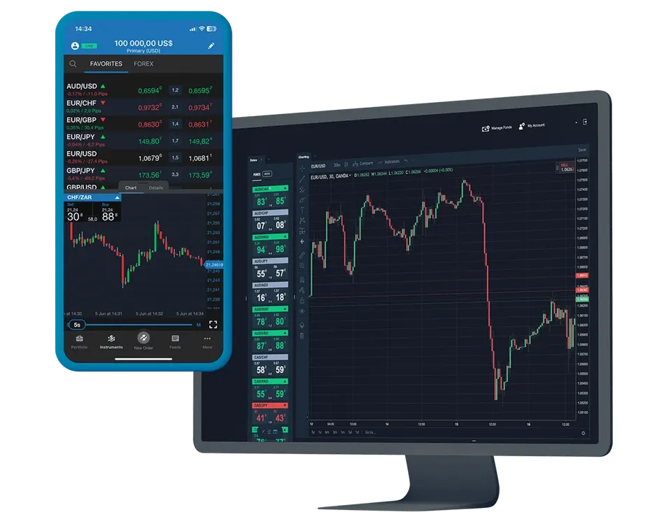

## Table of Contents

## What is Oanda?

Oanda is a company that helps people and businesses buy and sell different kinds of money from around the world. They are known for their online platform where you can trade currencies easily. Oanda started in 1996 and has become a popular choice for people who want to exchange money or invest in foreign currencies.

The company also provides tools and information to help people understand the currency market better. They have things like currency converters, charts, and news updates. Oanda works hard to make sure their services are safe and reliable, so people can trust them with their money.

## How was Oanda founded and who are its founders?

Oanda was started in 1996 by a man named Michael Stumm. He was a computer scientist who wanted to make it easier for people to trade money from different countries. At that time, trading currencies was hard and mostly done by big banks and financial experts. Michael thought that with the internet, anyone could do it. So, he created Oanda to help people trade currencies online.

The company began in Toronto, Canada, and quickly grew because it made currency trading simple and accessible. Michael Stumm worked with other smart people to build the technology that made Oanda's platform work well. Over time, Oanda became known around the world for its easy-to-use services and reliable information about currency markets.

## What services does Oanda offer to its users?

Oanda offers a lot of services to help people trade money from different countries. They have a platform where you can buy and sell currencies easily. This platform is online, so you can use it from anywhere. Oanda also has tools that help you understand the currency market better. For example, they have currency converters, charts, and news updates. These tools make it easier for you to decide when to trade.

Another service Oanda offers is called 'Corporate [FX](/wiki/fx-anomaly)'. This is for businesses that need to exchange money for their work. Oanda helps these businesses manage their money in different currencies. They also offer something called 'Payment solutions', which helps businesses send and receive money in different countries. Oanda works hard to make sure all these services are safe and reliable, so people can trust them with their money.

## How can someone open an account with Oanda?

To open an account with Oanda, you first need to visit their website. Look for the button that says "Open an Account" and click on it. You'll need to fill out a form with your personal information like your name, address, and email. Make sure to enter everything correctly. After you fill out the form, you'll need to choose a username and password for your account. This is important because you'll use these to log in later.

Once you've filled out the form and chosen your login details, you'll need to verify your identity. Oanda needs to make sure you are who you say you are, so they might ask for documents like a passport or driver's license. After you send in your documents, Oanda will check them. This might take a little time, but once they approve your documents, your account will be ready. You can then add money to your account and start trading currencies.

## What are the fees and charges associated with using Oanda's services?

When you use Oanda's services, there are some fees and charges you need to know about. First, there's a spread, which is the difference between the price Oanda buys a currency and the price they sell it. This spread is how Oanda makes money, and it's added to the cost of your trade. The spread can change depending on the currency pair you're trading and the market conditions. Oanda also charges an inactivity fee if you don't use your account for a while. If you don't log in or make a trade for more than 12 months, they will charge you $10 each month until you start using your account again.

There are also some other fees you might run into. For example, if you want to take your money out of your Oanda account, there might be a withdrawal fee. The amount of this fee can depend on how you want to get your money, like through a bank transfer or a different method. Oanda might also charge a fee if you need to convert your money from one currency to another. It's a good idea to check Oanda's website for the most up-to-date information on all their fees and charges, so you know what to expect.

## How does Oanda's trading platform work?

Oanda's trading platform is an online tool that helps you buy and sell different kinds of money easily. When you log in to your Oanda account, you can see different currency pairs like USD/EUR or GBP/JPY. You pick the pair you want to trade, decide if you want to buy or sell, and then enter the amount of money you want to trade. The platform shows you the current prices and lets you make your trade with just a few clicks. It also has charts and graphs that help you see how the prices are changing, so you can make better decisions.

The platform also has tools to help you manage your trades. You can set up something called 'stop-loss' and 'take-profit' orders. A stop-loss order helps you limit your losses by automatically closing your trade if the price goes down too much. A take-profit order helps you lock in your profits by closing your trade when the price reaches a certain level. Oanda's platform is designed to be easy to use, even if you're new to trading. It works on computers and mobile devices, so you can trade from anywhere.

## What types of accounts does Oanda offer and what are the differences between them?

Oanda offers different types of accounts to fit different needs. The main types are the Standard Account and the Premium Account. The Standard Account is good for people who are just starting out or who don't trade a lot. It has all the basic tools you need to trade currencies, like charts and news updates. The Premium Account is for people who trade more often or need more advanced tools. It comes with extra features like better customer support and lower trading costs.

There's also a Practice Account, which is great if you want to try trading without using real money. You can use this account to learn how the platform works and practice making trades. The Practice Account uses fake money, so you can experiment without any risk. All these accounts are easy to use, but the Premium Account gives you more help and better tools to make your trading easier and more successful.

## How does Oanda ensure the security of its users' funds and personal information?

Oanda takes security very seriously to keep your money and personal information safe. They use strong encryption to protect your data when you're using their platform. This means your information is turned into a secret code that's hard for hackers to break. Oanda also follows strict rules from financial regulators to make sure they're doing everything right. They keep your money in separate accounts from their own money, so even if something goes wrong with Oanda, your money is still safe.

Oanda also has a team that watches for anything suspicious all the time. If they see anything strange, they can stop it before it causes problems. They also make sure you can log into your account safely by using two-[factor](/wiki/factor-investing) authentication. This means you need to enter a special code sent to your phone or email, in addition to your password. This makes it much harder for someone else to get into your account. Oanda works hard to make sure you can trust them with your money and personal information.

## What are the key features of Oanda's mobile trading app?

Oanda's mobile trading app is made to help you trade money from different countries easily, even when you're not at your computer. The app lets you see live prices for different currencies and make trades quickly. You can also use the app to check your account balance and see how your trades are doing. It has charts and graphs that help you understand how the prices are changing, so you can make good choices about when to buy or sell.

The app also has tools to help you manage your trades better. You can set up 'stop-loss' and 'take-profit' orders right from your phone. A stop-loss order helps you limit your losses by closing your trade if the price goes down too much. A take-profit order helps you lock in your profits by closing your trade when the price reaches a certain level. The app is easy to use and works on both iPhones and Android phones, so you can trade from anywhere.

## How does Oanda's currency data and analysis tools help traders make informed decisions?

Oanda's currency data and analysis tools help traders by giving them important information about the currency market. The tools show live prices for different currency pairs, so traders can see how much money they will get when they trade. Oanda also has charts and graphs that show how prices have changed over time. This helps traders see patterns and decide when might be a good time to buy or sell. They can also look at news updates on the app, which tell them about big events that might affect currency prices. This way, traders can make choices based on what's happening in the world.

Another helpful feature is the historical data that Oanda provides. Traders can look at past prices to see how currencies have moved in different situations. This can help them guess what might happen next. Oanda also has tools like technical indicators, which are special calculations that can show if a currency is likely to go up or down. By using all this information, traders can make smarter decisions and feel more confident about their trades.

## What are some advanced trading strategies that can be implemented using Oanda's platform?

Oanda's platform offers tools that can help you use advanced trading strategies. One strategy is called '[scalping](/wiki/gamma-scalping)'. This means you make a lot of small trades to earn a little bit of money each time. You can use Oanda's live prices and charts to find the best moments to do this. Another strategy is 'hedging', which means you make trades to protect yourself from losing money. For example, if you think the price of a currency might go down, you can make a trade that will earn you money if it does. Oanda's platform lets you set up these trades easily.

Another advanced strategy is 'swing trading', where you hold onto your trades for a few days or weeks to catch bigger price changes. Oanda's charts and historical data can help you see when these changes might happen. You can also use 'technical analysis' to look for patterns in the charts that tell you when to buy or sell. Oanda's platform has many tools for this, like moving averages and other indicators. By using these strategies and tools, you can make smarter trades and possibly earn more money.

## How does Oanda compare to other forex brokers in terms of features, fees, and user experience?

Oanda is one of many [forex](/wiki/forex-system) brokers out there, and it has its own special features that make it stand out. One big thing about Oanda is that it has a lot of tools to help you understand the currency market better. They have charts, graphs, and news updates that can help you make smart choices about when to trade. Oanda's platform is also easy to use, which is great if you're new to trading. They offer different types of accounts, like a Standard Account for beginners and a Premium Account for people who trade a lot. Oanda's fees are mostly in the form of a spread, which is the difference between the price they buy and sell a currency. They also have an inactivity fee if you don't use your account for a long time.

When you compare Oanda to other forex brokers, you'll see that some brokers might have lower fees or different tools. For example, some brokers might not charge an inactivity fee, or they might have even more advanced tools for technical analysis. But Oanda is known for being reliable and safe, which is important when you're trading money. Their customer support is also good, especially if you have a Premium Account. The user experience on Oanda's platform is smooth and easy to navigate, which can be a big plus if you like a simple and straightforward way to trade. Overall, Oanda is a good choice if you value safety, ease of use, and helpful tools, even if their fees might be a bit higher than some other brokers.

## How can we approach Data Retrieval and Strategy Development?

Data is the backbone of any trading strategy. OANDA’s API provides a powerful toolset for traders to access and retrieve historical market data, which is critical in developing and refining trading strategies. By specifying parameters such as time range, granularity, and instrument, traders can obtain precise data tailored to their strategy requirements, enabling comprehensive analysis and informed decision-making.

Backtesting represents an essential process in evaluating the efficacy of trading strategies. By running a strategy against historical data, traders can assess how their strategy would have performed under past market conditions. This process helps in identifying potential weaknesses and refining strategies before they are executed in live markets. A key measure in [backtesting](/wiki/backtesting) is ensuring there is no overfitting to past data, which can lead to poor performance in future trading.

A common strategy employed by traders involving data analysis is the use of moving averages to determine market trends. Moving averages help smooth out price data by creating a constantly updated average price. Traders often use a combination of short-term and long-term moving averages to identify trade signals. For example, a simple moving average (SMA) crossover strategy might involve the following logic:

1. Calculate the short-term and long-term moving averages.
2. Buy when the short-term moving average crosses above the long-term moving average.
3. Sell when the short-term moving average crosses below the long-term moving average.

Mathematically, the simple moving average of a dataset $P$ over $n$ periods is calculated as:

$$
SMA = \frac{P_1 + P_2 + \cdots + P_n}{n}
$$

For implementation in Python using OANDA’s API, traders can use libraries like `pandas` to handle data and calculate these averages:

```python
import pandas as pd

# Example data retrieval and moving average calculation
data = pd.DataFrame(api.get_historical_data(instrument='EUR_USD'))
short_window = 40
long_window = 100

# Calculate the simple moving averages
data['short_mavg'] = data['close'].rolling(window=short_window, min_periods=1).mean()
data['long_mavg'] = data['close'].rolling(window=long_window, min_periods=1).mean()

# Generate buy/sell signals
data['signal'] = 0
data['signal'][short_window:] = np.where(data['short_mavg'][short_window:] > data['long_mavg'][short_window:], 1, -1)
data['position'] = data['signal'].diff()
```

By using OANDA's API in conjunction with Python, traders have the capability to develop, test, and refine strategies with significant data-driven insights, thereby enhancing their potential for successful trading outcomes.

## What is Backtesting and Performance Evaluation?

Backtesting is a crucial step in [algorithmic trading](/wiki/algorithmic-trading) that allows traders to simulate their trading strategies using historical data. This simulation helps in understanding the potential performance and associated risks before executing the strategies in live markets. The process essentially involves running a trading algorithm backward in time with historical data to see how it would have performed.

A common metric used in backtesting is the calculation of log returns. Logarithmic returns, or log returns, are preferred for their time-additive properties, which make it easier to aggregate and compare returns over different periods. The formula for calculating log return is:

$$
\text{Log Return} = \ln \left( \frac{P_t}{P_{t-1}} \right)
$$

where $P_t$ is the closing price at time $t$ and $P_{t-1}$ is the closing price at time $t-1$.

Performance metrics are vital in assessing how well a strategy might perform and help in refining it further. The number of trades executed during the backtesting period gives an idea about the strategy's activity level. A high number of trades might indicate a high-frequency trading strategy, whereas a low count could suggest a long-term [trend following](/wiki/trend-following) strategy.

Return on Investment (ROI) is another critical measure that indicates the profitability of the strategy. It is calculated by comparing the net profit to the initial investment, expressed as a percentage. A positive ROI suggests that the strategy has potential profitability. 

Volatility, commonly measured using the standard deviation of returns, is an indicator of risk. Strategies with high [volatility](/wiki/volatility-trading-strategies) may offer higher returns but also come with increased risk. It is crucial to balance the expected returns with the acceptable level of risk.

In Python, libraries such as `pandas` and `numpy` can be effectively used for these calculations. Below is a simple Python code snippet to compute these metrics:

```python
import numpy as np
import pandas as pd

# Assuming 'data' is a DataFrame with a 'Close' column for prices
data['Log Return'] = np.log(data['Close'] / data['Close'].shift(1))

# Calculate performance metrics
num_trades = data['Log Return'].count()
roi = (np.exp(data['Log Return'].sum()) - 1) * 100
volatility = data['Log Return'].std()

print(f"Number of Trades: {num_trades}")
print(f"ROI: {roi:.2f}%")
print(f"Volatility (Standard Deviation of Log Returns): {volatility:.4f}")
```

Through backtesting, traders can identify the strengths and weaknesses of their strategies, making informed decisions on whether to proceed with live trading or adjust their strategies accordingly. This step ensures that they are well-prepared to handle real-world market dynamics.

## References & Further Reading

[1]: Menkhoff, L. (2010). ["The Use of Technical Analysis by Fund Managers: International Evidence."](https://www.sciencedirect.com/science/article/pii/S0378426610001755) Journal of Banking & Finance.

[2]: ["Advances in Financial Machine Learning"](https://www.amazon.com/Advances-Financial-Machine-Learning-Marcos/dp/1119482089) by Marcos Lopez de Prado

[3]: ["Evidence-Based Technical Analysis: Applying the Scientific Method and Statistical Inference to Trading Signals"](https://www.amazon.com/Evidence-Based-Technical-Analysis-Scientific-Statistical/dp/0470008741) by David Aronson

[4]: ["Python for Finance: Mastering Data-Driven Finance"](https://books.google.com/books/about/Python_for_Finance.html?id=2qd9DwAAQBAJ) by Yves Hilpisch

[5]: ["Machine Learning for Algorithmic Trading"](https://github.com/stefan-jansen/machine-learning-for-trading) by Stefan Jansen