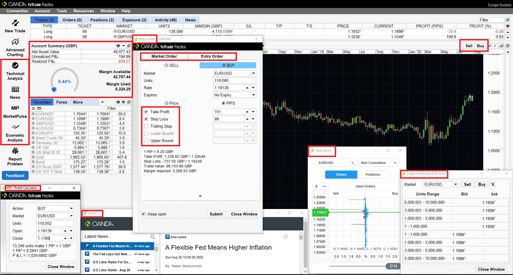

Algorithmic trading has transformed the landscape of financial markets by enabling trades to be executed with remarkable speed and efficiency. The use of sophisticated algorithms allows traders to assess vast amounts of market data, identify patterns, and act on opportunities within milliseconds. This technological advancement has opened the door to a wide range of strategies that were previously difficult or impossible to implement manually.

One platform that has distinguished itself in this domain is OANDA, renowned for its robust API offerings and adaptability in both forex and contract for difference (CFD) trading. OANDA's platform is engineered to cater to modern traders who demand immediate market access and detailed data analytics. Its APIs provide the tools necessary for traders to create and execute automated strategies, enhancing their ability to navigate the volatile financial landscape.



This article aims to explore how OANDA supports algorithmic trading through its comprehensive suite of tools and strategies. We will discuss how traders can utilize OANDA's capabilities to design algorithms tailored to their trading objectives, analyze the market with precision, and execute trades with confidence. By leveraging OANDA's offerings, traders can maximize their trading potential and gain a competitive edge in the financial markets.

## Table of Contents

## Understanding OANDA's Platform

OANDA is a notable player in the [algorithmic trading](/wiki/algorithmic-trading) landscape, primarily due to its comprehensive and capable trading platform. This platform supports an extensive range of financial instruments, with more than 90 currency pairs available for trading. Such diversity allows traders to diversify their portfolios and explore various market opportunities, making OANDA an attractive choice for [forex](/wiki/forex-system) and CFD (Contracts for Difference) trading.

The platform is designed with user-friendliness at its core, ensuring that both novice and experienced traders can navigate it with ease. One of its significant features is real-time trading capability, which is crucial for algorithmic traders who rely on timely data and rapid execution of trades to capitalize on fleeting market opportunities. OANDA also provides access to detailed historical data, which is indispensable for developing and [backtesting](/wiki/backtesting) trading strategies. This data enables traders to analyze past market behavior, identify patterns, and refine their strategies for future trades.

An essential component of OANDA's offering is its robust API (Application Programming Interface), which provides traders the ability to automate their trading strategies. The API allows for the programmatic execution of trades, development of custom algorithms, and integration with external platforms such as TradingView. TradingView is particularly popular for its powerful charting tools and social networking features, facilitating a community-driven approach to strategy development and market analysis. By integrating OANDA with TradingView, traders can leverage the strengths of both platforms, enhancing their trading capabilities.

The flexibility and functionality of the OANDA API make it possible to craft bespoke trading solutions tailored to specific needs and preferences. Traders can execute trades based on a variety of triggers and conditions, such as price levels, technical indicators, or economic events, thereby automating decision-making processes and minimizing manual intervention. This level of automation not only enhances efficiency but also helps in reducing emotional biases that may affect trading decisions.

Ultimately, OANDA's platform stands out in algorithmic trading for its versatile offerings and the ease with which traders can implement custom strategies. Whether integrating with advanced analytics platforms or utilizing the platform’s native capabilities, OANDA equips traders with the tools necessary to pursue algorithmic trading with precision and confidence.

## Connecting to OANDA Using Python

Python is a widely used programming language in algorithmic trading, appreciated for its straightforward syntax and a rich ecosystem of libraries. To engage in algorithmic trading with OANDA using Python, traders must establish a connection with the OANDA API. This process involves setting up authentication, configuring API endpoints, and leveraging specific Python libraries.

To begin, traders must authenticate their API requests. OANDA requires a valid API key to access its trading services. This key can be obtained by creating a trading account with OANDA and navigating to the API section in their account settings. Once the API key is acquired, it should be securely stored and used for authenticating requests.

The next step is configuring the API endpoints. OANDA provides both practice and live trading environments, each with distinct API endpoints. These endpoints are the URLs through which traders can send their data requests or execute trades. The base URL for the practice environment is typically `https://api-fxpractice.oanda.com`, while the live trading environment uses `https://api-fxtrade.oanda.com`.

Python libraries such as `numpy` and `pandas` are essential for data handling and analysis. `numpy` is used for numerical computations, which are crucial in financial modeling and strategy development. `pandas` is particularly useful for managing time-series data, allowing traders to organize and manipulate historical market data efficiently.

Additionally, `oandapy` is a specialized library that simplifies interactions with the OANDA API. It provides a set of tools to retrieve market data, execute trades, and monitor account information. With `oandapy`, traders can write concise and readable code to manage their trading operations. An example of initializing an API connection using `oandapy` is as follows:

```python
import oandapyV20
from oandapyV20 import API

# Replace 'YOUR_ACCESS_TOKEN' with your OANDA API key
access_token = 'YOUR_ACCESS_TOKEN'
account_id = 'YOUR_ACCOUNT_ID'

client = API(access_token=access_token)

# Example call to fetch account details
response = client.request(oandapyV20.endpoints.accounts.AccountDetails(accountID=account_id))
print(response)
```

This code snippet demonstrates how to set up a basic connection to the OANDA API using the `oandapyV20` library, establish an authenticated session, and fetch account details.

Through this integration of Python with the OANDA API, traders can automate data retrieval, backtesting, and execution of trading strategies, providing an efficient pathway to engage in modern algorithmic trading.

## Data Retrieval and Strategy Development

Data is the backbone of any trading strategy. OANDA’s API provides a powerful toolset for traders to access and retrieve historical market data, which is critical in developing and refining trading strategies. By specifying parameters such as time range, granularity, and instrument, traders can obtain precise data tailored to their strategy requirements, enabling comprehensive analysis and informed decision-making.

Backtesting represents an essential process in evaluating the efficacy of trading strategies. By running a strategy against historical data, traders can assess how their strategy would have performed under past market conditions. This process helps in identifying potential weaknesses and refining strategies before they are executed in live markets. A key measure in backtesting is ensuring there is no overfitting to past data, which can lead to poor performance in future trading.

A common strategy employed by traders involving data analysis is the use of moving averages to determine market trends. Moving averages help smooth out price data by creating a constantly updated average price. Traders often use a combination of short-term and long-term moving averages to identify trade signals. For example, a simple moving average (SMA) crossover strategy might involve the following logic:

1. Calculate the short-term and long-term moving averages.
2. Buy when the short-term moving average crosses above the long-term moving average.
3. Sell when the short-term moving average crosses below the long-term moving average.

Mathematically, the simple moving average of a dataset $P$ over $n$ periods is calculated as:

$$
SMA = \frac{P_1 + P_2 + \cdots + P_n}{n}
$$

For implementation in Python using OANDA’s API, traders can use libraries like `pandas` to handle data and calculate these averages:

```python
import pandas as pd

# Example data retrieval and moving average calculation
data = pd.DataFrame(api.get_historical_data(instrument='EUR_USD'))
short_window = 40
long_window = 100

# Calculate the simple moving averages
data['short_mavg'] = data['close'].rolling(window=short_window, min_periods=1).mean()
data['long_mavg'] = data['close'].rolling(window=long_window, min_periods=1).mean()

# Generate buy/sell signals
data['signal'] = 0
data['signal'][short_window:] = np.where(data['short_mavg'][short_window:] > data['long_mavg'][short_window:], 1, -1)
data['position'] = data['signal'].diff()
```

By using OANDA's API in conjunction with Python, traders have the capability to develop, test, and refine strategies with significant data-driven insights, thereby enhancing their potential for successful trading outcomes.

## Backtesting and Performance Evaluation

Backtesting is a crucial step in algorithmic trading that allows traders to simulate their trading strategies using historical data. This simulation helps in understanding the potential performance and associated risks before executing the strategies in live markets. The process essentially involves running a trading algorithm backward in time with historical data to see how it would have performed.

A common metric used in backtesting is the calculation of log returns. Logarithmic returns, or log returns, are preferred for their time-additive properties, which make it easier to aggregate and compare returns over different periods. The formula for calculating log return is:

$$
\text{Log Return} = \ln \left( \frac{P_t}{P_{t-1}} \right)
$$

where $P_t$ is the closing price at time $t$ and $P_{t-1}$ is the closing price at time $t-1$.

Performance metrics are vital in assessing how well a strategy might perform and help in refining it further. The number of trades executed during the backtesting period gives an idea about the strategy's activity level. A high number of trades might indicate a high-frequency trading strategy, whereas a low count could suggest a long-term [trend following](/wiki/trend-following) strategy.

Return on Investment (ROI) is another critical measure that indicates the profitability of the strategy. It is calculated by comparing the net profit to the initial investment, expressed as a percentage. A positive ROI suggests that the strategy has potential profitability. 

Volatility, commonly measured using the standard deviation of returns, is an indicator of risk. Strategies with high [volatility](/wiki/volatility-trading-strategies) may offer higher returns but also come with increased risk. It is crucial to balance the expected returns with the acceptable level of risk.

In Python, libraries such as `pandas` and `numpy` can be effectively used for these calculations. Below is a simple Python code snippet to compute these metrics:

```python
import numpy as np
import pandas as pd

# Assuming 'data' is a DataFrame with a 'Close' column for prices
data['Log Return'] = np.log(data['Close'] / data['Close'].shift(1))

# Calculate performance metrics
num_trades = data['Log Return'].count()
roi = (np.exp(data['Log Return'].sum()) - 1) * 100
volatility = data['Log Return'].std()

print(f"Number of Trades: {num_trades}")
print(f"ROI: {roi:.2f}%")
print(f"Volatility (Standard Deviation of Log Returns): {volatility:.4f}")
```

Through backtesting, traders can identify the strengths and weaknesses of their strategies, making informed decisions on whether to proceed with live trading or adjust their strategies accordingly. This step ensures that they are well-prepared to handle real-world market dynamics.

## Automating Trades with OANDA

Once a trader is satisfied with a strategy’s performance during backtesting, it can be automated for real-time execution using OANDA’s API. Automation involves setting up market signals that prompt trade execution upon meeting predefined conditions. These conditions might include price threshold breaches or significant market trend reversals.

To implement automated trading, traders can leverage OANDA's API to monitor market conditions and execute trades based on specific algorithms. Python is frequently used due to its robust support ecosystem. A basic automated trading setup might look like this in Python:

```python
import oandapyV20
from oandapyV20.contrib.requests import MarketOrderRequest
from oandapyV20.endpoints.orders import OrdersCreate

client = oandapyV20.API(access_token="YOUR_ACCESS_TOKEN")

order = MarketOrderRequest(
    instrument="EUR_USD",
    units=100,
    priceBound=1.2050  # Set a price threshold
)

r = OrdersCreate(accountID="YOUR_ACCOUNT_ID", data=order.data)
client.request(r)
```

This script sets up a market order where a trade is executed if the specified instrument, such as EUR/USD, reaches the defined price threshold. Real-time trade execution enables traders to respond instantaneously to market changes, facilitating transactions at optimal moments without manual intervention.

Automated trading reduces emotional interference by adhering strictly to predefined strategies. Traders can optimize strategies to exploit market opportunities around the clock, beyond normal working hours. This 24/7 capability is particularly beneficial in the forex market, where trading occurs continuously across different global markets. Studies have shown that automated trading can potentially lead to better decision-making and consistency in execution compared to manual trading (Menkhoff, 2010).

In implementing automated trading, it is crucial to ensure robust error handling and monitoring. This will prevent unexpected behavior due to network disruptions or erroneous data. Additionally, continuous optimization and strategy updates are necessary to adapt to evolving market conditions. Thus, OANDA’s API provides a solid foundation, enabling traders to execute and manage automated trading strategies effectively.

## Advanced Trading Techniques

OANDA's API offers robust support for traders aiming to incorporate advanced analytics and sophisticated trading techniques into their strategies. Machine learning models are increasingly becoming essential tools in predictive analytics. These models can process large datasets to identify patterns that may not be evident through traditional analysis. By training algorithms on historical price data and employing methods such as supervised learning, traders can forecast future price movements, enabling more informed trade decisions. Python libraries like scikit-learn and TensorFlow facilitate the integration of [machine learning](/wiki/machine-learning) into trading models.

High-frequency trading ([HFT](/wiki/high-frequency-trading-strategies)) is another strategy that benefits from OANDA's API capabilities. HFT involves executing a large number of trades within fractions of a second, capitalizing on minute price disparities. This approach requires sophisticated algorithms and a robust infrastructure capable of handling real-time data processing and order execution. The API's low-latency data feeds and efficient execution capabilities are well-suited for HFT strategies.

Sentiment analysis provides another layer of insight by assessing the mood of the market, which can affect price trends. By evaluating social media feeds, news articles, and other textual data using natural language processing (NLP) techniques, traders can gauge market sentiment. Python libraries like NLTK and spaCy enable the application of NLP in algorithmic trading by extracting and analyzing text-based data.

Educational platforms such as QuantInsti offer courses that help traders enhance their skills in these advanced areas. These resources provide training on utilizing modern tools and techniques, ensuring traders are equipped to harness the full potential of algorithmic trading with OANDA.

## Conclusion

Conclusion

OANDA’s trading platform, with its robust API, offers unparalleled tools and versatility for algorithmic traders. By utilizing this API alongside Python, traders can develop and implement advanced trading strategies efficiently. The synergy between Python's rich programming ecosystem and OANDA's comprehensive market data facilitates the seamless crafting, testing, and execution of trading algorithms. Whether you are a novice or a seasoned trader, OANDA provides essential capabilities to enhance your trading experience. With its support for a wide range of financial instruments and real-time trading functionality, OANDA empowers traders to make informed decisions and capitalize on opportunities in the dynamic financial markets.

## References & Further Reading

[1]: Menkhoff, L. (2010). ["The Use of Technical Analysis by Fund Managers: International Evidence."](https://www.sciencedirect.com/science/article/pii/S0378426610001755) Journal of Banking & Finance.

[2]: ["Advances in Financial Machine Learning"](https://www.amazon.com/Advances-Financial-Machine-Learning-Marcos/dp/1119482089) by Marcos Lopez de Prado

[3]: ["Evidence-Based Technical Analysis: Applying the Scientific Method and Statistical Inference to Trading Signals"](https://www.amazon.com/Evidence-Based-Technical-Analysis-Scientific-Statistical/dp/0470008741) by David Aronson

[4]: ["Python for Finance: Mastering Data-Driven Finance"](https://books.google.com/books/about/Python_for_Finance.html?id=2qd9DwAAQBAJ) by Yves Hilpisch

[5]: ["Machine Learning for Algorithmic Trading"](https://github.com/stefan-jansen/machine-learning-for-trading) by Stefan Jansen