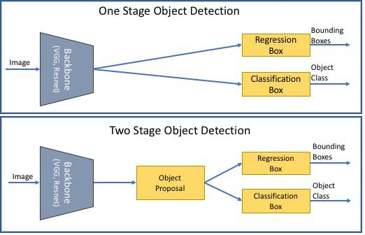

## Table of Contents

## What is object detection in the context of machine learning?

Object detection in machine learning is a technology that helps computers find and identify objects in pictures or videos. Imagine you have a photo with lots of things in it, like cars, people, and animals. Object detection can tell you where each car, person, or animal is in the photo and what they are. It's like playing a game of "I Spy" but with a computer doing the searching.

This technology uses special math formulas and computer programs to look at the pixels in an image. It then decides what those groups of pixels represent. For example, it might use a formula to figure out the edges of objects and then compare those shapes to known objects. This process can be very fast, allowing the computer to find and label many objects in just a few seconds. Object detection is used in many places, like self-driving cars to spot pedestrians, or in security cameras to find unusual activity.

## How does object detection differ from image classification?

Object detection and image classification are both used in machine learning to understand pictures, but they do different things. Image classification is like looking at a whole picture and saying what it is about. For example, if you show a computer a picture of a dog, image classification would just tell you, "This is a dog." It doesn't care where the dog is in the picture or if there are other things in the picture too.

On the other hand, object detection is more detailed. It not only tells you what is in the picture but also shows you where those things are. Using the same dog picture, object detection would say, "There's a dog here," and it would draw a box around the dog to show exactly where it is. If there were other things in the picture, like a ball or a tree, object detection would find those too and show where they are. So, object detection gives you more information about what's in the picture and where everything is located.

## What are the main components of an object detection model?

An object detection model is made up of two main parts: a backbone and a head. The backbone is like the brain of the model. It looks at the picture and turns it into something the computer can understand better. It does this by breaking down the picture into smaller pieces and figuring out what those pieces might be. The backbone often uses a special type of math called a [convolutional [neural network](/wiki/neural-network)](/wiki/convolutional-neural-network) (CNN) to do this. The head is like the eyes of the model. It takes what the backbone figured out and uses it to find and label the objects in the picture. The head decides where to draw the boxes around the objects and what to call them.

The second important part of an object detection model is the loss function. This part helps the model learn from its mistakes. When the model guesses wrong, the loss function tells it how far off it was. The model then tries to do better next time. A common loss function for object detection is a combination of classification loss, which checks if the labels are right, and localization loss, which checks if the boxes are in the right spots. The model keeps practicing with lots of pictures until it gets really good at finding and labeling objects.

To make the model work well, we also need a good way to train it. This usually involves a dataset with lots of pictures that have already been labeled. The model looks at these pictures and tries to match the labels. It uses a process called backpropagation to adjust its guesses and get better over time. With enough practice, the object detection model can become very accurate at finding and labeling objects in new pictures it has never seen before.

## Can you explain the basic workflow of a typical object detection model?

When you use an object detection model, it starts by taking in a picture. The first thing it does is use a special part called the backbone to look at the picture. The backbone breaks the picture down into smaller pieces and uses math to figure out what those pieces might be. This part often uses a [convolutional neural network](/wiki/convolutional-neural-network) (CNN) to do its job. The backbone turns the picture into a format that the computer can understand better. It's like the model is trying to see the picture in a new way.

After the backbone does its work, the next step is for the head of the model to take over. The head looks at what the backbone figured out and uses that information to find and label the objects in the picture. It draws boxes around the objects and puts labels on them, like "dog" or "car." The head also uses math to decide where the boxes should go and what the labels should say. If the model makes a mistake, a part called the loss function helps it learn from that mistake. The loss function tells the model how far off it was, and the model tries to do better next time. With lots of practice on many pictures, the model gets better and better at finding and labeling objects correctly.

## What are some common evaluation metrics used for object detection models?

When we want to see how good an object detection model is, we use special ways to measure it. One common way is called Intersection over Union (IoU). IoU looks at how much the box the model drew around an object matches up with the real box around the object. If the model's box and the real box overlap a lot, the IoU score is high, which means the model did a good job. We can use a formula to find the IoU: $$ \text{IoU} = \frac{\text{Area of Overlap}}{\text{Area of Union}} $$. Another important measure is called Average Precision (AP). AP looks at how well the model finds all the right objects and labels them correctly. It's like a score that tells us how accurate the model is overall.

Another way to measure how good an object detection model is, is by using Mean Average Precision (mAP). mAP is like AP, but it looks at how well the model does across different types of objects. If the model is good at finding and labeling many different things, its mAP score will be high. We also use something called Precision and Recall. Precision tells us how many of the objects the model found were actually correct, while Recall tells us how many of the real objects the model was able to find. These measures help us understand if the model is good at finding all the objects it should, and if it's good at not making mistakes.

## How does Faster R-CNN improve upon the original R-CNN model?

Faster R-CNN improves on the original R-CNN model by making it faster and more efficient. The original R-CNN had to look at each possible object in a picture one by one, which took a lot of time. Faster R-CNN uses a special part called a Region Proposal Network (RPN) that quickly finds places in the picture where objects might be. This means the model doesn't have to check every part of the picture, so it can work much faster. Also, Faster R-CNN shares the work between the part that finds objects and the part that labels them, which saves even more time.

Another way Faster R-CNN is better is that it uses a single network to do both finding and labeling objects. In the original R-CNN, these were done by separate networks, which made the process slower. By combining these tasks, Faster R-CNN can process pictures more quickly and still be just as accurate. This makes it a much better choice for things like real-time object detection in videos or self-driving cars, where speed is very important.

## What are the key differences between YOLOv3 and YOLOv8?

YOLOv3 and YOLOv8 are both versions of the YOLO (You Only Look Once) object detection model, but they have some important differences. YOLOv3 was released in 2018 and uses three different scales to detect objects, which helps it find objects of different sizes. It also uses a method called "Darknet-53" as its backbone, which is good at understanding the features in an image. YOLOv3 is known for being fast and works well for real-time object detection. However, it can sometimes struggle with small objects or when there are many objects close together in a picture.

YOLOv8, on the other hand, came out much later and includes many improvements over YOLOv3. It uses a more advanced backbone called "CSPDarknet" which is better at capturing details in an image. YOLOv8 also introduces a new way to handle different object sizes and shapes, making it more accurate, especially for small objects. Additionally, YOLOv8 has better methods for training the model, which means it can learn from data more effectively and perform better on new pictures it hasn't seen before. Overall, YOLOv8 is faster and more accurate than YOLOv3, making it a more powerful tool for object detection tasks.

## How does SSD achieve real-time object detection?

SSD, which stands for Single Shot MultiBox Detector, achieves real-time object detection by using a single neural network to do both finding and labeling objects in one go. This means it doesn't need to look at the picture multiple times like some other models do. Instead, SSD breaks the picture into smaller parts and checks each part for objects. It uses different sizes of these parts to find objects of different sizes, which helps it work quickly and still be accurate.

Another way SSD speeds things up is by using a simpler backbone network compared to some other models. This backbone, often a type of network called VGG, helps SSD process images faster without losing too much accuracy. By combining these methods, SSD can detect objects in real-time, making it useful for things like video surveillance or self-driving cars where speed is important.

## What advancements does Mask R-CNN bring to object detection and segmentation?

Mask R-CNN improves on earlier models like Faster R-CNN by adding a new feature called instance segmentation. This means it can not only find and label objects in a picture but also draw a detailed outline around each object. Imagine you have a picture with several dogs. Mask R-CNN can tell you where each dog is, what kind of dog it is, and even draw a precise shape around each dog to show exactly where it starts and ends. This is different from just drawing a box around the dog, which is what models like Faster R-CNN do. The addition of instance segmentation makes Mask R-CNN very useful for tasks where you need to know the exact shape of objects, like in medical imaging or robotics.

Mask R-CNN achieves this by adding a new part to the model called the mask head. This part works alongside the existing parts that find and label objects. After the model finds an object and draws a box around it, the mask head creates a detailed mask for that object. The mask is like a coloring book outline that shows the exact shape of the object. This process is done for every object in the picture, making the model's output much more detailed. By combining object detection with instance segmentation, Mask R-CNN provides a more complete understanding of what's in a picture, which is why it's considered a big step forward in computer vision.

## Can you describe the architecture and benefits of using DETR for object detection?

DETR, which stands for Detection Transformer, is a new way to do object detection that makes things simpler and easier to understand. Unlike older models that use lots of special parts and steps, DETR uses a transformer, which is a type of math model that's good at understanding patterns in data. The DETR model starts by looking at the whole picture and turning it into something called a feature map. Then, it uses a part called the encoder to break down this feature map into smaller pieces. After that, the decoder part of the transformer looks at these pieces and figures out where the objects are and what they are. It does this by matching the pieces to a set number of object queries, which are like guesses about what might be in the picture. This way, DETR can find and label objects without needing to draw boxes around them first.

One big benefit of using DETR is that it's easier to train and understand. Because it uses a transformer, which is good at handling different kinds of data, DETR can learn from pictures more effectively. This means it can be more accurate at finding and labeling objects, especially when there are many different kinds of objects in a picture. Another advantage is that DETR doesn't need to use special tricks to find objects of different sizes or shapes. It can handle all of that naturally, which makes it a powerful tool for object detection tasks. By using DETR, you can get good results without having to worry about all the complicated parts that other models need.

## How do recent models like YOLOX and EfficientDet enhance performance and efficiency?

YOLOX enhances performance and efficiency by using a new way to find objects called the "anchor-free" method. In older versions of YOLO, the model would guess where objects might be by drawing boxes in certain places, called anchors. But YOLOX doesn't need these anchors. Instead, it looks at the whole picture and directly predicts where the objects are. This makes the model simpler and faster because it doesn't have to check a lot of different guesses. YOLOX also uses a special way to train the model called "Decoupled Head," which helps it learn better and be more accurate. By making these changes, YOLOX can detect objects more quickly and with less confusion, making it great for real-time tasks like video surveillance or self-driving cars.

EfficientDet improves performance and efficiency by using a smart way to balance speed and accuracy. It uses something called "BiFPN" (Bidirectional Feature Pyramid Network) to look at the picture in different ways and combine what it sees. This helps the model find objects of different sizes and shapes more accurately. EfficientDet also uses a special type of backbone called "EfficientNet," which is designed to be very good at understanding images while using less computer power. By putting these parts together, EfficientDet can detect objects very accurately without needing a lot of time or computer resources. This makes it a good choice for tasks where you need to find objects quickly and with high precision, like in medical imaging or security systems.

## What are the latest trends and future directions in object detection research?

The latest trends in object detection research focus on making models faster, more accurate, and able to work with less data. One big trend is using transformers, like in the DETR model, which can understand the whole picture at once instead of looking at parts one by one. This makes the models simpler and easier to train. Another trend is using fewer labels to train models, which is called semi-supervised or self-supervised learning. This is important because getting lots of labeled data can be hard and expensive. Researchers are also working on making models that can detect objects in 3D, which is useful for things like self-driving cars and robotics. These models need to understand the depth and shape of objects, which is more complicated than just looking at a flat picture.

Future directions in object detection research aim to make models even better at handling real-world challenges. One direction is improving the ability of models to detect small or hard-to-see objects, which is still a big problem. Researchers are also looking into making models that can learn from video, not just still pictures. This could help with things like tracking objects over time or understanding how objects move. Another future direction is making models that can explain their decisions, which is called explainable AI. This is important for building trust in the models and making sure they are fair and unbiased. Overall, the goal is to create object detection models that are fast, accurate, and easy to use in many different situations.

## References & Further Reading

[1]: Girshick, R., Donahue, J., Darrell, T., & Malik, J. (2014). ["Rich feature hierarchies for accurate object detection and semantic segmentation."](https://ieeexplore.ieee.org/document/6909475) Proceedings of the IEEE Conference on Computer Vision and Pattern Recognition.

[2]: Ren, S., He, K., Girshick, R., & Sun, J. (2015). ["Faster R-CNN: Towards Real-Time Object Detection with Region Proposal Networks."](https://ieeexplore.ieee.org/document/7485869) Proceedings of the 2015 IEEE International Conference on Computer Vision (ICCV).

[3]: Redmon, J., & Farhadi, A. (2018). ["YOLOv3: An Incremental Improvement."](https://arxiv.org/abs/1804.02767) arXiv preprint arXiv:1804.02767.

[4]: Bochkovskiy, A., Wang, C., & Liao, H.M. (2020). ["YOLOv4: Optimal Speed and Accuracy of Object Detection."](https://arxiv.org/abs/2004.10934) arXiv preprint arXiv:2004.10934.

[5]: Carion, N., Massa, F., Synnaeve, G., Usunier, N., Kirillov, A., & Zagoruyko, S. (2020). ["End-to-End Object Detection with Transformers."](https://arxiv.org/abs/2005.12872) European Conference on Computer Vision.

[6]: Lin, T.Y., Dollár, P., Girshick, R., He, K., Hariharan, B., & Belongie, S. (2017). ["Feature Pyramid Networks for Object Detection."](https://ieeexplore.ieee.org/document/8099589) Proceedings of the IEEE Conference on Computer Vision and Pattern Recognition.

[7]: He, K., Gkioxari, G., Dollár, P., & Girshick, R. (2017). ["Mask R-CNN."](https://ieeexplore.ieee.org/document/8237584) Proceedings of the IEEE International Conference on Computer Vision.

[8]: Tan, M., Pang, R., & Le, Q.V. (2020). ["EfficientDet: Scalable and Efficient Object Detection."](https://arxiv.org/abs/1911.09070) Proceedings of the IEEE/CVF Conference on Computer Vision and Pattern Recognition.

[9]: Ge, Z., Liu, S., Wang, F., Li, Z., & Sun, J. (2021). ["YOLOX: Exceeding YOLO Series in 2021."](https://arxiv.org/abs/2107.08430) arXiv preprint arXiv:2107.08430.

[10]: Liu, W., Anguelov, D., Erhan, D., Szegedy, C., Reed, S., Fu, C.Y., & Berg, A.C. (2016). ["SSD: Single Shot MultiBox Detector."](https://arxiv.org/abs/1512.02325) European Conference on Computer Vision.