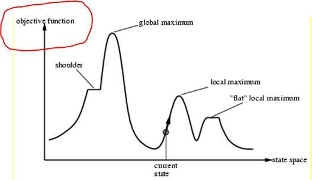

## Table of Contents

## What is an objective function in the context of machine learning?

An objective function in machine learning is like a guide that helps the algorithm figure out the best way to do its job. Imagine you're trying to find the shortest path to a friend's house. The objective function would be like a map that shows you different routes and tells you which one is the shortest. In machine learning, this function measures how well the model is doing and helps it adjust to do better. The goal is to minimize or maximize this function, depending on what you're trying to achieve. For example, if you're trying to predict house prices, the objective function could measure the difference between the predicted prices and the actual prices, and the model would try to make this difference as small as possible.

Mathematically, an objective function can be represented as $$ J(\theta) $$, where $$ \theta $$ represents the parameters of the model. The function $$ J(\theta) $$ calculates a value based on these parameters and the data the model is trained on. The model then adjusts its parameters to either minimize or maximize $$ J(\theta) $$, depending on the task. For instance, in a regression problem, the objective might be to minimize the mean squared error, which is calculated as $$ J(\theta) = \frac{1}{n} \sum_{i=1}^{n} (y_i - \hat{y}_i)^2 $$, where $$ y_i $$ is the actual value, $$ \hat{y}_i $$ is the predicted value, and $$ n $$ is the number of data points. By tweaking the parameters $$ \theta $$, the model aims to make the predictions as close as possible to the actual values, thus reducing the error.

## Why is the objective function important in machine learning models?

The objective function is super important in machine learning because it tells the model what to aim for. Think of it like a coach for a sports team. The coach sets goals for the players, like scoring more points or running faster. In machine learning, the objective function sets a goal for the model, like making better predictions or sorting things correctly. Without this goal, the model wouldn't know how to improve or what to focus on. It's like trying to win a game without knowing the rules or the score!

The objective function also helps the model learn from its mistakes. When the model makes a prediction, the objective function measures how far off the prediction is from the actual result. For example, if you're trying to predict the price of a house, the objective function might use a formula like $$ J(\theta) = \frac{1}{n} \sum_{i=1}^{n} (y_i - \hat{y}_i)^2 $$ to see how big the errors are. The model then uses this information to tweak its settings, trying to make the errors smaller each time. This process keeps going until the model can't get any better at its job. So, the objective function is like a teacher, showing the model where it went wrong and how to do better next time.

## How does an objective function differ from a cost function or loss function?

In [machine learning](/wiki/machine-learning), the terms "objective function," "cost function," and "loss function" are often used interchangeably, but they can have slightly different meanings depending on the context. An objective function is a broad term that refers to the function that the model aims to optimize. It can be either minimized or maximized based on the specific goal of the model. For example, in a classification problem, the objective might be to maximize the accuracy of predictions, while in a regression problem, the objective could be to minimize the difference between predicted and actual values.

A loss function, on the other hand, typically refers to the function that measures the error for a single training example. It quantifies how wrong the model's prediction is for that specific instance. For instance, in a regression problem, a common loss function is the mean squared error, calculated as $$ J(\theta) = \frac{1}{n} \sum_{i=1}^{n} (y_i - \hat{y}_i)^2 $$, where $$ y_i $$ is the actual value, $$ \hat{y}_i $$ is the predicted value, and $$ n $$ is the number of data points. The model tries to minimize this loss function to improve its predictions.

A cost function is often used to describe the average loss over the entire training dataset. It aggregates the loss across all examples to give a single value that represents the model's overall performance. Essentially, the cost function helps in tuning the model's parameters to minimize the total error across all data points. While the terms "loss" and "cost" are sometimes used interchangeably, "cost" generally refers to a more global measure of error, whereas "loss" is more specific to individual predictions.

## Can you provide examples of common objective functions used in machine learning?

In machine learning, one of the most common objective functions used in regression problems is the Mean Squared Error (MSE). MSE measures the average of the squared differences between the predicted values and the actual values. The formula for MSE is $$ J(\theta) = \frac{1}{n} \sum_{i=1}^{n} (y_i - \hat{y}_i)^2 $$, where $$ y_i $$ is the actual value, $$ \hat{y}_i $$ is the predicted value, and $$ n $$ is the number of data points. The goal is to minimize this function, making the predictions as close as possible to the actual values.

For classification problems, a widely used objective function is the Cross-Entropy Loss, also known as Log Loss. This function measures how well the model's predicted probabilities match the actual class labels. If you have two classes, the formula for binary cross-entropy loss is $$ J(\theta) = -\frac{1}{n} \sum_{i=1}^{n} [y_i \log(\hat{y}_i) + (1 - y_i) \log(1 - \hat{y}_i)] $$. Here, $$ y_i $$ is the actual class label (0 or 1), and $$ \hat{y}_i $$ is the predicted probability of the positive class. The model aims to minimize this loss, making the predicted probabilities as accurate as possible.

Another example is the Accuracy, which is often used as an objective function in classification tasks. While not a loss function in the traditional sense, it can be used as an objective to maximize. Accuracy is simply the proportion of correct predictions to the total number of predictions, calculated as $$ \text{Accuracy} = \frac{\text{Number of correct predictions}}{\text{Total number of predictions}} $$. The goal here is to maximize this value, achieving the highest possible percentage of correct predictions.

## How do you choose the right objective function for a specific machine learning task?

Choosing the right objective function for a machine learning task depends on what you're trying to achieve and the type of problem you're solving. If you're working on a regression problem, where you're trying to predict a number, like the price of a house, you might want to use the Mean Squared Error (MSE) as your objective function. MSE measures how far off your predictions are from the actual values, and you want to make this number as small as possible. The formula for MSE is $$ J(\theta) = \frac{1}{n} \sum_{i=1}^{n} (y_i - \hat{y}_i)^2 $$, where $$ y_i $$ is the actual value, $$ \hat{y}_i $$ is the predicted value, and $$ n $$ is the number of data points. By minimizing MSE, your model will try to make its predictions as close as possible to the real values.

For classification problems, where you're trying to sort things into different categories, like deciding if an email is spam or not, you might use the Cross-Entropy Loss. This function measures how well your model's predicted probabilities match the actual categories. The formula for binary cross-entropy loss is $$ J(\theta) = -\frac{1}{n} \sum_{i=1}^{n} [y_i \log(\hat{y}_i) + (1 - y_i) \log(1 - \hat{y}_i)] $$, where $$ y_i $$ is the actual class label (0 or 1), and $$ \hat{y}_i $$ is the predicted probability of the positive class. By minimizing this loss, your model will try to make its predictions as accurate as possible. Sometimes, you might also use Accuracy as an objective function, which is just the percentage of correct predictions. You want to maximize this value to get the highest possible accuracy.

## What are the key properties that an effective objective function should have?

An effective objective function should be clear and easy to understand. It needs to tell the model exactly what to aim for, like making predictions as close as possible to the real values or sorting things correctly into categories. If the objective function is too complicated, the model might have a hard time figuring out how to improve. Also, the function should be smooth and continuous, so small changes in the model's parameters lead to small changes in the function's value. This makes it easier for the model to learn and adjust its parameters. A good example of a smooth and continuous function is the Mean Squared Error (MSE), which is calculated as $$ J(\theta) = \frac{1}{n} \sum_{i=1}^{n} (y_i - \hat{y}_i)^2 $$, where $$ y_i $$ is the actual value, $$ \hat{y}_i $$ is the predicted value, and $$ n $$ is the number of data points.

Another important property of an effective objective function is that it should be differentiable. This means you can calculate its slope at any point, which is crucial for many optimization algorithms like gradient descent. These algorithms use the slope to figure out which direction to adjust the model's parameters to make the objective function better. If the function isn't differentiable, these algorithms won't work well. Lastly, the objective function should be relevant to the task at hand. For example, if you're trying to predict house prices, using MSE as your objective function makes sense because it directly measures how far off your predictions are from the actual prices. But if you're trying to sort emails into spam or not spam, using Cross-Entropy Loss would be better because it measures how well your model's predicted probabilities match the actual categories.

## How does the optimization of an objective function work in training a machine learning model?

When you train a machine learning model, you're trying to make it better at its job by adjusting its settings, or parameters. The objective function helps guide this process by telling the model how well it's doing. Imagine you're trying to find the shortest path to a friend's house. The objective function is like a map that shows you different routes and tells you which one is the shortest. In machine learning, the model uses the objective function to figure out which way to tweak its parameters to make better predictions or sort things more accurately. For example, if you're trying to predict house prices, the objective function could be the Mean Squared Error (MSE), calculated as $$ J(\theta) = \frac{1}{n} \sum_{i=1}^{n} (y_i - \hat{y}_i)^2 $$, where $$ y_i $$ is the actual price, $$ \hat{y}_i $$ is the predicted price, and $$ n $$ is the number of houses. The model tries to make this number as small as possible by adjusting its parameters.

The process of optimizing the objective function often involves using algorithms like gradient descent. These algorithms look at the slope of the objective function, which tells them which direction to move the parameters to make the function better. If the slope is positive, the algorithm knows to move the parameters in the opposite direction to make the function smaller. If the slope is negative, it moves the parameters in the positive direction. This process keeps going, with the model making small adjustments to its parameters, until the objective function can't get any better. It's like climbing down a hill to find the lowest point; you keep taking steps in the direction that feels like it's going downhill until you can't go any lower. This way, the model learns from its mistakes and improves over time.

## What are some challenges faced when optimizing objective functions in complex models?

Optimizing objective functions in complex models can be tricky because these models often have a lot of parameters to adjust. Imagine trying to solve a puzzle with thousands of pieces; it's hard to figure out which piece to move next to make the picture clearer. In machine learning, this means the model might get stuck in a place where it thinks it's doing well, but it's not the best it can do. This is called a local minimum, and it's like being at the bottom of a small valley when there's a deeper valley nearby. The model needs to keep searching to find the global minimum, which is the best solution overall. Sometimes, the objective function itself can be bumpy or have sudden changes, making it hard for the model to figure out which way to go. This is like trying to walk down a path with lots of rocks and holes; you have to be careful not to trip or get stuck.

Another challenge is that optimizing the objective function can take a long time, especially with big datasets. It's like trying to find the shortest path on a huge map; it takes a lot of time to check all the possible routes. Algorithms like gradient descent can help, but they need to make small steps in the right direction, and if the steps are too big or too small, the model might not learn as well as it could. Also, if the model is too complex, it might start to memorize the data instead of learning from it, which is called overfitting. This is like trying to remember every detail of a story instead of understanding the main points. To avoid this, techniques like regularization can be used, which add a little penalty to the objective function to keep the model from getting too complicated. So, optimizing objective functions in complex models is a balancing act, trying to find the best solution without getting stuck or taking too long.

## How can the choice of objective function affect the bias-variance tradeoff in a model?

The choice of objective function can really impact the bias-variance tradeoff in a machine learning model. Think of the bias-variance tradeoff like trying to hit a target with a bow and arrow. If your arrows always land in the same spot but far from the bullseye, that's high bias - your model is too simple and misses the mark. If your arrows are all over the place but some hit the bullseye, that's high variance - your model is too complex and can't predict consistently. The objective function helps guide the model to find the right balance. For example, if you use Mean Squared Error (MSE) as your objective function, calculated as $$ J(\theta) = \frac{1}{n} \sum_{i=1}^{n} (y_i - \hat{y}_i)^2 $$, the model will try to minimize the difference between predictions and actual values. This can lead to lower bias because the model is trying to fit the data closely, but it might increase variance if the model becomes too sensitive to the training data.

On the other hand, if you use a different objective function like Mean Absolute Error (MAE), calculated as $$ J(\theta) = \frac{1}{n} \sum_{i=1}^{n} |y_i - \hat{y}_i| $$, the model might be less sensitive to outliers, which can help reduce variance. However, this might come at the cost of higher bias because the model isn't trying to fit the data as tightly. Sometimes, you might add a regularization term to the objective function, like in Ridge Regression where you add $$ \lambda \sum_{j=1}^{p} \theta_j^2 $$ to the MSE. This helps to control the complexity of the model, reducing variance at the expense of a bit more bias. So, the choice of objective function is like choosing the right type of arrow for your bow - it can make a big difference in how well you hit the target.

## What advanced techniques can be used to improve the optimization of objective functions?

One advanced technique to improve the optimization of objective functions is using stochastic gradient descent (SGD). Instead of looking at all the data at once, SGD looks at just a small part of it each time. This makes the process faster and can help the model find better solutions by avoiding getting stuck in one place. Imagine you're trying to find the best path through a forest. Instead of looking at the whole forest at once, you look at small sections. This way, you can keep moving and exploring different paths without getting stuck in one spot. In SGD, the model updates its parameters based on a small batch of data, which can be represented as $$ \theta = \theta - \alpha \nabla J(\theta; x^{(i)}, y^{(i)}) $$, where $$ \alpha $$ is the learning rate, and $$ \nabla J(\theta; x^{(i)}, y^{(i)}) $$ is the gradient of the objective function for a single example or a small batch.

Another technique is using adaptive learning rate methods like Adam or RMSprop. These methods change the learning rate for each parameter based on how the model is doing. If a parameter is moving in the right direction, the learning rate might get bigger to help it move faster. If it's not, the learning rate might get smaller to help it be more careful. This can make the model learn faster and more accurately. For example, Adam adjusts the learning rate using both the first and second moments of the gradients, which can be represented as $$ \theta = \theta - \alpha \frac{\hat{m}_t}{\sqrt{\hat{v}_t} + \epsilon} $$, where $$ \hat{m}_t $$ and $$ \hat{v}_t $$ are the bias-corrected estimates of the first and second moments, and $$ \epsilon $$ is a small constant to prevent division by zero. By using these advanced techniques, the model can find better solutions and optimize the objective function more effectively.

## How do multi-objective optimization problems arise in machine learning, and how are they handled?

In machine learning, multi-objective optimization problems come up when you want to achieve more than one goal at the same time. Imagine you're trying to predict house prices, but you also want to make sure your model is simple and easy to understand. One goal might be to make the predictions as accurate as possible, which you can measure using the Mean Squared Error (MSE), calculated as $$ J(\theta) = \frac{1}{n} \sum_{i=1}^{n} (y_i - \hat{y}_i)^2 $$. Another goal might be to keep the model simple, which you can measure using the number of parameters or a regularization term. Balancing these goals can be tricky because improving one might make the other worse. For example, making the model more accurate might make it more complex, and making it simpler might reduce its accuracy.

To handle multi-objective optimization, you can use techniques like the Pareto front, which shows all the best possible solutions where improving one objective would make another worse. Another approach is to combine the objectives into a single function, like using a weighted sum. For instance, you might add a regularization term to the MSE to balance accuracy and simplicity, creating an objective function like $$ J(\theta) = \frac{1}{n} \sum_{i=1}^{n} (y_i - \hat{y}_i)^2 + \lambda \sum_{j=1}^{p} \theta_j^2 $$, where $$ \lambda $$ is a parameter that controls how much you care about simplicity. By adjusting $$ \lambda $$, you can find a good balance between the two goals. These methods help you find the best solution that considers all your objectives without favoring one too much over the others.

## What are some recent research developments in the design and use of objective functions in machine learning?

Recent research in machine learning has focused on developing more flexible and adaptive objective functions. One exciting development is the use of meta-learning to create objective functions that can adapt to different tasks and datasets. For example, researchers have proposed using meta-learning to automatically adjust the weights of different loss components in multi-objective optimization. This means the model can learn which aspects of the task are most important and adjust its focus accordingly. Another area of research is the development of objective functions that can handle imbalanced datasets better. Traditional objective functions like cross-entropy loss can struggle with imbalanced data, so researchers have been working on new loss functions that give more weight to underrepresented classes, helping the model learn more effectively from all parts of the data.

Another significant development is the exploration of objective functions that incorporate fairness and ethical considerations. As machine learning models are increasingly used in sensitive applications like hiring and loan approvals, there's a growing need to ensure these models don't unfairly disadvantage certain groups. Researchers have been designing objective functions that include fairness constraints, like $$ J(\theta) = \text{loss} + \lambda \cdot \text{fairness penalty} $$, where $$ \lambda $$ controls the importance of fairness relative to the traditional loss. This approach helps balance model performance with ethical considerations. Additionally, there's ongoing research into objective functions that can handle uncertainty and robustness, making models more reliable in real-world scenarios where data might be noisy or incomplete. These advancements show how the design of objective functions continues to evolve to meet new challenges and requirements in machine learning.