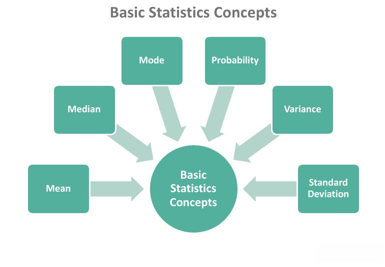

In the world of finance and trading, the role of probability is crucial in facilitating effective decision-making. Probability provides a structured approach to understanding and managing uncertainty, making it a fundamental component in the development of trading strategies and risk management frameworks. This article explores the concept of objective probability and its application in probability theory, focusing on its relevance in algorithmic trading.

Objective probability, rooted in empirical evidence, offers traders a way to make decisions based on statistical analysis rather than subjective judgment. Utilizing principles such as the law of large numbers, it helps ensure that the predictions are reliable and consistent, enhancing the precision of financial models. By analyzing historical data, traders can employ objective probability to predict future events more accurately, thereby refining their trading strategies.



Probability theory is imperative in quantitatively analyzing financial markets, providing traders with a mathematical framework to tackle the inherent uncertainty in trading. It enables the formulation of trading algorithms by defining sample spaces, events, and probability measures, crucial elements in algorithmic trading.

Practical examples of probability in finance include modeling stock price movements and assessing risk in asset pricing. Moreover, probability theory supports the application of various estimation techniques, like Monte Carlo simulations and Maximum Likelihood Estimation, which are pivotal in risk management and algorithmic strategy development.

Understanding probability not only improves decision-making but also enhances risk assessment, offering traders a robust foundation for constructing effective hedging strategies. While objective probability is not devoid of limitations, such as data dependency and market dynamics, its contribution to finance is undeniable. This article seeks to provide insights into how traders can leverage objective probability to optimize their trading outcomes and navigate the complexities of financial markets more effectively.

## Table of Contents

## Objective Probability: Definition and Principles

Objective probability refers to the likelihood of an event occurring based on factual evidence and statistical analysis. Unlike subjective probability, which relies on personal judgment and intuition, objective probability is rooted in empirical data and mathematical precision. This form of probability seeks to provide an accurate and consistent framework for understanding the potential outcomes of uncertain events.

A fundamental principle underlying objective probability is the law of large numbers. This statistical theorem posits that as the number of trials or observations of an event increases, the observed probability approaches the true probability. The law of large numbers ensures that conclusions drawn from large datasets are reliable and reflective of actual probabilities, thereby reducing random variations.

Using objective probability allows for stable and reliable predictions about future events by analyzing historical data. For instance, the probability of rolling a specific number on a fair six-sided die is objectively determined to be $\frac{1}{6}$ since there are six possible outcomes, each equally likely, assuming fair conditions. Such probabilities do not change irrespective of any observer's personal beliefs or biases.

Objective probability plays a crucial role in fields like finance, where it is used to assess risks and forecast trends based on historical market data. By applying statistical methods, analysts can construct probability distributions that help predict stock price movements, interest rates, or other financial metrics. This reliance on historical data helps formulate strategies that are grounded in observed patterns rather than speculative guesswork, although it also requires careful consideration of the dynamic nature of markets. As financial environments evolve, the assumptions about probability distributions must be re-evaluated and updated to maintain their accuracy and relevance.

In summary, objective probability provides a systematic approach to predicting events by utilizing factual evidence and large datasets, ensuring consistency and accuracy in decision-making processes across various domains.

## Examples of Objective Probability

Objective probability is a cornerstone of statistical analysis, offering a quantifiable measure of likelihood derived from empirical evidence. One of the simplest examples is determining the probability of a coin landing heads-up when flipped multiple times. Given a fair coin, the objective probability of landing heads in a single toss is 0.5. This probability is confirmed by empirical evidence through repeated trials, adhering to the law of large numbers, which states that as the number of trials increases, the experimental probability converges to the theoretical probability.

In finance, objective probability is essential for modeling stock price movements. Analysts use historical data to calculate the probability distributions of stock returns. For instance, stock prices often exhibit characteristics of a normal distribution, allowing traders to determine the likelihood of a stock's future price within a specific range. Consider the historical daily returns of a stock, which can be modeled using a normal distribution with a given mean ($\mu$) and standard deviation ($\sigma$). The probability of the stock return falling within a certain interval can be calculated using the cumulative distribution function (CDF):

$$
P(a < X < b) = \Phi\left(\frac{b - \mu}{\sigma}\right) - \Phi\left(\frac{a - \mu}{\sigma}\right)
$$

Where $\Phi$ is the CDF of the standard normal distribution.

Fintech companies leverage objective probability in risk assessment and asset pricing. A case study of a fintech firm utilizing predictive analytics might involve analyzing credit risk through objective probability. By integrating historical default data, companies can establish a probabilistic model to estimate the likelihood of future defaults. This model aids in pricing loans appropriately and managing risk more effectively.

Objective probability also plays a pivotal role in asset pricing models, such as the Black-Scholes model, which calculates the value of options. This model is grounded in the assumption of log-normal distribution of asset returns, which aligns with the principles of objective probability. By using market data to estimate parameters like [volatility](/wiki/volatility-trading-strategies) ($\sigma$) and employing the present value of expected payoffs, firms can derive fair prices for financial derivatives.

Python can be a useful tool for implementing these probabilistic calculations. Consider an example where one seeks to simulate stock returns to estimate the probability of a given return threshold:

```python
import numpy as np

# Parameters for normal distribution
mu = 0.01  # mean daily return
sigma = 0.02  # standard deviation of daily return
days = 252  # number of trading days in a year

# Simulate daily returns for one year
simulated_returns = np.random.normal(mu, sigma, days)

# Calculate probability of achieving a specific return threshold
threshold = 0.05
probability = np.mean(simulated_returns > threshold)

print(f"Probability of daily return exceeding {threshold}: {probability:.4f}")
```

This script generates simulated daily returns of a stock and calculates the probability of exceeding a specified return threshold, underlining the practical application of objective probability in financial analysis.

## Probability Theory in Algorithmic Trading

Probability theory is fundamental to [algorithmic trading](/wiki/algorithmic-trading), offering a robust mathematical framework to address the inherent uncertainty in financial markets. Central to this approach are the concepts of sample spaces, events, and probability measures, which provide the foundation for constructing and evaluating trading algorithms.

A sample space in probability theory is the set of all possible outcomes of a random experiment. In the context of algorithmic trading, this could encompass various market scenarios, such as price movements or trading volumes over a specified period. Events are subsets of the sample space, representing specific outcomes of interest, such as a stock price reaching a certain level. The probability measure quantifies the likelihood of these events, guiding traders in decision-making processes.

Probability distributions play a crucial role in modeling the behavior of financial data. The normal distribution, characterized by its bell-shaped curve, is frequently employed due to its properties of symmetry and its natural occurrence in diverse datasets. It is particularly useful for modeling returns on assets under the assumption of a relatively stable risk environment. However, log-normal distributions are often more appropriate for modeling asset prices themselves, as they prevent negative values and reflect the multiplicative nature of returns over time.

Mathematically, if $X$ is a normally distributed random variable with mean $\mu$ and variance $\sigma^2$, its probability density function is defined as:

$$

f(x) = \frac{1}{\sigma \sqrt{2\pi}} \exp\left(-\frac{(x-\mu)^2}{2\sigma^2}\right)
$$

For asset prices $S$ following a log-normal distribution, if $\ln(S)$ is normally distributed with mean $\mu$ and variance $\sigma^2$, it is expressed as:

$$

f(s) = \frac{1}{s \sigma \sqrt{2\pi}} \exp\left(-\frac{(\ln(s)-\mu)^2}{2\sigma^2}\right)
$$

These probabilistic models allow traders to predict future price movements and evaluate the likelihood of different market behaviors, aiding in the development of trading strategies that seek to exploit these statistical patterns.

In algorithmic trading, statistical methods such as hypothesis testing, regression analysis, and predictive modeling rely heavily on probability theory. These methods help in the construction of strategies that identify profitable trading opportunities while managing risks effectively. Moreover, probability-based metrics like Value-at-Risk (VaR) and Conditional Value-at-Risk (CVaR) are instrumental in assessing potential losses and optimizing portfolio allocations.

Incorporating probability theory into algorithmic trading enables quantitative analysts and traders to design sophisticated trading algorithms that can navigate the complexities and uncertainties of financial markets. Such applications underscore the significance of probability as a cornerstone of modern finance, facilitating the creation of strategies that are both innovative and data-driven.

## Estimation Techniques and Applications

Estimating objective probability is fundamental for risk management and developing robust algorithmic trading strategies. One widely used method is Maximum Likelihood Estimation (MLE). MLE involves selecting parameters for a statistical model that makes the observed data most probable. For instance, if we model stock prices using a normal distribution, MLE would help estimate the mean and variance that best fit historical price data.

Another pivotal technique is Monte Carlo simulation, which evaluates the probability of different outcomes through random sampling. Monte Carlo simulations are particularly beneficial for assessing complex financial products, such as derivatives, where determining an exact analytical probability can be challenging. By simulating various market scenarios, Monte Carlo methods allow traders to analyze potential risks and returns under different conditions.

In risk management, these estimation techniques are essential for quantifying credit and market risks. For example, Value at Risk (VaR) models, which estimate the maximum loss over a specified period at a given confidence level, often employ MLE and Monte Carlo simulations to assess potential losses. These estimates guide hedging strategies, ensuring that portfolios are appropriately diversified to mitigate risk exposure.

Algorithmic trading strategies leverage historical market data to validate trading signals and optimize results. A common approach is [backtesting](/wiki/backtesting), where trading algorithms are applied to past data to evaluate their performance. This involves calculating the probability of success of these trading signals and fine-tuning them for efficiency. Estimation techniques like MLE provide the statistical underpinnings for this process, ensuring that the strategies are grounded in empirical evidence rather than speculation.

Here is an example of how Monte Carlo simulation might be implemented in Python to simulate stock price movements:

```python
import numpy as np

# Parameters for the simulation
S0 = 100  # Initial stock price
mu = 0.05  # Expected return
sigma = 0.2  # Volatility
T = 1  # Time horizon (1 year)
dt = 0.01  # Time step

# Number of iterations
num_simulations = 1000

# Simulate stock price paths
np.random.seed(42)
price_paths = np.zeros((int(T/dt), num_simulations))

for i in range(num_simulations):
    price_paths[0, i] = S0
    for t in range(1, int(T/dt)):
        z = np.random.standard_normal()
        price_paths[t, i] = price_paths[t-1, i] * np.exp((mu - 0.5 * sigma**2) * dt + sigma * np.sqrt(dt) * z)

# Calculate the mean and variance of the simulated stock prices at the end of the period
mean_price = np.mean(price_paths[-1, :])
variance_price = np.var(price_paths[-1, :])

print(f"Estimated Mean Final Price: {mean_price}")
print(f"Estimated Variance of Final Price: {variance_price}")
```

This simulation provides a distribution of future stock prices, allowing traders to assess the risk and potential benefits of their trading strategies more thoroughly. By applying these statistical estimation techniques, practitioners can develop more resilient trading systems that are better equipped to perform in varied market conditions.

## Challenges and Limitations

Objective probability is a vital tool in finance, providing a foundation for quantitative analysis and trading strategies. However, its application comes with certain challenges and limitations that must be acknowledged to fully leverage its potential.

One of the primary limitations of objective probability is its dependency on data quality. The reliability of objective probability outcomes heavily relies on the quality and quantity of historical data available. Poor quality data, consisting of errors, missing values, or biases, can lead to inaccurate estimations, misinforming traders about potential future events. It is imperative that data used for generating objective probabilities is accurate and comprehensive to ensure reliable predictions.

Another significant challenge is the temporal nature of financial markets. Markets are inherently dynamic, experiencing shifts due to various factors like economic changes, political events, and technological advancements. These changes can alter the probability distributions that were once representative of past market conditions, thereby diminishing the accuracy of predictions based on historical data. Traders need to continuously adapt their models to reflect the current market environment.

Complex events with multiple influencing variables present further challenges when estimating probabilities. Financial markets often involve numerous interdependent variables, making it difficult to model and predict outcomes accurately. For example, pricing a derivative could require accounting for diverse factors such as interest rates, exchange rates, and market volatility. The complexity of these interactions can result in high-dimensional probability spaces, complicating accurate probability estimation.

To address these challenges, traders must implement robust data validation processes to ensure data quality and relevance. Regular updates to trading models are necessary to accommodate market changes, incorporating mechanisms such as parameter recalibration and model versioning. Additionally, advanced statistical methods and [machine learning](/wiki/machine-learning) techniques can help in managing the complexity of multi-variable systems by identifying patterns and correlations that might not be apparent through traditional methods.

Understanding these challenges enables traders to refine their approaches and hedge against potential risks, ensuring their strategies remain viable in the face of uncertainty. This requires a continual process of learning and adaptation, integrating new data and insights to enhance prediction accuracy and maintain competitiveness in the financial markets.

## Conclusion

Objective probability is integral to quantitative analysis in finance, playing a crucial role in risk assessment and the formulation of effective trading strategies. By relying on empirical data and statistical analysis, it provides a firm foundation for predictions and decision-making processes. Objective probability reduces the reliance on intuition and judgment by offering a more reliable and consistent approach through the use of historical data. This approach helps to model various financial scenarios, ultimately enhancing strategic planning and risk management.

While the advantages of objective probability are numerous, it is essential to recognize and address its limitations for effective application in finance and algorithmic trading. One significant limitation is its dependence on the quality and availability of historical data. Inaccurate or incomplete data can skew probability assessments, leading to erroneous conclusions. Additionally, financial markets are dynamic and subject to temporal changes; reliance solely on past data may not always capture future market behaviors accurately. Complex financial environments involving multifactorial influences further complicate probability estimation, requiring sophisticated models to account for various variables simultaneously.

Technological advancements continue to expand the use of objective probability in finance and algorithmic trading. Innovations in data collection and analysis enable more accurate and timely probability assessments. Advances in computational power allow for the utilization of complex models and simulations, such as Monte Carlo methods, to refine probability estimations in trading algorithms. Moreover, machine learning and [artificial intelligence](/wiki/ai-artificial-intelligence) contribute to the evolution of model-based probability approaches, adapting to real-time data and shifting market dynamics.

In conclusion, while objective probability has limitations that require careful consideration, its contribution to the field of finance is indispensable. As technology advances, the application of objective probability in algorithmic trading will likely continue to grow, offering more sophisticated tools for managing risk and developing robust trading strategies. Addressing the challenges associated with data quality and evolving market conditions will enhance the effectiveness of quantitative analysis, leading to more precise and reliable financial outcomes.

## References & Further Reading

[1]: ["Probability Theory: The Logic of Science"](https://www.amazon.com/Probability-Theory-Science-T-Jaynes/dp/0521592712) by E.T. Jaynes

[2]: Cont, R., & Tankov, P. (2004). ["Financial Modelling with Jump Processes."](https://archive.org/details/financialmodelli0000cont) Chapman and Hall/CRC Financial Mathematics Series.

[3]: Taleb, N. N. (2010). ["The Black Swan: The Impact of the Highly Improbable"](https://www.amazon.com/Black-Swan-Improbable-Robustness-Fragility/dp/081297381X) Second Edition. New York: Random House.

[4]: Glasserman, P. (2003). ["Monte Carlo Methods in Financial Engineering."](https://link.springer.com/book/10.1007/978-0-387-21617-1) Springer.

[5]: Campbell, J. Y., Lo, A. W., & MacKinlay, A. C. (1997). ["The Econometrics of Financial Markets."](https://press.princeton.edu/books/hardcover/9780691043012/the-econometrics-of-financial-markets) Princeton University Press.

[6]: Durrett, R. (2019). ["Probability: Theory and Examples."](https://services.math.duke.edu/~rtd/PTE/PTE5_011119.pdf) Fifth Edition. Cambridge University Press.