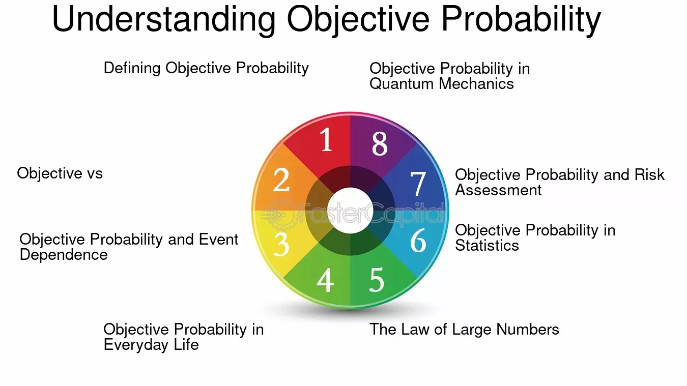

## Table of Contents

## What is objective probability?

Objective probability is the chance of something happening based on facts and numbers, not on what people think or feel. It's like flipping a coin. If it's a fair coin, the objective probability of getting heads is 50%, because that's what the numbers tell us. It doesn't change no matter who is flipping the coin or what they believe.

This kind of probability is used a lot in science and gambling. Scientists use it to predict things like the weather or the outcome of experiments. In gambling, it helps to know the odds of winning a game. Objective probability is important because it gives us a clear, unbiased way to understand the chances of different outcomes.

## How does objective probability differ from subjective probability?

Objective probability and subjective probability are two different ways to think about the chances of something happening. Objective probability is based on hard facts and numbers. It's like saying there's a 50% chance of getting heads when you flip a fair coin. This kind of probability doesn't change because it's based on what we know for sure. For example, if you roll a six-sided die, the objective probability of rolling a three is always 1 in 6.

Subjective probability, on the other hand, is based on what people think or believe. It's more personal and can change from person to person. For example, if you're trying to guess if it will rain tomorrow, one person might think there's a 70% chance because they saw dark clouds, while another might think there's only a 30% chance because they checked the weather app. Subjective probability is useful when we don't have all the facts, but it can be different for everyone.

In summary, the big difference between the two is that objective probability relies on solid evidence and stays the same, while subjective probability depends on personal beliefs and can vary a lot. Both types of probability are important and used in different situations, but they give us different kinds of information about the chances of things happening.

## What are the main sources of objective probability?

Objective probability comes from things we can count and measure. It's like when you roll a die or flip a coin. We know there are six sides on a die, so the chance of rolling a specific number is always the same. It's based on numbers and facts, not on what people think. Scientists use this kind of probability a lot. They do experiments over and over and use the results to figure out the chances of something happening. For example, they might test a new medicine on lots of people to see how likely it is to work.

Another big source of objective probability is looking at past data. If you want to know the chance of it raining tomorrow, you can look at weather records from the past. If it rained on similar days before, that gives you a good idea of what might happen. Insurance companies use this kind of information too. They look at how often certain things happen, like car accidents or house fires, to set their prices. By using hard data from the past, they can make predictions about the future that are based on facts, not guesses.

## Can you explain the concept of frequency probability?

Frequency probability is a way to figure out how likely something is to happen by looking at how often it has happened before. Imagine you're rolling a die. If you roll it many times and a certain number comes up a lot, you can say that number has a [high frequency](/wiki/high-frequency-trading) probability. It's like counting how many times something happens and then using that count to guess the chances of it happening again. 

For example, if you flip a coin 100 times and it lands on heads 50 times, you might say the frequency probability of getting heads is 50 out of 100, or 50%. This method is really useful because it's based on real data, not just guesses. Scientists and gamblers use it a lot to predict things like the weather or the outcome of a game. By looking at how often something has happened in the past, they can make better guesses about what might happen in the future.

## How is objective probability used in statistical analysis?

Objective probability is really important in statistical analysis because it helps us make predictions based on hard data. When scientists or researchers do experiments, they collect a lot of information and use it to figure out how likely certain things are to happen. For example, if they're testing a new drug, they might give it to a bunch of people and see how many get better. By counting the number of people who improve and dividing it by the total number of people in the study, they can find the objective probability of the drug working. This kind of probability is super useful because it's based on facts, not guesses, so it helps make reliable predictions.

In statistical analysis, objective probability is also used to understand patterns and trends. For instance, if a company wants to know how likely it is for customers to buy a certain product, they can look at past sales data. By counting how many times the product was bought out of all the times it could have been bought, they get the objective probability of a sale. This helps the company make better decisions about things like how much to produce or how to market the product. Using objective probability in this way makes sure that the decisions are based on solid evidence, which can lead to better outcomes.

## What role does objective probability play in scientific research?

Objective probability is super important in scientific research because it helps scientists make predictions based on real data. When scientists do experiments, they collect a lot of information and use it to figure out how likely certain things are to happen. For example, if they're testing a new medicine, they might give it to a bunch of people and see how many get better. By counting the number of people who improve and dividing it by the total number of people in the study, they can find the objective probability of the medicine working. This kind of probability is useful because it's based on facts, not guesses, so it helps make reliable predictions about what might happen in the future.

In scientific research, objective probability also helps scientists understand patterns and trends. For instance, if researchers are studying climate change, they can look at past weather data to find out how likely it is for certain weather events to happen. By counting how often these events have happened in the past, they can predict how often they might happen in the future. This helps scientists make better decisions about things like how to prepare for natural disasters or how to protect the environment. Using objective probability in this way makes sure that the decisions are based on solid evidence, which can lead to better outcomes for everyone.

## How can objective probability be applied in risk assessment?

Objective probability is really useful in risk assessment because it helps people figure out how likely certain bad things are to happen. Imagine you're an engineer working on a new bridge. You want to know how likely it is for the bridge to collapse. By looking at past data about similar bridges, you can count how many have collapsed and how many have stayed up. This gives you the objective probability of a collapse. With this information, you can make better decisions about how to build the bridge to make it safer.

In other situations, like in insurance, objective probability helps set prices. Insurance companies want to know how likely it is for someone to get into a car accident or have their house burn down. They look at past data to find out how often these things happen. For example, if 1 out of every 100 houses burns down each year, they can use this objective probability to decide how much to charge for house insurance. By using hard data, insurance companies can make sure their prices are fair and cover the risks they're taking on.

## What are some common misconceptions about objective probability?

One common misconception about objective probability is that it can predict the future with 100% accuracy. People sometimes think that if something has a 90% chance of happening, it's guaranteed to happen. But that's not true. Objective probability gives us the best guess based on facts, but it's still just a guess. There's always a chance that the unexpected will happen, even if it's small.

Another misconception is that objective probability is the same as certainty. Just because we can calculate the probability of something doesn't mean it's certain to happen. For example, if you roll a die, the objective probability of rolling a six is 1 in 6, but that doesn't mean you will roll a six if you try it. It just means that, over many rolls, you should see a six about one-sixth of the time. Objective probability is about long-term patterns, not individual events.

## How do philosophers view the concept of objective probability?

Philosophers have different views on objective probability. Some think it's a real thing that exists in the world, like how a coin flip has a 50% chance of landing on heads. They believe that these probabilities are based on facts and don't change no matter who is looking at them. Other philosophers think that objective probability is more about what we know and how we understand the world. They say that even though we use numbers and facts to figure out probabilities, those numbers are still based on our understanding and can change as we learn more.

There's also a debate about whether objective probability can really be separated from our beliefs and knowledge. Some philosophers argue that all probability is a bit subjective because it depends on what information we have. They say that even if we use objective data, like the results of many coin flips, our interpretation of that data can still be influenced by what we believe. On the other hand, some philosophers believe that objective probability is completely separate from our beliefs and is a true reflection of the world's randomness and patterns. They think that even if we don't know everything, the probabilities themselves are still real and unchanging.

## Can you discuss the limitations of using objective probability in decision-making?

Objective probability is super helpful for making decisions because it's based on facts and numbers. But it has some limits. One big limit is that it can't tell us everything about the future. Even if we know the chance of something happening, like a 70% chance of rain, it doesn't mean it will rain for sure. There's always a bit of uncertainty, and sometimes unexpected things happen. So, even with good data, we can't predict everything perfectly.

Another limit is that objective probability doesn't take into account things we don't know yet. Sometimes, we might not have all the information we need to make a good guess about the future. For example, if a new technology comes out, we might not have enough data to know how it will affect things. So, decisions based only on what we know now might not be the best. We need to be ready to change our minds as we learn more.

Also, objective probability can be hard to apply to one-time events. If you're deciding whether to take a new job or not, you can't use past data about that exact situation because it's never happened before. Sure, you can look at similar situations, but it's not the same. So, for big, unique decisions, objective probability might not give you all the answers you need.

## How has the understanding of objective probability evolved historically?

The idea of objective probability has changed a lot over time. A long time ago, people didn't really think about probability the way we do now. They might have noticed patterns, like how often it rained or how likely they were to win a game, but they didn't have a way to measure it exactly. It wasn't until the 16th and 17th centuries that people started to think about probability in a more scientific way. Mathematicians like Blaise Pascal and Pierre de Fermat worked on problems related to gambling and came up with ways to calculate chances using numbers. This was the start of understanding objective probability as something based on facts and numbers, not just guesses.

As time went on, the understanding of objective probability got even better. In the 19th and 20th centuries, scientists and mathematicians developed more advanced ways to measure and use probability. They started using it in all kinds of fields, like science, insurance, and even weather forecasting. People realized that by looking at a lot of data from the past, they could make pretty good guesses about what might happen in the future. This led to the idea of frequency probability, where you look at how often something has happened before to figure out how likely it is to happen again. Today, objective probability is a big part of how we make decisions and predict things, but it's always changing as we learn more and find new ways to use it.

## What advanced mathematical models are used to calculate objective probability in complex systems?

In complex systems, scientists use advanced mathematical models like the Monte Carlo method to figure out objective probability. This method is like playing out a situation many times on a computer to see how often different things happen. Imagine you want to know the chance of a rocket landing safely on Mars. You can't do the real thing over and over, but you can use a computer to simulate it thousands of times. By counting how many times the rocket lands safely, you can get a good idea of the objective probability of success. This method is really helpful because it can handle a lot of different factors and randomness, making it perfect for complex systems.

Another important model is Bayesian networks, which help us understand how different things are connected and affect each other. These networks are like a map that shows how one event can change the chance of another event happening. For example, if you're trying to figure out the probability of a disease spreading in a community, a Bayesian network can show how things like vaccination rates and social distancing affect the spread. By putting in data about these factors, the model can calculate the objective probability of the disease spreading in different scenarios. Both Monte Carlo simulations and Bayesian networks help us make better predictions in complex systems by using hard data and math to figure out the chances of different outcomes.

## What are examples of objective probability?

Objective probability is a cornerstone of statistical analysis, offering a quantifiable measure of likelihood derived from empirical evidence. One of the simplest examples is determining the probability of a coin landing heads-up when flipped multiple times. Given a fair coin, the objective probability of landing heads in a single toss is 0.5. This probability is confirmed by empirical evidence through repeated trials, adhering to the law of large numbers, which states that as the number of trials increases, the experimental probability converges to the theoretical probability.

In finance, objective probability is essential for modeling stock price movements. Analysts use historical data to calculate the probability distributions of stock returns. For instance, stock prices often exhibit characteristics of a normal distribution, allowing traders to determine the likelihood of a stock's future price within a specific range. Consider the historical daily returns of a stock, which can be modeled using a normal distribution with a given mean ($\mu$) and standard deviation ($\sigma$). The probability of the stock return falling within a certain interval can be calculated using the cumulative distribution function (CDF):

$$
P(a < X < b) = \Phi\left(\frac{b - \mu}{\sigma}\right) - \Phi\left(\frac{a - \mu}{\sigma}\right)
$$

Where $\Phi$ is the CDF of the standard normal distribution.

Fintech companies leverage objective probability in risk assessment and asset pricing. A case study of a fintech firm utilizing predictive analytics might involve analyzing credit risk through objective probability. By integrating historical default data, companies can establish a probabilistic model to estimate the likelihood of future defaults. This model aids in pricing loans appropriately and managing risk more effectively.

Objective probability also plays a pivotal role in asset pricing models, such as the Black-Scholes model, which calculates the value of options. This model is grounded in the assumption of log-normal distribution of asset returns, which aligns with the principles of objective probability. By using market data to estimate parameters like [volatility](/wiki/volatility-trading-strategies) ($\sigma$) and employing the present value of expected payoffs, firms can derive fair prices for financial derivatives.

Python can be a useful tool for implementing these probabilistic calculations. Consider an example where one seeks to simulate stock returns to estimate the probability of a given return threshold:

```python
import numpy as np

# Parameters for normal distribution
mu = 0.01  # mean daily return
sigma = 0.02  # standard deviation of daily return
days = 252  # number of trading days in a year

# Simulate daily returns for one year
simulated_returns = np.random.normal(mu, sigma, days)

# Calculate probability of achieving a specific return threshold
threshold = 0.05
probability = np.mean(simulated_returns > threshold)

print(f"Probability of daily return exceeding {threshold}: {probability:.4f}")
```

This script generates simulated daily returns of a stock and calculates the probability of exceeding a specified return threshold, underlining the practical application of objective probability in financial analysis.

## What is the role of Probability Theory in Algorithmic Trading?

Probability theory is fundamental to [algorithmic trading](/wiki/algorithmic-trading), offering a robust mathematical framework to address the inherent uncertainty in financial markets. Central to this approach are the concepts of sample spaces, events, and probability measures, which provide the foundation for constructing and evaluating trading algorithms.

A sample space in probability theory is the set of all possible outcomes of a random experiment. In the context of algorithmic trading, this could encompass various market scenarios, such as price movements or trading volumes over a specified period. Events are subsets of the sample space, representing specific outcomes of interest, such as a stock price reaching a certain level. The probability measure quantifies the likelihood of these events, guiding traders in decision-making processes.

Probability distributions play a crucial role in modeling the behavior of financial data. The normal distribution, characterized by its bell-shaped curve, is frequently employed due to its properties of symmetry and its natural occurrence in diverse datasets. It is particularly useful for modeling returns on assets under the assumption of a relatively stable risk environment. However, log-normal distributions are often more appropriate for modeling asset prices themselves, as they prevent negative values and reflect the multiplicative nature of returns over time.

Mathematically, if $X$ is a normally distributed random variable with mean $\mu$ and variance $\sigma^2$, its probability density function is defined as:

$$

f(x) = \frac{1}{\sigma \sqrt{2\pi}} \exp\left(-\frac{(x-\mu)^2}{2\sigma^2}\right)
$$

For asset prices $S$ following a log-normal distribution, if $\ln(S)$ is normally distributed with mean $\mu$ and variance $\sigma^2$, it is expressed as:

$$

f(s) = \frac{1}{s \sigma \sqrt{2\pi}} \exp\left(-\frac{(\ln(s)-\mu)^2}{2\sigma^2}\right)
$$

These probabilistic models allow traders to predict future price movements and evaluate the likelihood of different market behaviors, aiding in the development of trading strategies that seek to exploit these statistical patterns.

In algorithmic trading, statistical methods such as hypothesis testing, regression analysis, and predictive modeling rely heavily on probability theory. These methods help in the construction of strategies that identify profitable trading opportunities while managing risks effectively. Moreover, probability-based metrics like Value-at-Risk (VaR) and Conditional Value-at-Risk (CVaR) are instrumental in assessing potential losses and optimizing portfolio allocations.

Incorporating probability theory into algorithmic trading enables quantitative analysts and traders to design sophisticated trading algorithms that can navigate the complexities and uncertainties of financial markets. Such applications underscore the significance of probability as a cornerstone of modern finance, facilitating the creation of strategies that are both innovative and data-driven.

## References & Further Reading

[1]: ["Probability Theory: The Logic of Science"](https://www.amazon.com/Probability-Theory-Science-T-Jaynes/dp/0521592712) by E.T. Jaynes

[2]: Cont, R., & Tankov, P. (2004). ["Financial Modelling with Jump Processes."](https://archive.org/details/financialmodelli0000cont) Chapman and Hall/CRC Financial Mathematics Series.

[3]: Taleb, N. N. (2010). ["The Black Swan: The Impact of the Highly Improbable"](https://www.amazon.com/Black-Swan-Improbable-Robustness-Fragility/dp/081297381X) Second Edition. New York: Random House.

[4]: Glasserman, P. (2003). ["Monte Carlo Methods in Financial Engineering."](https://link.springer.com/book/10.1007/978-0-387-21617-1) Springer.

[5]: Campbell, J. Y., Lo, A. W., & MacKinlay, A. C. (1997). ["The Econometrics of Financial Markets."](https://press.princeton.edu/books/hardcover/9780691043012/the-econometrics-of-financial-markets) Princeton University Press.

[6]: Durrett, R. (2019). ["Probability: Theory and Examples."](https://services.math.duke.edu/~rtd/PTE/PTE5_011119.pdf) Fifth Edition. Cambridge University Press.