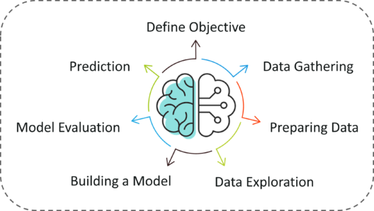

## Table of Contents

## What is objective machine learning?

Objective machine learning is a way to make sure that machine learning models are fair and work well for everyone. It means that when we create these models, we think about what we want them to do and make sure they do it in a way that is clear and fair. For example, if we are making a model to decide who gets a loan, we want to make sure the model is not unfair to certain groups of people. This helps build trust in the model because people can see that it is trying to be fair and do what it is supposed to do.

To achieve objective machine learning, we need to set clear goals for what the model should do and check if it meets those goals. This involves using different methods to test the model and see if it is working the way we want it to. For example, we might use a measure like accuracy, which tells us how often the model gets things right. We might also look at other measures to make sure the model is not biased against any group. By doing this, we can make sure that our machine learning models are not only effective but also fair and transparent.

## How does objective machine learning differ from traditional machine learning?

Objective machine learning focuses on making sure that machine learning models are fair and clear in how they work. In traditional machine learning, the main goal is often just to make the model as accurate as possible. But in objective machine learning, we also care about other things, like making sure the model doesn't treat certain groups of people unfairly. For example, if a model is used to decide who gets a loan, we want to make sure it doesn't unfairly reject people from certain backgrounds. This means we need to set clear goals for what the model should do and check if it meets those goals in a fair way.

In traditional machine learning, we might only look at how often the model gets things right, which we call accuracy. But in objective machine learning, we use other measures too. We might look at how the model performs for different groups of people to make sure it's not biased. This helps build trust in the model because people can see that it's trying to be fair and do what it's supposed to do. By focusing on fairness and transparency, objective machine learning helps create models that are not only effective but also ethical and trustworthy.

## What are the key components of an objective machine learning system?

Objective [machine learning](/wiki/machine-learning) systems focus on fairness, transparency, and clear goals. These systems start by setting specific objectives for what the model should do. For example, if the model is used to approve loans, the goal might be to make sure it approves loans fairly for all groups of people. To do this, the system needs to define what fairness means and how to measure it. This might involve looking at how the model performs for different groups and making sure it doesn't treat any group unfairly.

To make sure the model meets these goals, objective machine learning systems use different methods to test and check the model. They might use measures like accuracy, which shows how often the model gets things right, but they also use other measures to check for fairness. For example, they might look at how the model's accuracy changes for different groups of people. If the model is less accurate for one group, it might be biased. By using these different measures, the system can make sure the model is not only accurate but also fair and transparent.

Building trust in the model is a big part of objective machine learning. People need to see that the model is trying to be fair and do what it's supposed to do. This means the system needs to be open about how it works and how it makes decisions. By being clear and transparent, objective machine learning systems help create models that people can trust and that are ethical and fair.

## Can you explain the role of objectives in machine learning?

Objectives in machine learning are like goals that we set for our models. They help us decide what we want the model to do and how well we want it to do it. For example, if we are making a model to predict if it will rain, our objective might be to make the model as accurate as possible. This means we want the model to correctly predict rain or no rain as often as it can. Objectives guide us in choosing the right methods and measures to build and test our models.

Having clear objectives is important because it helps us make sure our models are fair and useful. For instance, if we are using a model to approve loans, our objective might be to make sure the model is fair to everyone, not just accurate. This means we need to check if the model is treating all groups of people the same way. By setting clear objectives, we can build models that people can trust and that work well for everyone.

## What are some common objectives used in machine learning models?

Some common objectives in machine learning models are accuracy, which measures how often the model gets things right, and minimizing error, which means making the model's predictions as close to the real answers as possible. For example, if we are predicting house prices, we want the model's predictions to be as close to the actual prices as we can get. Another common objective is to maximize the model's performance on a specific task, like classifying emails as spam or not spam. This means we want the model to be really good at telling the difference between spam and regular emails.

Fairness is another important objective, especially when the model's decisions affect people. For example, if a model is used to decide who gets a loan, we want to make sure it's fair to everyone, no matter their background. This means we need to check if the model is treating all groups of people the same way. By setting clear objectives like these, we can build models that people can trust and that work well for everyone.

## How do you define and measure objectives in machine learning?

Defining and measuring objectives in machine learning starts with setting clear goals for what the model should do. For example, if we want a model to predict house prices, our objective might be to make the model's predictions as close to the actual prices as possible. We can measure this using a metric like Mean Squared Error (MSE), which calculates the average of the squared differences between the predicted and actual values. The formula for MSE is $$ \text{MSE} = \frac{1}{n} \sum_{i=1}^{n} (y_i - \hat{y}_i)^2 $$, where $y_i$ is the actual value, $\hat{y}_i$ is the predicted value, and $n$ is the number of observations. By minimizing this value, we make the model's predictions more accurate.

Another important objective is fairness, which means making sure the model doesn't treat certain groups of people unfairly. For instance, if a model is used to approve loans, we want to check if it's fair to everyone. We can measure fairness by looking at how the model performs for different groups of people. If the model's accuracy or error rate is much different for one group compared to another, it might be biased. By using these measures, we can see if the model is meeting our fairness goals and adjust it if needed. This helps build trust in the model because people can see that it's trying to be fair and do what it's supposed to do.

## What challenges are faced when setting objectives in machine learning?

Setting objectives in machine learning can be tricky because there are many things to think about. One big challenge is deciding what the main goal of the model should be. For example, if we want a model to predict house prices, we might want it to be as accurate as possible. But we also need to make sure it's fair and doesn't treat certain groups of people unfairly. Balancing these different goals can be hard. Sometimes, making the model more accurate might make it less fair, and we need to find a way to do both.

Another challenge is figuring out how to measure these objectives. For accuracy, we might use a formula like Mean Squared Error (MSE), which is $$ \text{MSE} = \frac{1}{n} \sum_{i=1}^{n} (y_i - \hat{y}_i)^2 $$. But measuring fairness is not as easy. We need to look at how the model performs for different groups of people, which can be complicated. We might need to use different measures and methods to check if the model is fair. This can take a lot of time and effort, and it's not always clear which measures are the best to use.

## How can objectives impact the performance and outcome of machine learning models?

Objectives in machine learning guide how we build and test our models. If our main goal is to make the model as accurate as possible, we might focus on reducing errors like the Mean Squared Error (MSE), which is calculated as $$ \text{MSE} = \frac{1}{n} \sum_{i=1}^{n} (y_i - \hat{y}_i)^2 $$. This means we want the model's predictions to be as close to the real answers as we can get. But if we only focus on accuracy, we might miss other important things like fairness. For example, if a model is used to approve loans, we want to make sure it's fair to everyone, not just accurate. So, the objectives we choose can change how we train and evaluate our model, which can affect how well it works for different people.

Choosing the right objectives can also affect how people trust and use the model. If we set clear goals for fairness and transparency, people are more likely to trust the model's decisions. For instance, if we want to make sure a model doesn't treat certain groups of people unfairly, we need to measure how it performs for different groups. This might involve looking at how the model's accuracy changes for different people. If we do this well, we can build a model that not only works well but also treats everyone fairly. By focusing on the right objectives, we can create machine learning models that are both effective and ethical.

## What techniques are used to optimize objectives in machine learning?

To optimize objectives in machine learning, we often use techniques like gradient descent. This method helps us find the best values for our model by slowly changing them to reduce errors like the Mean Squared Error (MSE), which is calculated as $$ \text{MSE} = \frac{1}{n} \sum_{i=1}^{n} (y_i - \hat{y}_i)^2 $$. By using gradient descent, we can make our model more accurate. But sometimes, we need to balance accuracy with other goals, like fairness. To do this, we might use techniques like regularization, which helps prevent the model from being too focused on accuracy and ignoring other important things.

Another way to optimize objectives is by using different measures to check how well the model is doing. For example, if we want to make sure our model is fair, we might look at how it performs for different groups of people. We can use measures like demographic parity, which checks if the model treats all groups the same way. By looking at these different measures, we can adjust our model to meet our fairness goals. This helps us build models that people can trust because they can see that the model is trying to be fair and do what it's supposed to do.

## Can you discuss case studies where objective machine learning has been successfully implemented?

One successful case of objective machine learning is in the healthcare industry. A hospital wanted to use a machine learning model to predict which patients were at risk of readmission after being discharged. Their main objective was to make the model as accurate as possible, but they also wanted to make sure it was fair to all patients, no matter their background. They used a measure called the Area Under the Curve (AUC) to check the model's accuracy, which is calculated as $$ \text{AUC} = \int_{-\infty}^{\infty} \text{TPR}(t) \cdot \text{FPR}'(t) \, dt $$. To make sure the model was fair, they looked at how it performed for different groups of patients. By using these measures and adjusting the model, they were able to create a tool that not only predicted readmissions well but also treated all patients fairly.

Another case study is from the financial sector, where a bank used objective machine learning to approve loans. The bank's goal was to make the loan approval process as accurate as possible while also being fair to all applicants. They used a measure called the Gini coefficient to check the model's accuracy, which helps show how well the model can separate good and bad loan applicants. To ensure fairness, they also looked at demographic parity, which checks if the model approves loans at the same rate for different groups of people. By focusing on these objectives, the bank was able to create a model that was both accurate and fair, helping them make better loan decisions and build trust with their customers.

## How does the choice of objective affect the ethical considerations in machine learning?

The choice of objective in machine learning can have a big impact on how ethical the model is. If we only focus on making the model as accurate as possible, we might miss other important things like fairness. For example, if a model is used to approve loans, we want to make sure it's fair to everyone, not just accurate. If we only look at accuracy, the model might approve loans for one group of people more often than another, which is not fair. By choosing objectives that include fairness, we can make sure the model treats everyone the same way. This helps build trust in the model because people can see that it's trying to be fair and do what it's supposed to do.

Another way the choice of objective affects ethics is by making the model more transparent. If our objective is to make the model's decisions clear and easy to understand, we can use techniques like explainable AI. This means we can explain why the model made a certain decision, which is important for people to trust it. For example, if a model is used to decide who gets a job, people want to know why they were accepted or rejected. By setting objectives that focus on transparency, we can make sure the model is not only effective but also ethical and trustworthy.

## What are the future trends and developments expected in objective machine learning?

In the future, objective machine learning is expected to focus more on fairness and transparency. As more people use machine learning models in important decisions like hiring or loan approvals, there will be a bigger push to make sure these models are fair to everyone. This means setting clear goals for fairness and using measures like demographic parity to check if the model treats all groups the same way. By doing this, we can build models that people can trust because they know the models are trying to be fair.

Another trend will be the use of explainable AI to make models more transparent. People want to know why a model made a certain decision, especially when it affects their lives. By setting objectives that focus on explaining the model's decisions, we can make sure people understand how the model works. This helps build trust and makes sure the model is not only accurate but also ethical. As these trends grow, objective machine learning will become even more important in making sure our models are fair and clear for everyone.