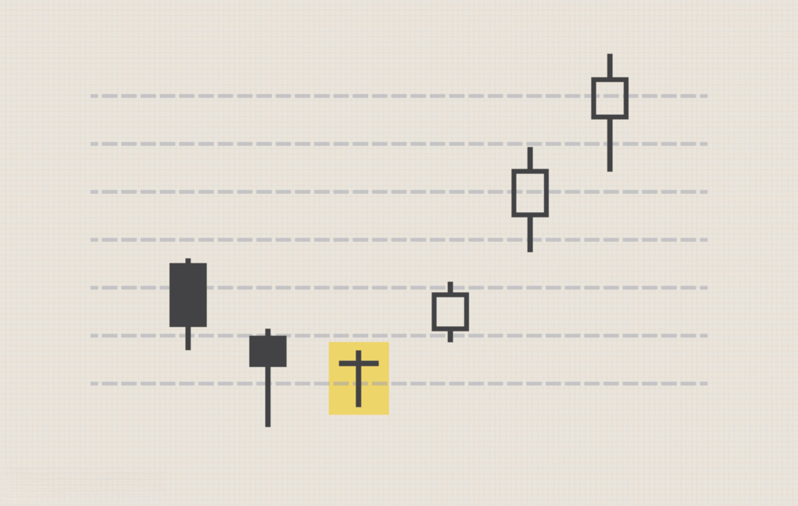

## Table of Contents

## What are the basic goals a beginner trader should set?

As a beginner trader, one of the first goals you should set is to learn the basics of trading. This includes understanding how markets work, what different financial instruments are, and how to use trading platforms. It's important to spend time reading books, taking online courses, and practicing with a demo account before risking real money. By building a strong foundation of knowledge, you'll be better equipped to make informed decisions and avoid common mistakes that can lead to big losses.

Another key goal for beginner traders is to develop a trading plan and stick to it. A trading plan should outline your financial goals, risk tolerance, and the strategies you'll use to achieve those goals. It's crucial to set realistic expectations and understand that trading involves risks. By following a well-thought-out plan, you can help manage those risks and increase your chances of success over time. Remember, consistency and discipline are key to long-term success in trading.

Lastly, it's important for beginner traders to focus on managing their emotions. Trading can be stressful, and it's easy to let fear or greed drive your decisions. Setting a goal to stay calm and rational, even during market ups and downs, can make a big difference. One way to do this is by keeping a trading journal to reflect on your decisions and learn from your experiences. Over time, managing your emotions will become easier, and you'll be able to make better trading choices.

## How can a beginner trader start with small, manageable objectives?

A beginner trader can start with small, manageable objectives by first setting a goal to learn the basics of trading. This means understanding how markets work, what stocks, bonds, and other financial instruments are, and how to use trading platforms. Instead of jumping right into trading with real money, a beginner should spend time reading [books](/wiki/algo-trading-books), taking online courses, and practicing with a demo account. This helps build a strong foundation of knowledge, which is important for making smart decisions and avoiding big mistakes that can lead to losses.

Another small objective for a beginner trader is to create a simple trading plan. This plan should include clear financial goals, how much risk the trader is willing to take, and the basic strategies they will use. It's important to set realistic expectations and understand that trading involves risks. By sticking to this plan, a beginner can manage those risks better and increase their chances of success over time. Consistency and discipline are key, so following the plan even when the market gets tough is crucial.

Lastly, a beginner trader should aim to manage their emotions. Trading can be stressful, and it's easy to let fear or greed affect decisions. A good goal is to stay calm and rational, even when the market goes up and down. Keeping a trading journal can help with this. Writing down thoughts and decisions helps a beginner reflect on their actions and learn from them. Over time, managing emotions will get easier, and the trader will make better choices.

## What are the key financial concepts a beginner trader needs to understand?

A beginner trader needs to understand the concept of supply and demand. This is the basic idea that drives all markets. When more people want to buy something than there are sellers, the price goes up. When more people want to sell something than there are buyers, the price goes down. Understanding this helps a trader predict how prices might move based on what's happening in the market.

Another key concept is risk and reward. Every trade has a chance of making money and a chance of losing money. A beginner trader needs to figure out how much they're willing to risk to make a certain amount of money. This is called the risk-reward ratio. It's important to set stop-loss orders to limit losses and take-profit orders to secure gains. Knowing how to balance risk and reward can help a trader make smarter decisions.

Lastly, a beginner trader should understand the concept of diversification. This means spreading money across different investments to reduce risk. If one investment does badly, others might do well and balance things out. A beginner should not put all their money into one stock or one type of investment. By diversifying, a trader can protect themselves from big losses and have a better chance of making steady profits over time.

## How should a beginner trader approach risk management?

A beginner trader should start with risk management by deciding how much money they can afford to lose. This is called setting a risk tolerance. It's important not to use money that's needed for bills or other important things. A good rule is to only risk a small part of the trading account on any single trade, like 1% or 2%. This way, even if a trade goes wrong, it won't hurt the whole account too much.

Another key part of risk management is using stop-loss orders. A stop-loss order is like a safety net that automatically sells a stock if it drops to a certain price. This helps limit how much money can be lost on a single trade. A beginner trader should also think about the risk-reward ratio. This means figuring out if the possible reward of a trade is worth the risk. A common goal is to aim for a reward that's at least twice the risk. By using these tools and sticking to a plan, a beginner trader can manage risk better and protect their money.

## What tools and resources are essential for a beginner trader?

A beginner trader needs a good trading platform to start. This is like a special computer program where you can buy and sell stocks, and watch what's happening in the market. Some popular ones are Robinhood, E*TRADE, and TD Ameritrade. These platforms often have tools like charts and news feeds that help you make smart choices. It's also a good idea to use a demo account first. This lets you practice trading without using real money, so you can learn the ropes before you start for real.

Another essential tool is a trading journal. This is just a place where you write down what you did, why you did it, and what happened. Keeping a journal helps you see what works and what doesn't, so you can get better over time. It's also important to use educational resources. There are lots of books, online courses, and websites that teach you about trading. Some good ones to check out are Investopedia, Coursera, and "A Beginner's Guide to the Stock Market" by Matthew R. Kratter. By using these tools and resources, a beginner trader can learn a lot and start trading with more confidence.

## How can a beginner trader develop a trading plan?

A beginner trader should start by setting clear financial goals. This means deciding how much money they want to make and how long it might take. It's important to be realistic and understand that trading can be risky. After setting goals, a trader should figure out their risk tolerance. This means deciding how much money they can afford to lose without it hurting their life. A good rule is to only risk a small part of the trading account on any single trade, like 1% or 2%. This helps protect the account from big losses.

Next, a beginner trader needs to choose a trading strategy. There are many different strategies, like [day trading](/wiki/day-trading-spy), swing trading, or long-term investing. It's a good idea to pick one that fits the trader's goals and how much time they can spend on trading. Once a strategy is chosen, the trader should write down the rules for when to buy and sell. This includes setting stop-loss orders to limit losses and take-profit orders to secure gains. By following these rules, a trader can stay disciplined and make better decisions.

Lastly, a beginner trader should keep a trading journal. This is a place to write down what trades were made, why they were made, and what happened. Keeping a journal helps the trader see what works and what doesn't, so they can improve over time. It's also important to review and update the trading plan regularly. Markets change, and what worked before might not work in the future. By staying flexible and learning from experience, a beginner trader can develop a solid trading plan that helps them reach their goals.

## What are common mistakes beginner traders make and how can they be avoided?

One common mistake beginner traders make is not doing enough research before they start trading. They might jump into the market without understanding how it works or what different financial instruments are. This can lead to big losses because they don't know what they're doing. To avoid this, a beginner should spend time reading books, taking online courses, and practicing with a demo account. This helps them learn the basics and make smarter choices when they start trading for real.

Another mistake is letting emotions drive their decisions. It's easy to get scared and sell when the market goes down, or get greedy and buy more when the market goes up. This can lead to bad trades and big losses. To avoid this, a beginner should stick to a trading plan and use tools like stop-loss orders to manage risk. Keeping a trading journal can also help because it lets them reflect on their decisions and learn from their mistakes. By staying calm and following a plan, a beginner trader can make better choices and avoid emotional trading.

Lastly, beginner traders often risk too much money on a single trade. They might put all their money into one stock or trade, hoping to make a big profit. But if that trade goes wrong, they can lose everything. To avoid this, a beginner should only risk a small part of their trading account on any single trade, like 1% or 2%. This way, even if a trade goes bad, it won't hurt the whole account too much. By managing risk carefully, a beginner trader can protect their money and have a better chance of success over time.

## How can a beginner trader effectively use demo accounts before trading with real money?

A beginner trader can use a demo account to practice trading without risking real money. A demo account is like a pretend trading platform where you can buy and sell stocks using fake money. This lets you try out different strategies and see how the market works without worrying about losing your savings. It's a great way to get familiar with the trading platform, learn how to place orders, and understand how different financial instruments move. By using a demo account, a beginner can make mistakes and learn from them without any real financial consequences.

To make the most out of a demo account, a beginner should treat it like a real trading account. This means setting up a trading plan with clear goals and rules for when to buy and sell. They should also keep a trading journal to write down what they did, why they did it, and what happened. This helps them see what works and what doesn't, so they can improve their skills over time. By practicing with a demo account and treating it seriously, a beginner trader can build confidence and be better prepared when they start trading with real money.

## What are the psychological challenges a beginner trader might face and how to overcome them?

One big psychological challenge for a beginner trader is dealing with fear and greed. When the market goes down, it's easy to get scared and sell everything, even if it's not the best choice. On the other hand, when the market goes up, greed can make a trader buy more than they should, hoping to make a big profit. These emotions can lead to bad decisions and big losses. To overcome this, a beginner should stick to a trading plan. Having clear rules for when to buy and sell can help keep emotions in check. Using tools like stop-loss orders can also help manage fear by limiting losses, and take-profit orders can help manage greed by securing gains.

Another challenge is the fear of missing out, or FOMO. A beginner might see others making money and feel like they need to jump into a trade right away, even if it's not a good idea. This can lead to impulsive decisions and risky trades. To overcome FOMO, a beginner should focus on their own trading plan and goals. It's important to remember that everyone's situation is different, and what works for someone else might not work for them. Keeping a trading journal can help too. By writing down their thoughts and decisions, a beginner can reflect on their actions and learn to make choices based on their own strategy, not what others are doing.

## How can a beginner trader transition to more advanced trading strategies?

A beginner trader can start moving to more advanced trading strategies by first getting really good at the basics. They should keep practicing with a demo account and stick to their trading plan until they feel confident. Once they have a good handle on the basics, they can start learning about more complex strategies like technical analysis, which is about using charts and patterns to predict what the market will do next. They can also learn about fundamental analysis, which looks at a company's financial health to decide if its stock is a good buy. By slowly adding these new skills to their trading plan, a beginner can start using more advanced strategies without taking on too much risk.

Another important step is to keep learning and staying up to date with the market. A beginner trader can read books and take courses on advanced trading topics, like options trading or futures trading. These are more complicated ways to trade that can offer bigger rewards but also come with more risk. It's a good idea to start with small amounts of money when trying out these new strategies, so any mistakes won't hurt too much. By staying disciplined, keeping a trading journal, and always learning, a beginner can smoothly transition to more advanced trading and increase their chances of success over time.

## What metrics should a beginner trader use to evaluate their performance?

A beginner trader should start by looking at their win rate, which is the percentage of trades that make money. If they win more often than they lose, that's a good sign. But they should also pay attention to the size of their wins and losses. If they make small profits but big losses, they might still lose money overall. Another important metric is the risk-reward ratio. This tells them if the possible reward of a trade is worth the risk. A good goal is to aim for a reward that's at least twice the risk. By keeping track of these numbers, a beginner can see if their trading plan is working and make changes if needed.

Another key metric is the drawdown, which is the biggest drop in their account value from its highest point. This helps a beginner understand how much risk they're taking on. They should also look at their average return per trade, which shows how much money they make or lose on average for each trade. Keeping a trading journal can help them track all these metrics and see patterns over time. By regularly reviewing their performance and adjusting their strategy, a beginner trader can improve their skills and increase their chances of success in the long run.

## How can a beginner trader stay updated with market trends and adapt their strategies accordingly?

A beginner trader can stay updated with market trends by reading financial news every day. Websites like Bloomberg, Reuters, and Yahoo Finance have lots of news about what's happening in the market. They can also use social media and follow traders and financial experts on platforms like Twitter and LinkedIn. This helps them see what others are thinking and talking about. Another good way to stay updated is by using market analysis tools on their trading platform. These tools show charts and patterns that can help them predict what the market might do next. By keeping an eye on these resources, a beginner trader can stay in the know and make smarter choices.

To adapt their strategies based on market trends, a beginner trader should be flexible and willing to change their plan when needed. If they see a new trend starting, they might need to adjust their trading rules or try a different strategy. For example, if a certain industry is doing well, they might want to focus more on stocks from that industry. Keeping a trading journal can help with this because it lets them see what's working and what's not. By regularly reviewing their journal and the market news, a beginner trader can make small changes to their strategy and stay ahead of the game.

## How can one develop a personalized trading plan?

A trading plan is a crucial element for any trader, functioning as a strategic blueprint for executing and managing trades. This plan is analogous to a business plan, outlining the approach and tactics for market engagement. For novice traders, constructing a comprehensive trading plan involves several components, each contributing to a structured and disciplined trading approach.

### Risk Management

Central to a trading plan is an effective risk management strategy. This includes defining the size of each trade relative to the portfolio size, setting stop-loss orders to limit potential losses, and determining an acceptable level of loss per trade. For instance, a common rule is the 1% rule, where no more than 1% of the trading capital is risked on a single trade. This can be expressed mathematically as:

$$
\text{Risk per trade} = \frac{\text{Trade size} \times \text{Stop loss distance}}{\text{Account equity}} \leq 0.01
$$

This formula ensures the preservation of capital, allowing traders to endure a series of losses without depleting their accounts.

### Trade Selection

Trade selection involves identifying assets or securities that fit specific criteria or models outlined in the trading plan. This could be based on technical analysis, such as chart patterns, indicators like moving averages, or [fundamental analysis](/wiki/fundamental-analysis), which involves assessing the intrinsic value based on financial statements and market position. Beginners should focus on a select few strategies to gain proficiency without overgeneralizing across multiple markets or securities.

### Market Analysis

A trading plan should include detailed market analysis. This involves both technical analysis, which uses historical price data to predict future price movements, and fundamental analysis, focusing on macroeconomic indicators, company earnings reports, and geopolitical events impacting the markets. Effective analysis allows traders to make informed decisions and adjust strategies based on current market conditions.

### Contingency Planning

Inevitable losses are part of trading, and a robust plan should include contingency measures. This involves predefining actions for various scenarios, such as a significant market downturn or unexpected [volatility](/wiki/volatility-trading-strategies). One such action could be a circuit breaker, where trading activity is paused to prevent emotional decision-making.

### Personal Risk Tolerance

Understanding personal risk tolerance is vital. Traders should evaluate their emotional capacity to handle risk and align it with their trading strategies. This involves setting realistic benchmarks and ensuring that the potential rewards justify the risks. By acknowledging their comfort with risk, traders can avoid making impulsive decisions based on short-term market fluctuations.

### Continuous Learning

A successful trading plan incorporates ongoing learning from both achievements and failures. This iterative process allows traders to refine their methods, adapt to changing markets, and improve their overall performance over time. Regularly reviewing and updating the trading plan can highlight areas for improvement and reinforce successful tactics.

A well-thought-out trading plan not only guides traders in executing their strategies but also instills discipline and reduces the influence of emotions on trading decisions. By focusing on planned, calculated risks, traders enhance their ability to achieve long-term success in the markets.

## References & Further Reading

[1]: Bergstra, J., Bardenet, R., Bengio, Y., & Kégl, B. (2011). ["Algorithms for Hyper-Parameter Optimization."](https://dl.acm.org/doi/10.5555/2986459.2986743) Advances in Neural Information Processing Systems 24.

[2]: ["Advances in Financial Machine Learning"](https://www.amazon.com/Advances-Financial-Machine-Learning-Marcos/dp/1119482089) by Marcos Lopez de Prado

[3]: ["Evidence-Based Technical Analysis: Applying the Scientific Method and Statistical Inference to Trading Signals"](https://www.amazon.com/Evidence-Based-Technical-Analysis-Scientific-Statistical/dp/0470008741) by David Aronson

[4]: ["Machine Learning for Algorithmic Trading"](https://github.com/stefan-jansen/machine-learning-for-trading) by Stefan Jansen

[5]: ["Quantitative Trading: How to Build Your Own Algorithmic Trading Business"](https://www.amazon.com/Quantitative-Trading-Build-Algorithmic-Business/dp/1119800064) by Ernest P. Chan