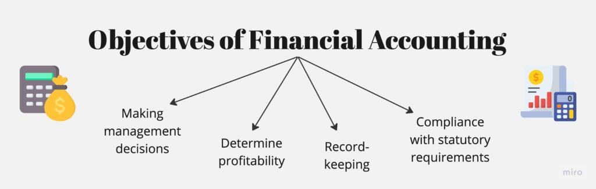

Understanding the landscape of financial accounting, reporting, and algorithmic trading is essential for modern businesses and investors. Financial reporting serves as a critical tool in assessing corporate health and value, enabling stakeholders such as investors, creditors, and managers to make informed decisions based on transparent and standardized information. It involves converting raw financial data into structured reports—such as income statements, balance sheets, and cash flow statements—which facilitate the evaluation of a company's performance and strategic direction.

In parallel, algorithmic trading represents an innovative approach to executing trades in financial markets. By utilizing sophisticated algorithms, this method seeks to optimize trading strategies, offering speed and precision that surpasses human capabilities. Algorithmic trading takes advantage of financial data, including insights gained from financial reporting, to identify and capitalize on trading opportunities. This integration highlights the importance of quality financial data in developing algorithms that can predict market movements and execute trades efficiently.



This article will explore how financial accounting provides a transparent view of a company's financial health while meeting legal and statutory requirements, supported by standards such as Generally Accepted Accounting Principles (GAAP). Additionally, it will examine the intersection of financial accounting and algorithmic trading, illustrating how these domains complement each other in enhancing decision-making processes and strategic resource allocation.

## Table of Contents

## The Objectives of Financial Accounting

Financial accounting serves as the cornerstone for providing stakeholders with a clear and accurate depiction of an organization's financial health. The primary objective is to collect, measure, record, and report financial data meticulously, facilitating transparency and aiding stakeholders in making informed decisions. 

By focusing on the precise capture of financial metrics such as revenue, expenses, and receivables, financial accounting helps portray an accurate financial position of the company. This process involves tracking income streams and expenditures to present a truthful picture that reflects the economic activities and performance during a specified period.

Moreover, financial accounting fulfills critical legal and statutory requirements. Businesses are obligated to adhere to these regulations to maintain legitimacy and avoid legal ramifications. Regulatory compliance also implies contributing to the broader economic infrastructure, as stakeholders including government agencies, investors, and creditors rely on these reports for various purposes. Consequently, financial accounting plays a crucial role in resource allocation—ensuring that resources are efficiently utilized and directed towards profitable ventures.

The practice of financial accounting is standardized by frameworks like the Generally Accepted Accounting Principles (GAAP). These standards are essential for maintaining consistency and transparency across financial reporting. GAAP provides a structured approach that promotes comparability, allowing stakeholders to evaluate and analyze financial statements with a common understanding. Adhering to such standards ensures that financial data is both reliable and objective, facilitating trust and confidence among stakeholders. 

In summary, the objectives of financial accounting extend beyond mere number tracking; they encompass the allegiance to regulatory requirements, accurate financial representation, and the consistent application of standards to support strategic decision-making.

## The Role of Financial Reporting

Financial reporting is the systematic process of converting raw financial data into comprehensive and structured reports such as income statements, balance sheets, and cash flow statements. These financial documents serve as essential analytical tools for a variety of stakeholders, including investors, creditors, and management, allowing them to evaluate a company's financial performance and strategic positioning.

Income statements provide insights into a company’s profitability over a certain period by recording revenue, expenses, and net income. They allow stakeholders to assess operational efficiency and profitability trends. The formula for net income is:

$$
\text{Net Income} = \text{Revenue} - \text{Expenses}
$$

Balance sheets offer a snapshot of a company's financial position at a specific point in time, detailing assets, liabilities, and equity. This assists stakeholders in determining financial stability and [liquidity](/wiki/liquidity-risk-premium). The fundamental accounting equation that balance sheets adhere to is:

$$
\text{Assets} = \text{Liabilities} + \text{Equity}
$$

Cash flow statements track the inflow and outflow of cash, highlighting how effectively a company manages its cash, ensuring sufficient liquidity to meet its obligations. It covers three areas: operating, investing, and financing activities.

Compliance with standards set by authoritative bodies such as the Financial Accounting Standards Board (FASB) ensures that financial reporting is consistent, reliable, and comparable across different entities. The adoption of standards like Generally Accepted Accounting Principles (GAAP) underscores the importance of transparency and uniformity in financial disclosure.

These structured reports play a pivotal role in bolstering investor confidence by providing a clear picture of a company's financial health and performance. They facilitate sound decision-making, enabling stakeholders to make informed assessments about investments and credit. Moreover, reliable financial information enhances the smooth operation of financial markets by ensuring all parties have access to trustworthy data, thereby supporting efficient capital allocation.

## Financial Reporting Standards and Regulation

The Financial Accounting Standards Board (FASB) is a pivotal institution in shaping financial reporting standards within the United States. It establishes a comprehensive framework that ensures consistency, accuracy, and transparency across financial statements, which is essential for stakeholders, including investors, creditors, and regulatory bodies. The Generally Accepted Accounting Principles (GAAP) serve as the cornerstone of this framework, providing detailed guidelines that publicly traded companies must adhere to when preparing their financial reports.

GAAP compliance is not merely a recommendation; it is a legal requirement for publicly traded companies. This compliance guarantees that the financial information disclosed reflects a true and fair view of the company's financial position and is comparable across different organizations and industries. Such standardization is critical for stakeholders who rely on these reports to make informed decisions regarding investments, lending, and management.

The enforcement of these standards is primarily handled by regulatory bodies such as the Securities and Exchange Commission (SEC). The SEC's role is to enforce compliance with GAAP, safeguarding investors by ensuring that the financial statements published by companies are both reliable and free from material misstatements. This oversight is integral to maintaining market integrity and investor confidence, particularly within the dynamic landscape of financial markets.

Certified Public Accountants (CPAs) are entrusted with the crucial task of auditing financial statements to verify their adherence to the established standards. During an audit, CPAs assess whether the financial reports comply with GAAP and offer an unbiased opinion on their accuracy and completeness. This process involves examining accounting records, evaluating internal controls, and verifying transactions and balances reported in the financial statements. The audit opinion serves as a testament to the reliability of the financial data presented, providing assurance to external stakeholders that the company has met the requisite standards of financial reporting.

In conclusion, the FASB, alongside GAAP, the SEC, and CPAs, forms a robust regulatory ecosystem that underpins the integrity of financial reporting. This system not only protects investors but also facilitates the smooth operation of financial markets by ensuring that all parties have access to consistent and transparent financial information.

## Algorithmic Trading: A New Frontier

Algorithmic trading employs intricate algorithms to automate the execution of trades, offering significant advantages in terms of speed and precision. These algorithms, often executed within milliseconds, analyze comprehensive financial data sets to detect patterns and opportunities that may not be readily apparent to human traders. By harnessing real-time and historical financial information, [algorithmic trading](/wiki/algorithmic-trading) systems can make swift decisions, thereby capitalizing on fleeting market opportunities.

At the core of algorithmic trading is the ability to leverage data produced through financial reporting. Insights from financial statements, such as income statements or balance sheets, can inform algorithms about a company's performance, industry trends, and broader economic indicators. This financial data is instrumental in constructing predictive models that assess the value and potential risks associated with various trading strategies.

The integration of algorithmic trading with financial accounting data enhances the strategic aspects of trading decisions. By systematically analyzing factors such as revenue growth, profitability, and market conditions, algorithms can optimize trade execution and allocation of resources. This integration demands robust financial data infrastructure to process and analyze vast quantities of information accurately and in real-time.

For algorithmic trading to operate effectively, transparency and accuracy of financial data are crucial. Traders and firms must rely on consistent and reliable data inputs to mitigate risks associated with false signals and ensure compliance with regulatory standards. Consequently, algorithmic strategies benefit from data integrity and transparency, allowing for better risk management and improved investment returns.

In Python, a simple example of an algorithmic trading strategy could involve decision-making based on moving averages:

```python
import pandas as pd

# Example financial data in DataFrame
data = pd.DataFrame({'Price': [100, 102, 101, 105, 107, 110]})

# Calculate the short and long moving average
short_window = 2
long_window = 3
data['Short_MA'] = data['Price'].rolling(window=short_window).mean()
data['Long_MA'] = data['Price'].rolling(window=long_window).mean()

# Generate trading signals
data['Signal'] = 0
data['Signal'][short_window:] = np.where(data['Short_MA'][short_window:] > data['Long_MA'][short_window:], 1, 0)

print(data)
```

This simple routine calculates short and long moving averages and generates a signal when the short-term average crosses above the long-term average, illustrating a buy opportunity.

Overall, algorithmic trading represents a significant shift in market trading strategies, enabled by sophisticated data analytics and financial reporting. As technology advances, the seamless integration of these data-driven processes continues to transform financial markets, reinforcing the importance of reliable and transparent financial data.

## The Interplay between Financial Accounting and Algorithmic Trading

Accurate financial data forms the core foundation of successful algorithmic trading. This synergy between financial accounting and algorithmic trading enhances decision-making and optimizes resource allocation. 

Financial reporting is pivotal in generating algorithms capable of predicting market movements and executing trades. These reports provide the structured financial data essential for developing and refining algorithmic models. The data extracted from financial statements, such as income statements, balance sheets, and cash flow statements, are integral to understanding a company's financial position and performance. This allows algorithms to analyze historical data and identify trends and patterns useful for forecasting.

As algorithmic trading progresses, the reliance on real-time, accurate financial data becomes increasingly significant. With the speed and precision required in automated trading, access to up-to-date financial information ensures that trading models operate with the most current data. This is paramount in a rapidly changing market where outdated information can lead to suboptimal trading decisions.

By integrating financial accounting with algorithmic trading, market participants can develop better-informed trading strategies. Algorithmic trading models benefit from the rich, detailed insights provided by thorough financial analysis, leading to more strategic and timely transactions. These advancements in technology also enhance the ability to allocate resources more effectively, optimizing returns and managing risks.

In conclusion, the convergence of financial accounting and algorithmic trading underscores the necessity for impeccable financial data. As the landscape of trading continually evolves, maintaining the integrity of financial reporting is critical for the successful implementation of algorithmic strategies, ensuring that businesses and investors can navigate the complexities of modern financial markets.

## Conclusion

Financial accounting and reporting are foundational to understanding and communicating an organization's economic reality. They serve as the backbone for informed decision-making by providing stakeholders with reliable insights into a company's financial health. As businesses increasingly leverage technology, the integration of algorithmic trading transforms the manner in which financial data is utilized within these decision-making processes. Algorithmic trading strategies depend heavily on quality data inputs derived from financial reports to optimize trade execution and enhance investment decisions.

Ensuring transparency and accuracy in financial reporting is paramount not only for regulatory compliance but also for the effective implementation of algorithmic strategies. Regulatory standards, such as the Generally Accepted Accounting Principles (GAAP), provide a framework that assures the integrity of financial data. These standards are crucial in maintaining investor confidence and enabling the functioning of efficient financial markets.

As the landscape of financial markets becomes more complex, with rapid technological advancements and integration across systems, businesses and investors alike must continue to prioritize the quality of financial data. This focus is essential for accurately assessing risks and opportunities in the market, thereby supporting strategic planning and resource allocation. By maintaining rigorous financial reporting practices, organizations ensure they remain equipped to navigate the evolving economic environment effectively.

## References & Further Reading

[1]: ["Fundamentals of Financial Accounting"](https://www.coursera.org/learn/uva-darden-financial-accounting) by Fred Phillips, Robert Libby, and Patricia Libby

[2]: ["Accounting and Finance: An Introduction"](https://books.google.com/books/about/Accounting_and_Finance_An_Introduction.html?id=FyzJDwAAQBAJ) by Eddie McLaney and Peter Atrill

[3]: ["Algorithmic Trading: Winning Strategies and Their Rationale"](https://www.wiley.com/en-us/Algorithmic+Trading%3A+Winning+Strategies+and+Their+Rationale-p-9781118460146) by Ernest P. Chan

[4]: Fama, E. F., & French, K. R. (1993). ["Common Risk Factors in the Returns on Stocks and Bonds."](https://people.hec.edu/rosu/wp-content/uploads/sites/43/2023/09/Fama-French-Common-risk-factors-1993.pdf) Journal of Financial Economics, 33(1), 3-56.

[5]: Financial Accounting Standards Board (FASB). (2023). ["FASB Accounting Standards Codification®."](https://fasb.org/standards/accounting-standard-updates)

[6]: ["The Economics of Algorithmic Trading"](https://publikationen.bibliothek.kit.edu/1000014028) by Henry Coleman

[7]: Securities and Exchange Commission (SEC). (2023). ["SEC's Role in Accounting Standards."](https://whistleblowersblog.org/corporate-whistleblowers/sec-whistleblowers/sec-whistleblower-complaint-leads-to-probe-into-earthquake-risk-at-indonesian-copper-plant/)

[8]: Khandani, A. E., & Lo, A. W. (2007). ["What Happened to the Quants in August 2007?"](https://web.mit.edu/Alo/www/Papers/august07.pdf) MIT Sloan Research Paper.