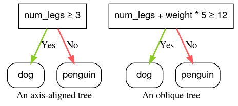

## Table of Contents

## What is an Oblique Condition in the context of machine learning?

An oblique condition in machine learning refers to a decision rule used in decision trees and other tree-based models where the split is made along a line that is not parallel to the axes of the feature space. Instead of splitting data based on a single feature, an oblique condition uses a combination of features to create a more complex decision boundary. This can be represented mathematically as $$a_1 \cdot x_1 + a_2 \cdot x_2 + ... + a_n \cdot x_n > \theta$$ where $$a_1, a_2, ..., a_n$$ are coefficients, $$x_1, x_2, ..., x_n$$ are the features, and $$\theta$$ is a threshold. This approach can lead to more accurate models by capturing relationships between features that might be missed by simpler, axis-parallel splits.

Using oblique conditions can be beneficial in scenarios where the relationships between features are complex and non-linear. For example, in a dataset where the decision boundary is a diagonal line, an oblique split can capture this boundary more effectively than multiple axis-parallel splits. However, the use of oblique conditions can also increase the computational complexity of building and interpreting the model. This is because finding the optimal oblique split requires more calculations compared to finding the best axis-parallel split. Despite this, the potential for improved accuracy makes oblique conditions a valuable tool in the machine learning toolkit.

## How does an Oblique Condition differ from traditional decision boundaries?

An oblique condition in machine learning is different from traditional decision boundaries because it uses a combination of features to make a split, rather than splitting on just one feature at a time. Traditional decision boundaries in decision trees, for example, make splits that are parallel to the axes of the feature space. This means they only consider one feature at a time to decide which side of the split a data point goes. On the other hand, an oblique condition uses a formula that combines multiple features to create a more flexible decision boundary. This can be expressed as $$a_1 \cdot x_1 + a_2 \cdot x_2 + ... + a_n \cdot x_n > \theta$$, where $$a_1, a_2, ..., a_n$$ are coefficients, $$x_1, x_2, ..., x_n$$ are the features, and $$\theta$$ is a threshold.

The main advantage of using an oblique condition is that it can capture more complex relationships between features. For example, if the true decision boundary in a dataset is a diagonal line, an oblique split can represent this boundary more accurately than multiple axis-parallel splits. This can lead to more accurate predictions because the model can better fit the underlying patterns in the data. However, using oblique conditions can make the model more complex and harder to interpret. It also requires more computational power to find the best oblique split compared to finding the best axis-parallel split. Despite these challenges, oblique conditions can be a powerful tool for improving the performance of machine learning models.

## What are the advantages of using Oblique Conditions in decision trees?

Using oblique conditions in decision trees can make them better at understanding and predicting things. Instead of just looking at one thing at a time, oblique conditions let the tree use a mix of different things to make a decision. For example, if you have data where the important line that separates different groups is diagonal, an oblique condition can follow that line better than splitting things up in straight lines. This can be written as $$a_1 \cdot x_1 + a_2 \cdot x_2 + ... + a_n \cdot x_n > \theta$$ where $$a_1, a_2, ..., a_n$$ are numbers that help mix the different things, $$x_1, x_2, ..., x_n$$ are the things you're looking at, and $$\theta$$ is a number that helps decide which side of the line something goes on. By using this formula, the tree can make more accurate guesses about new data.

However, using oblique conditions can make things a bit more complicated. It takes more work for the computer to figure out the best way to split the data using these mixed conditions. Also, it can be harder for people to understand what the tree is doing because the decisions are based on a mix of things rather than just one at a time. Even though it's more complex, the better accuracy that oblique conditions can bring is often worth it, especially when the data has complicated patterns that regular decision trees can't handle well.

## Can you explain how Oblique Conditions are implemented in algorithms?

Oblique conditions in decision trees are implemented by using a formula that combines multiple features to make a split. Instead of just looking at one feature at a time, the algorithm uses a mix of features to create a decision boundary. This can be written as $$a_1 \cdot x_1 + a_2 \cdot x_2 + ... + a_n \cdot x_n > \theta$$ where $$a_1, a_2, ..., a_n$$ are numbers that help mix the different features, $$x_1, x_2, ..., x_n$$ are the features, and $$\theta$$ is a number that helps decide which side of the line something goes on. To find the best oblique split, the algorithm tries different combinations of these numbers and thresholds to see which one splits the data in the best way.

To implement this in code, the algorithm needs to search for the best values of $$a_1, a_2, ..., a_n$$ and $$\theta$$. This can be done using optimization techniques like gradient descent or genetic algorithms. The algorithm will keep trying different values until it finds the combination that makes the best split. This process can be more complicated than finding the best split for a single feature, but it can lead to a more accurate model. Here's a simple example of how you might start to implement this in Python:

```python
import numpy as np

def find_oblique_split(X, y):
    n_features = X.shape[1]
    best_score = float('-inf')
    best_coefficients = None
    best_threshold = None

    for _ in range(1000):  # Try 1000 random combinations
        coefficients = np.random.randn(n_features)
        threshold = np.random.randn()

        scores = np.dot(X, coefficients) > threshold
        score = np.mean(y[scores] == 1) + np.mean(y[~scores] == 0)

        if score > best_score:
            best_score = score
            best_coefficients = coefficients
            best_threshold = threshold

    return best_coefficients, best_threshold

# Example usage
X = np.array([[1, 2], [3, 4], [5, 6]])
y = np.array([0, 1, 1])
coefficients, threshold = find_oblique_split(X, y)
print(f"Best coefficients: {coefficients}")
print(f"Best threshold: {threshold}")
```

This code shows a basic way to find an oblique split by trying many random combinations of coefficients and thresholds. In practice, more advanced optimization methods would be used to find the best split more efficiently.

## What types of problems are best suited for using Oblique Conditions?

Oblique conditions are really helpful when you have data that is hard to separate using simple lines. Imagine you're trying to tell apart different groups of data points, but the line that separates them is not straight up and down or side to side. It's more like a diagonal line. In this case, using an oblique condition can help because it lets you use a mix of different things to make a decision. This can be written as $$a_1 \cdot x_1 + a_2 \cdot x_2 + ... + a_n \cdot x_n > \theta$$ where $$a_1, a_2, ..., a_n$$ are numbers that help mix the different things, $$x_1, x_2, ..., x_n$$ are the things you're looking at, and $$\theta$$ is a number that helps decide which side of the line something goes on. By using this formula, you can make a decision boundary that follows the diagonal line more closely, leading to better predictions.

Another type of problem where oblique conditions shine is when the relationships between the things you're looking at are complicated and not just simple lines. For example, if the way two things are related is not a straight line but more like a curve or a zigzag, an oblique condition can capture this better. This is especially useful in areas like medical diagnosis where symptoms and test results might have complex relationships. Even though using oblique conditions can make things more complicated and take more computer power, the better accuracy they can bring is often worth it, especially when regular decision trees can't handle the data well.

## How do Oblique Conditions affect the complexity of a model?

Using oblique conditions in decision trees makes the model more complex. Instead of just looking at one thing at a time, oblique conditions use a mix of different things to make a decision. This can be written as $$a_1 \cdot x_1 + a_2 \cdot x_2 + ... + a_n \cdot x_n > \theta$$ where $$a_1, a_2, ..., a_n$$ are numbers that help mix the different things, $$x_1, x_2, ..., x_n$$ are the things you're looking at, and $$\theta$$ is a number that helps decide which side of the line something goes on. Because the model has to find the best mix of these numbers and the best threshold, it takes more work for the computer to figure out the best way to split the data. This means the model is harder to build and might take longer to train.

Even though oblique conditions make the model more complex, they can also make it better at understanding and predicting things. When the important line that separates different groups of data is not straight up and down or side to side, but more like a diagonal line, an oblique condition can follow that line more closely. This can lead to more accurate predictions because the model can better fit the underlying patterns in the data. However, this increased accuracy comes at the cost of making the model harder to understand and interpret, as the decisions are based on a mix of things rather than just one at a time.

## What are the computational challenges associated with Oblique Conditions?

Using oblique conditions in decision trees makes them harder to build and run because they need to look at many different ways to mix the data. Instead of just checking one thing at a time, oblique conditions use a formula like $$a_1 \cdot x_1 + a_2 \cdot x_2 + ... + a_n \cdot x_n > \theta$$ where $$a_1, a_2, ..., a_n$$ are numbers that help mix the different things, $$x_1, x_2, ..., x_n$$ are the things you're looking at, and $$\theta$$ is a number that helps decide which side of the line something goes on. Finding the best mix of these numbers and the best threshold takes a lot more work for the computer. This means it can take longer to train the model and use more computer power.

Even though oblique conditions make things more complicated, they can help the model make better guesses about new data. When the important line that separates different groups of data is not straight up and down or side to side, but more like a diagonal line, an oblique condition can follow that line more closely. This can lead to more accurate predictions because the model can better fit the underlying patterns in the data. However, this increased accuracy comes at the cost of making the model harder to understand and interpret, as the decisions are based on a mix of things rather than just one at a time.

## How can one evaluate the performance of a model using Oblique Conditions?

To evaluate the performance of a model using oblique conditions, you can use the same methods you would use for any other [machine learning](/wiki/machine-learning) model. This means looking at things like accuracy, which tells you how often the model gets the right answer, and other measures like precision, recall, and F1 score. These measures help you understand how well the model is doing at telling apart different groups of data. You can also use cross-validation, which means splitting your data into different parts and training the model on some parts while testing it on others. This helps you see if the model is good at making predictions on new data it hasn't seen before.

One important thing to remember is that because oblique conditions make the model more complex, you might need to be careful about overfitting. Overfitting happens when the model is too good at fitting the data it was trained on but not as good at predicting new data. To check for overfitting, you can compare the model's performance on the training data with its performance on a separate set of test data. If the model does much better on the training data than on the test data, it might be overfitting. Using techniques like regularization can help prevent this by making the model simpler and less likely to fit the training data too closely.

## What are some popular algorithms that utilize Oblique Conditions?

Oblique conditions are used in some decision tree algorithms to make them better at understanding and predicting things. One popular algorithm that uses oblique conditions is the Oblique Decision Tree. Instead of just looking at one thing at a time, this algorithm uses a mix of different things to make a decision. This can be written as $$a_1 \cdot x_1 + a_2 \cdot x_2 + ... + a_n \cdot x_n > \theta$$ where $$a_1, a_2, ..., a_n$$ are numbers that help mix the different things, $$x_1, x_2, ..., x_n$$ are the things you're looking at, and $$\theta$$ is a number that helps decide which side of the line something goes on. By using this formula, the tree can make more accurate guesses about new data.

Another algorithm that can use oblique conditions is the Random Forest. A Random Forest is made up of many decision trees, and each tree can use oblique conditions to split the data. This helps the Random Forest make better predictions by capturing more complex patterns in the data. Even though using oblique conditions makes these algorithms more complicated and harder to understand, the better accuracy they can bring is often worth it, especially when the data has complicated patterns that regular decision trees can't handle well.

## How do Oblique Conditions handle high-dimensional data?

Oblique conditions work well with high-dimensional data because they can look at many different things at the same time. Instead of just checking one thing at a time, oblique conditions use a formula like $$a_1 \cdot x_1 + a_2 \cdot x_2 + ... + a_n \cdot x_n > \theta$$ where $$a_1, a_2, ..., a_n$$ are numbers that help mix the different things, $$x_1, x_2, ..., x_n$$ are the things you're looking at, and $$\theta$$ is a number that helps decide which side of the line something goes on. By using this formula, the model can find patterns in the data that might be hard to see when looking at each thing separately. This is especially helpful when you have a lot of different things to look at, because it can capture relationships between them that might be missed by simpler methods.

However, using oblique conditions with high-dimensional data can make the model more complicated. It takes more work for the computer to figure out the best way to mix all the different things and find the best threshold. This means it can take longer to train the model and use more computer power. Even though it's more complex, the better accuracy that oblique conditions can bring is often worth it, especially when the data has complicated patterns that regular decision trees can't handle well.

## What are the latest research developments in Oblique Conditions?

Recent research in oblique conditions focuses on improving their efficiency and effectiveness in decision tree algorithms. One notable development is the use of advanced optimization techniques to find the best oblique splits more quickly. For example, researchers have explored using gradient descent to optimize the coefficients $$a_1, a_2, ..., a_n$$ and the threshold $$\theta$$ in the formula $$a_1 \cdot x_1 + a_2 \cdot x_2 + ... + a_n \cdot x_n > \theta$$. This approach can help the model find better splits with less computational effort, making it more practical for large datasets.

Another area of research is the integration of oblique conditions with ensemble methods like Random Forests. By incorporating oblique splits into multiple trees, these models can capture more complex patterns in the data and improve their overall accuracy. Researchers are also looking into ways to reduce the risk of overfitting when using oblique conditions, such as through regularization techniques that simplify the model and make it more generalizable. These developments show that oblique conditions continue to be a promising area for enhancing the performance of decision tree-based models.

## Can you discuss any case studies where Oblique Conditions significantly improved model performance?

In a study on medical diagnosis, researchers used oblique conditions in a decision tree to predict whether a patient had a certain disease based on a mix of symptoms and test results. The traditional decision tree, which only looked at one symptom or test result at a time, had a hard time telling apart the patients who had the disease from those who didn't. By using an oblique condition, which used a formula like $$a_1 \cdot x_1 + a_2 \cdot x_2 + ... + a_n \cdot x_n > \theta$$ where $$a_1, a_2, ..., a_n$$ are numbers that help mix the different things, $$x_1, x_2, ..., x_n$$ are the symptoms and test results, and $$\theta$$ is a number that helps decide which side of the line something goes on, the model was able to capture the complex relationships between these factors. This led to a big improvement in the model's accuracy, making it better at predicting who had the disease.

Another case study involved using oblique conditions in a Random Forest to predict customer churn for a telecommunications company. The company had a lot of data about customer behavior, but the relationships between these behaviors were hard to understand. A regular decision tree struggled to find the right patterns to predict which customers were likely to leave. By using oblique conditions in the Random Forest, which allowed each tree to make splits using a mix of different customer behaviors, the model was able to find these complex patterns more effectively. This resulted in a much better prediction of customer churn, helping the company take action to keep more customers.