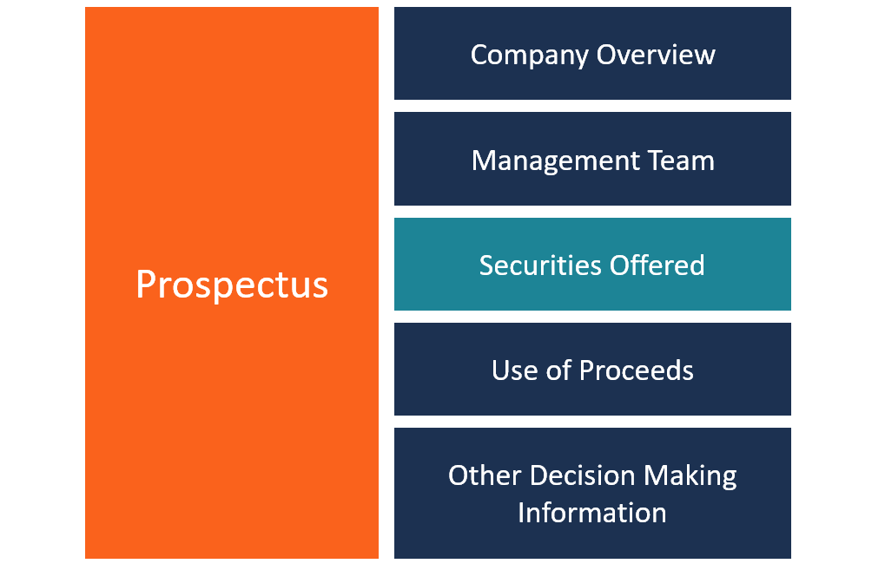

In today's rapidly evolving financial landscape, investors are constantly seeking tools to gain a competitive edge. Successfully navigating this complex environment requires a solid understanding of the core documents that underpin informed financial decisions. Investment documents, financial disclosures, and company prospectuses play a critical role in this process, providing essential data that investors rely on to make sound investment choices. These documents reveal valuable insights into the characteristics and potential risks associated with various investments, forming a foundation upon which strategic decisions are built.

In addition to understanding these documents, the role of algorithmic trading in modern investing is an increasingly important aspect of gaining an advantage in the markets. Algorithmic trading employs sophisticated computer algorithms to execute trades at speeds and frequencies beyond human capability, capitalizing on market inefficiencies and trends. As investors adopt these advanced technologies, they harness the potential to improve trading accuracy and portfolio performance, ensuring they remain competitive in the fast-paced financial industry.

The objective of this article is to empower investors with the requisite knowledge to effectively interpret and utilize these vital financial documents and trading technologies. By enhancing their comprehension of investment documents, financial disclosures, company prospectuses, and the mechanics of algorithmic trading, investors can navigate financial markets with greater confidence and acuity, optimizing their investment outcomes and safeguarding their financial interests.

## Table of Contents

## Understanding Investment Documents

Investment documents form the backbone of informed financial decision-making. These essential documents provide comprehensive insights into the characteristics, risks, and potential returns of specific investments. By examining these documents, investors can better understand the terms and conditions attached to various investment opportunities, thus facilitating informed decision-making and effective portfolio management.

Key documents in this domain include investment contracts, offering memorandums, and performance reports. Each of these plays a distinct role in conveying vital information to investors:

1. **Investment Contracts:** These are legally binding agreements that outline the terms and conditions of an investment. They include details such as the rights and obligations of the parties involved, the amount invested, duration, and the expected returns. Understanding the nuances of these contracts is crucial for investors to safeguard their interests and ensure compliance with legal and financial obligations.

2. **Offering Memorandums:** Offering memorandums are documents provided to potential investors when a company or entity offers securities for sale. They detail the terms of the investment, including company background, financial statements, and the risks involved. Unlike a prospectus, which is required for public offerings, offering memorandums are often used for private placements. Reviewing these documents allows investors to ascertain the viability and risk of the investment, based on the provided insights into the company's operations and financial health.

3. **Performance Reports:** These reports provide a historical account of an investment’s performance over a specific period. They typically include data on returns, volatility, and comparisons with benchmarks. Investors can use performance reports to evaluate the past performance of an asset or portfolio, enabling them to make informed predictions about future performance and adjust their investment strategies accordingly.

Thoroughly reviewing and understanding these documents is critical for effective portfolio management. By doing so, investors can assess the suitability of an investment, align it with their financial goals, and make informed decisions that enhance portfolio performance. As such, investment documents play an indispensable role in empowering investors and facilitating sound financial decisions.

## The Importance of Financial Disclosure

Financial disclosure represents a fundamental component of corporate transparency, allowing companies to communicate their financial performance and operational status. This transparency is critical in building and maintaining investor trust, as it enables stakeholders to make informed decisions based on a company's disclosed financial information.

Common types of financial disclosures include quarterly earnings reports, balance sheets, and cash flow statements. Quarterly earnings reports provide a regular update on a company's revenue, expenses, and profit or loss over a specific period. These reports are pivotal as they reflect the operational performance and can signal the company's financial health. Balance sheets offer a snapshot of a company's financial stance at a given time, showcasing assets, liabilities, and shareholders’ equity. This allows investors to evaluate the company's net worth and capital structure. Cash flow statements highlight the inflow and outflow of cash within the company, underscoring the [liquidity](/wiki/liquidity-risk-premium) position and ensuring the company has enough cash to meet its obligations.

Regulatory bodies, such as the Securities and Exchange Commission (SEC) in the United States, enforce stringent disclosure practices to protect investors from misleading information and potential fraud. Regulations ensure that disclosures are accurate, timely, and comprehensive. The SEC mandates listed companies to file regular reports, thereby safeguarding investor interests by promoting transparency and accountability.

Investors must meticulously analyze these financial disclosures to assess a company's financial health, stability, and future prospects. For instance, a consistently positive cash flow might indicate robust business operations, while a volatile earnings report might suggest underlying financial issues. By interpreting disclosures, investors can make informed judgments regarding the potential risks and rewards associated with investing in a particular company.

In summary, financial disclosure acts as a bridge between companies and investors, providing essential information that aids in making well-informed investment decisions. Understanding and analyzing these disclosures is crucial for evaluating the financial health and stability of companies within the financial market.

## Demystifying the Company Prospectus

A company prospectus is a critical document that plays a pivotal role in the investment process, particularly during the periods of Initial Public Offerings (IPOs) and secondary offerings. These formal documents serve as comprehensive guides designed to furnish potential investors with detailed insights into a company's foundational aspects prior to purchasing its stock. 

The prospectus provides an extensive overview of a company's operations, offering potential investors a window into its business model. Understanding the business model is essential as it delineates how the company plans to generate revenue and profit, which is crucial for assessing its long-term viability and competitive advantage. Additionally, prospectuses outline the company’s strategic goals, providing investors with information regarding future plans, growth strategies, and market positioning. 

Financial data is another cornerstone of the company prospectus. This includes historical financial statements, projected future performance, and key financial ratios, enabling investors to conduct a thorough financial analysis. Evaluating this data helps in forming a judgment regarding the company’s financial stability and potential for growth, placing an emphasis on metrics such as revenue growth, profit margins, and return on equity.

A significant section of the prospectus is dedicated to risk factors. This component enumerates potential challenges and threats that the company may encounter, ranging from market competition and regulatory changes to operational risks and economic conditions. By carefully assessing these risks, investors can gauge the potential downsides of the investment, facilitating a well-rounded decision-making process.

Moreover, the management team is a focal point within a prospectus. Insight into the backgrounds, experiences, and track records of key executives can provide an understanding of the leadership driving the company’s success. A capable and innovative management team is often indicative of a company’s potential to execute its strategic plans effectively.

The prospectus also details the use of proceeds from the stock offering. This elucidates how the company intends to allocate the funds raised, whether for expansion, debt reduction, research and development, or other corporate purposes. Understanding the use of proceeds is crucial as it reflects the company’s immediate priorities and commitments post-offering.

By systematically reading and analyzing a company prospectus, investors are equipped to evaluate not only the potential returns on an investment but also the associated risks. This measure of due diligence is fundamental in making educated investment choices, thereby enhancing the investor’s ability to navigate through prospective investment opportunities with confidence and acuity.

## Introducing Algorithmic Trading

Algorithmic trading utilizes computer algorithms to automate trading decisions, leveraging predefined criteria to execute orders at optimal timing and prices. This technology is reshaping the financial industry by providing significant advantages over traditional manual trading.

One of the primary benefits of [algorithmic trading](/wiki/algorithmic-trading) is increased efficiency. Algorithms can analyze vast datasets and execute trades in milliseconds, far surpassing human capabilities. This rapid execution minimizes the time lag between identifying trading opportunities and acting on them, which is critical in volatile markets.

Algorithmic trading also reduces errors associated with human intervention. Emotions in trading, such as fear and greed, can lead to irrational decisions. By relying on algorithms, traders can eliminate such biases and adhere strictly to data-driven strategies. This adherence helps maintain consistency and discipline in executing trades.

Moreover, algorithms facilitate the processing of large data volumes swiftly, enabling traders to incorporate various indicators and market data into their strategies. This includes technical indicators, real-time market data, and complex mathematical models.

Several types of algorithms are commonly employed in algorithmic trading:

1. **Arbitrage Strategies**: These algorithms exploit price differences of the same asset across different markets or exchanges. For instance, if asset A is cheaper on Exchange X than Exchange Y, the algorithm buys from X and sells on Y for a profit.

2. **Trend-Following Strategies**: These algorithms aim to capitalize on upward or downward market trends. By employing moving averages and other technical indicators, the algorithm identifies and follows trends until they show signs of reversing.

3. **Market-Making Strategies**: These strategies provide liquidity by simultaneously placing buy and sell orders for a particular asset. The algorithm profits from the bid-ask spread by continuously adjusting its orders to reflect market conditions.

Despite its advantages, algorithmic trading is not without risks and ethical considerations, particularly in high-frequency trading ([HFT](/wiki/high-frequency-trading-strategies)). HFT refers to the rapid execution of a large number of orders, often completed in fractions of a second. A key concern with HFT is the amplification of market [volatility](/wiki/volatility-trading-strategies). During market stress or "flash crashes," HFT algorithms can exacerbate price swings, potentially thwarting market stability.

Ethical considerations in algorithmic trading also involve market fairness. The speed and sophistication of algorithmic strategies can disadvantage retail investors, who often lack access to similar technology. This disparity raises questions about market equity and the potential need for regulatory oversight to ensure a level playing field.

In conclusion, while algorithmic trading offers profound benefits in terms of efficiency and accuracy, it is essential to balance these advantages with ethical and risk considerations to foster a fair and stable market environment.

## Integrating Knowledge for Informed Investments

Informed investors who understand key investment documents and trading strategies are better positioned for success in the financial markets. By integrating insights from investment documents, financial disclosures, and company prospectuses, investors can make sound investment choices. Each of these documents serves a distinct purpose but collectively contributes to a comprehensive understanding of potential investments.

Investment documents, such as offering memorandums and performance reports, provide crucial data on the characteristics and risks associated with an investment. Financial disclosures, including quarterly earnings reports and balance sheets, offer a transparent view of a company’s financial health. Company prospectuses, especially in initial public offerings (IPOs), provide detailed insights into the company's operations and strategic goals. Evaluating this information allows investors to make informed decisions by assessing both the potential rewards and inherent risks of an investment.

Algorithmic trading, a significant innovation in modern investing, enhances decision-making by using quantitative methods and data-driven insights to automate trading processes. Algorithms can process vast data sets quickly and execute trades with precision based on predefined criteria. Common algorithms include [arbitrage](/wiki/arbitrage) strategies, which exploit price differentials; trend-following algorithms, which identify [momentum](/wiki/momentum) in market movements; and market-making strategies to provide liquidity.

By adopting a holistic approach to investing, which combines the insights from traditional investment documents with the data-powered advantages of algorithmic trading, investors can enhance their resilience and adaptability amid market volatility. Continuous education remains imperative, enabling investors to leverage emerging technologies and strategies effectively. By staying informed and continuously integrating diverse sources of financial insights, investors are better equipped to navigate the complexities of financial markets and capitalize on emerging opportunities.

## Conclusion

Navigating the complexities of investment documents, financial disclosures, and company prospectuses is essential for investors to make informed decisions. These documents provide crucial insights into the risks, returns, and operational aspects of potential investments, forming the foundation upon which sound investment strategies are built.

Algorithmic trading presents an additional dimension by offering avenues for optimizing trading strategies and maximizing returns through data-driven insights. By automating decisions based on predefined criteria, algorithmic trading enhances the trading process by increasing efficiency and reducing errors. As the financial market continues to evolve rapidly, staying abreast of the latest tools and strategies is imperative for investors who aim to remain competitive.

Understanding and applying insights derived from these critical financial documents, along with leveraging the advantages of algorithmic trading technologies, can lead to improved investment outcomes. The continuous evolution of the market requires investors to be adaptable, informed, and continuously educated about both established practices and emerging trends.

Equipped with this knowledge, investors can navigate financial markets with greater efficacy and confidence, making resilient choices even amid volatility. By integrating comprehensive document analysis with advanced trading techniques, investors are better positioned to optimize their strategies and achieve sustained financial success.

## References & Further Reading

[1]: Bergstra, J., Bardenet, R., Bengio, Y., & Kégl, B. (2011). ["Algorithms for Hyper-Parameter Optimization."](https://papers.nips.cc/paper/4443-algorithms-for-hyper-parameter-optimization) Advances in Neural Information Processing Systems 24.

[2]: ["Advances in Financial Machine Learning"](https://www.amazon.com/Advances-Financial-Machine-Learning-Marcos/dp/1119482089) by Marcos Lopez de Prado

[3]: ["Evidence-Based Technical Analysis: Applying the Scientific Method and Statistical Inference to Trading Signals"](https://www.amazon.com/Evidence-Based-Technical-Analysis-Scientific-Statistical/dp/0470008741) by David Aronson

[4]: ["Machine Learning for Algorithmic Trading"](https://github.com/stefan-jansen/machine-learning-for-trading) by Stefan Jansen

[5]: ["Quantitative Trading: How to Build Your Own Algorithmic Trading Business"](https://www.amazon.com/Quantitative-Trading-Build-Algorithmic-Business/dp/1119800064) by Ernest P. Chan

[6]: Securities and Exchange Commission (SEC). ["A Beginner's Guide to the SEC's EDGAR System."](https://www.sec.gov/about/reports-publications/investorpubsbegininvesthtm)

[7]: Jones, C. M. (2013). ["What Do We Know About High-Frequency Trading?"](https://papers.ssrn.com/sol3/papers.cfm?abstract_id=2236201) The Review of Financial Studies, 26(12), 3301-3336.

[8]: Harris, L. (2003). ["Trading and Exchanges: Market Microstructure for Practitioners"](https://academic.oup.com/book/52292) by Larry Harris

[9]: Fabozzi, F. J., & Drake, P. P. (2009). ["The Basics of Finance: An Introduction to Financial Markets, Business Finance, and Portfolio Management"](https://onlinelibrary.wiley.com/doi/book/10.1002/9781118267790) by Frank J. Fabozzi and Pamela P. Drake