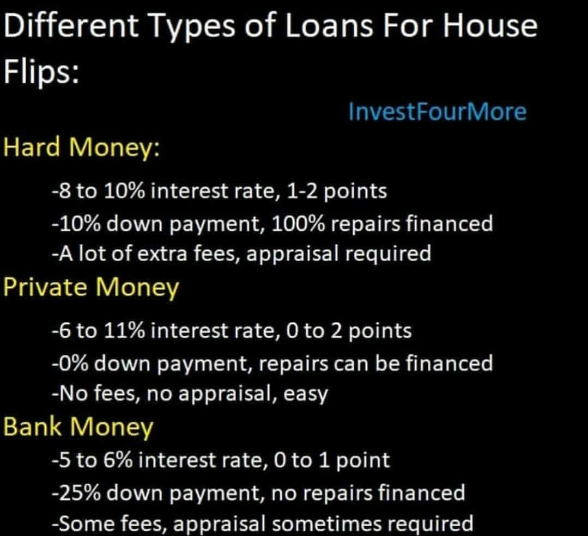

Real estate investment encompasses a diverse array of strategies that have seen a surge in popularity over recent years. Among these, house flipping stands out as a particularly enticing opportunity for investors aiming to capitalize on transforming undervalued properties. House flipping involves purchasing residential properties with the intent to renovate and sell them at a profit, often within a short timeframe. This strategy requires not only a keen understanding of market trends but also efficient project management and access to reliable financial resources.

Securing the right type of loan is crucial for navigating the complexities of real estate investment. Different loan options, such as conventional mortgages, hard money loans, and private lender loans, offer varying terms, interest rates, and eligibility requirements. Each option has specific advantages and challenges depending on the investor's experience and creditworthiness. This makes the selection of an appropriate loan type a critical step for aspiring house flippers.



In addition to traditional investment approaches, the integration of algorithmic trading concepts offers promising potential to optimize decision-making processes in real estate. Originally prevalent in stock markets, algorithmic trading utilizes computer algorithms to analyze large datasets, identify patterns, and predict trends. By applying these concepts to real estate, investors can leverage data-driven insights to enhance their buying and selling strategies, thereby gaining a competitive edge in the market.

This article explores the key aspects of real estate investment loan acquisition, the art and science of house flipping, and the role of algorithmic trading. By understanding and integrating these elements, investors can navigate the dynamic and complex landscape of real estate investment with greater confidence and efficiency.

## Table of Contents

## Understanding Real Estate Investment Loans

Real estate investment loans are specifically designed to fund the acquisition of properties with the aim of generating profit, rather than for personal residence. These loans differ from traditional home loans due to their emphasis on investment returns and typically have distinct terms and conditions.

There are several types of loans available for real estate investors, including conventional mortgages, hard money loans, and private lender loans. Conventional mortgages are traditional loan products offered by banks or financial institutions, generally featuring lower interest rates and longer terms. These loans usually require a strong credit history and a substantial down payment, making them suitable for experienced investors with established creditworthiness.

Hard money loans, on the other hand, are often preferred by house flippers due to their expedited approval process and quick fund access. While these loans offer short terms and high-interest rates, they are based more on the property's potential value rather than the borrower's credit score. This makes hard money loans an attractive option for investors who need immediate capital to purchase and renovate properties.

Private lender loans come from individual investors or groups that offer more flexible terms compared to conventional banks. These loans can be personalized to fit specific investment strategies, allowing for customized agreements based on the investor's needs and the potential profitability of the project. Private lenders are often more willing to negotiate interest rates and repayment plans.

Understanding the unique terms, interest rates, and eligibility requirements associated with each type of real estate investment loan is critical for choosing the right financing option. The selection process should consider the investor's experience level, creditworthiness, and the specific strategy they intend to employ. Opting for the appropriate loan type can significantly influence the success of the investment, affecting both the profitability and the time frame of the project.

## The Art and Science of House Flipping

House flipping is a real estate strategy that involves the purchase, renovation, and sale of properties within a relatively short period. This approach seeks to capitalize on market inefficiencies by refurbishing undervalued properties to boost their market appeal and subsequently selling them at a profit. The process is both an art, requiring a keen eye for potential and design, and a science, demanding precise financial calculations and market analysis.

To succeed in house flipping, the selection of the right property is paramount. Investors must identify undervalued properties in promising locations. This requires an understanding of neighborhood trends, property values, and potential growth. Selecting a property often involves a cost-benefit analysis to ensure that the purchase price plus the renovation expenses will result in a profitable sale. Successful flippers are adept at calculating potential profit margins using metrics such as the after-repair value (ARV). The ARV is an estimate of the property's value after renovations, which can be calculated as:

$$
\text{Profit Margin} = \text{Selling Price} - (\text{Purchase Price} + \text{Renovation Costs})
$$

Managing renovation costs effectively is another critical [factor](/wiki/factor-investing). Investors must develop a comprehensive renovation plan that balances cost with quality. This involves hiring skilled contractors and accurately estimating renovation costs to avoid overruns. Project management skills are crucial in this phase to ensure that projects are completed on time and within budget. Networking with real estate [agents](/wiki/agents) and contractors can also provide insights and opportunities that might not be immediately obvious.

Understanding local real estate market dynamics is crucial for maximizing profitability. This includes keeping up with market trends, demographic shifts, and economic indicators that influence property values. Knowledge of the local market enables investors to make informed decisions about when to buy and sell, ensuring that they capitalize on favorable market conditions.

Investors must also be vigilant about potential pitfalls. Unforeseen repair costs can erode profits, especially if underlying issues are not identified during initial inspections. Additionally, market downturns pose a risk by potentially reducing property values or prolonging sales timelines. To mitigate such risks, thorough due diligence, contingency planning, and flexible strategies are essential.

In essence, house flipping requires a blend of analytical and practical skills. While the goal is to achieve maximum returns on investment, the strategy's success hinges on meticulous planning, execution, and market insight.

## Algorithmic Trading Concepts in Real Estate

Algorithmic trading, prominently used in financial markets, can be effectively leveraged in real estate investment to refine strategies and execution. At its core, [algorithmic trading](/wiki/algorithmic-trading) involves the use of computer algorithms to conduct trades at optimal prices, by analyzing numerous datasets to discern patterns and trends.

Investors in real estate can utilize algorithms to sift through vast amounts of market data, ranging from property prices and market supply-demand dynamics to historical sale trends and economic indicators. This enables the identification of patterns that may not be immediately visible through manual analysis. For instance, algorithms can process datasets encompassing multiple variables and timeframes to predict shifts in property values or to forecast demand in specific real estate sectors.

Algorithmic models can offer insightful predictions regarding the best times to buy or sell properties. By employing techniques such as regression analysis, time-series forecasting, or [machine learning](/wiki/machine-learning), these models provide predictive analytics that enhances traditional decision-making processes. Consider a scenario where a real estate investor uses a linear regression model to project future property prices based on historical data and economic variables:

```python
import numpy as np
from sklearn.model_selection import train_test_split
from sklearn.linear_model import LinearRegression

# Sample dataset: [square footage, location score, age of property, market trend score]
X = np.array([[2000, 80, 10, 5], [1500, 75, 8, 6], [1800, 70, 15, 4]])
y = np.array([300000, 250000, 275000])  # Property prices

X_train, X_test, y_train, y_test = train_test_split(X, y, test_size=0.2, random_state=42)
model = LinearRegression().fit(X_train, y_train)

# Predict the price of a property with a certain set of features
predicted_price = model.predict(np.array([[1900, 78, 12, 5]]))
print(predicted_price)
```

Automating data analysis through algorithmic methods reduces human error and facilitates faster, more informed decision-making. This enhances an investor's ability to react to real-time market changes, potentially maximizing profit margins or minimizing losses.

The integration of technology in real estate investment presents a significant advantage, especially within an environment characterized by rapid market fluctuations. For instance, algorithms can continuously monitor housing market indicators and trigger buying or selling decisions as soon as favorable or adverse conditions are detected. This real-time adaptability allows investors to stay ahead of trends, ensuring a competitive edge.

Overall, as real estate markets evolve, the incorporation of algorithmic trading concepts in investment strategies will likely become increasingly pivotal. This fusion of finance, data science, and technology not only streamlines the investment process but also enhances the strategic positioning of investors in an ever-changing landscape.

## Securing Financing for House Flipping

Securing financing is a crucial aspect of the house flipping process, as access to appropriate funding can significantly influence the success of a flip. Investors have several loan options at their disposal, each with its unique characteristics and benefits.

Hard money loans stand out as a popular choice for those needing rapid funding solutions. These loans, typically offered by private investors or companies, are secured by the property's value rather than the borrower's creditworthiness. The primary advantage of hard money loans is their speed; they can often be obtained within days, providing house flippers with the agility needed to capitalize on competitive real estate opportunities. However, this swift access comes at a cost, as hard money loans generally have higher interest rates and shorter repayment terms compared to conventional loans, reflecting the increased risk assumed by lenders.

Private lenders, on the other hand, offer another viable financing route. Unlike traditional banks, private lenders often provide more flexible terms and the possibility of personalized agreements tailored to the investor's specific needs and circumstances. This flexibility can be particularly appealing for experienced investors who can negotiate terms that align closely with their flipping strategy, such as interest-only payments or customized loan durations.

Real estate crowdfunding represents an innovative financing option that has gained traction in recent years. This method entails pooling resources from multiple investors via online platforms, enabling individuals to invest in real estate projects with smaller amounts of capital. Crowdfunding provides house flippers with access to funding without the constraints of traditional loans, and it allows investors to diversify their portfolios by participating in various projects. However, it requires a clear and compelling business plan to attract potential backers.

Successfully securing financing for a house flip hinges on presenting a well-prepared business plan. This plan should effectively communicate the potential profitability of the project to lenders or investors, incorporating details such as the purchase price, estimated renovation costs, and calculated after-repair value (ARV). A formula to calculate potential profit might be:

$$
\text{Profit} = \text{ARV} - (\text{Purchase Price} + \text{Renovation Costs} + \text{Holding Costs} + \text{Selling Costs})
$$

By providing a comprehensive overview of the expected financial outcomes, investors demonstrate their due diligence and risk assessment capabilities, thereby improving their chances of securing the necessary funding.

## Strategies for Successful House Flipping

Successful house flipping relies on a combination of strategic planning and dynamic execution. Central to this process is conducting thorough market research and gaining a clear understanding of local property trends. Comprehensive market analysis helps investors identify neighborhoods with growth potential, allowing them to select properties that are more likely to appreciate in value post-renovation.

Building a reliable team is crucial for the smooth execution of a house flipping project. This team should include real estate agents with insight into local market conditions, contractors equipped to handle renovations efficiently, and inspectors to ensure that all work meets regulatory standards. Effective communication and coordination among team members can streamline the flipping process, prevent delays, and ensure high-quality outcomes.

Establishing a detailed budget and timeline is essential to manage costs effectively and avoid unexpected financial pitfalls. A budget should account for purchase costs, renovation expenses, holding costs, and a contingency for unforeseen issues. Similarly, a realistic timeline helps in coordinating the various phases of the project, from acquisition through renovation, marketing, and sale. Sticking to a budget and timeline minimizes the risk of overspending and ensures the project remains profitable.

Marketing the renovated property plays a significant role in determining the speed and profitability of the sale. Effective marketing strategies can include staging the house, utilizing professional photography, and targeting the right audience through various platforms. Highlighting the property's unique features and improvements can attract potential buyers swiftly and potentially shorten the selling cycle.

Continuously analyzing and refining flipping strategies is vital for sustained success and growth in the competitive real estate market. This involves keeping abreast of market trends, evaluating previous projects to identify opportunities for improvement, and adapting to changes in buyer preferences and economic conditions. Investors who remain flexible and informed are better positioned to maximize returns on their house flipping investments.

## Conclusion

Real estate investment through house flipping offers significant profit potential when the right combination of financing and strategy is employed. Investors must have a comprehensive understanding of various loan options, such as conventional mortgages, hard money loans, and private lender loans. This knowledge allows investors to tailor their financial approach to align with their specific investment goals and risk tolerance.

Incorporating data analytics into real estate decision-making processes further enhances investment outcomes. Analyzing property trends, market fluctuations, and economic indicators can guide investors in making informed decisions regarding property acquisition and sales. Algorithmic trading concepts, typically associated with stock markets, have demonstrated their value in providing insights and efficiencies in real estate investments. Algorithms can be utilized to identify patterns and anticipate market movements, thus optimizing buying and selling decisions.

As the technological landscape evolves, investors are becoming increasingly tech-savvy, integrating advanced analysis tools and automated processes into their investment strategies. Python, for instance, provides various libraries such as NumPy and pandas, which can be advantageous for performing sophisticated data analyses to assess market conditions effectively.

In this dynamic and competitive market, the fusion of financial expertise, technological innovation, and strategic execution is paramount for achieving success in real estate investment. Embracing these elements enables investors to capitalize on lucrative opportunities while navigating the complexities of the market with confidence and precision.

## References & Further Reading

[1]: Peters, J. (2019). ["The Book on Flipping Houses: How to Buy, Rehab, and Resell Residential Properties"](https://www.amazon.com/Book-Flipping-Houses-Residential-Properties/dp/1947200100) by J Scott.

[2]: Ferguson, R. (2020). ["Real Estate Investing For Dummies"](https://www.wiley.com/en-us/Real+Estate+Investing+For+Dummies%2C+4th+Edition-p-9781119601760) by Eric Tyson and Robert S. Griswold.

[3]: Lochner, K. L. (2021). ["The Flipping Blueprint: The Complete Plan for Flipping Houses and Creating Your Real Estate-Investing Business"](https://www.amazon.com/Flipping-Blueprint-Complete-Estate-Investing-Investors-ebook/dp/B09GQH2GSK) by Luke Weber.

[4]: "Residential Real Estate Investment and Algorithmic Trading" by Jansen, S. ["Machine Learning for Algorithmic Trading"](https://github.com/stefan-jansen/machine-learning-for-trading).

[5]: Aronson, D. R. (2006). ["Evidence-Based Technical Analysis: Applying the Scientific Method and Statistical Inference to Trading Signals"](https://www.amazon.com/Evidence-Based-Technical-Analysis-Scientific-Statistical/dp/0470008741) by John Wiley & Sons, Inc.