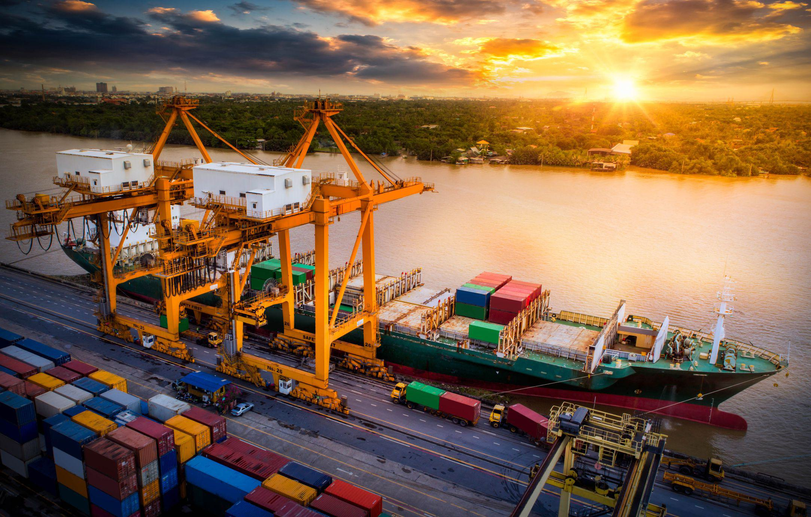

In the fast-paced world of international trade and shipping, documentation plays a crucial role in ensuring the smooth movement of goods across borders. The Bill of Lading (BL), a key document in this process, serves not only as a receipt for the merchandise but also as a contract and a document of title. The BL has evolved over time, with variants like the Telex Release further simplifying and expediting the shipping processes by allowing the release of goods without needing the original physical document.

With the advent of technology, these traditional documents have experienced a transformation, becoming digitized to enhance efficiency and accuracy in the shipping industry. Digitalization reduces the likelihood of errors and delays, which are common in paper-based systems. The emergence of advanced technological solutions such as algorithmic trading, often referred to as algo trading, exemplifies the ongoing optimization of operational processes within the industry. Algo trading employs computer algorithms to automate decision-making processes, providing predictive insights and facilitating real-time actions that improve logistics management.



This article examines these essential shipping documents and the role of algo trading in optimizing operations. It highlights the significance of integrating traditional documentation methods with cutting-edge technological advancements to create a robust framework for global trade. As businesses strive to remain competitive, embracing these innovations is increasingly important to meet the demands of a rapidly evolving shipping landscape.

## Table of Contents

## Understanding the Bill of Lading

A Bill of Lading (BL) is a fundamental document in the shipping and logistics industry, serving multiple essential purposes. It acts primarily as a legal agreement between the shipper (the party sending the goods) and the carrier (the entity responsible for transporting the goods). This document outlines critical details such as the ownership, type, quantity, and destination of the goods being shipped. These specifics ensure both parties have a mutual understanding of the shipment's particulars, reducing the risk of disputes or miscommunications.

The Bill of Lading functions as a receipt for the goods once they are on board the vessel, verifying that the carrier has received the merchandise in the agreed condition and quantity. This acknowledgment is crucial for the shipper, as it provides a paper trail and proof that the carrier has taken responsibility for the cargo. Furthermore, in many instances, the Bill of Lading also serves as a document of title. This characteristic allows it to be negotiable, which means it can be endorsed or transferred to a third party, contributing to the fluidity of commerce by facilitating the sale or collateralization of the underlying cargo. Conversely, it can be non-negotiable, often labelling specific recipients without offering transfer rights, thereby limiting flexibility but providing security over who ultimately receives the goods.

There are several types of Bills of Lading, each tailored to specific functions and scenarios within the shipping process. A Master Bill of Lading is typically issued by the carrier and is used when goods are shipped through a freight forwarder. It is crucial for defining the overall terms and conditions under which the transportation is carried out. On the other hand, a House Bill of Lading is issued by the freight forwarder to the shipper, representing a more detailed and specific agreement between them.

These Bills of Lading ensure that all parties involved in the shipping process maintain clearly defined responsibilities and rights. Understanding their differing roles and applications is vital for stakeholders in the shipping industry to effectively manage logistics and avoid potential legal and operational pitfalls.

## Telex Release Explained

A Telex Release represents a key procedural step in contemporary shipping operations, facilitating the release of goods without necessitating the presentation of the original Bill of Lading. This process is particularly advantageous in scenarios that demand expedited transactions or where physical documents have been misplaced. 

The fundamental mechanism of a Telex Release involves an electronic or emailed communication from the agent at the loading port to the agent at the discharge port. This communication serves to confirm that the original Bill of Lading has been surrendered, thereby authorizing the release of the shipment to the consignee. This system allows for the seamless continuation of the logistics chain, mitigating potential delays that could arise from document-related issues.

By enabling this electronic notification, Telex Release provides significant flexibility and expedites the shipping process. It effectively circumvents the traditional dependency on physical document transfers, which can be slow and cumbersome, especially in international operations. As a result, Telex Release is ideally suited for situations where there is a stringent timeline or where unforeseen circumstances, such as lost or damaged documents, pose a challenge to the timely release of cargo. 

In essence, the Telex Release mechanism enhances the efficiency of global trade by reducing the reliance on physical documentation, thereby accommodating the fast-paced nature of modern shipping logistics.

## The Role of Technology in Shipping Documentation

Technological advancements have significantly modernized shipping documentation processes, with digital solutions like WaveBL being at the forefront of these innovations. These advancements have primarily focused on enhancing the efficiency and security of documentation, which are critical factors in international trade and shipping.

Digital Bills of Lading (Digital BLs) have revolutionized operations within the shipping industry. These digital documents allow for a more streamlined approach to managing shipping operations by reducing the manual workload involved in handling paper documents. The digital format facilitates faster processing times, minimizing human-generated errors that can occur during data entry. Additionally, Digital BLs ensure greater visibility across the supply chain because they can be easily updated and shared in real-time with all stakeholders, including shippers, carriers, and receivers. This transparency enhances coordination and efficient handling of logistical operations.

Moreover, automation and blockchain technology have introduced unprecedented levels of security and compliance in shipping documentation. Automation ensures that routine processes and validations are handled by software systems, which significantly reduces the chance of errors and accelerates the overall process. For instance, automated systems can flag discrepancies in documentation, thereby preventing potential shipping delays caused by incorrect or incomplete documents.

Blockchain technology, characterized by its decentralized and immutable nature, offers robust security features that are particularly beneficial in preventing fraud and unauthorized alterations of documents. It ensures that each transaction or change in the document is recorded in a verifiable manner, making it almost impossible to manipulate data without detection. Consequently, this level of security addresses key concerns related to cyber threats, which are prevalent in digital ecosystems.

WaveBL, a notable example in this domain, utilizes blockchain to secure transactions and documentation. It enables companies to issue, transfer, and manage Digital BLs efficiently while ensuring adherence to legal and industry standards. This digital solution not only minimizes the risks associated with traditional paper-based processes but also complies with international best practices, contributing to a more secure and compliant shipping industry.

In conclusion, the integration of digital technologies, such as Digital BLs, automation, and blockchain, into shipping documentation has dramatically improved operational efficiencies, accuracy, and security, paving the way for more reliable and expedited international trade processes.

## Algo Trading and Its Application in Shipping

Algorithmic trading, or algo trading, is a method of executing orders using automated pre-programmed trading instructions. Its application extends beyond financial markets, offering significant potential for the shipping industry to streamline logistics and operations. By leveraging computer algorithms, shipping companies can optimize routes, manage fleets more efficiently, and enhance cargo handling, thereby reducing operational costs and improving overall efficiency.

In the context of shipping, algo trading analyzes vast amounts of market data alongside industry trends to generate predictive insights. These insights facilitate real-time decision-making, allowing shipping companies to anticipate and react promptly to market fluctuations, fuel price changes, and unexpected delays. Consequently, this leads to better resource allocation, optimized shipping schedules, and ultimately, enhanced operational efficiency.

One crucial advantage of algo trading is its ability to model complex logistical problems and produce optimal solutions quickly. For example, solving a routing problem for a fleet of cargo ships involves considering various constraints such as fuel consumption, port fees, and delivery deadlines. Algorithms can process this information rapidly, identifying the most efficient routes and schedules under ever-changing conditions, thus reducing transit times and fuel use.

Here's a simple demonstration of how Python can be used to solve an optimization problem in shipping:

```python
from scipy.optimize import linprog

# Coefficients for fuel cost, port fees, and speed penalties for each route
c = [5, 10, 7, 8]  

# Constraints representing time limitations and port schedules
A = [
    [1, 1, 0, 0],
    [0, 0, 1, 1],
    [1, 0, 1, 0],
    [0, 1, 0, 1]
]

# Maximum available time or budget
b = [20, 20, 25, 15]  

# Bounds for each decision variable (e.g., route selection)
x_bounds = [(0, None), (0, None), (0, None), (0, None)]

# Solve the optimization problem
result = linprog(c, A_ub=A, b_ub=b, bounds=x_bounds, method='highs')

print(result)
```

In this example, `linprog` from the SciPy library efficiently finds the least costly combination of shipping routes, adhering to operational constraints like time and budget.

Furthermore, algo trading in shipping aids in synchronizing supply chain components, enhancing visibility, and fostering a proactive approach to managing disruptions. Rather than responding to issues after their occurrence, shipping companies can utilize predictive analytics to foresee and mitigate potential problems, such as weather disruptions or port congestion.

The integration of [algorithmic trading](/wiki/algorithmic-trading) with current digital technologies accelerates the digital transformation within the shipping industry. By using algo trading, firms gain a competitive edge through improved decision-making capabilities, thus supporting the industry's ongoing efforts to adapt to technological advancements and maintain sustainable growth.

In conclusion, as the shipping industry continues to embrace digital transformation, the application of algo trading is becoming increasingly vital. It holds the promise of transforming traditional logistics operations into more efficient, data-driven processes, paving the way for the future of global trade.

## Risks and Challenges of Modern Shipping Methods

Modern shipping methods, despite offering numerous benefits in terms of efficiency and speed, come with a set of risks and challenges that necessitate careful management. Documentation methods, such as Telex Release, and digital transformations have their own vulnerabilities, including potential fraud, miscommunication, and technical errors.

Security concerns are particularly critical in the context of digital documentation. Electronic documents, such as digital Bills of Lading, are susceptible to cyber threats if not properly protected. Unauthorized access or tampering with these documents can lead to significant financial losses and operational disruptions. To protect against these threats, companies need to implement robust cybersecurity measures. This includes encryption of sensitive data, use of secure communication protocols such as HTTPS for data transmission, and regular security audits to identify and close vulnerabilities.

Moreover, the risk of miscommunication is heightened with Telex Release, as the process involves electronic exchanges between [agents](/wiki/agents) at different ports. Misunderstandings or errors can occur if these communications are not clear and precise. To address this risk, establishing clear and standardized communication protocols is essential. This can involve the use of standardized message formats and verification procedures to ensure that the correct information is exchanged and interpreted correctly by all parties involved.

Additionally, as companies move towards digital platforms, technical errors can become a more frequent cause of concern. System downtimes, software malfunctions, or network issues can delay or disrupt shipping operations. Continuous monitoring of digital platforms is vital to promptly detect and resolve such technical issues. Moreover, deploying redundancy systems and backup solutions can help mitigate the impact of technical failures, ensuring that operations can continue with minimal interruption.

In implementing these measures, companies aim to create a secure, reliable, and efficient shipping process that leverages modern technology while minimizing associated risks. This balancing act is crucial to maintaining competitiveness in the fast-paced world of international trade.

## Conclusion

The integration of traditional shipping documentation with innovative technologies has significantly enhanced global trade efficiency. By combining proven methods with modern advancements such as Telex Release and algorithmic trading, the shipping industry achieves a higher degree of speed and reliability in transactions. Telex Release facilitates the swift and secure release of goods without the physical exchange of documents, mitigating risks related to lost paperwork and expediting the movement of cargo. Meanwhile, algorithmic trading introduces predictive analysis and real-time decision-making, optimizing logistics and reducing operational costs.

These technological strides allow businesses to respond more agilely to market demands, maintaining competitiveness in a constantly evolving environment. The synergy between historical practices and digital innovations offers a streamlined approach to international shipping, ensuring compliance and security. As the shipping industry continues to embrace these solutions, companies are well-positioned to meet the challenges and opportunities presented by globalization and digital transformation. The ongoing adoption of such technologies represents a proactive step in fortifying the resilience and adaptability of global supply chains.

## References & Further Reading

[1]: Branch, A. E. (2000). ["Elements of Shipping."](https://www.taylorfrancis.com/books/mono/10.4324/9780203013083/elements-shipping-alan-edward-branch) Routledge.

[2]: Maritime Law Handbook, "Bills of Lading: Law and Practice," Wolters Kluwer.

[3]: Umit, S. (2019). ["Digitalizing International Trade: Electronic Bills of Lading and Blockchain Technology"](https://www.researchgate.net/publication/343788241_Electronic_bills_of_lading_in_international_trade_transactions_-_critical_remarks_on_digitalisation_and_the_blockchain_technology), SSRN Electronic Journal.

[4]: Kovács, G., & Kot, S. (2016). ["New Logistics and Production Trends as the Result of Global Economy Changes."](https://www.semanticscholar.org/paper/New-logistics-and-production-trends-as-the-effect-Kov%C3%A1cs-Kot/c5bb7286fd680d2acc413d3f28003e987e341769) Logistics.

[5]: Stopford, M. (2009). ["Maritime Economics"](https://www.taylorfrancis.com/books/mono/10.4324/9780203891742/maritime-economics-3e-martin-stopford), Routledge.

[6]: The World Economic Forum, "Blockchain and the Future of Trade: Report," 2019.