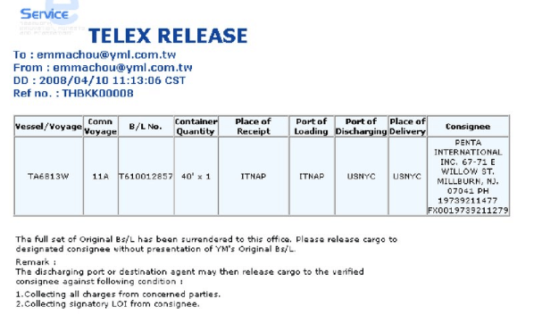

## Table of Contents

## What is a Telex Release?

A Telex Release is a way to release goods without needing the original bill of lading. When a buyer and seller agree on a Telex Release, the seller tells the shipping company to let the buyer pick up the goods. This is done by sending a message, usually by email or fax, to the shipping company. This message tells the shipping company that the original bill of lading is no longer needed.

Using a Telex Release can make things easier and faster. Instead of waiting for the original bill of lading to be sent by mail, which can take a long time, the buyer can get the goods more quickly. This is helpful when time is important. However, both the buyer and seller need to trust each other because the original document is not used.

## What is a Bill of Lading?

A Bill of Lading is a very important document in shipping. It acts like a receipt and a contract between the person sending the goods and the shipping company. It shows that the shipping company has received the goods and agrees to deliver them to a specific place. The Bill of Lading also has details about the goods, like what they are, how many there are, and where they are going.

The Bill of Lading is also used to show who owns the goods while they are being shipped. When someone buys goods, they might need the original Bill of Lading to pick them up at the destination. This makes sure that only the right person can take the goods. If the Bill of Lading is lost or not given to the right person, it can cause problems and delays in getting the goods.

## Why might someone need a Telex Release?

Someone might need a Telex Release if they want to get their goods faster. When you buy things from far away, you usually need a Bill of Lading to pick them up. But waiting for the original Bill of Lading to come in the mail can take a long time. With a Telex Release, the seller can tell the shipping company to let the buyer have the goods without needing the original paper. This can save a lot of time and help the buyer get their goods quicker.

Another reason to use a Telex Release is if the buyer and seller trust each other a lot. Since the original Bill of Lading is not used, both sides need to be sure that everything is okay. If they trust each other, they can agree to use a Telex Release to make things easier. This can be really helpful in situations where speed is important and both the buyer and seller want to work together smoothly.

## How does the process of obtaining a Telex Release begin?

The process of obtaining a Telex Release starts when the seller and buyer agree to use it instead of the original Bill of Lading. They talk about it and decide that it's the best way to go. Once they agree, the seller needs to tell their bank or the shipping company that they want to do a Telex Release. This is important because the bank or shipping company needs to know what's happening.

After the seller tells their bank or the shipping company, the next step is for the seller to send a message. This message can be an email or a fax, and it tells the shipping company to release the goods to the buyer without the original Bill of Lading. The message has all the important details about the shipment, like the number of the Bill of Lading and the name of the buyer. Once the shipping company gets this message, they can let the buyer pick up the goods.

## What are the key differences between a Telex Release and an Original Bill of Lading?

A Telex Release and an Original Bill of Lading are both important in shipping, but they work differently. A Telex Release is a message sent by the seller to the shipping company, saying that the buyer can pick up the goods without needing the original Bill of Lading. This makes things faster because the buyer doesn't have to wait for the original paper to come in the mail. On the other hand, an Original Bill of Lading is a physical document that acts like a receipt and a contract. It shows that the shipping company has the goods and will deliver them to a specific place, and it's needed to prove who owns the goods.

The main difference is that a Telex Release speeds up the process by not needing the original document. This can be really helpful when time is important, but it needs a lot of trust between the buyer and seller. With an Original Bill of Lading, the buyer has to wait for the paper to arrive, which can take longer but is more secure because it's a physical document that shows ownership. Both methods have their own benefits and are used based on what the buyer and seller agree on and how much they trust each other.

## What documentation is required to apply for a Telex Release?

To apply for a Telex Release, you need a few important pieces of paper. First, you need the original Bill of Lading. Even though you won't use it to pick up the goods, you need to give it to your bank or the shipping company. This shows that you have the right to tell them to do a Telex Release. You also need to write a letter or fill out a form asking for the Telex Release. This letter or form should have all the details about your shipment, like the Bill of Lading number and the buyer's name.

Once you have these documents ready, you send them to your bank or the shipping company. They will check everything to make sure it's okay. If everything is right, they will send a message, like an email or a fax, to the shipping company at the destination. This message tells the shipping company to let the buyer pick up the goods without needing the original Bill of Lading. It's important to do everything correctly so the Telex Release works smoothly.

## How long does it typically take to obtain a Telex Release?

The time it takes to get a Telex Release can be different depending on a few things. Usually, it can take a few hours to a couple of days. This is because you need to send the right papers to your bank or the shipping company, and they need to check everything to make sure it's okay. If everything is in order and they can send the message quickly, it can be faster.

Sometimes, it might take longer if there are problems or if the bank or shipping company is busy. For example, if there's a holiday or if they need more information from you, it can take more time. But in general, a Telex Release is much quicker than waiting for the original Bill of Lading to come in the mail, which can take weeks.

## What are the costs associated with obtaining a Telex Release?

The costs for getting a Telex Release can be different depending on the shipping company and the bank you work with. Usually, you might have to pay a fee to the shipping company for sending the Telex Release message. This fee can be small, like $25 to $50, but it can be more depending on the company and where the goods are going. Also, your bank might charge you a fee for handling the paperwork and sending the message. This bank fee can also be around $25 to $50, but again, it can change based on your bank's rules.

Sometimes, there might be other costs too. For example, if you need to send documents quickly by courier or if you need to get extra papers or help from a shipping agent, these can add to the total cost. It's a good idea to ask your shipping company and bank about all the fees before you start the process, so you know what to expect and can plan your budget.

## What are the potential risks or issues that can arise when using a Telex Release?

Using a Telex Release can be risky because it depends a lot on trust between the buyer and the seller. Since the original Bill of Lading is not used, there's a chance that someone else could try to claim the goods. If the message for the Telex Release is sent to the wrong person or if there's a mistake in the message, it could cause big problems. The buyer might not be able to pick up the goods, or someone else might take them instead.

Another issue is that the shipping company or the bank might not process the Telex Release quickly. If there are delays or if they need more information, it can slow things down. Also, if the buyer and seller don't agree on everything clearly, there could be misunderstandings or disagreements about who should pay the fees for the Telex Release. It's important for both sides to be careful and make sure all the details are right to avoid these problems.

## How does the verification process work for a Telex Release?

When you want to get a Telex Release, the verification process starts with the seller sending the original Bill of Lading to their bank or the shipping company. This is to show that they have the right to ask for a Telex Release. The bank or shipping company checks the original Bill of Lading to make sure it matches the details of the shipment. They look at things like the Bill of Lading number, the name of the buyer, and other important information. If everything is correct, they will agree to send the Telex Release message.

After the bank or shipping company agrees, they send a message, usually by email or fax, to the shipping company at the destination. This message tells the shipping company to let the buyer pick up the goods without needing the original Bill of Lading. The shipping company at the destination will then check the message to make sure it's from the right place and has all the correct details. If everything checks out, they will release the goods to the buyer. This verification process is important to make sure that the goods go to the right person and that everything is done correctly.

## Can a Telex Release be used for all types of cargo and shipping routes?

A Telex Release can be used for many types of cargo and shipping routes, but it's not always possible for every situation. It works well for common goods like electronics, clothes, and machinery. Most shipping companies that handle these types of cargo will agree to do a Telex Release if the seller and buyer want it. However, some special or dangerous goods might need extra rules or documents, so a Telex Release might not be allowed or could be harder to get.

The shipping route can also affect whether a Telex Release can be used. For routes that are well-known and have good communication, like between big ports in different countries, a Telex Release is usually easy to do. But for routes that are less common or go through places with less good communication, it might be harder or take longer to get a Telex Release. It's always a good idea to check with the shipping company to see if they will allow a Telex Release for your specific cargo and route.

## What are the best practices for ensuring a smooth Telex Release process?

To make sure the Telex Release process goes smoothly, it's important to talk clearly with the buyer and the shipping company from the start. Make sure everyone knows what a Telex Release is and agrees to use it. Have all the right papers ready, like the original Bill of Lading, and check them carefully before sending them to your bank or the shipping company. If you need to fill out a form or write a letter asking for the Telex Release, make sure it has all the details about your shipment, like the Bill of Lading number and the buyer's name. This helps avoid mistakes and makes the process faster.

Another good practice is to keep in touch with your bank and the shipping company while they are working on the Telex Release. If they need more information or if there are any problems, you can help fix them quickly. Also, it's a good idea to know about any fees you might have to pay and plan for them. By being clear and ready, you can make sure the Telex Release works well and your goods get to the buyer on time.

## References & Further Reading

[1]: Branch, A. E. (2000). ["Elements of Shipping."](https://www.taylorfrancis.com/books/mono/10.4324/9780203013083/elements-shipping-alan-edward-branch) Routledge.

[2]: Maritime Law Handbook, "Bills of Lading: Law and Practice," Wolters Kluwer.

[3]: Umit, S. (2019). ["Digitalizing International Trade: Electronic Bills of Lading and Blockchain Technology"](https://www.researchgate.net/publication/343788241_Electronic_bills_of_lading_in_international_trade_transactions_-_critical_remarks_on_digitalisation_and_the_blockchain_technology), SSRN Electronic Journal.

[4]: Kovács, G., & Kot, S. (2016). ["New Logistics and Production Trends as the Result of Global Economy Changes."](https://www.semanticscholar.org/paper/New-logistics-and-production-trends-as-the-effect-Kov%C3%A1cs-Kot/c5bb7286fd680d2acc413d3f28003e987e341769) Logistics.

[5]: Stopford, M. (2009). ["Maritime Economics"](https://www.taylorfrancis.com/books/mono/10.4324/9780203891742/maritime-economics-3e-martin-stopford), Routledge.

[6]: The World Economic Forum, "Blockchain and the Future of Trade: Report," 2019.