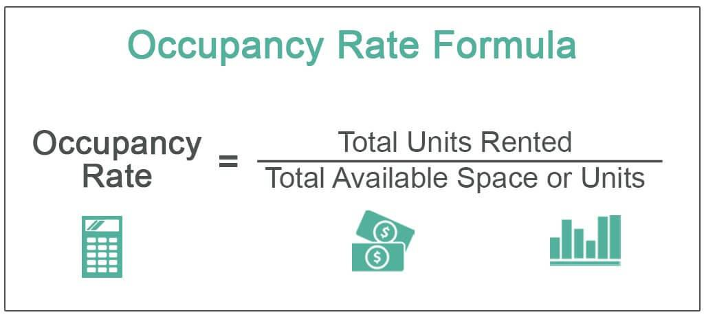

The intersection of real estate metrics, particularly occupancy rates, with algorithmic trading presents new opportunities for investors and analysts. Occupancy rates serve as a crucial indicator in real estate, reflecting the proportion of occupied units within a given property compared to the total available units. Within the domain of real estate, occupancy rates are a direct measure of demand and supply dynamics, offering investors a lens into the economic health and market attractiveness of various sectors. 

When integrated into trading algorithms, these metrics offer unique insights by providing real-time data on market conditions. Algorithmic trading, which relies on precise and timely data inputs to predict market movements and execute trades efficiently, can significantly benefit from incorporating occupancy rates. This integration enhances decision-making processes, enabling traders to better anticipate market trends and adjust their strategies accordingly.



This article explores how real estate metrics like occupancy rates are utilized within algorithmic trading to provide a competitive edge in the fast-paced world of trading. By leveraging these dynamic data points, traders and analysts can gain a significant advantage, refining their strategies to align with underlying economic indicators. The synergy between traditional real estate data and innovative trading strategies underscores the potential for transforming market analysis and investment decisions. This intersection not only provides new insights but also catalyzes the development of more sophisticated and responsive trading models.

## Table of Contents

## Understanding Occupancy Rates

Occupancy rate is a critical metric in real estate, serving as an indicator of the proportion of occupied space within a property compared to the total available space. This metric provides valuable insights into the performance and potential of real estate assets across various sectors, including residential, commercial, and hospitality.

In the residential sector, occupancy rates reflect the demand for housing and can influence rental prices. A high occupancy rate often indicates that a property is desirable, located in an in-demand area, or is competitively priced. Conversely, a low occupancy rate could signal potential issues such as poor location, overpricing, or inadequate property management. However, it could also present opportunities for investors to acquire undervalued assets that could appreciate with strategic improvements or marketing.

In commercial real estate, occupancy rates are essential for assessing business activity and economic health. High occupancy in office spaces or retail properties often corresponds with a robust economic environment, signaling thriving business operations and consumer spending. Investors and companies often rely on these rates to gauge market demand and make decisions about expansion or contraction.

The hospitality sector also heavily depends on occupancy metrics, where they directly impact revenue management. Hotels and resorts use occupancy rates to adjust room pricing, optimize revenue, and forecast demand trends. A sustained high occupancy rate could suggest a popular destination or effective marketing strategies, while a declining rate might indicate competitive pressures or a need for refurbishment.

For traders and investors, occupancy rates offer a window into broader economic conditions. High rates can be indicative of strong market demand and economic health, providing a basis for strategic investment decisions. These rates can also serve as a leading indicator for economic shifts, as changes in occupancy often precede broader market trends.

To illustrate the calculation, the basic formula for occupancy rate is:

$$
\text{Occupancy Rate} = \left( \frac{\text{Occupied Units}}{\text{Total Available Units}} \right) \times 100\%
$$

By understanding occupancy dynamics, investors and analysts can better assess market conditions, optimize asset management, and strategically navigate the complexities of the real estate market.

## Role of Occupancy Rates in Algorithmic Trading

Algorithmic trading, which leverages real-time data and advanced algorithms to execute trades, finds a complementary asset in real estate metrics such as occupancy rates. These rates serve as a form of [alternative data](/wiki/best-alternative-data), providing insights into broader economic conditions which can enrich trading strategies. By incorporating occupancy rates, traders can fine-tune their algorithms to anticipate market shifts, offering a broader understanding of real estate's influence on financial markets.

High occupancy rates in commercial real estate often indicate strong economic activity, suggesting thriving business environments and increased consumer spending. This relationship can inform stock positions in sectors closely linked to real estate, such as construction, retail, and financial services. For instance, a surge in office space occupancy might reflect a healthy job market, potentially boosting employment-related companies' stocks.

Integrating geo-location data and transaction histories with occupancy metrics enables traders to identify patterns and correlations across different geographical areas and asset classes. It enhances the ability to forecast economic trends through spatial analytics, granting traders an edge in anticipating sector-specific developments. Python libraries such as Pandas and GeoPandas can assist in analyzing this spatial data, revealing actionable insights.

Moreover, real estate alternative data does not merely add granularity to existing models; it broadens the spectrum of insights available to traders. This integration allows algorithms to capture subtle economic signals overlooked by traditional financial metrics. For example, a consistent drop in hotel occupancy might signal a downturn in travel and tourism, prompting traders to reassess investments in related hospitality stocks.

Here is a simple Python code snippet demonstrating how occupancy data might be integrated into a trading strategy:

```python
import pandas as pd
import numpy as np

# Importing occupancy rate data
occupancy_data = pd.read_csv('occupancy_data.csv')

# Calculation of occupancy rate change
occupancy_data['change'] = occupancy_data['current_rate'] - occupancy_data['previous_rate']

# Defining a basic trading decision function based on occupancy rate
def trading_signal(change):
    if change > 0.05:
        return 'Buy'
    elif change < -0.05:
        return 'Sell'
    else:
        return 'Hold'

occupancy_data['signal'] = occupancy_data['change'].apply(trading_signal)

print(occupancy_data[['current_rate', 'change', 'signal']])
```

This example assesses changes in occupancy rates, issuing trading signals based on predefined thresholds. Such integration of real estate data into algorithmic strategies highlights economic conditions and enhances the predictive capacity of financial models, enabling more informed decision-making and potentially leading to better investment outcomes.

## Benefits and Challenges of Integrating Real Estate Data

Integrating occupancy rates into trading strategies provides investors with real-time insights that surpass the constraints of traditional financial data. By using these real estate metrics, traders can achieve a more accurate risk assessment, enhancing the valuation of assets and enabling more robust portfolio management. The main benefits of this integration include:

1. **Precise Risk Assessment**: Occupancy rates can serve as leading indicators of economic health, providing critical information that allows traders to evaluate market volatility and predict potential downturns or growth periods. This data enhances risk models by adding variables that reflect real market conditions beyond traditional financial indicators.

2. **Improved Asset Valuation**: By integrating occupancy rates in asset valuation processes, investors gain a better understanding of the demand dynamics influencing property prices. This can improve investment strategies by highlighting undervalued or overvalued assets based on empirical real estate performance indicators.

3. **Robust Portfolio Management**: Real-time data allows for more adaptive and responsive portfolio management. Traders can rebalance portfolios more effectively by using up-to-date occupancy statistics to inform decisions about buying, holding, or selling real estate-related assets.

Nevertheless, integrating occupancy rates into trading strategies presents challenges:

- **Data Quality**: Ensuring the accuracy and timeliness of occupancy data is essential. Poor-quality data can lead to inaccurate trading decisions. It is imperative to validate data sources and use sophisticated tools to clean and normalize data inputs.

- **Integration Complexity**: The process of integrating real estate metrics with existing trading platforms can be technically challenging. It requires the harmonization of different data types and formats, necessitating advanced software solutions and technical expertise.

- **Advanced Data Processing Tools**: Effective use of occupancy rates in trading requires state-of-the-art data processing tools capable of handling large volumes of data quickly and accurately. This includes employing machine learning algorithms for data normalization and employing predictive modeling techniques to derive actionable insights.

To address these challenges, several strategies can be employed:

- **Leveraging AI and Machine Learning**: Through the use of artificial intelligence and machine learning, traders can automate the data normalization process and develop predictive models that enhance the understanding of market trends and future occupancy rate fluctuations.

- **Collaborations with Data Providers**: Partnering with established data providers can ensure access to high-quality data and reduce the burden of data validation. These partnerships can provide exclusive data sets that amplify the competitive advantage gained from using alternative data sources.

- **Use of Advanced Platforms**: Developing or purchasing advanced trading platforms that are specifically designed to integrate alternative data sources can streamline the incorporation of occupancy rates into trading algorithms. These platforms can offer the computational power and flexibility needed to handle complex data integration tasks.

Overall, the integration of real estate metrics like occupancy rates into [algorithmic trading](/wiki/algorithmic-trading) strategies represents a significant opportunity for traders to glean novel insights and enhance decision-making processes. Overcoming the associated challenges requires a strategic approach focused on leveraging technology and fostering collaborations with data experts.

## Future Trends in Real Estate Data and Trading

The future of real estate data in trading is poised for transformative changes driven by advancements in Artificial Intelligence (AI), the Internet of Things (IoT), and blockchain technologies. These technologies collectively promise to enhance the accuracy, speed, and reliability of data collection and analysis, thereby refining trading algorithms.

AI has the potential to revolutionize the processing and interpretation of vast amounts of real estate data. Machine learning algorithms can analyze patterns and trends within occupancy rates, allowing for predictive modeling that enhances decision-making. By using AI, traders can develop models that identify subtle correlations between real estate metrics and market dynamics, leading to more informed trading strategies. For instance, AI algorithms can automatically adjust trading positions based on shifts in localized real estate occupancy data, reacting more swiftly than traditional methods.

The IoT significantly contributes to the precision of real estate data by providing real-time updates on occupancy and property conditions. IoT devices, such as smart meters and sensors, can furnish continuous data streams regarding a building's usage and status. This immediacy allows traders to make agile adjustments to their strategies, responding promptly to changes in property conditions or usage patterns. By integrating IoT data into trading platforms, investors gain a dynamic view of market conditions, facilitating quicker and more accurate decision-making.

Blockchain technology offers the potential to streamline real estate transactions, enhancing the reliability and transparency of data integration into trading models. By recording transactions on an immutable ledger, blockchain ensures the integrity and authenticity of real estate data. This transparency can reduce the risk of data inaccuracies and fraud, fostering greater confidence amongst traders. Furthermore, blockchain can automate and expedite transaction processes through the use of smart contracts, thereby reducing transactional inefficiencies and delays.

The ongoing evolution of data technology necessitates that traders continuously adapt to harness these advancements for innovative trading strategies. As data becomes more granular and instantaneous, traders will need to leverage these technologies to stay competitive, employing advanced data analytics to gain insights previously unattainable through conventional methods. Such adaptability is crucial for traders aiming to maintain a competitive edge and capitalize on emerging opportunities in the fast-paced financial markets.

In summary, as AI, IoT, and blockchain technologies continue to progress, they will undoubtedly shape the landscape of real estate data in trading. Traders and investors who effectively integrate these technologies into their trading models will be better positioned to navigate and capitalize on the complexities of financial markets.

## Conclusion

The integration of occupancy rates and real estate alternative data into trading strategies presents a notable advantage in the evolving landscape of modern finance. As the financial industry increasingly relies on data-driven decisions, these metrics provide unique insights that go beyond traditional financial indicators, offering a more holistic view of market dynamics. Challenges such as data quality, integration complexity, and the need for sophisticated processing tools remain. However, advancements in technology, particularly in [artificial intelligence](/wiki/ai-artificial-intelligence) and data normalization techniques, are providing robust solutions. For example, [machine learning](/wiki/machine-learning) algorithms can be employed to preprocess and analyze large volumes of occupancy data, enhancing predictive modeling accuracy.

As trading strategies continue to evolve, the importance of incorporating diverse data sets such as real estate metrics becomes evident. These data sets offer insights into economic conditions and market demand that are not immediately apparent through conventional financial reports. This integration facilitates more comprehensive risk assessment, improved asset valuation, and enhanced portfolio management.

Staying updated with technological advancements and emerging data trends is crucial for traders aiming to maintain a competitive edge. Technologies like the Internet of Things (IoT) and blockchain are expected to play significant roles in real-time data collection and secure data handling, respectively. For instance, IoT devices can provide continuous updates on property conditions and occupancy rates, allowing traders to make swift adjustments to their positions.

The synergy between real estate metrics and algorithmic trading holds significant potential for transforming market analysis and investment strategies. Traders who successfully leverage these tools will be better positioned to navigate the complexities of the financial markets, gaining a substantial edge over competitors. As the financial ecosystem continues to integrate alternative data sources, the influence of real estate metrics on trading decisions is set to grow, underscoring the promising future of this innovative approach.

## References & Further Reading

[1]: Bergstra, J., Bardenet, R., Bengio, Y., & Kégl, B. (2011). ["Algorithms for Hyper-Parameter Optimization."](https://dl.acm.org/doi/10.5555/2986459.2986743) Advances in Neural Information Processing Systems 24.

[2]: ["Advances in Financial Machine Learning"](https://www.amazon.com/Advances-Financial-Machine-Learning-Marcos/dp/1119482089) by Marcos Lopez de Prado

[3]: ["Evidence-Based Technical Analysis: Applying the Scientific Method and Statistical Inference to Trading Signals"](https://www.amazon.com/Evidence-Based-Technical-Analysis-Scientific-Statistical/dp/0470008741) by David Aronson

[4]: ["Machine Learning for Algorithmic Trading"](https://github.com/stefan-jansen/machine-learning-for-trading) by Stefan Jansen

[5]: ["Quantitative Trading: How to Build Your Own Algorithmic Trading Business"](https://www.amazon.com/Quantitative-Trading-Build-Algorithmic-Business/dp/1119800064) by Ernest P. Chan