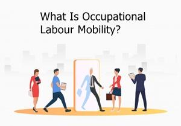

## Table of Contents

## What is occupational labor mobility?

Occupational labor mobility refers to how easily workers can move from one job to another within the same industry or across different industries. It's about how well people can change their careers or jobs based on their skills, training, and the opportunities available in the job market. For example, a teacher might switch to becoming a corporate trainer, using their skills in a different but related field.

This kind of mobility is important for both workers and the economy. For workers, it means they can find better job opportunities, higher pay, or more satisfying work. For the economy, it helps match the skills of the workforce with the needs of businesses, leading to more efficient use of labor. However, barriers like lack of skills, education, or information can make it harder for people to move between jobs, affecting their career growth and the overall health of the economy.

## Why is occupational labor mobility important for the economy?

Occupational labor mobility is important for the economy because it helps match people's skills with the jobs that need them. When workers can easily move from one job to another, businesses can find the right people for the jobs they need to fill. This makes the economy work better because companies can produce more and grow. If workers stay stuck in jobs that don't fit their skills, the economy can't use everyone's talents the best way.

Also, when people can change jobs easily, it can help keep unemployment low. If someone loses their job, they can find a new one in a different field more quickly. This keeps more people working and [earning](/wiki/earning-announcement) money, which is good for the economy. It also means that workers can find jobs that pay better or make them happier, which can make the whole economy stronger and more productive.

## What are the different types of occupational labor mobility?

There are two main types of occupational labor mobility: horizontal and vertical. Horizontal mobility is when a worker moves from one job to another job that is at the same level. This means the new job is not higher or lower than the old job. For example, a nurse might switch to being a medical assistant. Both jobs are in healthcare, but they are at the same level of skill and responsibility.

Vertical mobility is when a worker moves to a job that is at a different level. This can be moving up to a better job, which is called upward mobility, or moving down to a lower job, which is called downward mobility. Upward mobility happens when someone gets a promotion or learns new skills to get a better job. Downward mobility can happen if someone loses their job and has to take a lower-paying job. Both types of mobility are important for the economy because they help match workers with the jobs that need them.

## How does occupational labor mobility affect individual workers?

Occupational labor mobility gives workers more choices and chances to find better jobs. When people can easily switch jobs, they can look for work that pays more or makes them happier. If someone doesn't like their current job or wants to earn more money, they can learn new skills and move to a different job. This can make their life better because they can find work that fits their skills and what they want.

But, moving between jobs isn't always easy. Some people might not have the right skills or education to switch to a new job. They might also not know about all the job opportunities out there. When it's hard to change jobs, people might stay in jobs they don't like or that don't pay well. This can make them feel stuck and unhappy. So, while occupational labor mobility can help workers a lot, it also depends on having the right skills and knowing about the job market.

## What factors influence occupational labor mobility?

Several factors influence how easily workers can move from one job to another. Education and skills are really important. If someone has the right skills and education, they can switch jobs more easily. For example, if you know how to code, you can work at different tech companies. But if you don't have the skills needed for a new job, it's harder to switch. Also, knowing about job opportunities matters. If you don't know about other jobs you could do, you might stay in the same job even if you could do something better.

Another big [factor](/wiki/factor-investing) is the economy. When the economy is doing well, there are more jobs, and it's easier to switch to a new one. But when the economy is bad, there are fewer jobs, and it's harder to move. Laws and rules can also affect job switching. For example, if it's hard to get a license for a new job, that can stop people from switching. Personal things like family and where you live can also make a difference. If you have a family, you might not want to move to a new city for a job. And if you live somewhere with few job options, it's harder to switch jobs.

## How can barriers to occupational labor mobility be identified?

Barriers to occupational labor mobility can be identified by looking at what makes it hard for people to switch jobs. One way to find these barriers is by talking to workers and asking them about their experiences. If many people say they can't find jobs because they don't have the right skills or education, that's a sign that skill and education gaps are barriers. Also, if workers say they don't know about job opportunities, it shows that a lack of information is a problem. Surveys and interviews can help gather this information and show where the barriers are.

Another way to identify barriers is by looking at data and numbers. For example, if unemployment is high in certain areas or industries, it might mean there are not enough jobs or that the jobs available don't match the skills of the workers. Government reports and studies can show where there are big differences in job opportunities and pay, which can point to barriers like discrimination or lack of access to training. By putting together what workers say and what the data shows, we can see what's stopping people from moving between jobs and work on fixing those problems.

## What policies can governments implement to enhance occupational labor mobility?

Governments can help people switch jobs more easily by making education and training more available. They can set up programs that teach people new skills or help them go back to school. This way, workers can learn what they need to move to better jobs. Governments can also work with businesses to make sure these programs teach the skills that companies are looking for. By doing this, more people can find jobs that match their skills, and businesses can find the workers they need.

Another way governments can help is by giving people better information about job opportunities. They can create websites or services that list jobs and tell people about different careers. This helps workers know what jobs are out there and what skills they need to get them. Governments can also make it easier to move between jobs by changing rules and laws. For example, they can make it simpler to get licenses for new jobs or help people if they lose their jobs. By doing these things, governments can make it easier for people to switch jobs and find work that's a good fit for them.

## How does occupational labor mobility vary across different industries?

Occupational labor mobility can be different in each industry. In some industries, like tech and healthcare, it's easier for workers to switch jobs because there are a lot of jobs and many different kinds of work. For example, a software engineer might move from a big tech company to a startup, or a nurse might switch to a different hospital or become a home health aide. These industries often have programs to help workers learn new skills, which makes it easier to move around.

In other industries, like manufacturing or mining, it can be harder to switch jobs. These industries might have fewer job openings or the skills needed might be very specific. For example, a factory worker might find it hard to move to a different industry if they only know how to use certain machines. Also, if the industry is in a certain area, workers might not want to move to a new place for a job. So, in these industries, it can be tougher for workers to change jobs, and they might need more help to learn new skills or find out about other job opportunities.

## What role does education and training play in occupational labor mobility?

Education and training are really important for helping people switch jobs easily. When someone has the right education and skills, they can move to different jobs more easily. For example, if you learn how to code, you can work at different tech companies. Or if you get a degree in business, you can switch from one company to another in the business world. Schools, colleges, and training programs help people learn new things, which makes it easier for them to find new jobs that fit their skills.

But not everyone has easy access to education and training, which can make it harder to switch jobs. If someone can't go to school or can't afford to learn new skills, they might stay stuck in the same job. Governments and businesses can help by offering free or cheap training programs. This way, more people can learn what they need to move to better jobs. When people have the right skills, they can find work that pays more or makes them happier, which is good for them and the whole economy.

## How can employers facilitate occupational labor mobility within their organizations?

Employers can help their workers move to different jobs within the company by offering training and education programs. These programs can teach workers new skills that they need for different jobs. For example, a company might have classes to help someone learn how to use new software or manage a team. When workers have the chance to learn, they can switch to jobs that are a better fit for them. This can make them happier and more productive at work.

Employers can also make it easier for workers to move around by keeping them informed about job openings within the company. They can use newsletters, emails, or a company website to let workers know about new jobs. If workers know about these opportunities, they can apply for jobs that interest them. This helps the company use the skills of its workers better and keeps everyone motivated. When workers feel like they can grow and move up in their jobs, they are more likely to stay with the company longer.

## What are the global trends in occupational labor mobility?

Around the world, more and more people are switching jobs and moving to different countries for work. This is because of globalization, which means countries are working together more and businesses are spreading out. Technology also helps because people can learn new skills online and work from anywhere. In places like Europe, it's easier to move between countries because of the European Union. But in other places, like some parts of Asia and Africa, it can be harder because of rules and laws that make it tough to move.

Even though it's easier to move around, there are still big differences between countries. In rich countries, people often have more education and skills, so they can switch jobs more easily. But in poorer countries, people might not have the same chances to learn new things, so it's harder for them to move to better jobs. Governments and businesses are trying to help by making education and training more available everywhere. This way, more people can learn what they need to find good jobs, no matter where they live.

## How can advanced data analytics be used to predict and improve occupational labor mobility?

Advanced data analytics can help us understand and predict how people move between jobs by looking at big sets of information. For example, by studying data from job markets, we can see which skills are in demand and where the job opportunities are growing. This can help people decide what skills to learn and where to look for new jobs. Also, companies can use this data to find workers with the right skills and help them switch to new jobs within the company. By using data analytics, we can make better plans for training and education, so more people can find good jobs that match their skills.

Data analytics can also show us where the barriers to job switching are. If the data shows that people in certain areas or industries are having a hard time finding new jobs, we can work on fixing those problems. For example, if we see that workers in one industry don't have the skills needed for other jobs, we can create training programs to help them. Governments and businesses can use this information to make policies and programs that help people move between jobs more easily. By understanding the data, we can make the job market work better for everyone.

## What is the Intersection of Finance and Technology?

At its core, [algorithmic trading](/wiki/algorithmic-trading) utilizes mathematical models to make decisions based on market data. These algorithms can be designed to execute trades at speeds and frequencies that a human trader cannot match, capturing market inefficiencies and optimizing transaction costs. For instance, algorithms often employ statistical methodologies like time series analysis to predict future price movements based on historical data. The formula for a simple moving average (SMA) of stock prices over a set period, which might be used by an algorithm for trend analysis, is:

$$
\text{SMA} = \frac{P_1 + P_2 + \ldots + P_n}{n}
$$

where $P_1, P_2, \ldots, P_n$ represent the closing prices over $n$ days.

The programming languages commonly used in algorithmic trading include Python, C++, and Java, thanks to their robust libraries for data analysis and [machine learning](/wiki/machine-learning). Python, in particular, is favored for its simplicity and the vast array of libraries such as NumPy, pandas, and TensorFlow, which can be used to build, test, and deploy trading algorithms.

```python
import numpy as np
import pandas as pd

# Example of calculating a simple moving average with pandas
def calculate_sma(prices, window):
    return prices.rolling(window=window).mean()

# Sample data
close_prices = pd.Series([150, 155, 157, 160, 162])
sma = calculate_sma(close_prices, window=3)
print(sma)
```

## References & Further Reading

[1]: McKinsey Global Institute. (2017). ["Jobs Lost, Jobs Gained: Workforce Transitions in a Time of Automation."](https://www.mckinsey.com/~/media/McKinsey/Industries/Public%20and%20Social%20Sector/Our%20Insights/What%20the%20future%20of%20work%20will%20mean%20for%20jobs%20skills%20and%20wages/MGI-Jobs-Lost-Jobs-Gained-Executive-summary-December-6-2017.pdf)

[2]: Marcos Lopez de Prado. ["Advances in Financial Machine Learning"](https://www.amazon.com/Advances-Financial-Machine-Learning-Marcos/dp/1119482089)

[3]: David Aronson. ["Evidence-Based Technical Analysis: Applying the Scientific Method and Statistical Inference to Trading Signals"](https://www.amazon.com/Evidence-Based-Technical-Analysis-Scientific-Statistical/dp/0470008741)

[4]: Stefan Jansen. ["Machine Learning for Algorithmic Trading"](https://github.com/stefan-jansen/machine-learning-for-trading)

[5]: Ernest P. Chan. ["Quantitative Trading: How to Build Your Own Algorithmic Trading Business"](https://www.amazon.com/Quantitative-Trading-Build-Algorithmic-Business/dp/0470284889)

[6]: Brynjolfsson, E., & McAfee, A. (2014). ["The Second Machine Age: Work, Progress, and Prosperity in a Time of Brilliant Technologies."](https://psycnet.apa.org/record/2014-07087-000) W. W. Norton & Company.

[7]: Autor, D. H. (2015). "Why are there still so many jobs? The history and future of workplace automation." Journal of Economic Perspectives, 29(3), 3-30. 

[8]: Frank, M. R., Autor, D., Bessen, J. E., Brynjolfsson, E., Cebrian, M., Deming, D. J., Feldman, M., Groh, M., Lobo, J., & Moro, E. (2019). "Toward understanding the impact of artificial intelligence on labor." Proceedings of the National Academy of Sciences, 116(14), 6531-6539. 

[9]: World Economic Forum. (2020). ["The Future of Jobs Report 2020."](https://www.weforum.org/publications/the-future-of-jobs-report-2020/)