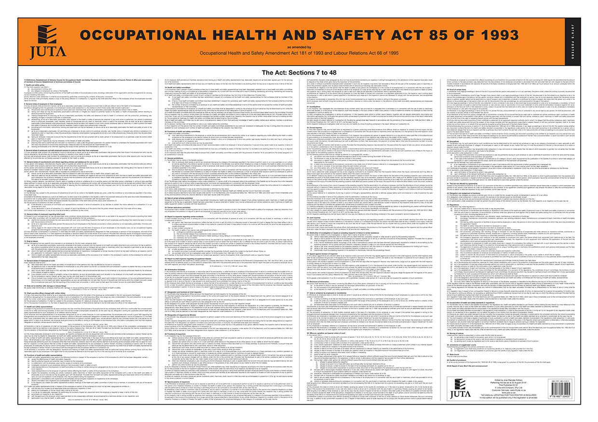

## Table of Contents

## What is the Occupational Safety and Health Act (OSHA)?

The Occupational Safety and Health Act, often called OSHA, is a law in the United States that was passed in 1970. Its main goal is to make sure that workers are safe and healthy at their jobs. OSHA does this by setting rules that employers must follow to keep their workplaces safe. These rules cover many things, like making sure machines are safe to use, providing safety equipment, and training workers about dangers they might face on the job.

OSHA also has inspectors who can visit workplaces to check if the rules are being followed. If a workplace is not safe, OSHA can make the employer fix the problems. If the employer does not fix the problems, they might have to pay a fine. OSHA also helps workers by giving them information and training about how to stay safe at work. This way, everyone can work together to make sure that jobs are as safe as possible.

## Who does OSHA apply to?

OSHA applies to most private sector employers and their workers in the United States. This means if you work for a company that is not part of the government, OSHA rules probably apply to your workplace. The rules cover many different kinds of jobs, from factories and construction sites to offices and stores.

There are some exceptions, though. OSHA does not cover self-employed people, family farms, or workplaces that are regulated by other federal agencies, like mines or nuclear power plants. Also, state and local government workers are usually covered by state plans instead of federal OSHA, but these state plans have to be at least as good as the federal OSHA rules.

## What are the main goals of OSHA?

The main goal of OSHA is to make sure that workers in the United States are safe and healthy at their jobs. OSHA does this by making rules that employers have to follow. These rules help to prevent accidents and illnesses at work. They cover things like making sure machines are safe, giving workers the right safety equipment, and teaching workers about dangers they might face on the job.

Another important goal of OSHA is to help workers understand their rights and how to stay safe. OSHA provides information and training to help workers learn about safety. If a workplace is not safe, workers can tell OSHA, and OSHA can send inspectors to check the workplace. If the inspectors find problems, they can make the employer fix them. This way, OSHA helps to keep workplaces safe for everyone.

## What are the general duty clause requirements under OSHA?

The general duty clause is a part of OSHA that says employers must keep their workplace safe, even if there are no specific rules for a certain danger. This means that if something at work could hurt workers, and it's something that the employer can fix, they have to fix it. This clause helps to cover any dangers that might not be listed in other OSHA rules.

For example, if there's a machine that could hurt workers because it's not working right, the employer has to fix it or find another way to keep workers safe. The general duty clause makes sure that employers are always thinking about safety, not just following a list of rules. It's a way to make sure that workplaces are as safe as they can be, no matter what kind of job it is.

## What specific standards does OSHA enforce?

OSHA enforces many specific standards to keep workers safe. These standards cover things like how to use machines safely, what kind of safety equipment workers should use, and how to handle dangerous chemicals. For example, OSHA has rules about making sure ladders and scaffolds are safe to use on construction sites. They also have rules about wearing helmets, gloves, and other safety gear to protect workers from getting hurt.

Another set of OSHA standards deals with how to keep the air clean and safe to breathe. This includes rules about how to control dust, fumes, and other harmful things in the air. OSHA also has rules about how to handle emergencies like fires or chemical spills. These rules help make sure that workers know what to do and can stay safe during an emergency.

OSHA also has standards for specific industries. For example, there are special rules for workers in construction, agriculture, and healthcare. These rules are made to fit the unique dangers that workers in these jobs might face. By following these standards, employers can help keep their workers safe and healthy.

## How does OSHA conduct inspections and what triggers them?

OSHA conducts inspections to make sure workplaces are safe. Inspectors visit workplaces to check if the rules are being followed. They look at things like machines, safety equipment, and how workers are trained. If they find problems, they can make the employer fix them. Sometimes, OSHA also talks to workers to see if they know about any dangers at work.

Inspections can be triggered in different ways. One common way is if someone reports a problem. This could be a worker, a union, or even someone from the public. OSHA calls these "complaint inspections." Another way is if there is a serious accident or someone dies at work. OSHA will usually inspect the workplace quickly after something like this happens. OSHA also has a plan to check certain workplaces regularly, even if no one reports a problem. This helps to make sure all workplaces stay safe.

## What are the rights and responsibilities of employees under OSHA?

Under OSHA, employees have important rights to help keep them safe at work. They have the right to a workplace that is free from serious dangers. This means their employer must follow OSHA rules to make sure the job is safe. Employees also have the right to know about any dangers at work and to get training on how to stay safe. If they see something dangerous, they can ask OSHA to come and check the workplace. They can also ask OSHA to keep their names secret if they are worried about being treated badly for speaking up.

Employees also have responsibilities to help keep the workplace safe. They need to follow all the safety rules and use the safety equipment their employer gives them. This means wearing helmets, gloves, or other safety gear when needed. They should also tell their employer about any dangers they see at work. By working together with their employer, employees can help make sure everyone stays safe and healthy on the job.

## What are the rights and responsibilities of employers under OSHA?

Under OSHA, employers have important rights and responsibilities to make sure their workplace is safe. Employers have the right to know about any dangers their workers see at work. This means workers should tell their boss if something could hurt them. Employers also have the right to ask OSHA for help if they need it. OSHA can give them advice and help them follow the rules.

Employers have a big responsibility to keep their workers safe. They must follow all OSHA rules, like making sure machines are safe to use and giving workers the right safety equipment. If something at work could hurt someone, and it's something the employer can fix, they have to fix it. This is called the general duty clause. Employers also need to train their workers about dangers they might face on the job. By doing all these things, employers can help make sure their workplace is as safe as possible.

## How should employers maintain OSHA-required records and documentation?

Employers need to keep good records to follow OSHA rules. They have to write down any work-related injuries or illnesses in a special log called the OSHA 300 Log. This log should have details like what happened, when it happened, and how bad it was. Employers also need to keep a record of any safety training they give to workers. This helps show that they are teaching their workers how to stay safe. Keeping these records up to date is important because OSHA might ask to see them during an inspection.

It's also important for employers to keep these records for a certain amount of time. The OSHA 300 Log and any related records need to be kept for at least five years. This way, if OSHA comes to check the workplace, the employer can show that they have been following the rules for a long time. Keeping good records helps employers prove that they are doing their best to keep their workers safe and healthy.

## What are the penalties for non-compliance with OSHA regulations?

If an employer does not follow OSHA rules, they can get in trouble and have to pay money. The fines can be different depending on how bad the problem is. If it's a small problem, the fine might not be too big. But if it's a big problem that could really hurt someone, the fine can be a lot of money. OSHA decides how much to fine an employer by looking at how serious the problem is, if the employer knew about it, and if they tried to fix it.

Sometimes, if an employer keeps breaking the same rule over and over, OSHA can give them even bigger fines. This is to make sure employers take safety seriously. If someone gets hurt or dies because an employer did not follow OSHA rules, the employer could face very big fines and even go to court. This helps make sure that workplaces stay safe and that employers do what they need to do to protect their workers.

## How can an organization implement an effective OSHA compliance program?

An organization can implement an effective OSHA compliance program by starting with a strong commitment from the top. The leaders of the company need to show that safety is important and make sure everyone knows it. They should set up a safety plan that says what the company will do to follow OSHA rules. This plan should include regular checks of the workplace to find any dangers, and ways to fix them quickly. It's also important to train workers on how to stay safe and make sure they have the right safety gear. By making safety a big part of the company's culture, everyone can work together to keep the workplace safe.

Another important part of an effective OSHA compliance program is keeping good records. The company should keep an OSHA 300 Log to write down any injuries or illnesses that happen at work. They should also keep records of all the safety training they give to workers. These records help show that the company is following OSHA rules and can be useful if OSHA comes to check the workplace. By doing all these things, the company can make sure they are doing their best to keep workers safe and healthy, and avoid getting in trouble with OSHA.

## What advanced strategies can be used to go beyond basic OSHA compliance and enhance workplace safety?

To go beyond basic OSHA compliance and make the workplace even safer, companies can use something called a safety management system. This is a big plan that looks at all parts of the job to find dangers and fix them before they hurt anyone. It includes setting up safety goals, checking the workplace often, and always trying to make things safer. Companies can also use new technology like safety sensors and cameras to watch for dangers in real time. This helps them stop problems before they start. By doing all this, companies show they care about safety and want to do more than just follow the rules.

Another good way to improve safety is by getting workers involved. Companies can start safety committees where workers can talk about dangers they see and help find ways to fix them. This makes workers feel like they are part of keeping the workplace safe. Companies can also give rewards to workers who help make things safer, like finding a new way to do a job without getting hurt. By working together with their workers, companies can make the workplace much safer and show that they really care about everyone's health and safety.

## References & Further Reading

[1]: Perrow, C. (1999). ["Normal Accidents: Living with High-Risk Technologies."](https://www.jstor.org/stable/j.ctt7srgf) Princeton University Press.

[2]: Aldridge, I., & Krawciw, S. (2017). ["Real-Time Risk: What Investors Should Know About Fintech, High-Frequency Trading, and Flash Crashes."](https://en.wikipedia.org/wiki/Big_data) Wiley.

[3]: Lopez de Prado, M. (2018). ["Advances in Financial Machine Learning."](https://www.amazon.com/Advances-Financial-Machine-Learning-Marcos/dp/1119482089) Wiley.

[4]: O'Neil, C., & Schutt, R. (2013). ["Doing Data Science: Straight Talk from the Frontline."](https://www.oreilly.com/library/view/doing-data-science/9781449363871/) O'Reilly Media.

[5]: Chan, E. P. (2009). ["Quantitative Trading: How to Build Your Own Algorithmic Trading Business."](https://github.com/ftvision/quant_trading_echan_book) Wiley.

[6]: OSHA (2021). ["Safety and Health Management Systems and Joint Commission Standards"](https://www.osha.gov/sites/default/files/2.2_SHMS-JCAHO_comparison_508.pdf) U.S. Department of Labor.

[7]: Amadeo, K. (2021). ["Occupational Safety and Health Administration (OSHA)"](https://www.researchgate.net/publication/344288567_Occupational_Safety_and_Health_Administration_OSHA_and_Worker_Safety_during_the_COVID-19_Pandemic) The Balance Careers.