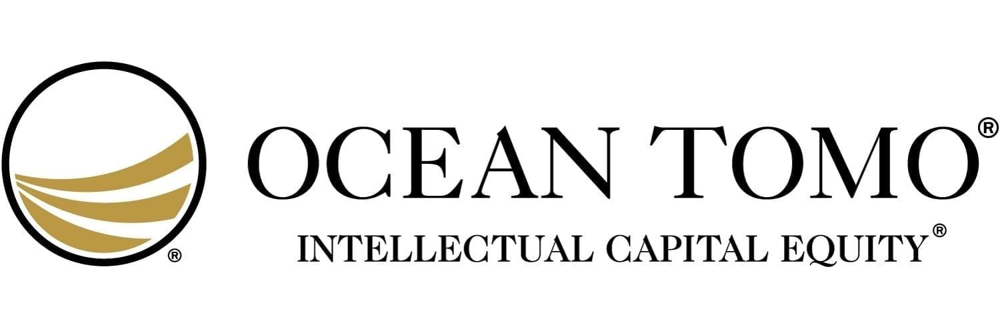

In the digital age, intellectual property (IP) has become a cornerstone of business value, particularly for companies rooted in technology and innovation. These intangible assets, which include patents, trademarks, and copyrights, offer substantial leverage in competitive markets. Effectively managing IP is crucial as it not only protects a company's innovations and brand identity but also enhances market positioning and revenue potential.

This article aims to illuminate the multifaceted relationship between intellectual property valuation, asset management, and algorithmic trading. We will examine the methodologies used to ascertain the monetary value of IP assets, which is essential for strategic decisions in mergers, acquisitions, licensing, and financial reporting. The intrinsic value of these assets, when assessed correctly, can inform a company's market strategy and investment decisions.



Understanding IP valuation extends beyond mere estimation. It encompasses a spectrum of approaches that reflect different circumstances and intended outcomes. By exploring these methods, companies can better align their IP strategy with broader business objectives. This alignment is critical, as it allows for efficient resource allocation and risk mitigation.

The article also considers the novel integration of algorithmic trading with IP asset management. Algorithmic trading, with its reliance on sophisticated data-driven analysis, offers an innovative frontier for optimizing IP asset value. Through real-time data analytics and predictive modeling, organizations can enhance their investment strategies and react swiftly to market changes.

In a business environment where technological advancements are rapid, the dynamic nature of IP valuation requires continuous adaptation and strategic foresight. Companies must navigate the complexities of IP management with precision to sustain their competitive edge and ensure long-term success. This discussion will provide insights into effective IP management practices, emphasizing their importance in today's knowledge-driven economy.

## Table of Contents

## Understanding Intellectual Property Valuation

Intellectual property (IP) valuation is an essential process for assigning a monetary value to intangible assets like patents, trademarks, and copyrights. In the digital economy, these intangible assets represent a significant portion of a company's value, influencing strategic decision-making, financial reporting, and risk management. Understanding the different methods of IP valuation is crucial for accurately assessing these assets' worth and aligning them with business objectives.

Accurate IP valuation aids in strategic decision-making by providing insights into the potential contribution of IP assets to business growth. In financial reporting, precise valuation ensures that a company's financial statements reflect the true value of its assets, enhancing transparency and credibility. Furthermore, it plays a key role in risk management, helping companies identify, assess, and mitigate risks associated with their IP portfolios.

Various methods are employed in IP valuation, each offering unique perspectives and applicability that depend on the asset type and the purpose of the valuation. The three primary approaches are cost-based, market-based, and income-based methods.

1. **Cost-Based Approach**: This method calculates the value of an IP asset based on the cost incurred in its creation or acquisition. While this approach is straightforward, it may not always reflect the asset's market value, as it does not account for future income potential or market demand. The cost-based approach is best suited for IP assets at the early development stages or where market data is unavailable.

2. **Market-Based Approach**: This valuation method utilizes comparable market transactions to estimate the IP asset's value. It relies on the availability of market data for similar IP assets, making it highly dependent on the existence of active and comparable markets. The market-based approach is beneficial when there is sufficient market activity, providing a clear benchmark for determining asset value.

3. **Income-Based Approach**: This method focuses on the future income that the IP asset is expected to generate. It involves projecting the cash flows attributable to the IP and discounting them to present value. This approach requires assumptions about future market conditions and potential income, making it suitable for IP assets that are integral to a company's revenue generation.

Each method has its strengths and limitations, often necessitating a combination of approaches for a comprehensive and accurate valuation. By integrating these methods, companies can develop a more nuanced understanding of their IP assets' value, ensuring that they are strategically managed to support growth and competitive advantage.

## Methods of Intellectual Property Valuation

Intellectual property (IP) valuation plays a crucial role in understanding the financial worth of intangible assets such as patents, trademarks, and copyrights. Accurate valuation of IP is essential for various strategic and financial purposes, including mergers and acquisitions, licensing, and litigation support. Several methods exist to evaluate IP assets, each offering distinct perspectives and insights depending on the nature of the asset and the purpose of the valuation.

**Cost-Based Approach**

The cost-based approach calculates the value of an IP asset by considering the cost incurred to create or acquire it. This method focuses on historical expenses rather than current market dynamics or future potential earnings. Costs can include research and development expenses, legal fees for obtaining protection, and any related expenditures during the IP's creation phase. While this approach provides a straightforward and objective cost assessment, it has limitations. It may not accurately reflect the asset's current market value or its potential to generate future income, particularly for innovative technologies where market conditions or future income potential play a significant role.

**Market-Based Approach**

The market-based approach evaluates IP assets based on recent transactions involving similar assets in open markets. This method requires access to a sufficient number of comparable IP transactions to establish a reliable market value. By analyzing the pricing information from these transactions, appraisers estimate the IP's fair market value. However, the scarcity of comparable data can pose challenges, especially for unique or highly specialized IP assets where few transaction precedents exist. Despite this limitation, the market-based approach provides an evidence-based assessment grounded in actual market behavior, making it a valuable tool when applicable data are available.

**Income-Based Approach**

The income-based approach assesses an IP asset's value by estimating the present value of expected future income generated by the asset. This method involves forecasting the cash flows that the IP is anticipated to produce over its useful life and discounting them to present value using an appropriate discount rate. The formula for discounted cash flow (DCF) can be expressed as:

$$
\text{PV} = \sum_{t=1}^{n} \frac{C_t}{(1 + r)^t}
$$

Where:
- $\text{PV}$ is the present value of the IP.
- $C_t$ is the cash flow in year $t$.
- $r$ is the discount rate.
- $n$ is the number of years in the forecast period.

The income-based approach captures the economic benefits that the IP is expected to deliver, making it particularly useful for IP with proven revenue-generating capabilities. However, it requires robust financial projections and judgment in selecting an appropriate discount rate, thus introducing an element of subjectivity.

**Comprehensive Valuation**

Each valuation method has its strengths and limitations; therefore, employing a combination often yields a more comprehensive assessment. A multi-method approach can provide a well-rounded perspective by leveraging the cost-based approach's objectivity, the market-based approach's market relevance, and the income-based approach's future earnings potential. Practitioners must carefully choose and adapt these methods to the specific characteristics and context of the IP asset being evaluated to ensure an accurate and reliable valuation.

## The Role of Asset Management in IP Valuation

Effective asset management is vital in ensuring that intellectual property (IP) assets contribute effectively to an organization's strategic goals. It focuses on the strategic planning, efficient use, and safeguarding of IP assets, ensuring these intangible assets are optimally utilized and aligned with business objectives.

Strategic planning involves integrating IP assets into the broader business strategy. Companies must identify how their patents, trademarks, and copyrights can strengthen their business propositions or create new market opportunities. This includes evaluating how existing IP can be leveraged to establish a competitive edge or enter new markets. Efficient use of IP assets often requires regular audits and assessments to ensure they are being utilized in alignment with these strategic goals.

Continuous monitoring and valuation adjustments are integral to effective asset management. IP assets must be frequently assessed to determine their current market value and business impact. This involves adapting to changes in market dynamics, such as the emergence of new technologies or competitor actions, that can influence the worth and utility of IP. Regular monitoring helps in making informed decisions regarding licensing, litigation, or further development of the IP.

Risk management is a critical component of asset management. Organizations must identify potential risks to their IP, including infringement, obsolescence, and market shifts, and develop strategies to mitigate these risks. This might involve securing proper intellectual property rights protection, such as filing for patents or trademarks promptly. It also could mean establishing robust guidelines for handling IP disputes to protect these valuable assets from third-party infringements.

Maximizing the potential of IP assets requires an approach where asset management principles consistently drive the business forward. By strategically aligning IP management practices with corporate business objectives, companies can ensure that their IP assets contribute significantly to business growth and help maintain competitive advantage. Organizations committed to this structured approach can effectively harness their intellectual capital to drive innovation and revenue growth, ensuring long-term success in a competitive market environment.

## Integrating Algorithmic Trading with IP Asset Management

Algorithmic trading is a technique that involves utilizing pre-programmed trading instructions to manage investments in financial markets. Its application in intellectual property (IP) asset management focuses on optimizing the creation of value from these intangible assets. By leveraging large datasets and advanced analytics, [algorithmic trading](/wiki/algorithmic-trading) enhances decision-making processes, allowing organizations to act swiftly and with precision.

The concept of algorithmic trading integrates seamlessly with IP asset management by enabling real-time data analysis and predictive modeling. This capability is particularly crucial in a market environment that is characterized by rapid changes and the need for quick strategic adjustments. Advanced algorithms can be designed to analyze vast amounts of market and IP-related data, identifying trends and patterns that might not be immediately apparent through traditional analysis methods. This enhances the ability of organizations to forecast the potential value of their IP assets and to make informed investment decisions.

One notable example of algorithmic trading's application in IP asset management is the Ocean Tomo 300 Patent Index. This index is designed to measure the performance of IP-driven entities, using methodologies that incorporate algorithmic processes to assess the value of patent portfolios. The index relies on a multifaceted approach to valuation, utilizing both quantitative and qualitative factors to determine the significance and financial potential of patented technologies.

To utilize algorithmic trading within IP asset management, organizations must deploy advanced tools and systems capable of handling and processing complex datasets. Python, with its rich ecosystem of libraries such as Pandas for data manipulation, NumPy for numerical computation, and SciPy for scientific computing, is a suitable language for developing algorithms tailored for this purpose. Machine learning libraries like TensorFlow or PyTorch can further enhance these capabilities, enabling predictive analytics through models trained on historical data.

Here is a simple Python example demonstrating how basic data analytics could be used in approximating the influence of certain patents on a market index:

```python
import pandas as pd
import numpy as np

# Simulating a dataset for IP assets with respective market performance
data = {
    'PatentID': ['P1', 'P2', 'P3'],
    'MarketImpact': [1.5, 2.3, 3.1],
    'RevenueGenerated': [1000, 1500, 2000]
}

df = pd.DataFrame(data)

# Basic computation: correlating revenue generated with market impact
correlation = np.corrcoef(df['MarketImpact'], df['RevenueGenerated'])[0, 1]

print(f"Correlation between Market Impact and Revenue Generated: {correlation}")
```

In this script, a simple correlation is drawn between market impact and the revenue generated by patents, providing a foundational step towards more intricate analyses. Algorithmic trading, when integrated with these techniques, results in a powerful tool for boosting the economic potential of IP assets. It allows organizations not only to stay competitive but also to thrive in a market where the valuation and strategic management of intellectual property are paramount.

## Challenges in IP Valuation and Management

Intellectual property (IP) valuation and management face numerous challenges, primarily due to the unique and intangible nature of these assets. One major difficulty lies in the scarcity of market data for unique IP assets, which significantly complicates their valuation. Unlike tangible assets, which often have readily available market comparisons, IP assets frequently lack equivalent transactional data, leading to increased uncertainty in determining their fair market value.

Valuation often involves subjective judgment, which can vary dramatically based on the expertise and methodology employed by different evaluators. While various approaches, such as cost-based, market-based, and income-based methods, offer frameworks for valuation, each integrates assumptions and estimations that introduce subjectivity. Consequently, two assessors might arrive at significantly different valuations for the same IP asset, reflecting divergences in their expertise and methodological preferences.

Technological advances and legal changes further complicate IP valuation. As technology evolves, the relevance, applicability, and potential income streams from specific IP assets can swiftly change, necessitating continuous re-evaluation. Legal developments, particularly those related to patent laws and IP protection frameworks, can also alter the valuation landscape. Such changes require stakeholders to stay informed and adapt their valuation strategies accordingly to ensure accuracy and compliance.

Effective IP management demands continuous monitoring and evaluation to accommodate changes in market dynamics. The [volatility](/wiki/volatility-trading-strategies) of markets and the risk factors associated with IP — such as obsolescence due to technological innovation or market saturation — require proactive management strategies. This includes not only the periodic reassessment of IP assets but also the anticipation of future trends that could impact their value.

Moreover, integrating modern technologies, such as data analytics and algorithmic trading, into IP management can provide real-time insights and predictive capabilities, enhancing the ability to adapt to changes. However, implementing such systems involves a learning curve and potential upfront costs, presenting additional barriers for some organizations.

In summary, the challenges in IP valuation and management are multifaceted, requiring balanced consideration of subjective factors, evolving legal and technological contexts, and proactive management techniques to optimize the value and utility of these vital intangible assets.

## Conclusion

Intellectual property (IP) stands as a cornerstone asset in today's knowledge-driven economy, embodying substantial value that extends beyond traditional physical assets. The meticulous valuation and management of IP are not just necessary procedures but strategic imperatives in maximizing the potential of these intangible resources. Understanding various IP valuation methods—such as cost-based, market-based, and income-based approaches—provides foundational insights into assessing value. Each method presents unique perspectives: cost-based valuation considers the expense of creation or acquisition, market-based relies on comparable asset transactions, and income-based focuses on future income projections.

Integrating algorithmic trading with IP asset management heralds new opportunities for optimizing asset value. Algorithmic trading utilizes pre-programmed instructions and advanced analytics, enabling organizations to leverage real-time data and predictive modeling. This technological synergy enhances decision-making, facilitating more dynamic and responsive asset management strategies. Specifically, indices like the Ocean Tomo 300 Patent Index exemplify how algorithmic techniques can drive efficient investments in IP portfolios.

The strategic integration of these methodologies is essential to maintain competitiveness in a business landscape marked by rapid evolution and technological innovation. Organizations must adopt a holistic view of IP management, continuously aligning their strategies with business goals and market shifts. By harnessing the capabilities of IP valuation methods and algorithmic trading, companies can unlock the full potential of their IP portfolios. This not only fortifies their market position but also paves the way for sustainable growth in an increasingly competitive environment.

## References & Further Reading

[1]: Grewal, D. S., & Prince, J. (2018). ["Intellectual Property Licensing and Valuation: A Business Manager's Guide to Finding, Managing, and Protecting Your IP."](https://bmcpublichealth.biomedcentral.com/articles/10.1186/s12889-024-20525-6) Wiley.

[2]: Lemley, M. A. (2005). ["Property, Intellectual Property, and Free Riding."](https://law.stanford.edu/wp-content/uploads/2015/06/MarkALemleyPropertyIntell.pdf) Stanford Law Review, 83(4), 1031-1076.

[3]: Smith, G. V., & Parr, R. L. (2005). ["Intellectual Property: Valuation, Exploitation, and Infringement Damages."](https://www.semanticscholar.org/paper/Intellectual-Property%3A-Valuation%2C-Exploitation%2C-and-Smith-Parr/0a2284b553b3e1a368c53c150cfc83072bd320b3) John Wiley & Sons.

[4]: Rasekhschaffe, K. C., & Jones, R. (2019). ["Machine Learning for Stock Selection."](https://www.hillsdaleinv.com/uploads/Machine_Learning_for_Stock_Selection.pdf) Financial Analysts Journal, 75(3), 70-88.

[5]: ["Ocean Tomo 300 Patent Index."](https://oceantomo.com/services/patent-indexes/ocean-tomo-300-patent-index/) Ocean Tomo Official Website.