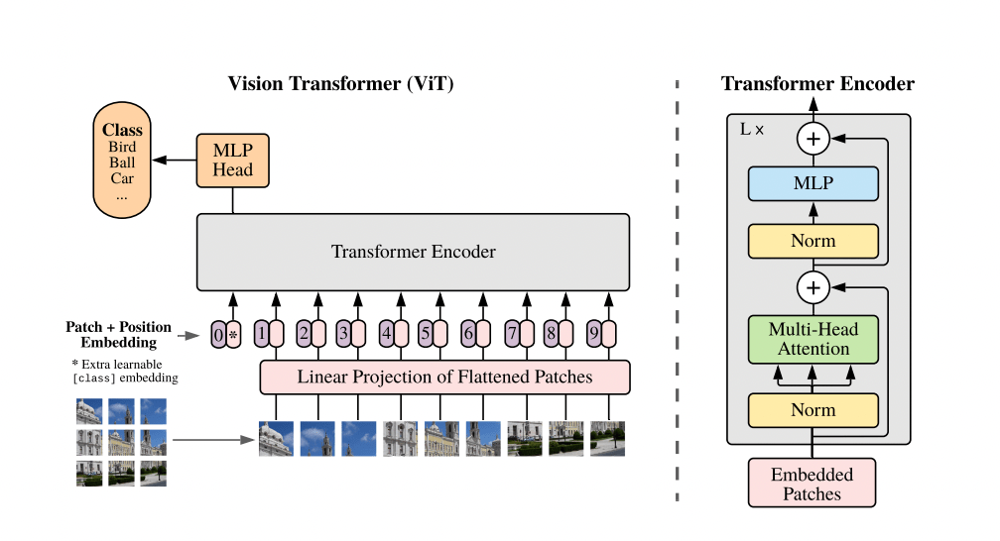

## Table of Contents

## What is OCR and why is it important?

OCR stands for Optical Character Recognition. It's a technology that helps computers read text from images or scanned documents. Imagine you have a picture of a page from a book. OCR can turn that picture into text that you can edit, search, or store on a computer. This is really useful because it makes it easier to work with information that used to be only on paper.

OCR is important for many reasons. It helps save time and effort because you don't have to type out everything by hand. For example, if you need to enter data from old records into a computer, OCR can do it much faster. It also helps people who have trouble reading printed text, like those with visual impairments, because the text can be read aloud by a computer. Overall, OCR makes it easier to use and share information that was once hard to access.

## How do OCR models like TrOCR and PP-OCR work?

TrOCR, developed by Microsoft, is a model that uses a transformer-based architecture to recognize text from images. It works by first converting the image into a format that the model can understand, often using a technique called tokenization. Then, TrOCR processes this data through multiple layers of its transformer model, which are designed to understand the context and sequence of the text. This allows TrOCR to predict the text accurately, even if the image quality is not perfect. The model is trained on large datasets of image-text pairs, which helps it learn how to map visual information to textual output effectively.

PP-OCR, developed by PaddlePaddle, is another OCR model that focuses on both text detection and recognition. It works in two main steps: first, it detects where the text is located within the image using a detection model. This step identifies the bounding boxes around the text areas. Then, the recognition model takes these detected areas and converts the pixels inside the boxes into readable text. PP-OCR uses deep learning techniques to improve accuracy and speed, making it efficient for real-time applications. Both TrOCR and PP-OCR are designed to handle various languages and scripts, making them versatile tools for text recognition tasks.

## What are the main components of an OCR system?

An OCR system has several key parts that work together to turn images into text. The first part is the image preprocessing stage. This step makes the image clearer and easier to work with by adjusting things like brightness and contrast. It also might involve removing noise or correcting any distortions in the image. After preprocessing, the system moves to the text detection phase, where it figures out where the text is located in the image. This is done using algorithms that can spot patterns and shapes that look like letters or words.

Once the text areas are identified, the OCR system goes into the text recognition phase. This is where the system tries to understand what the text actually says. It uses machine learning models, like those in TrOCR or PP-OCR, to match the patterns it sees in the image to known characters or words. These models are trained on lots of examples to get better at recognizing text accurately. The final part of an OCR system is post-processing, where the recognized text might be corrected for any errors or formatted in a way that's easier to read or use. This step can include things like spell-checking or arranging the text into paragraphs.

These components together make up a complete OCR system, each playing a crucial role in transforming visual information into usable text. From preprocessing the image to detecting and recognizing the text, and finally refining the output, every step is important to ensure the system works well and produces accurate results.

## Can you explain the difference between TrOCR and PP-OCR?

TrOCR and PP-OCR are both OCR systems, but they work a bit differently. TrOCR, created by Microsoft, uses a transformer-based approach. This means it looks at the whole image at once and tries to understand the text in context. It's like reading a sentence and understanding the meaning of each word based on the words around it. TrOCR is good at recognizing text even if the image is not perfect because it learns from lots of examples. It's trained on big sets of image-text pairs, which helps it match what it sees in the image to the correct text.

PP-OCR, developed by PaddlePaddle, works in two steps: first, it finds where the text is in the image, and then it reads the text. This is like first spotting all the words on a page and then reading them one by one. PP-OCR uses deep learning to make sure it can do both steps quickly and accurately. It's designed to be fast and good for real-time use, like scanning a document and getting the text right away. Both systems can handle different languages, but they use different methods to get to the same goal of turning images into text.

These two OCR systems show how different approaches can be used to solve the same problem. TrOCR's holistic view of the image and PP-OCR's step-by-step process each have their strengths, making them useful in different situations. Whether you need a system that can handle messy images or one that needs to work quickly, understanding these differences helps choose the right tool for the job.

## What are the typical steps in processing an image for OCR?

When you process an image for OCR, the first step is to clean up the image. This is called image preprocessing. You might adjust the brightness and contrast to make the text clearer. Sometimes, you need to remove noise or fix any distortions in the image. This makes it easier for the computer to see the text. It's like wiping a dirty window to see outside better.

After the image is cleaned up, the next step is to find where the text is on the image. This is called text detection. The computer looks for patterns and shapes that look like letters or words. Once it knows where the text is, it goes to the text recognition step. Here, the computer tries to read what the text says. It uses special models, like TrOCR or PP-OCR, to match what it sees to letters and words. These models are trained on lots of examples to get better at reading text.

The last step is called post-processing. After the text is recognized, the computer might fix any mistakes or make the text easier to read. This can include things like spell-checking or putting the text into paragraphs. All these steps together help turn a picture of text into something you can edit and use on a computer.

## How does training data affect the performance of OCR models?

Training data is super important for how well OCR models work. The more examples an OCR model sees during training, the better it gets at recognizing text. If the training data includes lots of different kinds of images, like handwritten notes, printed pages, and signs, the model can learn to read all sorts of text. But if the training data is limited, like only including clear, printed text, the model might struggle with messy or handwritten text. It's like learning a language: the more you practice with different words and sentences, the better you get at understanding and speaking.

The quality of the training data also matters a lot. If the images used for training are clear and the text is correctly labeled, the OCR model learns accurately. But if the images are blurry or the labels have mistakes, the model can learn wrong things. For example, if many images in the training data have the letter "O" labeled as "0", the model might start mixing them up. So, having good, varied, and correctly labeled training data helps make sure the OCR model can read text well in real life.

## What are some common challenges faced by OCR models?

OCR models often struggle with things like messy handwriting or bad image quality. If the text in the image is not clear, like if it's blurry or has shadows, the model might read it wrong. Also, if the text is in a language or script the model hasn't seen much during training, it can have a hard time figuring out what it says. For example, if an OCR model is mostly trained on English text, it might not do well with Chinese characters.

Another challenge is when the text is laid out in a tricky way, like in a curve or at an angle. This can confuse the model because it's used to seeing text in straight lines. Sometimes, the model can also mix up similar-looking characters, like "O" and "0" or "l" and "1". These challenges show why it's important to have a lot of different kinds of images in the training data, so the model can learn to handle all sorts of situations.

## How can the accuracy of OCR models be improved?

To make OCR models better at reading text, you can start by using more and better training data. If you train the model with lots of different kinds of images, like handwritten notes, old documents, and signs, it can learn to recognize all sorts of text. The images should be clear and the text labeled correctly so the model doesn't learn wrong things. For example, if you want the model to read Chinese characters well, you should include many examples of Chinese text in the training data. Also, using advanced machine learning techniques, like deep learning, can help the model understand the text better, even if the image is not perfect.

Another way to improve OCR accuracy is by tweaking the model after it's been trained. This is called fine-tuning. You can use special techniques to make the model better at recognizing tricky text, like text that's at an angle or in a curve. Post-processing is also important. After the model reads the text, you can use spell-checkers or other tools to fix any mistakes. By combining good training data, smart model adjustments, and careful post-processing, OCR models can get much better at turning images into accurate text.

## What are the latest advancements in OCR technology?

The latest advancements in OCR technology have made it even better at reading text from images. One big improvement is the use of deep learning models, like TrOCR and PP-OCR, which can understand text in context. These models are trained on huge amounts of data, which helps them recognize text even if it's messy or in a language they haven't seen much before. For example, researchers are now using techniques like transfer learning, where a model trained on one language can be quickly adapted to another. This makes OCR more versatile and accurate across different scripts and languages.

Another exciting advancement is the improvement in handling complex layouts and low-quality images. New algorithms can now detect text that's curved, at an angle, or even overlapped with other text. This is important for reading things like book pages or signs in real life. Also, researchers are working on making OCR faster, so it can be used in real-time applications, like scanning a document and getting the text right away. These advancements are making OCR more useful and easier to use for everyone.

## How do TrOCR and PP-OCR handle different languages and scripts?

TrOCR and PP-OCR both work well with different languages and scripts by using lots of training data from around the world. TrOCR uses a special method called transformer-based learning, which helps it understand text in context. This means it can read text even if it's in a language it hasn't seen much before. By training on many examples of different languages, TrOCR learns to recognize patterns and shapes that are common in those scripts. This makes it good at reading text in languages like English, Chinese, and many others.

PP-OCR also handles different languages well by using two steps: first, it finds where the text is in the image, and then it reads the text. It uses deep learning to make sure it can read text in different languages accurately. PP-OCR is trained on a wide range of languages and scripts, so it can spot and read text in many different ways. Both models keep getting better as they are trained on more data, making them useful for reading text from all over the world.

## What are the specific use cases where TrOCR outperforms PP-OCR and vice versa?

TrOCR tends to perform better than PP-OCR in situations where the text is messy or the image quality is poor. Because TrOCR uses a transformer-based approach, it can understand the text in context, which means it's good at figuring out what the text says even if it's hard to read. For example, if you have a crumpled piece of paper with handwritten notes, TrOCR is more likely to read it correctly because it looks at the whole image and tries to make sense of it all together. This makes TrOCR a better choice for tasks like reading old documents or handwritten notes where the text might be smudged or faded.

On the other hand, PP-OCR often outperforms TrOCR when speed and efficiency are important. PP-OCR works in two steps: it first finds where the text is and then reads it, which makes it faster and better for real-time applications. If you need to quickly scan a document and get the text right away, like at a checkout counter or in a busy office, PP-OCR is the better choice. It's designed to handle tasks where you need to process a lot of images quickly, making it ideal for situations where time is of the essence.

## How can one evaluate and compare the performance of different OCR models like TrOCR and PP-OCR?

To evaluate and compare the performance of OCR models like TrOCR and PP-OCR, you can use several measures. One common way is to check how accurately the models read the text. This means counting how many characters or words the model gets right compared to the total number of characters or words in the image. For example, if an image has 100 characters and the model reads 95 of them correctly, the accuracy would be 95%. Another important measure is the speed of the model. You can time how long it takes for the model to read the text from an image. This is important for applications where you need quick results, like scanning documents in real-time.

Besides accuracy and speed, you can also look at how well the models handle different languages and scripts. You might test them on images with text in English, Chinese, and other languages to see which one performs better across different scripts. Another way to compare them is by seeing how they deal with messy or low-quality images. For example, you could use images with smudged text or bad lighting to see which model can still read the text correctly. By using these different measures, you can get a good idea of which OCR model is best for your specific needs.