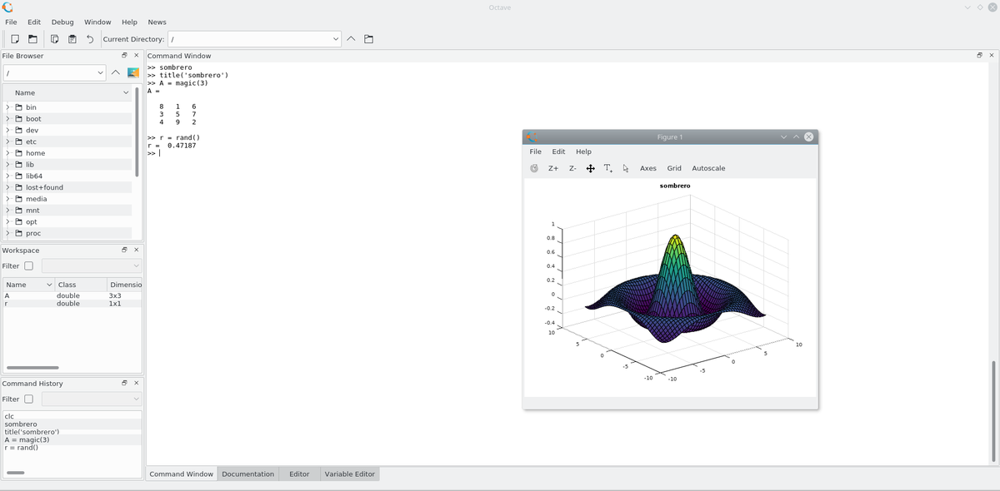

In the fast-paced world of financial markets, algorithmic trading emerges as a pivotal instrument that enables traders to harness technological advancements in their trading strategies. Algorithmic trading refers to the use of computer algorithms to automatically make trading decisions, submit orders, and manage portfolios, largely eliminating human emotion and error from the trading process. This approach has gained prominence over the years due to its ability to process complex calculations, analyze significant datasets, and execute trades at speeds and frequencies that are impossible for human traders.

Among the various tools employed in algorithmic trading, Octave is increasingly gaining traction. Octave is an open-source programming language designed for numerical computations, offering a wide range of functionalities akin to MATLAB, a popular proprietary product. This similarity makes Octave an attractive, cost-effective alternative for traders, especially those who require robust computational power without the associated expenses of commercial software. Octave's inherent capabilities in handling large datasets, performing matrix manipulations, and executing complex simulations render it particularly suited for developing and testing algorithmic trading strategies.



This article delves into how Octave can be effectively integrated into algorithmic trading, highlighting the strengths and potential applications of the tool. By understanding its advantages, traders can leverage Octave to develop sophisticated trading algorithms that may enhance efficiency and profitability in today's dynamic financial markets.

## Table of Contents

## Understanding Octave in Algorithmic Trading

Octave is an open-source programming language and a high-level numerical computation environment that caters primarily to users involved in mathematical modeling, data manipulation, and algorithm development. It offers extensive functionalities comparable to MATLAB, presenting itself as a cost-effective alternative for traders who rely on sophisticated numerical calculations without incurring the costs associated with proprietary software licenses.

Octave's design is centered on ease of use and flexibility, allowing traders to perform complex mathematical operations efficiently. Its capability to handle large datasets with ease is particularly advantageous in [algorithmic trading](/wiki/algorithmic-trading), where the ability to process and analyze a vast amount of financial data in real-time is crucial. This feature allows traders to implement strategies that require intensive data analytics, such as statistical [arbitrage](/wiki/arbitrage) or quantitative modeling.

One of the critical strengths of Octave in the context of algorithmic trading is its support for vector and matrix operations vital for numerical computations. This support enables efficient simulations and modeling, as many trading strategies depend on linear algebra and statistical analysis. Users can easily execute matrix operations like multiplication, inversion, and factorization, which are essential in constructing financial models.

Additionally, Octave offers built-in functions for optimization problems, which are integral to algorithm development. Traders can utilize these functions to fine-tune their trading strategies, optimizing parameters to maximize returns or minimize risk. The scripting nature of Octave further allows for rapid prototyping and testing of algorithms, accelerating the development process compared to more traditional programming languages.

The open-source nature of Octave ensures that it benefits from continuous community-driven updates and enhancements, keeping it aligned with the latest computational techniques. While the community is not as large as those for Python or R, it remains a valuable resource for users seeking support or contributing to the platform's growth.

In summary, Octave provides a robust suite of tools tailored for numerical computation and modeling, making it an appealing choice for traders engaged in algorithmic trading. Its ability to handle complex simulations, coupled with cost-effectiveness and community support, positions Octave as a viable tool for developing and executing data-driven trading strategies.

## Setting Up Your Environment with Octave

To begin using Octave for algorithmic trading, initial setup involves installing the requisite software and libraries essential for efficient data analysis and execution of trading strategies. Octave, available on various platforms including Windows, macOS, and Linux, can be downloaded from [GNU Octave's official website](https://www.gnu.org/software/octave/). 

**Installation and Basic Setup:**

1. **Download and Install Octave:** Ensure that the latest stable release is downloaded and installed on your system. Follow the appropriate instructions provided on the official site for your operating system.

2. **Install Essential Libraries:** Post installation, augment Octave’s capabilities by incorporating libraries that facilitate numerical and symbolic computations. For instance, the `optim` package is vital for optimization routines commonly used in trading strategies.

3. **Data Handling Libraries:** For effective data manipulation, incorporate libraries like `io` which allow for seamless Excel file operations. This can be essential for traders who need to ingest and process large datasets quickly.

**Setting Up the Coding Environment:**

To tailor Octave's environment to suit algorithmic trading needs, integrating mathematical libraries, such as those for linear algebra and statistical analysis, is fundamental. For example, the `[statistics](/wiki/bayesian-statistics)` package enhances Octave's native capabilities with functions for probability distributions, hypothesis testing, and regression analysis, all critical for formulating and [backtesting](/wiki/backtesting) trading algorithms.

**Custom Configuration for Trading Strategies:**

1. **Customize Scripts and Functions:** Utilize Octave’s scripting and function capabilities to automate routine tasks and create custom indicators or metrics that align with specific trading strategies. For example, a moving average can be calculated using built-in functions to identify potential trade opportunities.

2. **Leverage Visualization Tools:** Visualization is key in trading for analysis and presentation. Octave supports various plotting and graphing commands like `plot`, `semilogx`, `semilogy` which can be used to visualize data trends and trading signals effectively.

3. **Automation and Optimization:** Script your trading strategies in Octave to automatically execute buy/sell orders based on pre-defined criteria. This involves configuring the environment to interact with trading platforms via APIs if necessary, using custom functions to channel data and signals between the two.

Ensuring a robust setup and customized environment enhances trading efficiency by leveraging Octave's computational prowess comprehensively in algorithmic trading applications.

## Advantages of Using Octave for Algorithmic Trading

Octave serves as a valuable tool in algorithmic trading due to several key advantages that make it appealing for traders seeking efficient and cost-effective solutions. One of the most significant benefits of Octave is that it is free and open-source. This eliminates the expenses associated with proprietary software, allowing traders to allocate their financial resources elsewhere, such as in strategy development or data acquisition.

Octave excels in executing complex mathematical operations swiftly, an essential feature for traders aiming to implement real-time trading strategies. The ability to process large datasets quickly and accurately is crucial in financial markets, where time-sensitive decisions can dramatically affect profitability. Octave supports a wide range of mathematical functions and algorithms, catering to the diverse needs of trading strategies. Whether performing matrix operations, numerical integrations, or optimizations, Octave ensures that calculations are done efficiently, minimizing latency in decision-making processes.

Moreover, Octave's capability to integrate with other systems is a considerable advantage. Seamless execution of trading strategies often requires the interaction between different software tools and platforms. Octave can interface with languages such as C++, Fortran, and Python, allowing traders to leverage existing tools and libraries alongside Octave for a cohesive trading system. This interoperability enhances functionality, enabling traders to automate complex trading strategies without being confined to a single software environment.

In summary, Octave’s open-source nature, proficiency in handling complex mathematical operations, and seamless integration capabilities make it a compelling choice for algorithmic trading. These advantages empower traders to develop, test, and execute sophisticated trading strategies effectively.

## Potential Challenges and Considerations

While Octave provides a robust suite of tools ideal for algorithmic trading, certain challenges accompany its use, warranting careful consideration by traders. The learning curve is a primary challenge; mastering Octave's functions necessitates a thorough understanding of its unique syntax and operations. For traders accustomed to more intuitive platforms, this learning process can be time-consuming and demanding. Unlike Python, known for its beginner-friendly nature, Octave requires dedicated study and practice to leverage its full potential effectively.

Another notable challenge is backtesting capabilities in Octave. Backtesting, a critical component in evaluating the viability of trading strategies, often requires additional plugins or custom code when utilizing Octave. This requirement stems from the fact that Octave lacks native backtesting frameworks that are commonplace in more established trading platforms such as MetaTrader or proprietary software systems. As a result, traders may need to develop custom solutions or integrate supplementary tools to achieve comprehensive backtesting functionality.

Additionally, the community support for Octave is considerably less extensive compared to platforms like Python or R. These languages benefit from large, active user communities that contribute libraries, tools, and solutions, streamlining the development and troubleshooting processes. In contrast, while Octave does have a dedicated community, its smaller size can result in fewer readily available resources and slower response times for issue resolution. This [factor](/wiki/factor-investing) may impact development speed and present challenges in seeking assistance for complex problems.

The combination of these challenges means that traders must weigh the benefits of Octave's cost-effectiveness and computational power against the potential hurdles associated with its use. For those willing to invest the effort in learning and customizing their environment, Octave remains a compelling option. Nonetheless, traders should remain cognizant of the resources required to overcome these potential hurdles effectively.

## Case Studies and Applications

Octave has emerged as a robust tool in the field of algorithmic trading, allowing traders to efficiently implement and execute trading strategies. Various case studies highlight its successful application, demonstrating its potential and versatility. 

One notable example is the implementation of [statistical arbitrage](/wiki/statistical-arbitrage) strategies. StatArb, as it is commonly known, involves taking advantage of price differentials between related financial instruments. Using Octave, traders can perform complex statistical calculations to identify opportunities for arbitrage. These calculations often involve linear regression models to predict price movements, which can be effectively executed in Octave thanks to its advanced numerical capabilities. For instance, traders can use ordinary least squares (OLS) regression to estimate the parameters of their predictive model. The flexibility of Octave facilitates the handling of large data sets, enabling traders to backtest their strategies across various market conditions effectively.

Another application is in the domain of high-frequency trading ([HFT](/wiki/high-frequency-trading-strategies)). In HFT, the speed and efficiency of executing trades are critical. Octave's ability to handle real-time data processing and its integration options with other programming environments make it suitable for developing HFT algorithms. For instance, HFT strategies can employ moving averages to generate buy or sell signals. Here's an example of how a simple moving average crossover strategy can be coded in Octave:

```matlab
% Load financial data
prices = load('market_data.txt');

% Define the short-term and long-term windows
short_window = 20;
long_window = 50;

% Calculate the moving averages
short_ma = movmean(prices, short_window);
long_ma = movmean(prices, long_window);

% Generate trading signals
signals = (short_ma > long_ma) - (short_ma < long_ma);

% Plot the results
plot(prices);
hold on;
plot(short_ma, 'g');
plot(long_ma, 'r');
legend('Price', 'Short MA', 'Long MA');
```

This script loads market data, calculates short and long-term moving averages, and generates trading signals based on the crossover of these averages. Traders can use similar models in Octave to test and optimize their strategies, adjusting parameters to suit their risk appetite and market conditions.

Furthermore, Octave's application extends to risk management, where traders use the platform to calculate Value at Risk (VaR) and other risk metrics that are critical for maintaining a balanced portfolio. By employing Monte Carlo simulations, traders can assess potential future losses and adjust their portfolios accordingly to mitigate risks.

These case studies underscore the efficacy of Octave in algorithmic trading. By learning from these applications, new traders can harness Octave's capabilities to develop innovative strategies, optimize existing models, and ultimately enhance their trading performance. The software's open-source nature encourages experimentation and collaboration, enabling traders to customize strategies to their unique specifications.

## Conclusion

Octave presents a compelling option for traders who seek a balance between cost-effectiveness and computational power in algorithmic trading. Its open-source nature significantly reduces expenses, making high-level financial computations accessible without the hefty price tag associated with proprietary software solutions. Additionally, Octave's capability to handle complex mathematical operations and large datasets enables traders to implement sophisticated trading strategies effectively.

However, deciding to incorporate Octave into one's trading toolkit requires a careful evaluation of its advantages and limitations. Traders need to assess their technical proficiency and the specific requirements of their trading strategies. While Octave excels in mathematical computing, the learning curve can be steep for those unfamiliar with its syntax and functionalities. Moreover, backtesting and integration with existing trading platforms may pose challenges due to the need for custom code and limited community support compared to more established languages like Python or R.

Looking ahead, the potential for Octave in algorithmic trading is promising. As technology advances and more users contribute to its ecosystem, Octave could see enhancements that further streamline its application in trading. This growth can lead to new functionalities and improved user support, opening up additional opportunities for traders. By staying informed of these developments, traders can effectively leverage Octave's evolving features to refine their algorithmic strategies and maintain a competitive edge in the trading environment.

## Further Resources

For those interested in expanding their knowledge of Octave for algorithmic trading, several resources can facilitate learning and engagement with the broader community.

### Online Tutorials and Documentation

1. **GNU Octave Documentation**: The official GNU Octave website (https://www.gnu.org/software/octave/doc/interpreter/) offers comprehensive documentation that covers everything from basic commands to advanced computational techniques.

2. **Octave Wiki**: The Octave Wiki (https://wiki.octave.org/) is a valuable resource providing tutorials, tips, and user-contributed examples that are helpful for both beginners and advanced users.

3. **Tutorialspoint**: Tutorialspoint provides a series of tutorials on Octave programming, which can be accessed at (https://www.tutorialspoint.com/gnu_octave/index.htm). The platform offers structured guides, examples, and exercises to assist in mastering Octave.

### Recommended Books and Courses

- **"Octave Programming for Engineers and Scientists" by Robert H. King**: This book is tailored for engineers and scientists interested in using Octave's computational capabilities, providing practical applications and examples relevant to algorithmic trading.

- **Coursera and edX Online Courses**: Although specific courses on Octave for algorithmic trading may be limited, platforms like Coursera and edX offer courses on related subjects, such as numerical computing and algorithmic trading, which can be adapted to Octave.

- **Udemy Courses on Algorithmic Trading**: While many Udemy courses primarily focus on Python or R for algorithmic trading, the core strategies and concepts can be implemented in Octave. Supplementing these courses with Octave basics can provide a robust trading education.

### Communities and Forums

1. **Stack Overflow**: The Octave tag on Stack Overflow (https://stackoverflow.com/questions/tagged/octave) is a popular venue for seeking help and exchanging knowledge related to Octave programming challenges.

2. **Octave Mailing Lists and News Groups**: Subscribing to Octave's mailing lists (https://www.gnu.org/software/octave/community.html#Mailing-Lists) can keep you updated with the latest developments and provide a platform for discussion with other Octave users.

3. **Reddit (r/algotrading)**: The Reddit community dedicated to algorithmic trading (https://www.reddit.com/r/algotrading/) is an excellent place for discussing trading strategies, including those that can be implemented using Octave.

These resources collectively cater to different aspects of learning and using Octave for algorithmic trading, from foundational knowledge to advanced applications and community support.

## References & Further Reading

[1]: King, R. H. (2016). ["Octave Programming for Engineers and Scientists."](https://link.springer.com/book/10.1007/978-1-4842-3201-9) Academic Press.

[2]: Ng, A. Y. (2004). ["Feature selection, L1 vs. L2 regularization, and rotational invariance."](https://dl.acm.org/doi/10.1145/1015330.1015435) Proceedings of the Twenty-first International Conference on Machine Learning.

[3]: Chang, J. W., & Chen, S. K. (2020). ["Algorithmic Trading: The Basics and Development."](https://iopscience.iop.org/article/10.1149/1945-7111/ab9050) Journal of Banking and Financial Technology.

[4]: Prado, M. L. de. (2018). ["Advances in Financial Machine Learning."](https://www.amazon.com/Advances-Financial-Machine-Learning-Marcos/dp/1119482089) Wiley.

[5]: Aronson, D. (2007). ["Evidence-Based Technical Analysis: Applying the Scientific Method and Statistical Inference to Trading Signals."](https://onlinelibrary.wiley.com/doi/book/10.1002/9781118268315) Wiley.

[6]: Jansen, S. (2020). ["Machine Learning for Algorithmic Trading: Predictive Models to Extract Signals from Market and Alternative Data for Systematic Trading Strategies with Python."](https://www.amazon.com/Machine-Learning-Algorithmic-Trading-alternative/dp/1839217715) Packt Publishing.

[7]: Chan, E. P. (2008). ["Quantitative Trading: How to Build Your Own Algorithmic Trading Business."](https://github.com/ftvision/quant_trading_echan_book) Wiley.