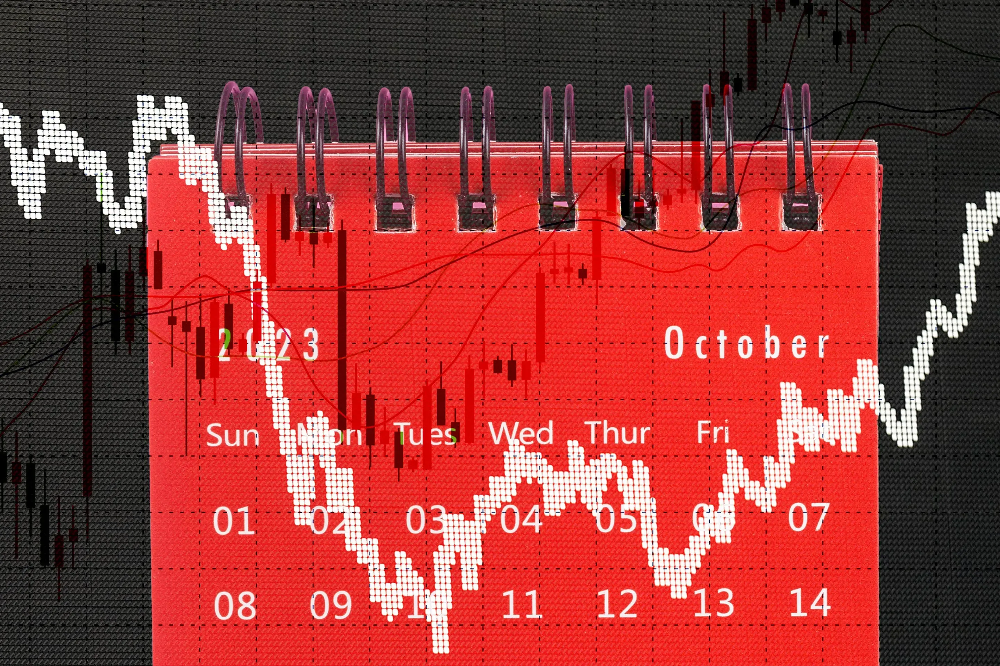

## Table of Contents

## What is the October Effect in stock markets?

The October Effect is a term used to describe the belief that stock markets are more likely to crash or experience significant drops during the month of October. This idea comes from historical events where major stock market crashes happened in October, like the famous 1929 crash that led to the Great Depression and the 1987 Black Monday crash.

However, the October Effect is more of a superstition than a proven fact. While it's true that some big crashes happened in October, there have been many Octobers without any major problems. Stock market movements are influenced by many factors, and no single month can predict a crash. So, while it's interesting to know about the October Effect, it's not something investors should rely on when making decisions.

## How did the October Effect get its name?

The October Effect got its name because of some big stock market crashes that happened in October. People started to notice that these crashes seemed to happen more often in October than in other months. The most famous one was in 1929, which started the Great Depression. Another big crash happened in October 1987, which people called Black Monday.

Even though these big crashes happened in October, it doesn't mean that October is always bad for the stock market. The October Effect is more like a superstition. There have been many Octobers where the stock market did just fine. So, the name comes from those big events, but it's not a rule that investors should follow.

## Can you explain the historical events that contributed to the October Effect?

The October Effect got its name from some big stock market crashes that happened in October. One of the most famous ones was in 1929. On October 24, 1929, the stock market started to fall a lot, and then on October 29, it crashed even more. This crash is known as Black Tuesday, and it started the Great Depression, which was a very hard time for the economy. Because this big crash happened in October, people started to think that October was a bad month for the stock market.

Another big crash that added to the October Effect happened in 1987. On October 19, 1987, the stock market fell a lot, and this day is known as Black Monday. It was one of the biggest one-day drops in stock market history. These two big crashes in October made people think that October was a dangerous month for the stock market. But, even though these big crashes happened in October, there have been many Octobers where the stock market did just fine. So, the October Effect is more like a superstition than a rule.

## What are some notable examples of stock market crashes in October?

One of the most famous stock market crashes in October happened in 1929. On October 24, the stock market started to fall a lot, and then on October 29, it crashed even more. This day is known as Black Tuesday. The crash in 1929 started the Great Depression, which was a very hard time for the economy. Because this big crash happened in October, people started to think that October was a bad month for the stock market.

Another big crash that added to the idea of the October Effect happened in 1987. On October 19, 1987, the stock market fell a lot, and this day is known as Black Monday. It was one of the biggest one-day drops in stock market history. These two big crashes in October made people think that October was a dangerous month for the stock market. But, even though these big crashes happened in October, there have been many Octobers where the stock market did just fine.

## How does the October Effect influence investor behavior?

The October Effect can make investors feel nervous when October comes around. Because big stock market crashes happened in October in the past, some people think that October is a risky month for the stock market. This can make investors more cautious or even scared, and they might sell their stocks or avoid buying new ones in October. They might worry that their money is not safe and try to protect it by moving it to safer places like savings accounts.

However, the October Effect is more like a superstition than a rule. There have been many Octobers where the stock market did just fine, and crashes can happen in any month. Smart investors know that the stock market is influenced by many things, not just the month. So, while the October Effect might make some people nervous, it's important not to let it control your decisions. It's better to look at the bigger picture and make choices based on good information, not just the calendar.

## Is the October Effect a myth or does it have statistical backing?

The October Effect is more of a myth than something with strong statistical backing. It got its name because of big stock market crashes that happened in October, like the 1929 crash that started the Great Depression and the 1987 Black Monday crash. These events made people think that October is a risky month for the stock market. But just because some big crashes happened in October doesn't mean that October is always bad for the stock market.

When you look at the numbers, there isn't strong evidence that October is more likely to have a crash than any other month. Crashes can happen in any month, and there have been many Octobers where the stock market did just fine. So, while the October Effect is interesting to know about, it's not something that investors should rely on when making decisions. It's better to look at the bigger picture and not let a superstition guide your choices.

## What psychological factors contribute to the October Effect?

The October Effect is mostly about people's feelings and memories. When big stock market crashes happened in October, like the one in 1929 that started the Great Depression and the one in 1987 on Black Monday, it made people remember October as a scary month for the stock market. These memories can make investors feel nervous when October comes around, even if there's no real reason to be worried. They might think, "Oh no, it's October again, maybe I should sell my stocks to be safe."

Even though the October Effect is more like a superstition, it can still affect how people act. When investors are scared, they might sell their stocks or avoid buying new ones in October. This can make the stock market go down a bit, not because October is bad, but because people are acting based on their fears. It's important for investors to remember that the stock market is influenced by many things, and no single month can predict a crash. So, while the October Effect might make some people nervous, it's better to make choices based on good information, not just the calendar.

## How can investors prepare for potential downturns due to the October Effect?

Investors can prepare for potential downturns by keeping a cool head and not letting the October Effect scare them. It's important to remember that the October Effect is more like a superstition than a real rule. Instead of worrying about the month, investors should focus on having a good plan. This means spreading their money across different kinds of investments, like stocks, bonds, and maybe even some cash. By doing this, they can lower the risk of losing a lot of money if the stock market goes down.

Another good way to prepare is to keep learning about the stock market and the economy. By understanding what's going on, investors can make better choices and not just react to their fears. It's also a good idea to have some money set aside that they can use if they need to, without having to sell their investments at a bad time. By staying calm, having a solid plan, and keeping informed, investors can handle whatever the stock market throws at them, even in October.

## Are there specific sectors or types of stocks more affected by the October Effect?

The October Effect is more like a superstition than a rule, so there aren't specific sectors or types of stocks that are always more affected by it. However, when investors get scared because of the October Effect, they might sell stocks that they think are riskier. This could mean that stocks in sectors like technology or small companies might see bigger drops because people think they're more likely to lose value quickly.

But, it's important to remember that any changes in the stock market during October are usually because of how people feel, not because October is a bad month. If everyone starts selling stocks because they're worried about the October Effect, then the stocks that people think are riskier might go down more. But this isn't because of October itself, it's because of what people think might happen. So, it's better to look at the bigger picture and not let the calendar scare you into making bad choices.

## How has the October Effect evolved over time with changes in global markets?

The October Effect has changed a lot as global markets have grown and become more connected. In the past, big crashes like the one in 1929 and the one in 1987 made people think that October was a bad month for the stock market. But as more countries started trading with each other and technology made it easier to buy and sell stocks all over the world, the idea of the October Effect became less important. Now, the stock market is influenced by many things happening all over the world, not just what happened in the past in one country.

Even though the October Effect is more like a superstition than a rule, it can still make some people nervous when October comes around. But with more information and better ways to understand what's happening in the global economy, smart investors know that it's not smart to make choices just because of the month. They look at the bigger picture and think about all the different things that can affect the stock market, not just old stories about October.

## What are the criticisms of the October Effect theory?

The October Effect is criticized because it's more like a superstition than a real rule. Just because big stock market crashes happened in October in the past doesn't mean that October is always bad for the stock market. There have been many Octobers where the stock market did just fine. Critics say that it's not smart to make choices based on the month, because the stock market is influenced by many things, not just the calendar.

Another criticism is that the October Effect can make people act in ways that aren't good for them. When investors get scared because of the October Effect, they might sell their stocks or avoid buying new ones in October. This can make the stock market go down a bit, not because October is bad, but because people are acting based on their fears. It's better to look at the bigger picture and make choices based on good information, not just the calendar.

## How should long-term investors consider the October Effect in their investment strategies?

Long-term investors should not let the October Effect scare them into making bad choices. The October Effect is more like a superstition than a real rule. Just because big stock market crashes happened in October in the past doesn't mean that October is always bad for the stock market. There have been many Octobers where the stock market did just fine. So, long-term investors should focus on their overall plan and not worry too much about the month.

A good way for long-term investors to handle the October Effect is to keep a cool head and stick to their investment strategy. This means spreading their money across different kinds of investments, like stocks, bonds, and maybe even some cash. By doing this, they can lower the risk of losing a lot of money if the stock market goes down. It's also important to keep learning about the stock market and the economy, so they can make smart choices based on good information, not just the calendar.

## References & Further Reading

[1]: Shiller, R. J. (1987). ["Investor Behavior in the October 1987 Stock Market Crash: Survey Evidence."](https://www.nber.org/papers/w2446) NBER Working Paper Series, National Bureau of Economic Research.

[2]: Ormerod, P. (2010). ["The Illusion of Rationality: Historical Analysis of Market Fluctuations."](https://onlinelibrary.wiley.com/doi/10.1002/sres.2739) Complexity and Economics.

[3]: Malkiel, B. G. (2015). ["A Random Walk Down Wall Street: The Time-Tested Strategy for Successful Investing"](https://www.academia.edu/10850809/A_Random_Walk_Down_Wall_Street_The_Time_Tested_Strategy_for_Successful_Investing). W. W. Norton & Company.

[4]: Goldstein, J., & Khanna, T. (2002). ["Market and Firm Responses to Crises: Evidence from the Asian Financial Crisis."](https://www.semanticscholar.org/paper/The-Asian-financial-crisis-Goldstein/d9fe102e1baeccbeb2ab92de29836f733db95b7a) Strategic Management Journal.

[5]: Chan, E. P. (2009). ["Quantitative Trading: How to Build Your Own Algorithmic Trading Business."](https://github.com/ftvision/quant_trading_echan_book) John Wiley & Sons.

[6]: Lo, A. W. & MacKinlay, A. C. (1999). ["A Non-Random Walk Down Wall Street."](https://www.jstor.org/stable/j.ctt7tccx) Princeton University Press.

[7]: Lopez de Prado, M. (2018). ["Advances in Financial Machine Learning."](https://www.amazon.com/Advances-Financial-Machine-Learning-Marcos/dp/1119482089) Wiley.

[8]: Aronson, D. (2007). ["Evidence-Based Technical Analysis: Applying the Scientific Method and Statistical Inference to Trading Signals."](https://www.amazon.com/Evidence-Based-Technical-Analysis-Scientific-Statistical/dp/0470008741) Wiley.

[9]: Jansen, S. (2020). ["Machine Learning for Algorithmic Trading: Predictive Models to Extract Signals from Market and Alternative Data for Systematic Trading Strategies with Python."](https://www.amazon.com/Machine-Learning-Algorithmic-Trading-alternative/dp/1839217715) Packt Publishing.