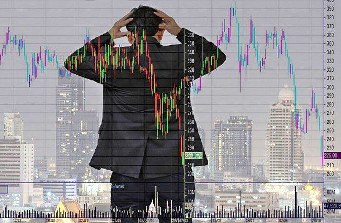

The October effect is a phenomenon that garners considerable attention within financial circles, characterized by a perception of heightened volatility and potential downturns in the stock market during the month of October. Historically, this reputation is linked to notable market crashes, such as the infamous crash of 1929 and Black Monday in 1987. Both events have indelibly marked the financial psyche, leading to a widespread anticipation of turbulence during this period. This article will explore the historical context of these market perceptions, evaluate recent trends, and examine how algorithmic trading may navigate or even redefine these longstanding beliefs.

Despite the apprehension surrounding October, it remains crucial to discern whether this effect is based on empirical evidence or if it is predominantly a psychological construct influenced by memorable financial downturns. With the advancement of algorithmic trading, there is a contemporary viewpoint through which to analyze stock market data—free from emotional bias. Algorithmic trading uses sophisticated algorithms that process extensive historical data, potentially offering new perspectives that challenge traditional assumptions regarding October market behavior. This article aims to analyze these facets to ascertain whether the October effect remains a myth or a tangible influence on market performance.



## Table of Contents

## What Is the October Effect?

The October effect is a phenomenon in financial markets characterized by the belief that stock prices are prone to decline during the month of October. This belief is entrenched largely due to notable historical market crashes that occurred in this month, such as the infamous stock market crash of 1929 and Black Monday in 1987. These events have ingrained the notion that October is a financially precarious month. However, empirical data challenges this perception, suggesting that the October effect is more psychological than it is based on observable market performance.

Despite the notoriety of certain events, a detailed analysis of historical market performance indicates that October often yields neutral or even positive results. For instance, an examination of century-spanning market data reveals that the average returns in October do not significantly deviate from those of other months. In fact, September has historically been more prone to downturns, yet it does not [carry](/wiki/carry-trading) the same psychological weight as October. This discrepancy between perception and reality might be attributed to narrative bias, where memorable events disproportionately influence collective memory and expectations.

Investors' behavioral patterns can be understood through the lens of cognitive biases. The anchoring of the October effect in investors' minds can lead to preconceptions that affect trading decisions, though these decisions may not align with market data. A comprehensive review of stock market return data using tools such as Python libraries for data analysis could help illustrate the comparative performance in October across different years. Data analytics plays a crucial role in dispelling myths by providing evidence-based insights.

To summarize, the belief in the October effect outpaces its empirical reality, which reveals a more complex and nuanced picture of market performance in October. Recognizing the psychological underpinnings of this phenomenon is essential for investors aiming to base their decisions on robust, data-driven analyses rather than succumbing to historically shaped anxieties.

## Historical Context of the October Effect

Significant financial events have deeply ingrained the October effect into the consciousness of investors, leading many to anticipate market turbulence during this month. Two of the most notable events reinforcing this perception are the stock market crashes of 1929 and 1987.

The Wall Street Crash of 1929, beginning in late October, marked the onset of the Great Depression, one of the most devastating economic downturns in history. Known as "Black Tuesday," October 29, 1929, saw the Dow Jones Industrial Average plummet, erasing significant wealth and punctuating a widespread loss of investor confidence. Almost six decades later, on October 19, 1987, an event known as "Black Monday" further solidified the October effect's notoriety. On this day, global markets saw severe declines, with the Dow dropping over 22%, the largest single-day percentage loss in history at that time.

While these catastrophic events contribute to the perception that October is a precarious month for investors, a more comprehensive review of historical stock performance data paints a different picture. Contrary to popular belief, October has frequently concluded with a net positive outcome for the stock market over the past century. This apparent paradox can be attributed to specific volatile days casting a long shadow over the month in its entirety. Data analyses reveal that despite isolated incidents of extreme market disruption, October often benefits from robust market corrections and rebounds.

In comparison, September has historically presented more consistent challenges to market performance, empirically yielding more downturns than October. An examination of monthly return patterns across various stock indices indicates that September tends to exhibit a higher frequency of negative returns. This pattern suggests that investor apprehension tied specifically to October may not be statistically justified when considering broader historical data trends.

Understanding these patterns involves scrutinizing historical price movements and employing statistical analyses to calculate average monthly returns, variance, and the probability of losses. Using Python, one could analyze such trends through libraries like Pandas and Matplotlib to visually represent stock returns over a century or more, aiding in dispelling myths associated with specific months.

```python
import pandas as pd
import matplotlib.pyplot as plt

# Sample data loading process
data = pd.read_csv('historical_stock_data.csv')
data['Date'] = pd.to_datetime(data['Date'])
data.set_index('Date', inplace=True)

# Calculate monthly returns
monthly_returns = data['Close'].resample('M').ffill().pct_change()

# Group by month to find average returns
average_monthly_returns = monthly_returns.groupby(monthly_returns.index.month).mean()

# Plotting the average monthly returns
plt.figure(figsize=(10, 6))
average_monthly_returns.plot(kind='bar')
plt.title('Average Monthly Stock Returns')
plt.xlabel('Month')
plt.ylabel('Average Return')
plt.xticks(range(12), ['Jan', 'Feb', 'Mar', 'Apr', 'May', 'Jun', 
                       'Jul', 'Aug', 'Sep', 'Oct', 'Nov', 'Dec'], rotation=45)
plt.show()
```

Although the infamous market events of October persist in the collective consciousness, the statistical evidence undermines the notion that October is inherently more volatile than other months. This misconception is rectified when examined through a systematic analysis of long-term data trends, emphasizing the importance of basing investment strategies on data-driven insights rather than historical fear.

## Algorithmic Trading and Its Role

Algorithmic trading utilizes advanced computational algorithms to execute trading decisions based on historical data patterns, offering a systematic approach that could challenge perceptions associated with the October effect. Unlike traditional trading, which can be influenced by emotions and psychological biases, [algorithmic trading](/wiki/algorithmic-trading) relies on data-driven strategies that aim to capitalize on market efficiencies.

By analyzing extensive datasets, algorithms are capable of identifying trends and patterns that may not be immediately apparent to human traders. This capability provides an opportunity to exploit the heightened [volatility](/wiki/volatility-trading-strategies) often attributed to the month of October. An algorithm could, for example, employ a strategy that detects historical price patterns or volatility indicators to predict likely market movements, thereby identifying opportunities for profit amidst perceived uncertainty.

Moreover, automation permits a dispassionate assessment of market conditions, effectively stripping away the emotional responses that might exacerbate fears of historical events linked to the October effect. By focusing solely on quantitative analysis, algorithmic trading systems are designed to respond to factual market inputs rather than speculative concerns.

Python, a widely-used language in algorithmic trading, offers tools and libraries that facilitate data analysis and model building. For instance, using libraries like `pandas` and `numpy`, traders can craft algorithms that analyze past October performances to identify potentially profitable scenarios. A Python snippet illustrating a simple moving average crossover strategy might look like this:

```python
import pandas as pd

# Load historical market data
data = pd.read_csv('market_data.csv')

# Calculate short and long-term moving averages
short_window = 40
long_window = 100

data['short_mavg'] = data['Close'].rolling(window=short_window).mean()
data['long_mavg'] = data['Close'].rolling(window=long_window).mean()

# Generate buy/sell signals
data['signal'] = 0
data['signal'][short_window:] = np.where(data['short_mavg'][short_window:] 
                                        > data['long_mavg'][short_window:], 1, 0)
data['positions'] = data['signal'].diff()

# Display buy/sell actions
print(data[['Date', 'Close', 'signal', 'positions']].dropna())
```

This example demonstrates how algorithms can systematically generate buy or sell signals based on moving average crossovers, a common method used to capture short-term market fluctuations. By utilizing such automated processes, algorithmic trading could mitigate some of the market anxieties traditionally associated with October, making decisions founded on analytical rigor rather than historical trepidation.

## Psychological Impacts on Trading Behavior

Investor psychology plays a crucial role in shaping trading behaviors, as historical narratives can create biased expectations of market movements, especially concerning the October effect. This psychological phenomenon suggests that investors might expect heightened volatility or declines in October based on past experiences rather than current data. As a result, these expectations can sometimes manifest as self-fulfilling prophecies, where investor anxiety and preemptive selling lead to actual market disruptions.

Understanding these psychological patterns is essential for both individual investors and algorithmic models to efficiently navigate the market dynamics of October. Many traders, influenced by the fear of the October effect, may sell off assets prematurely, causing unnecessary volatility. This behavior is based on the heuristics and biases that investors develop due to the historical significance of October in financial markets. Behavioral finance literature suggests that cognitive biases, such as loss aversion and herd behavior, can exacerbate these effects. Loss aversion leads investors to fear potential losses more than they appreciate equivalent gains, while herd behavior causes them to follow the crowd, expecting others also to sell due to the perceived October risk.

Algorithmic trading systems, designed to capitalize on inefficiencies and trends, provide a counterbalance to human psychological tendencies. These algorithms, by relying on statistical analysis and historical data, can mitigate the effects of psychological biases. For instance, by identifying patterns and opportunities overlooked by human traders due to emotional bias, algorithms can exploit the volatility brought on by the market participants whose actions are influenced by the October effect.

The development of algorithms that incorporate behavioral finance insights can further improve trading decisions. By integrating models that account for and predict human irrationality, these systems may better anticipate market movements during periods of psychological stress, such as October. In Python, this could involve utilizing [machine learning](/wiki/machine-learning) libraries like sci-kit-learn to build predictive models based on historical trading behavior data.

Ultimately, a comprehensive understanding of investor psychology and the integration of data-driven algorithmic strategies allow for more informed and rational trading decisions, particularly in periods traditionally associated with unpredictability, such as October. This balanced approach reduces the likelihood of self-fulfilling prophecies and enhances market stability.

## Recent Trends: October's Performance in Modern Markets

An analysis of recent Octobers indicates a trend towards less volatility and often positive performance in the stock markets, challenging the historical fear associated with the month. For instance, October 2022 demonstrated a strong market recovery, highlighted by significant gains in major indices such as the S&P 500, which rose by approximately 8% over the month. This performance reflects a departure from the negative connotations traditionally linked to the month. The rebound in October 2022 can be attributed to a combination of factors, including investor optimism following the Federal Reserve's [interest rate](/wiki/interest-rate-trading-strategies) decisions and corporate earnings that exceeded expectations.

Market efficiency theories propose that anomalies like the October effect may be dissipating as investors gain access to better information and advanced trading technologies. The Efficient Market Hypothesis (EMH) suggests that stock prices reflect all available information. As technological innovations provide investors with real-time access to market data and news, the opportunity for outdated perceptions to persist diminishes. Algorithmic trading, capable of quickly analyzing vast datasets, often detects patterns and trends that human traders may overlook, further contributing to diminishing traditional anomalies such as the October effect.

Moreover, the increasing market participation of institutional investors, who base their strategies on quantitative analyses and rigorous models, also supports a shift away from the whims of historical narratives. These professional traders often employ systematic approaches that reduce the likelihood of irrational market reactions rooted in psychological phenomena.

In summary, while October's historical image as a problematic month persists, recent trends illustrate a potentially more stable and positive market environment. This evolution is supported by the widespread availability of precise information and the growing influence of technology-driven trading strategies, which allow for more informed decision-making and help dispel fears rooted in historical precedent.

## Conclusion

The October effect's reputation as a perilous time for stock markets primarily stems from historical narratives that evoke fear and caution among investors. Despite its deep-seated psychological influence, statistical analyses often depict October as an ordinary or even positive month for market performance. Algorithmic trading offers a novel perspective that can help distinguish fact from fiction. By systematically analyzing market data, these algorithms bypass emotional biases and historical anxieties, presenting a more rational approach to trading. Algorithms assess patterns and predict market behaviors, employing complex models that account for a wide range of variables. For instance, a simple moving average (SMA) or more advanced techniques like ARIMA (AutoRegressive Integrated Moving Average) models can forecast market trends without succumbing to the biases that human traders might have.

```python
import pandas as pd
import numpy as np
import matplotlib.pyplot as plt
from statsmodels.tsa.arima.model import ARIMA

# Sample data for demonstration purposes
data = pd.read_csv('market_data.csv', parse_dates=['Date'], index_col='Date')
returns = data['Adj Close'].pct_change().dropna()

# Fit ARIMA model
model = ARIMA(returns, order=(5,1,0)) # Example parameters
model_fit = model.fit()

# Forecast
forecast = model_fit.forecast(steps=30)
plt.plot(forecast)
plt.title('30-Day Forecast')
plt.show()
```

By employing such quantitative techniques, investors can gain insights into market dynamics based on empirical data rather than anecdotal evidence. This objective approach may alleviate undue worries tied to October, resulting in more informed trading decisions.

For investors, focusing on comprehensive data analysis rather than succumbing to the entrenched narratives of the October effect is crucial. While market history informs us of past events, reliance on historical fears alone can skew perception and result in missed opportunities. Employing algorithmic strategies alongside classical analysis helps cultivate a balanced view, mitigating psychological influences and promoting data-driven investment strategies throughout October and beyond.

## References & Further Reading

[1]: Shiller, R. J. (1987). ["Investor Behavior in the October 1987 Stock Market Crash: Survey Evidence."](https://www.nber.org/papers/w2446) NBER Working Paper Series, National Bureau of Economic Research.

[2]: Ormerod, P. (2010). ["The Illusion of Rationality: Historical Analysis of Market Fluctuations."](https://onlinelibrary.wiley.com/doi/10.1002/sres.2739) Complexity and Economics.

[3]: Malkiel, B. G. (2015). ["A Random Walk Down Wall Street: The Time-Tested Strategy for Successful Investing"](https://www.academia.edu/10850809/A_Random_Walk_Down_Wall_Street_The_Time_Tested_Strategy_for_Successful_Investing). W. W. Norton & Company.

[4]: Goldstein, J., & Khanna, T. (2002). ["Market and Firm Responses to Crises: Evidence from the Asian Financial Crisis."](https://www.semanticscholar.org/paper/The-Asian-financial-crisis-Goldstein/d9fe102e1baeccbeb2ab92de29836f733db95b7a) Strategic Management Journal.

[5]: Chan, E. P. (2009). ["Quantitative Trading: How to Build Your Own Algorithmic Trading Business."](https://github.com/ftvision/quant_trading_echan_book) John Wiley & Sons.

[6]: Lo, A. W. & MacKinlay, A. C. (1999). ["A Non-Random Walk Down Wall Street."](https://www.jstor.org/stable/j.ctt7tccx) Princeton University Press.

[7]: Lopez de Prado, M. (2018). ["Advances in Financial Machine Learning."](https://www.amazon.com/Advances-Financial-Machine-Learning-Marcos/dp/1119482089) Wiley.

[8]: Aronson, D. (2007). ["Evidence-Based Technical Analysis: Applying the Scientific Method and Statistical Inference to Trading Signals."](https://www.amazon.com/Evidence-Based-Technical-Analysis-Scientific-Statistical/dp/0470008741) Wiley.

[9]: Jansen, S. (2020). ["Machine Learning for Algorithmic Trading: Predictive Models to Extract Signals from Market and Alternative Data for Systematic Trading Strategies with Python."](https://www.amazon.com/Machine-Learning-Algorithmic-Trading-alternative/dp/1839217715) Packt Publishing.